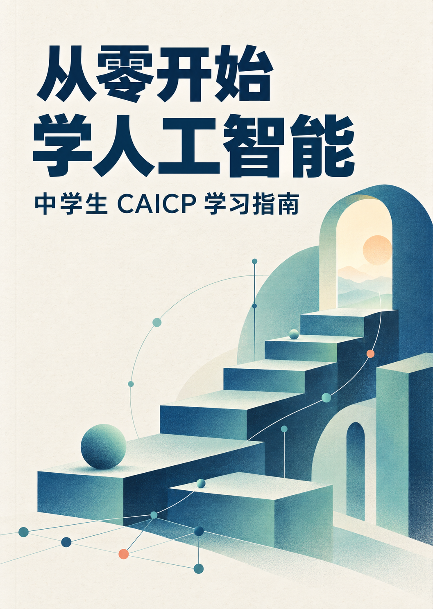

# 从零开始学人工智能：中学生 CAICP 学习指南

**陈峥 著 · 公开试读版 v0.9 · 2026 年 9 月 29 日**

给想从头学习人工智能的中学生，也给陪孩子一起学习的家长和老师。

本书从 Python 和数学基础讲起，逐步介绍算法、机器学习、常见模型，以及人工智能的前沿与应用。不要求读者已经学过编程；概念初次出现时尽量说明来由，计算和程序也尽量展开讲清楚。

编写这本书，起于给初一孩子辅导 CAICP 时的一个困难：有大纲和样题，却很难找到一本适合中学生从头学习、又能把相关知识串起来的教材。现在将完整书稿和源文件公开，欢迎阅读、分享和提出修改意见。

## 在线阅读

[打开图书网站](https://uestc1010.github.io/CAICP_Book/)：按章、按节阅读，支持手机浏览、公式与代码显示。

## 下载整本书

**[下载完整 PDF（v0.9，289 页）](https://github.com/UESTC1010/CAICP_Book/releases/download/v0.9/CAICP_Book-v0.9.pdf)**

[查看本版发布说明及附件](https://github.com/UESTC1010/CAICP_Book/releases/tag/v0.9) · [文件校验值](https://github.com/UESTC1010/CAICP_Book/releases/download/v0.9/SHA256SUMS.txt)

PDF 保留书籍排版、目录和书签，适合连续阅读或打印。源文件包包含 Word 排版稿、Markdown、插图和代码，供修改与再排版使用。

## 这本书讲什么

[前言](book/%E5%89%8D%E8%A8%80.md)

1. [第一章 认识人工智能](book/%E7%AC%AC%E4%B8%80%E7%AB%A0_%E8%AE%A4%E8%AF%86%E4%BA%BA%E5%B7%A5%E6%99%BA%E8%83%BD.md)
2. [第二章 用 Python 编写程序](book/%E7%AC%AC%E4%BA%8C%E7%AB%A0_%E7%94%A8%20Python%20%E7%BC%96%E5%86%99%E7%A8%8B%E5%BA%8F.md)
3. [第三章 理解 AI 所需的数学基础](book/%E7%AC%AC%E4%B8%89%E7%AB%A0_%E7%90%86%E8%A7%A3%20AI%20%E6%89%80%E9%9C%80%E7%9A%84%E6%95%B0%E5%AD%A6%E5%9F%BA%E7%A1%80.md)
4. [第四章 用算法解决问题](book/%E7%AC%AC%E5%9B%9B%E7%AB%A0_%E7%94%A8%E7%AE%97%E6%B3%95%E8%A7%A3%E5%86%B3%E9%97%AE%E9%A2%98.md)
5. [第五章 让机器从数据中学习](book/%E7%AC%AC%E4%BA%94%E7%AB%A0_%E8%AE%A9%E6%9C%BA%E5%99%A8%E4%BB%8E%E6%95%B0%E6%8D%AE%E4%B8%AD%E5%AD%A6%E4%B9%A0.md)
6. [第六章 理解常见模型的工作原理](book/%E7%AC%AC%E5%85%AD%E7%AB%A0_%E7%90%86%E8%A7%A3%E5%B8%B8%E8%A7%81%E6%A8%A1%E5%9E%8B%E7%9A%84%E5%B7%A5%E4%BD%9C%E5%8E%9F%E7%90%86.md)
7. [第七章 用 Python 处理数据与训练模型](book/%E7%AC%AC%E4%B8%83%E7%AB%A0_%E7%94%A8%20Python%20%E5%A4%84%E7%90%86%E6%95%B0%E6%8D%AE%E4%B8%8E%E8%AE%AD%E7%BB%83%E6%A8%A1%E5%9E%8B.md)
8. [第八章 了解人工智能的前沿与应用](book/%E7%AC%AC%E5%85%AB%E7%AB%A0_%E4%BA%86%E8%A7%A3%E4%BA%BA%E5%B7%A5%E6%99%BA%E8%83%BD%E7%9A%84%E5%89%8D%E6%B2%BF%E4%B8%8E%E5%BA%94%E7%94%A8.md)

[附录](book/%E9%99%84%E5%BD%95.md)包括大纲与教材对应表、术语与符号、分级阅读路线，以及 E、J、S 三个级别的原创模拟题和答案解析。各章末尾另有少量“想一想”，可用于回顾本章内容。

CAICP 是 IOAI（国际人工智能奥林匹克）中国区面向中小学生开展的人工智能能力认证活动。本书依据编写时的 2025 年资料组织内容，是作者独立编写的学习材料，**不是官方指定教材**；认证安排与要求以官方最新公布为准。

## 示例代码

程序放在 [code](code/) 中，按章节组织。运行方法见 [代码运行说明](code/%E8%BF%90%E8%A1%8C%E8%AF%B4%E6%98%8E.md)。

## 发现错误或有读不懂的地方

欢迎[提交 Issue](https://github.com/UESTC1010/CAICP_Book/issues/new)。写明版本、章节或 PDF 中印刷的页码，附上原文和你的疑问即可。暂时没有修改建议，也可以直接指出哪里没有讲明白。

愿意直接修改的读者可以提交 Pull Request。请先阅读 [参与修订说明](CONTRIBUTING.md)。版本变化记录在 [CHANGELOG.md](CHANGELOG.md)。

## 署名与使用许可

正文、原创插图、封面及原创模拟题采用 **[CC BY-NC-SA 4.0](LICENSE.md)**：可以在遵守条款的前提下非商业分享与改编，须署名、标注修改，分享改编作品时采用相同许可。独立示例程序与随附示例数据采用 **[MIT 许可](code/LICENSE)**。

建议署名形式：陈峥，《从零开始学人工智能：中学生 CAICP 学习指南》，[原始仓库](https://github.com/UESTC1010/CAICP_Book)。修改版本请明确注明修改者和修改内容，勿将改编内容冒充作者发布的原版。

官方真题、样卷及第三方参考书不包含在本仓库中。封面由作者使用图像生成工具辅助制作。
