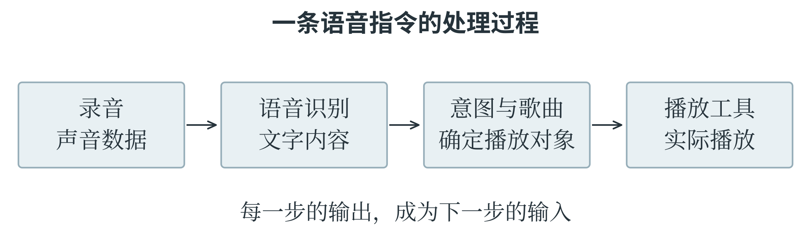
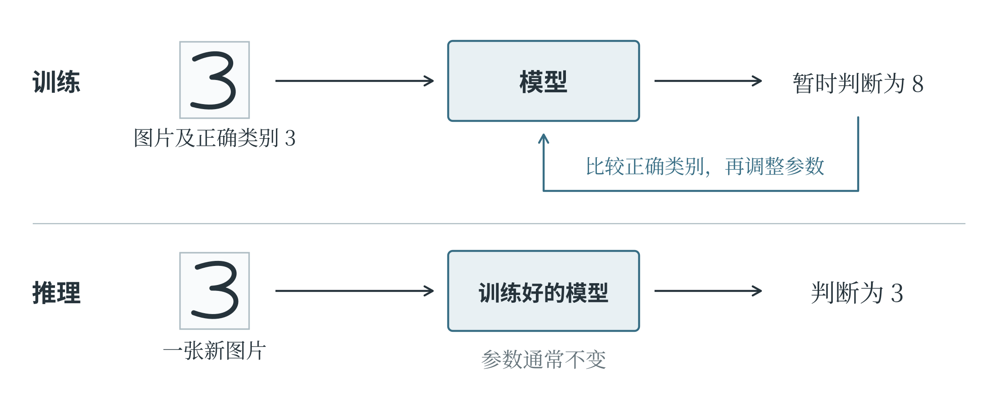
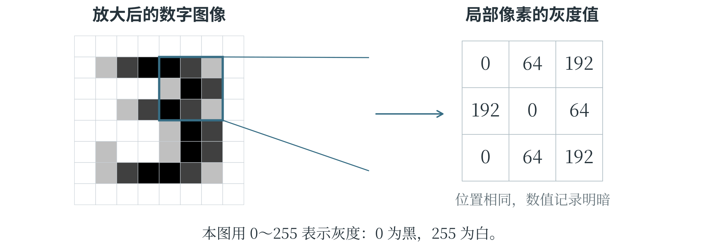
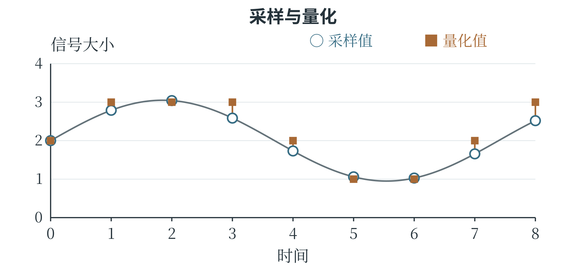
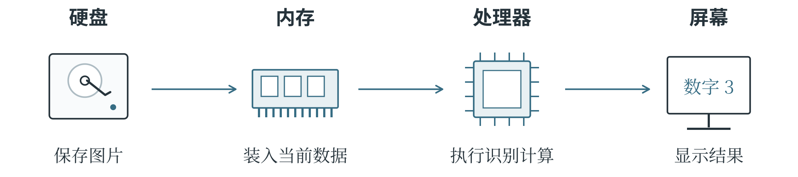

# 第一章 认识人工智能

一段录音变成文字，一张图片被认出内容，人工智能的本领常常先以结果呈现在人们面前。这些结果是怎样得到的？本章从人工智能的基本含义讲起，介绍数据、算法和计算机怎样配合，再沿着发展历程认识几种主要思想，讨论使用中的局限与责任。这些知识也是 CAICP 学习的起点，后面的编程、数学和模型计算都将与它们发生联系。

## 1.1 人工智能是什么

**人工智能**（Artificial Intelligence，简称 AI）研究怎样让机器完成感知、学习、推理和决策等任务。辨认事物、寻找规律、推导结论、选择行动，都属于这类研究关心的问题。从相册里找出同一个人，要辨认不同照片中的人脸；根据以往记录预测明天的用水量，要寻找数据之间的规律；下棋时选择下一步，则要考虑不同走法会带来什么结果。人做这些事各有办法，计算机却需要能够执行的处理方法。一项应用也常常要调动几种能力：语音助手先听清说话内容，再处理请求，最后组织回答。至于这套能力装在什么地方，并没有固定要求。它可以帮助有机身和传感器的机器人绕过障碍，也可以藏在手机的一个相册功能里。了解人工智能，首先要看它怎样处理信息、完成任务。

### 规则难写全时怎么办

计算机很善于照明确的步骤办事。算出一列数的总和、按文件名排序、到点播放铃声，只要把要求规定清楚，程序就能执行。

手写数字识别却难得多。同一个“3”，有人写得圆，有人写得扁；拍成图片后，还可能歪斜、模糊，带上阴影。若每遇到一种写法就补一条规定，规则很快就会变得繁杂，而且总有没考虑到的情况。另一种办法，是准备许多手写数字图片，标明各自对应的数字，让程序从这些例子中寻找区分它们的规律。这样，工作的重心就变了：不再由人逐条写完所有识别规则，而要认真考虑提供哪些材料、用什么方法学习、怎样检查学习效果。**机器学习**便是人工智能的重要研究方向，它利用数据或经验改善模型完成任务的表现。

不过，人工智能的办法不止机器学习。专家系统会把领域知识整理为规则，再根据事实推导结论，并不一定先从大量样本中学习。

同一个产品里，普通自动化与人工智能功能也可能并存。相册保存照片和辨认人脸就属于不同的工作。“智能相册”这个名称，不能代替对具体功能的分析。

### 先把系统的任务说清楚

同一张照片可以交给不同的系统处理。一个系统回答“有几片叶子”，另一个系统回答“属于哪种植物”，还有一个系统检查“这张照片是否清晰”。输入材料相同，输出要求却不同。设计人工智能应用时，需要先说清楚所要完成的**任务**，也就是系统接收什么材料、需要给出什么结果，以及怎样判断结果是否合适。否则，即使程序顺利运行，也可能回答了一个原本没有打算问的问题。

以语音点播音乐为例，系统接收到的是一段录音，最终需要执行播放动作。录音先经过语音识别，得到文字；接着从文字里分辨歌曲名称和播放要求；找到相应歌曲后，再交给播放器。说话者含糊地说“放刚才那首”，系统还需要利用前面的对话或播放记录。图 1-1 把这些环节连在一起。某一步的错误可能传到后面：歌曲名称听错了，检索即使完全按照文字执行，也会找到另一首歌。因此，检查一个应用时，要沿着过程定位问题。

图 1-1 一个应用往往由多个处理环节组成

描述一种能力时，任务和条件要一起说清楚。安静房间里识别很准，不代表在嘈杂场所也一样；能够照要求办事，也不代表能够判断要求是否合理。

### 训练、推理与泛化

手写数字识别中的**模型**，可以理解为一套把图片变成类别判断的计算方法。计算中能够调整的数值称为**参数**；参数变了，同一张图片得到的结果也可能改变。一个尚未学好的模型，可能把“3”认成“8”。训练程序把这个结果与正确类别比较，再按一定的方法调整参数，尽量减少差错；随后换上其他图片，继续比较和调整。这个利用数据调整模型的过程称为**训练**。在这里，一张图片与它的正确类别构成一个训练样本：图片是学习的材料，类别提供检查结果的依据。训练完成以后，把新图片交给模型，使用已经得到的参数作出判断，这一步通常称为**推理**，图 1-2 展示了两者的区别。一次普通识别通常不会自动修改参数，所以模型今天认错了，明天再见到同一张图，也可能仍然认错。

“推理”在机器学习中有这个专门含义。在逻辑讨论中，它也常指从已有知识推导结论，读到这个词时要结合上下文分辨。

图 1-2 训练时调整模型，推理时使用模型

模型是否学会了，不能只看它对旧图片的判断。假如一个系统保存了所有训练图片及其答案，见到原图就去查找，可能一张也不认错；换成另一个人写的数字，它却可能不会了。这与做题时只记住例题答案、换一组数便无从下手，有相似之处。模型需要从已有样本中学到能用于新情况的规律，这种能力称为**泛化能力**。因此，检查模型时还要准备没有用于训练的新样本，看看换了材料以后，它是否仍能完成任务。

### 几种典型应用

数字图像由许多**像素**组成，每个像素对应画面中的一个小位置。把图放大，就能看到一格格颜色，它们连在一起才成为完整画面。常见彩色图像用红、绿、蓝三个通道的数值记录颜色。因此，计算机接收到的首先是按位置排列的数值，要从中认出猫的耳朵、眼睛和尾巴，还需要模型进行计算。识别系统通常会先采集图片、调整尺寸等输入条件，再交给模型处理。

输出“猫”，回答的是“是什么”；标出猫的位置，回答的是“在哪里”。两种结果结合起来，系统就能指出画面中有什么、各在哪里。

语音识别从声音开始。麦克风把声波的变化转成电信号，设备再把信号数字化，得到按时间排列的数据。模型分析这些数据，寻找它们与词语之间的联系。一段“明天下午三点开会”的录音，就可以这样变成文字记录。不过，同一句话换个人说，口音、语速都可能不同；旁边再有车辆声或音乐声，识别就更难了。把语音转换为文字称为**语音识别**，把文字转换为声音称为**语音合成**。如果任务是根据声音判断说话者的身份，则属于说话人识别。它们都与声音有关，所要回答的问题却不一样。

推荐系统要解决的是“先展示什么”的问题。图书很多，屏幕一次能展示的却很少，系统需要估计哪些书更适合当前读者，再排出先后顺序。图书的主题、读者以往的阅读记录，以及其他读者读过哪些相关书籍，都可能成为判断依据。但记录不能完全代表兴趣：点击可能出于好奇，也可能是误触；没读过某本书，可能只是从未见过它。推荐结果因此是一种估计。系统追求的目标也会影响排序：如果希望获得更多点击，可能把更吸引眼球的书放在前面；如果希望帮助读者接触新知识，则可能多展示一些不同领域的书。

人工智能还可以预测数值、规划行动和生成内容。例如，预测用水量，安排机器人前往目的地的路线，或者按要求生成文字和图像。这些本领各有适用范围：擅长下棋的系统不会因此就懂得照顾动物，白天认图很准的模型到了夜间也可能出错。人的智能与身体活动、社会交往和长期经验紧密相连，机器则依靠能够得到的输入和计算方法处理任务。即使在某件事上表现相似，也不能据此认为两者在其他方面同样相似。

## 1.2 数据

**数据**是对观察、测量或记录结果的表示。一张图片、一段录音、一行气温记录，都可以成为人工智能的学习材料。但一个孤零零的“25”，究竟是温度还是人数？只有写成“上午九点，气温为 25 摄氏度”，对象、时间和单位才明确。同样，把以米记录的长度和以厘米记录的长度混在一起，数字即使全部抄对，比较也会出错。数据经过解释和处理，才能提供有意义的信息：连续几天的气温可以用来观察降温，较细的分时记录还可以显示昼夜温差，结合其他材料又能研究气温与用电量的联系。留下了什么、记录得多细，决定了后面能够回答哪些问题。

### 从连续信号到数字表示

声波、温度和光照可以随时间连续变化。用连续变化的物理量表示对象，称为**模拟表示**。麦克风的输出电压随着声音变化，就是一例；这里的“模拟”表示两者相互对应，没有“虚假”的意思。计算机主要处理**数字数据**，也就是用可以分开的符号或数值表示的数据。要把声音变成这样的记录，可以每隔一小段时间测量一次信号高度，再将测得的高度归入有限的数值档位。前一步叫**采样**，后一步叫**量化**。采样好比连续“拍快照”，间隔越短，记录越密；量化则像选择尺子的刻度，只有厘米刻度和还有毫米刻度，能分辨的细节不同。录音和图片的数字化都要作这种取舍：希望保留更多细节，就往往要付出更大的存储和处理代价。

数字数据不只是日常所说的那些“数字”。文字需要编码，图像需要记录像素，声音需要记录采样值。以图像为例，图 1-3 把一个数字放大，每个像素都用数值记录明暗；这里采用灰度图像，也就是只用从黑到白的深浅表示画面。虽然文字、图像、声音最终呈现的形式不同，在计算机内部却都由二进制位表示。一个二进制位只能取 0 或 1，多个位组合起来就能表示更多取值。通常，8 个二进制位组成 1 个**字节**，记作 1 B。程序还要根据编码规则和文件格式，知道应当把这些位读成文字、像素还是其他内容。

图 1-3 灰度图像中的像素与数值

### 数值怎样保留信息

设想一个温度传感器，每隔十分钟记录一次气温，只保留整数。九点到九点十分之间，气温可能先升后降，记录里却只剩两个时刻的数；实际测得 20.2 摄氏度和 20.4 摄氏度，两次还可能都记成 20。前一种细节受采样时间影响，后一种受量化精度影响。图 1-4 把两步放在同一幅图中：横轴是时间，纵轴是信号大小，圆点标出采样时刻的高度，方块标出量化后允许保存的档位。采样所得数值还可能有许多小数位，量化再将它归到某一档；设备往往连续完成这两项工作。

记录中已经丢掉的变化，通常不能靠把图画得更平滑就找回来。

图 1-4 采样确定记录时刻，量化确定记录精度

二进制位的数量限制了能区分多少种取值。一个位有 0、1 两种取值，两个位组成 00、01、10、11，共四种；三个位有八种。每增加一个位，原先每种组合都能再接上 0 或 1，组合数便加倍。八个位因此有 256 种组合，可以表示 0 到 255 的整数。常见八位灰度图像就用这些数记录明暗，一个像素占一个字节。由此可以估算：宽、高各 100 像素的图像有 10000 个像素，像素数据共占 10000 字节；同样大小的彩色图像若给红、绿、蓝三个通道各用一个字节，就需要 30000 字节。换用其他精度，数据量也要重新计算。

这个乘法算的是像素数据。实际文件还包含尺寸等信息，也可能经过压缩，文件大小未必等于这个数。

### 数据的组织与学习任务

**结构化数据**按照明确的字段和规则组织，表格就是常见形式。一行记录一个对象或一次事件，一列表示一种属性。表 1-1 是一组用于说明数据组织方式的植物观测记录。

表 1-1 植物观测记录示例

| 样本编号 | 叶片长度（厘米） | 叶片宽度（厘米） | 植物类别 |
| --- | --- | --- | --- |
| 001 | 8.2 | 3.1 | 甲类 |
| 002 | 5.6 | 4.0 | 乙类 |
| 003 | 7.9 | 2.8 | 甲类 |

统一字段以后，程序就能比较叶长、计算平均叶宽，也能统计各类植物的数量。如果某一行把长度写成“八厘米左右”，就得先整理，才能与其他数值一起计算。假如要根据叶片大小判断植物类别，长度和宽度便可以作为**特征**，即帮助判断的属性；已知的植物类别则是**标签**，即希望模型给出的答案。编号主要用来区分记录，001 比 002 小，并不说明植物类别有什么关系。特征与标签也不是一成不变的身份：在这个任务里，类别是待预测的答案；若研究某类植物的叶长，类别又成了已知条件。读一张数据表，必须先知道准备用它回答什么问题。

没有标签的数据也可能有用。例如，相册中未标明对象的照片，仍可用于某些寻找规律的学习方法。

一张表格可以直接列出叶片长多少厘米，一篇文章的意思却很难都装进固定的几列里。文章、图像和录音的主要内容，通常被称为**非结构化数据**。它们当然也有结构：文章有句子和段落，图像有像素排列，音频有时间顺序；只是其中的意思，通常还需要进一步分析，才能用于统计。例如，两条商品评论分别写着“很好用”和“用起来很顺手”，措辞不同，都可能表达满意。系统分析这些文字后，可以增加“正面”或“负面”的类别字段，再统计不同评价各有多少条。

数据还可以按照表现形式分成不同的**模态**。文字、图像、音频，就是几种常见模态。一段带声音和字幕的视频同时包含多种模态，使用时还要对齐画面、声音和字幕；如果字幕迟了很久，就可能把一句话配到错误的场景上。前面这些分类是在从不同角度描述数据：“数字与模拟”看怎样表示，“结构化与非结构化”看怎样组织，“单模态与多模态”看有哪些内容形式。因此，一张数字照片可以同时属于数字数据、非结构化数据和图像模态数据。

### 数据质量

训练数据会影响模型学到什么。如果许多“3”的图片被误标为“8”，训练程序就会把错误答案当作调整依据，模型也可能跟着学错。因此，数据质量首先要看记录是否准确、标签是否可靠，以及该有的内容是否齐全。一万条错误记录并不会因为数量多就变成好材料，重复出现反而可能扩大它们的影响。

另一项要求是**代表性**，也就是数据应当包含实际任务中重要的情况。动物识别模型如果只见过白天拍摄的正面照片，就没有多少机会学习不同光照和角度带来的变化。更有意思的错误还可能藏在背景里：假如训练照片中的猫总在室内，狗总在草地上，模型可能把背景当成重要线索，学成了“室内像猫，草地像狗”。遇到草地上的猫，它就容易判断失误。此时，照片和标签未必有错，只是这批照片给了模型一个不可靠的“捷径”。补充不同背景、角度和光照下的照片，比一味增加相似照片更可能解决问题。

只调查校队成员，也许能得到一批很准确的运动记录，却很难代表全校学生。记录准确和选得有代表性，是数据质量的两个不同要求。

## 1.3 算法、算力与计算机

**数据、算法和算力**通常被称为人工智能的三大要素。数据提供材料，算法规定处理材料的方法，算力让计算真正执行起来。仍以训练图像识别模型为例：图片是学习材料，训练算法规定怎样根据图片调整模型，处理器负责完成运算。材料不合适，模型可能学不到有用的规律；方法不合适，有了好材料也未必学得好；计算资源不足，训练可能太慢，甚至无法运行。三者需要配合，才能把任务完成。

### 算法与程序

**算法**是为完成规定任务而设计的一组明确步骤。每一步做什么，遇到不同情况怎么办，都需要说清楚，并且能够在有限步骤内得到结果。比如，要从一组至少包含一个数的数据中找出最大值，可以先把第一个数记为“当前最大值”，然后逐个比较后面的数，遇到更大的就更新记录。对 17、23、19、26 这组数来说，记录先是 17，随后变成 23；遇到 19 时不变，最后变成 26。所有数比较完，留下的就是最大值。这套步骤也适用于其他数值，不必每换一组数就重新想一种办法。

算法可以用不同方式表达。自然语言说明步骤，流程图画出顺序和分支，伪代码写得像程序，却不必严格遵守某一种语言的语法。**程序**则是用编程语言实现算法的结果，必须符合相应语言的规则。找最大值的思路可以相同，用不同语言写出的程序却可能很不一样。训练模型也要先规定怎样计算输出、比较差错和调整参数，再把步骤落实为程序。

同一个问题还可能有更省事的办法。找最大值时，先排序再取最后一项当然可行，但排序做了任务原本不需要的工作。只有四个数时差别很小，数据多了，额外耗时就不能忽略。硬件跑得快，也值得替它省掉这些计算。

### 处理器、内存与存储

程序运行时，**中央处理器**（CPU）负责通用计算和程序控制，例如读取指令、判断条件、安排任务。它能灵活处理多种工作，现代 CPU 还常有多个核心。**图形处理器**（GPU）则擅长用大量计算单元同时完成相似运算：对许多像素使用同一规则，可以分开来一起做，神经网络里也有大量这样的计算。还有专为神经网络常见运算设计的**神经网络处理器**（NPU），能加快适合的 AI 任务，或减少耗电。一台设备可以让 CPU 组织程序，将适合加速的工作交给 GPU 或 NPU。

这种分工不能简化成“CPU 只能依次算，GPU 才能同时算”。它们的核心设计和适合处理的工作不同。

运行程序还需要放置数据的地方。可以把硬盘和内存的关系想成书柜与书桌：书柜适合长期存放许多书，书桌则放正在翻阅的材料，便于随时取用。**内存**（RAM）就是程序运行时存放指令和数据的快速工作空间，通常所说的运行内存在断电后不能保留内容，文件还要保存到固态硬盘等长期存储设备上。硬盘大，说明能存下更多文件；内存大，说明运行时能同时容纳更多数据。GPU 使用的相应内存空间通常称为显存，有的设备有独立显存，有的采用共享内存。模型的参数和计算中的中间结果都要占据空间，因此，模型能不能运行，除了看算得多快，还要看这些内容能不能放得下。

图 1-5 展示了一次图片识别中的主要步骤。图片原先保存在硬盘中，程序先把需要的数据读入内存，再让处理器计算；如果使用独立 GPU，通常还需要把相应数据传入显存。计算结果可以显示在屏幕上，也可以保存为文件。如果图片来自摄像头，还要先进行采集。摄像头、麦克风和键盘是常见输入设备，屏幕、扬声器和打印机是常见输出设备，它们让计算机接收外部信息，再把处理结果呈现出来。

图 1-5 一次图片识别中的主要步骤

### 算力与实际性能

**算力**是执行计算的能力，常用单位时间能完成的运算量描述。可是，处理器等着数据送来时，再强的算力也用不上。厨师动作再快，食材迟迟不到，同样做不出饭菜。看处理器的指标，也要问清数字意味着什么。**主频**表示时钟每秒经历的周期数，1 GHz 对应每秒十亿个周期；时钟提供工作节拍，但一个节拍不固定等于完成一道计算，不同处理器在一个周期里能做的工作也不同。**核心数量**表示包含多少相应的处理核心。多个核心可以分担能够并行的任务，有些步骤却必须等前一步完成，不能随意拆开。所以，只比较主频或核心数，不能判断所有程序谁都跑得更快，还得把计算、存储和数据传送放在一起看。

FLOPS 和 TOPS 是另外两种常见指标。FLOPS 指每秒浮点运算次数；浮点数是计算机表示数值的一种常用方式，能够表示小数以及很大或很小的数。TOPS 通常指每秒万亿次运算。比较这些数字，还要看运算类型和数值精度，也就是数值表示得有多精细。类似于记录长度时可以保留到厘米，也可以保留到毫米，计算机处理不同精度的数值，速度和资源消耗也可能不同。两台设备给出的指标如果计算条件不同，就不能只比数字大小。

**带宽**表示单位时间能传送多少数据，**延迟**表示完成一次操作或得到响应要等多久。

整理整个相册，关心的可能是一千张照片多久能处理完；实时语音识别，更在意一句话说完后要等多久才能看到文字。系统每秒能处理很多请求，也可能让其中某个请求排队很久。总处理能力和一次使用的等待时间，衡量的是不同的快慢。

表 1-2 常见性能指标

| 指标 | 主要说明什么 | 常见单位或表述 |
| --- | --- | --- |
| 容量 | 能够保存或容纳多少数据 | B、MB、GB 等 |
| 主频 | 处理器时钟每秒的周期数 | GHz 等 |
| 运算吞吐能力 | 单位时间完成的运算量 | FLOPS、TOPS 等，需注明条件 |
| 带宽 | 单位时间传送的数据量 | GB/s 等 |
| 延迟 | 完成一次操作所需的等待时间 | 毫秒、微秒等 |

### 一次识别到底花了多少时间

处理一张图片，假设读取和传送花 8 毫秒，模型计算花 2 毫秒，显示结果花 1 毫秒，三个步骤依次进行，共需 11 毫秒。如果只把模型计算加快一倍，这一步变为 1 毫秒，总时间却仍要 10 毫秒，另外 9 毫秒的工作并没有消失。处理大量图片时，有时可以一边计算当前图片、一边准备下一张，使部分步骤重叠，但哪些工作能同时做，取决于它们之间的依赖关系，以及程序、存储和处理器能否配合。先把过程画出来，找到时间主要花在哪里，才容易发现限制速度的环节，也就是**瓶颈**。它可能在计算，也可能在读取、传输或排队。

因此，一次识别要等多久，一批图片要处理多久，数据能否放进内存，都应结合具体任务考察。减少重复计算、改用合适的数据表示，也是在改善整个过程。

### 软件怎样使用硬件

模型还需要合适的软件，才能在具体硬件上运行。程序提出需要完成的计算，相关软件再安排设备执行，并处理数据的传送。**CUDA** 是 NVIDIA 提供的并行计算平台与编程模型，开发者可以借助它，让 NVIDIA GPU 完成图形处理之外的通用计算。**CANN** 是昇腾面向 AI 计算的异构计算架构，英文全称为 Compute Architecture for Neural Networks，为上层框架使用下层硬件提供软件支持。这里的框架，可以理解为组织模型与计算任务的软件工具；“异构”则表示系统中包含不同类型的计算设备。

软件能否支持模型需要的运算，也是选择硬件时必须回答的问题。CUDA、CANN 所做的工作，就处在这种软件与硬件的配合之中。

## 1.4 人工智能的发展与主要思想

1956 年，一批研究者在美国达特茅斯开展了以人工智能为主题的夏季研究活动。此前一年，约翰·麦卡锡等人提出研究计划，并在计划中使用了“人工智能”这个名称。这次活动通常被视为人工智能成为独立研究领域的重要起点。研究者希望机器具有智能，但对实现方法有不同想法：有人从知识和推理出发，有人借鉴神经元之间的连接，还有人关注机器怎样在环境中行动。这些思路逐渐形成了符号主义、联结主义和行为主义等研究方向，后来也常在同一个系统中结合使用。

### 用知识和规则推导结论

**符号主义**重视把知识写成符号和规则，再逐步推导结论。系统若知道“麻雀是鸟”“所有鸟都是动物”，便能推出“麻雀是动物”。专家系统把这类办法用于特定领域：将知识整理为规则，从输入事实找到适用规则，推得的新结论还可以继续参与推理。设备维护系统就可以联系故障现象、传感器读数与检查规则，判断下一步该检查哪个部件。这样的推理有时能清楚交代结论是怎样来的，但规则本身也得可靠。若保存的是“所有鸟都会飞”，推理步骤即使没有错，遇到企鹅仍会出问题。现实知识有条件、例外和冲突，任务范围越广，整理和维护这些知识就越困难。

早期人工智能还广泛研究**搜索**，也就是按照一定的方法考察可能的选择。下一步棋会形成新局面，对方的回应又会形成更多局面，继续往后想，就像一棵树不断分出枝条。计算机可以搜索这些分支，用评价方法判断哪些局面更有利。1997 年，IBM 的“深蓝”在六局国际象棋对抗赛中以总比分击败当时的世界冠军卡斯帕罗夫。它把强大的局面搜索能力与棋局评价方法结合起来，在规则明确、变化很多的任务中取得了成功。

### 从感知机到神经网络

**联结主义**关注相互连接的计算单元。生物大脑中神经元之间的大量连接启发了研究者：许多简单单元能否共同完成复杂任务？人工神经网络由此发展，不过人工神经元是简化的数学模型。20 世纪 50 年代后期，弗兰克·罗森布拉特研究了**感知机**。它把多个输入分别乘以权重、合在一起，再作判断，并通过学习调整权重。数值同为 5，乘以 2 得到 10，乘以 0.5 得到 2.5，可见权重能改变一个输入对结果的影响。简单感知机所能表示的判断关系有限，将多个计算层连接起来，上一层的输出便能交给下一层继续处理，表示更复杂的关系。由较多层构成的神经网络是**深度学习**的主要研究对象。图像中的像素经过多层计算，会逐步形成适合判断对象的信息；各层怎样处理、哪些信息分量更大，需要在训练中调整。

层数多，并不等于一开始就会识别。合适的数据、训练方法和计算资源仍然缺一不可。

**ImageNet** 是一个大规模、有类别组织的图像数据库，相关论文发表于 2009 年。它为视觉研究提供了丰富的学习材料，也让不同方法能够在共同的任务中比较表现。2012 年，后来被广泛称为 **AlexNet** 的深度卷积神经网络在 ImageNet 图像识别挑战中取得显著成绩。卷积神经网络是一类适合处理图像等数据的神经网络，具体原理将在后面的章节介绍。这里先分清两者的角色：ImageNet 提供图片，AlexNet 是识别模型，GPU 提供了重要的计算支持。这次进展再次体现了数据、算法和算力的配合。

### 从行动的结果中学习

**行为主义**关注机器在环境中的感知和行动。能观察环境并采取行动的系统，常称为**智能体**。机器人读取传感器，发现障碍就转向，移动后再观察，决定下一步怎么走，便形成了持续交互。如果它始终照预定规则转向，交互中未必发生学习；如果还能根据走过的路线和遇到的障碍，改善以后的行动方式，就涉及从经验中学习。

**强化学习**研究的正是怎样利用行动后的反馈学会更好的策略，也就是学会在不同情况下选择怎样行动。

2016 年，**AlphaGo** 在与李世石的五局围棋比赛中以 4 比 1 获胜，它结合了神经网络、搜索和强化学习等技术。围棋的可能局面太多，很难把每一种后续走法都算完。AlphaGo 利用学习得到的判断，优先考虑更有希望的方向，再通过搜索分析落子之后的变化。学习与搜索在这里相互帮助，也说明人工智能的不同研究思路可以共同解决一个问题。

### 机器的语言表现与理解

1950 年，艾伦·图灵在《计算机器与智能》中提出用模仿游戏讨论机器智能。通常所说的**图灵测试**，让判断者只通过文字交流，分辨另一端是人还是机器。看不到外貌、听不到声音，只能依据交流内容判断，机器的语言表现由此成了可以观察和讨论的对象。

但是，回答得合适，是否就说明理解了意思？哲学家约翰·塞尔在 1980 年提出了**中文屋子**思想实验。设想一个完全不懂中文的人待在房间里，收到中文符号后，照一本规则手册查找，再把规定的符号送出去。屋外的人也许觉得回答很流利，屋里的人却不知道这些符号是什么意思。所谓思想实验，不一定真要建一间屋子，而是借一种设想追问概念中的困难。塞尔由此讨论，正确操作符号是否足以构成理解。人们对这套论证仍有争议，它没有为机器理解的问题给出一个公认答案。

2022 年 11 月 30 日，OpenAI 发布 ChatGPT 的研究预览，大量公众开始通过对话接触基于**大语言模型**的系统。大语言模型利用大量语言数据，学习词语、句子和上下文中的联系，并经过进一步训练形成对话能力。它们能生成连贯文字，也把机器理解的问题带到了人们面前。图灵关注交谈中的表现，塞尔追问符号与理解的关系，语言模型则提供了新的技术实例。讨论这些问题，有助于更仔细地区分机器做到了什么，以及还不能仅凭表现断定什么。

表 1-3 人工智能发展的部分重要事件

| 时间 | 事件或工作 | 主要意义 |
| --- | --- | --- |
| 1950 年 | 图灵提出模仿游戏的讨论 | 从可观察行为研究机器智能 |
| 1956 年 | 达特茅斯夏季研究活动 | 人工智能形成独立研究领域的重要起点 |
| 20 世纪 50 年代后期 | 感知机研究 | 通过数据调整参数，学习判断规则 |
| 1980 年 | 中文屋子思想实验 | 讨论符号处理与语言理解的关系 |
| 1997 年 | 深蓝击败卡斯帕罗夫 | 搜索和局面评价在复杂任务中取得突破 |
| 2009 年 | ImageNet 论文发表 | 大规模图像数据为视觉研究提供学习材料 |
| 2012 年 | AlexNet 取得突破 | 深层网络与 GPU 计算提升图像识别表现 |
| 2016 年 | AlphaGo 击败李世石 | 学习与搜索方法相互配合 |
| 2022 年 | ChatGPT 研究预览发布 | 对话系统使语言模型进入公众视野 |

## 1.5 人工智能的局限与使用伦理

人工智能的结果会影响人。语音识别错了，会议记录可能写错意思；推荐顺序变了，有些内容就更容易被看见；对学生作出的自动评价，还可能影响学生受到怎样的对待。因此，除了问“算得对不对”，还要问这些数据能不能这样用，结果交给谁、会带来什么影响。**人工智能伦理**关注技术开发和使用中的价值、权益与责任，包括是否公平、是否尊重隐私，以及出错后应当怎样处理。

### 错误从哪里来

错误可能出现在不同环节。照片模糊、传感器失灵或录音噪声过大，会让输入变差；训练照片与实际环境相差很大，模型学到的规律也可能不适用。有时，问题甚至出在任务设计上。比如，只根据作业提交时间判断学生是否认真，就很难作出合理评价。晚交作业可能有多种原因，交得早也不能说明一定思考得深入。即使系统把每次提交时间都读对，这个评价办法仍然可能有问题，换一台更快的计算机也无法解决。

一个系统如果持续不擅长某些情况，或让某些人处于不利地位，就需要分析其中的**偏见**。训练录音主要来自一种口音，系统很少有机会学习另一种口音，识别表现就可能长期不同。这不需要机器有什么主观好恶；数据的选择、历史记录和社会环境，都可能留下影响。

把两组成绩合起来看，差别还可能被藏住。假设测试有 1000 条录音，甲类口音占 900 条，正确识别 882 条；乙类占 100 条，只正确识别 60 条。总体正确率是 94.2%，看起来很高，乙类却只有 60%。乙类使用者遇到的错误，并不会因为总体成绩好看就变少。

找清原因，才能选择改进办法。标签错了就检查标注，重要情况缺得太多就补充数据，评价目标不合理就重新设计任务。模型更大、算力更强，并不能代替这些工作。

### 幻觉与遗忘

能够生成文字、图像等新内容的人工智能，常称为**生成式人工智能**。它有时给出看似合理、实际上错误或没有依据的内容，这种现象称为**幻觉**。一本根本不存在的书，也可能被它介绍得有模有样，连作者和出版时间都写得齐全。语言模型学到的语言规律帮助它组织表达，却不保证每一句话都经过事实核查。核对这种回答，要找到实际资料，看资料是否支持它的说法。多问几遍有时能发现矛盾，但相同错误也可能被重复多次；用过检索工具，也仍要看检索到的材料究竟说了什么。

**遗忘**指已有能力或信息没能继续发挥作用的一类现象。模型学好新任务后，旧任务反而做差了，称为**灾难性遗忘**：多个任务共用参数，为新任务而作的调整可能改坏了旧任务原先有用的计算方式。

聊天系统没接上早先的话题，却未必是这个原因。对话太长，早先内容没有进入当前可读取的范围，或相关记录没被找到，也会让它像是“忘了”。能力受到影响与眼前缺少信息，需要分开分析。

### 个人信息与作品的使用

姓名、联系方式、人脸、声音、位置和学习记录，都可能与具体个人有关。把资料交给一个新系统，意味着可能有更多人或服务接触到它们。保护隐私，应先明确用途，只收集相关内容，并尊重当事人的知情和选择。统计完成作业所需的时间，通常用不到家庭地址和面部照片；而即使删掉姓名，班级、年龄和活动地点等信息合起来，也可能让人认出记录中的个人。

同意一种用途，不等于同意所有用途。答应拍合影，未必答应把照片上传分析或公开展示；答应录制朗读，也未必答应用自己的声音合成其他话语。用途变了，当事人的意愿和新的影响都要重新考虑。

文章、图片和音乐的使用还涉及**版权**，也就是创作者对作品享有的相关权利，例如复制和改编等方面的权利。作品放在网上供人阅读或欣赏，并不意味着谁都可以任意复制和发布。注明来源是说明内容从哪里来，取得许可则是解决能否按某种方式使用的问题，两者不能混为一谈。使用 AI 生成内容时，也需要留意其中是否包含他人的作品或可识别的人物形象，以及准备把它用在什么地方。

**深度伪造**利用人工智能合成或修改人脸、声音等内容，使其看起来像真实人物在说话或行动。这可以用于经授权的影视制作，也可能被用来冒充他人。例如，未经同意合成同学的声音，再当作真实录音传播，接收者就可能误以为那些话真是同学说的，当事人也可能因此受到伤害。是否获得授权、有没有说明经过合成、会不会被误认为真实记录，都会影响对这种做法的评价。越是逼真的画面和声音，越需要弄清它来自哪里、是在什么情况下传播的。

### 学习中的工具与人的责任

日历保存安排，计算器处理数值，检索工具查找材料，人一直在借工具帮助记忆和思考。把原本在头脑中完成的一部分工作交给外部工具，称为**认知外包**。是否有益，要看学习的目的：熟悉的运算交给计算器，可以腾出精力考虑更复杂的问题；刚学运算规则就完全跳过推导，却可能失去理解的机会。AI 帮助编程也是如此。一段代码能够运行，还需要有人解释判断条件、找到错误原因，并在要求变化后修改它。可以先独立分析，再让工具检查不确定的一步，最后说清修改理由，学习者便始终参与了关键判断。

这种分工也会出现在工作中。系统整理信息，人检查结果、处理特殊情况并决定行动；这些本领仍需练习，才能应对工具失效或从未见过的情况。

有些问题，即使技术完全准确，也不能只靠技术解决。个性化推荐希望多了解一些偏好，个人却可能希望少留下一些行为记录；更多数据可能让推荐更合心意，也可能让隐私暴露得更多。当两个合理要求难以同时充分满足时，就形成了**两难问题**。处理时要弄清各方在意什么，不同方案会影响谁，以及有没有调整的余地。减少收集范围、缩短保存时间，或让使用者能够退出，都可能改变方案的影响。怎样取舍，需要考虑人的价值判断和意愿。

系统出了问题，要由人和组织承担责任。开发者负责怎样设计，应用者负责用在哪里，使用者负责怎样行动。自动评价影响了学生的机会，就应允许学生了解依据、提出疑问，并在出错后得到纠正。“算法就是这么算的”，不能代替这些说明。

## 本章小结

人工智能研究感知、学习、推理和决策等任务。机器学习从数据中调整模型，训练好的模型再处理新输入，换了材料后还能否做好，体现了泛化能力。数据提供材料，算法规定方法，算力支持执行，处理器、内存、存储和输入输出设备共同完成工作。知识规则、神经网络、从行动反馈中学习等思路，可以单独使用，也可以配合。评价一项应用，既要看它在具体条件下完成任务的表现，也要考察数据是否使用得当、结果影响谁，以及人应承担什么责任。

## 想一想

1．闹钟到点会响，相册还能自动找出猫的照片。只凭“会自动工作”，能判断一个功能是否用了人工智能吗？还应了解它怎样完成任务？

2．数字识别模型认错了一张图片。程序把正确答案告诉它，并据此调整参数；后来，模型又认出一张新图片。这两个过程有什么不同？为什么还要给它看新图片？

3．一套动物识别系统只学过晴天拍的照片，到了雨天就常常认错。再给它一万张相似的晴天照片，就一定能解决问题吗？怎样补充照片更有帮助？

4．一张小图的宽和高都扩大为原来的两倍，每个像素所占的字节数不变。如果不考虑压缩，只算像素数据，数据量会变成几倍？可以先画几个小方格想一想。

5．小林训练好一个模型，只把参数留在运行程序的内存里，还没有保存到文件。电脑突然断电，这次成果可能怎样？为什么“已经算出来”和“已经保存好”是两回事？

6．同学想把全班的正脸照片和姓名交给 AI，做一张班级海报。海报画得漂亮，就可以直接公开发布吗？在收集、上传和使用这些资料之前，还应考虑什么？
