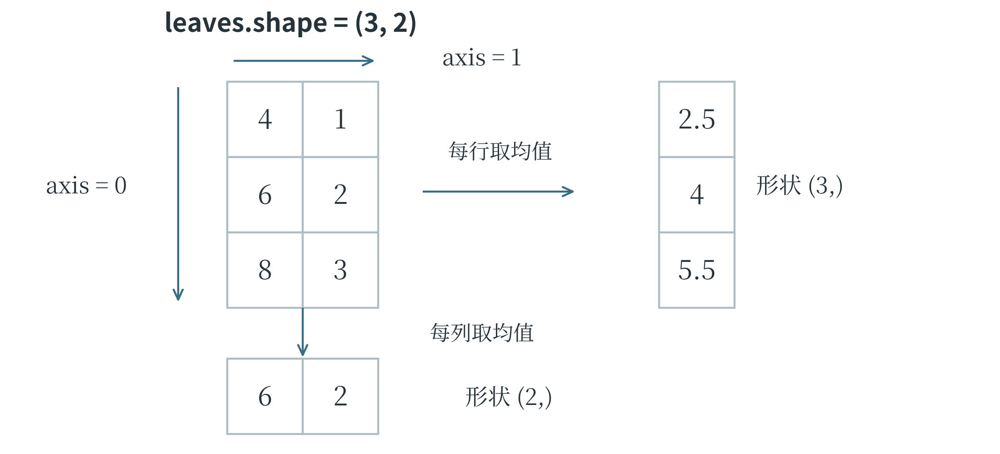
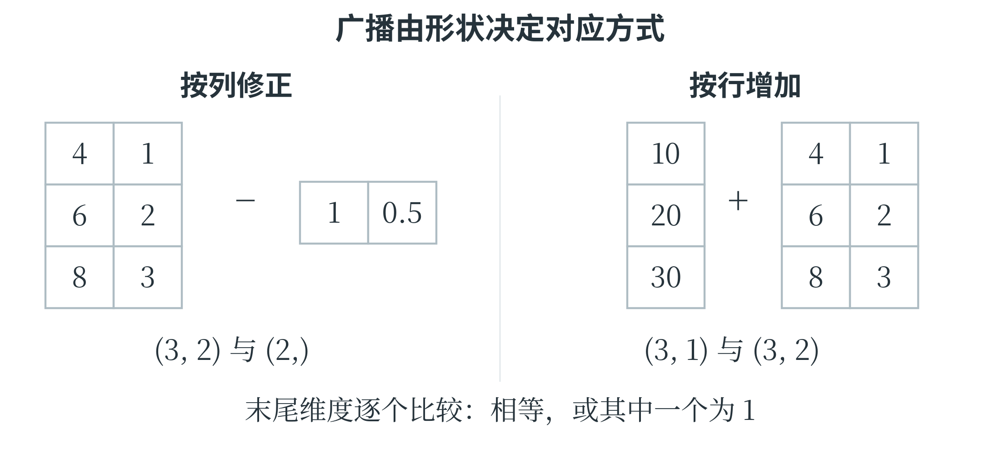
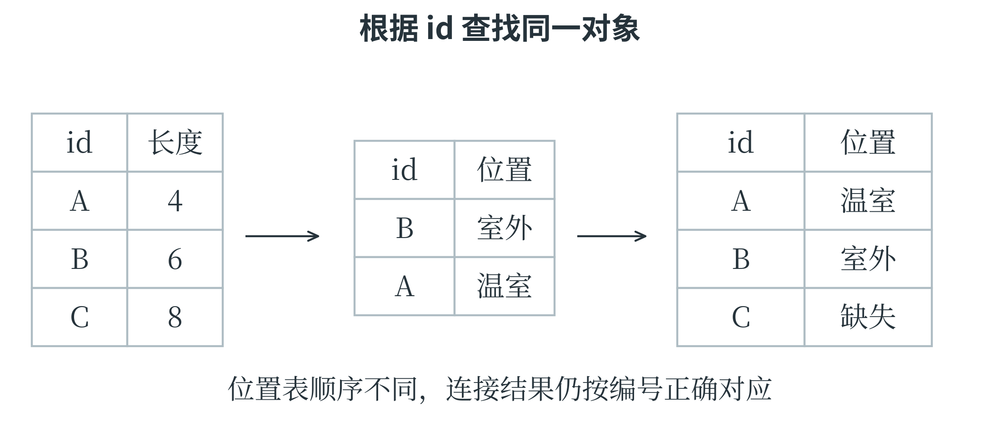
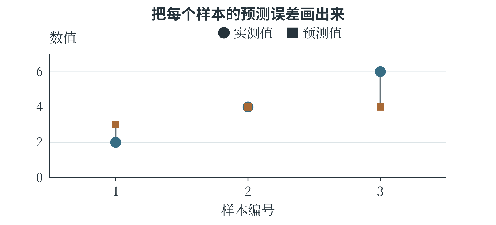
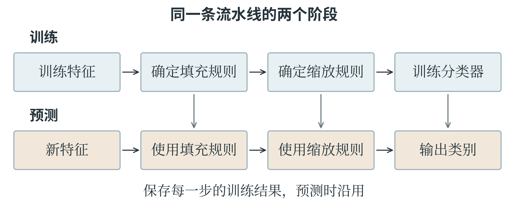

# 第七章 用 Python 处理数据与训练模型

前面的计算可以逐项手算，也可以写成循环；数据增加后，专门的工具能把重复操作组织得更清楚。本章介绍 NumPy、Pandas、Matplotlib 和 scikit-learn，依次完成数组运算、表格处理、绘图和模型训练。学习这些工具，不必把所有函数背下来，但需要知道输入是什么形状、一个操作改变了什么、输出怎样解释。CAICP 对第三方库的要求也强调结合文档理解和使用，代码的正确性仍要回到前面已经说明的数学与学习流程上检查。

## 7.1 NumPy

### 从列表到数组

**NumPy** 是 Python 中用于数值计算的常用第三方库。它提供多维数组 `ndarray`，能够对许多同类型数值进行统一运算。与列表相比，数值数组对形状和数据类型有更明确的约定，许多计算由库内部高效执行。

使用第三方库之前，需要在当前 Python 环境中安装；安装本章所需库时，可以在终端依次执行下面两条命令。终端是接受并执行系统命令的工具，这些命令应在终端输入，不写进 Python 源文件。

```text
python -m pip install numpy pandas matplotlib
python -m pip install scikit-learn jieba
```

有些环境用 `python3` 启动 Python，此时相应地将命令开头改为 `python3`。安装与运行程序应使用同一个环境。同一节的示例依次接续前面的导入和数据，初次运行时宜按顺序执行。导入时常约定将 NumPy 简写为 `np`。以下数组表示三片叶子的长度与宽度，每一行一个样本，每一列一种特征。

```python
import numpy as np

leaves = np.array([[4.0, 1.0],
                   [6.0, 2.0],
                   [8.0, 3.0]])
print(leaves.shape)
print(leaves.ndim)
print(leaves.size)
```

三个输出依次为 `(3, 2)`、`2`、`6`。`shape` 是形状，说明有 3 行、2 列；`ndim` 是数组的轴数；`size` 是元素总数。

一个样本有两个特征，可以称为二维特征向量；将三份样本放成表格后，数组也有两个轴。这两个“二维”碰巧数字相同，含义却不同。若表格改成 3 行、10 列，每个样本有 10 维特征，数组仍然只有行、列两个轴。

数组的 `dtype` 表示元素的数据类型。`np.array([1, 2, 3])` 通常得到整数数组，`np.array([1, 2, 3], dtype=float)` 则明确使用浮点数。整数数组若直接接收小数，可能丢失小数部分，因此需要小数结果时应先选择合适类型。常用的 `np.zeros((2, 3))` 创建全零的 2 行 3 列数组，`np.ones((2, 3))` 创建全一数组；它们适合为后续计算准备空间。

`np.arange(0, 6, 2)` 按步长产生 0、2、4，不包含终点 6；`np.linspace(0, 1, 5)` 则在两端之间等间距产生 5 个数，默认包含 0 和 1，结果为 0、0.25、0.5、0.75、1。前者主要规定步长，后者主要规定数量。用小数步长时，浮点舍入可能影响 `arange` 的端点表现，需要固定点数的绘图任务常用 `linspace`。

### 索引、切片与形状

NumPy 的二维索引可以在一对方括号内写“行、列”。对上面的 `leaves`，`leaves[1, 0]` 是第二行第一列，值为 6.0；`leaves[:, 0]` 取所有行的第一列，得到 `[4., 6., 8.]`；`leaves[0:2, :]` 取前两行和全部列。切片仍是左端包含、右端不包含，冒号单独使用表示该轴全部位置。

```python
print(leaves[:, 0].shape)
print(leaves[:, 0:1].shape)
print(leaves[leaves[:, 0] >= 6])
```

前两个形状分别为 `(3,)` 和 `(3, 1)`。整数索引取出一列后减少一个轴，切片保留了列轴，形成 3 行 1 列的数组。最后一行先检查每行长度是否不小于 6，产生布尔数组 `[False, True, True]`，再保留条件为真的行，得到长度为 6 和 8 的两条记录。这叫**布尔索引**。多个数组条件通常用 `&`、`|` 组合，并把每个条件放进括号；它们与针对单个布尔值的 `and`、`or` 用法不同。**变形**用 `reshape` 改变数组的组织形状，元素总数必须保持一致。`np.arange(6).reshape(2, 3)` 得到两行三列，依次为 0、1、2 和 3、4、5。某一个位置可以写 `-1`，让 NumPy 根据总数推算，例如 `reshape(3, -1)` 得到三行两列。

`reshape` 不等于转置：转置用 `.T` 交换行列位置，例如两行三列变成三行两列时，原来的一行变成一列，而不是重新按原顺序分组。

NumPy 的基本切片常常是原数组的**视图**，与原数组共享数据。下面的小例子需要特别留意：

```python
a = np.array([1, 2, 3])
part = a[:2]
part[0] = 9
print(a)
independent = a[:2].copy()
independent[0] = 7
print(a)
```

两次输出都是 `[9 2 3]`。第一次通过视图修改，改变了原数组；第二次先 `copy`，修改的是独立副本。

一次给出一组整数位置的索引，以及布尔索引，通常产生副本，不能把所有取子数组的操作一律当作视图。程序需要独立修改数据时，明确复制比依靠对切片的模糊印象更稳妥。

### 向量运算与按轴统计

对数组使用 `+`、`-`、`*`、`/`、`**`，通常进行逐元素计算。`np.array([1, 2]) * 2` 得到 `[2, 4]`，而 Python 列表 `[1, 2] * 2` 得到 `[1, 2, 1, 2]`。相同符号遇到不同对象，含义可能不同。两个数组使用 `*` 是对应元素相乘，矩阵乘法则用 `@`。

```python
A = np.array([[2, 1, 3], [0, 4, 1]])
w = np.array([1, 2, 1])
print(A * w)
print(A @ w)
```

第一项输出两行三列，分别为 `[2, 2, 3]` 和 `[0, 8, 1]`；第二项输出 `[7, 9]`，正是第三章中每行与向量做点积的结果。第一项中，形状 `(3,)` 的 `w` 对每一行重复应用，称为**广播**。一般的广播规则从形状末端对齐，各对应轴长度相等或其中之一为 1 时可以配合；不能配合就会报错。广播并不意味着库会猜测哪一行应该配哪一列。

除了形状，统计运算还要指定沿哪个轴汇总。`leaves.mean()` 对全部 6 个元素求平均；`leaves.mean(axis=0)` 将行方向汇总掉，保留每列结果，得到 `[6., 2.]`；`leaves.mean(axis=1)` 将列方向汇总掉，保留每行结果，得到 `[2.5, 4., 5.5]`。

按列求均值，分别得到平均长度与平均宽度；按行求均值，则把同一叶片的长度和宽度混在一起。后者是否有意义，要看任务需要。



图 7-1 axis 等于 0 时汇总行轴，结果保留各列

`sum`、`min`、`max`、`std` 等方法也可以接受轴参数。NumPy 的 `std` 默认用元素个数作方差分母，和第三章整组数据的标准差定义一致；一些其他统计工具默认使用样本数减一，比较数值时应核对约定。利用按列均值和标准差，可以进行第五章的标准化，但这些统计量仍应从训练部分计算。

```python
true_values = np.array([10.0, 10.0, 10.0])
predictions = np.array([8.0, 11.0, 12.0])
errors = predictions - true_values
mae = np.mean(np.abs(errors))
mse = np.mean(errors ** 2)
print(round(mae, 4), round(mse, 4))
```

输出为 `1.6667 3.0`。一次数组减法已经完成三条记录的误差计算，`abs` 和平方再分别作用于每个位置，最后求平均。这样的代码与手算步骤一一对应，减少了显式循环，却没有改变指标定义。

### 把形状变化画在纸上

数组运算中，形状是一条很有用的线索。还是看三片叶子的测量值：三行分别属于三个样本，两列依次是叶长和叶宽。如果两种测量工具的零点分别偏高 1 厘米和 0.5 厘米，需要从每行的两列中减去这两个数。长度为 2 的数组正好与每行的两项对应。

```python
offsets = np.array([1.0, 0.5])
corrected = leaves - offsets
print(corrected)
```

结果为 `[[3.0, 0.5], [5.0, 1.5], [7.0, 2.5]]`。计算时，`offsets` 的两项分别作用于两列，每一行沿用同一组修正数。这正是广播：程序不必先写出三份相同的修正数组，也能表达对应的运算。这里给定的修正数来自假设的仪器零点偏差，与从样本数据中学习标准化参数是两回事。假如另一个任务要求第一行加 10、第二行加 20、第三行加 30，且每行的两项都加上该行的数，修正数组就应写成三行一列。图 7-2 中，两种形状决定了两种不同的对应方式。

```python
row_offsets = np.array([[10.0], [20.0], [30.0]])
print(leaves + row_offsets)
```

结果为 `[[14.0, 11.0], [26.0, 22.0], [38.0, 33.0]]`。若误写成形状 `(3,)` 的 `[10, 20, 30]`，末尾维度 3 与原数组的末尾维度 2 既不相等，也都不是 1，便不能这样相加。

数组里“恰好有三个数”，并不意味着程序知道这三个数各属于哪一行；对应关系必须由形状表达清楚。



图 7-2 一行两项对应各列，三行一项对应各行

`reshape` 与转置也容易混淆。把按行排列的数 1、2、3、4、5、6 放成三行两列，再分别执行两种操作，可以直接看出差别。

```python
numbers = np.arange(1, 7).reshape(3, 2)
print(numbers.reshape(2, 3))
print(numbers.T)
```

前一个结果是 `[[1, 2, 3], [4, 5, 6]]`，按默认的行顺序重新安排形状；后一个结果是 `[[1, 3, 5], [2, 4, 6]]`，把原来的列变成行。结果虽然都是两行三列，每个位置的内容却不一样。处理“每行一个样本”的数据时，随意重排可能把不同样本的特征拼到一起。数组尺寸符合接口，只说明程序有机会运行，还要检查每行、每列的实际含义。

## 7.2 Pandas

### 有列名的表格

**Pandas** 适合处理有字段名的表格数据。`Series` 表示带索引的一列数据，`DataFrame` 表示由多列组成的表。不同列可以采用不同类型，例如编号为字符串、长度为小数、类别为文字。下面使用字典创建一张表，字典的键成为列名，各列表中的同一位置构成一行；`None` 表示缺失。

```python
import pandas as pd

df = pd.DataFrame({
    "id": ["A", "B", "C", "C"],
    "length": [4.0, None, 8.0, 8.0],
    "width": [1.0, 2.0, 3.0, 3.0],
    "kind": ["甲", "乙", "甲", "甲"]
})
print(df.shape)
print(df.head(2))
```

`shape` 为 `(4, 4)`，`head(2)` 显示前两行。表格最左侧默认出现的 0、1 等数字是行索引，不是 `id` 列的内容。`df["length"]` 得到一个 Series，`df[["length", "width"]]` 则得到两列构成的 DataFrame。这里两层方括号有不同作用：里面是一份列名列表，外面用它选择表格列。`iloc` 按整数位置选择，`df.iloc[0, 1]` 得到第一行第二列的 4.0；`loc` 按行索引标签和列标签选择。若把 `id` 设成索引，就可以用样本编号选行。但本表 C 出现两次，以 C 选取时会得到两条记录，不能假定索引标签一定唯一。位置切片的右端不包含，标签切片在相应用法中通常包含右端，阅读文档时需要区分。

文件中常见的 **CSV** 以分隔符组织行列。`pd.read_csv("leaves.csv")` 读取文件，`df.to_csv("cleaned.csv", index=False)` 保存表格；后面的 `index=False` 表示不把行索引额外写成一列。若当前文件夹没有该文件，读取会报文件不存在，不能把路径问题当作数据处理算法的错误。下面用内存中的文本演示相同的读取方法，不需要事先准备文件。

```python
from io import StringIO

csv_text = "id,length,width\nA,4.0,1.0\nB,6.0,2.0\n"
small_table = pd.read_csv(StringIO(csv_text))
print(small_table["length"].mean())
```

输出为 `5.0`。`StringIO` 把字符串包装成可读取的文本对象，`read_csv` 再按行列解释内容。实际文件还可能需要说明字符编码、分隔符或日期格式，这些都是读取规则，不应在失败后盲目删除看不懂的内容。

### 筛选、清洗和分组

可以先用 `isna` 识别缺失，再决定处理方式。下面先删除完全相同的重复行，再在这份示意表内用已知长度的均值填充缺失。它仅演示清洗操作；若这张表进入机器学习流程，应先划分数据，再从训练部分学习填充值。

```python
clean = df.drop_duplicates().copy()
print(clean["length"].isna().sum())
mean_length = clean["length"].mean()
clean["length"] = clean["length"].fillna(mean_length)
selected = clean.loc[clean["length"] >= 6,
                     ["id", "length", "width"]]
print(selected)
```

第一项输出 1，表示一条长度缺失。去重后已知长度为 4 和 8，均值为 6，B 的长度因此被填为 6。筛选结果保留 B、C 两行。`drop_duplicates()` 不指定字段时按整行比较；若只按编号去重，应明确 `subset="id"`，并先判断同一编号的多条记录到底是重复录入还是不同时间的有效观测。

对按时间排序、间隔相同的一列数，可以用线性插值演示中间缺失值的估计：

```python
temperatures = pd.Series([18.0, None, 22.0])
print(temperatures.interpolate().tolist())
print(clean.groupby("kind")["length"].mean())
```

第一项为 `[18.0, 20.0, 22.0]`。第二项先按 `kind` 分组，再对每组长度求平均，甲类均值为 6，乙类也是 6。`groupby` 不是训练分类模型，它依据现有字段把记录分组后执行统计。如果要同时查看每组样本数，还应增加计数，避免把样本很少的组与大组的均值作过强比较。

### 连接、追加与类别转换

下面的右表为每个编号补充采集区域。左连接保留 `clean` 的所有记录，编号 C 在右表没有出现，连接后的区域字段因而缺失。

```python
places = pd.DataFrame({
    "id": ["A", "B"],
    "place": ["温室", "室外"]
})
joined = clean.merge(places, on="id", how="left",
                     validate="one_to_one")
print(joined[["id", "place"]])
```

`on` 指定共同的键，`how="left"` 指定左连接，`validate="one_to_one"` 要求两边的连接键都唯一；若这一约定不成立，程序会报告问题，便于发现意外重复。Pandas 也有 `join` 方法，常按索引组织连接。使用哪种写法，都要先清楚按哪个字段配对，以及一条记录可能匹配几条。

```python
new_row = pd.DataFrame({
    "id": ["D"], "length": [5.0],
    "width": [1.5], "kind": ["乙"]
})
combined = pd.concat([clean, new_row], ignore_index=True)
encoded = pd.get_dummies(combined, columns=["kind"],
                         dtype=int)
print(encoded.columns.tolist())
```

`concat` 沿行方向追加，`ignore_index=True` 为结果重新安排连续行索引。追加操作在概念上也常称 append，但较新版本的 Pandas 已移除 `DataFrame.append` 方法，应使用 `concat`。

`get_dummies` 将类别列转换成独热列，结果中包含 `kind_乙`、`kind_甲` 等字段；具体顺序应查看实际列名。

分别对训练与新数据独立编码，可能产生不同列集合或顺序，机器学习时更适合使用在训练数据上确定类别规则的编码器。

### 标签相同与位置相同

前面筛选出的 `selected` 保留 B、C 两行，行索引仍为 1、2。筛选只是选择记录，并没有把它们的索引自动改为 0、1。于是 `selected.iloc[0]` 取得第一行，也就是 B；`selected.loc[1]` 则查找标签为 1 的行，在本例中恰好也是 B。两个结果相同，依据却不同。

```python
print(selected.iloc[0]["id"])
print(selected.loc[1, "id"])
renumbered = selected.reset_index(drop=True)
print(renumbered.index.tolist())
```

前两行都输出 B，最后一行输出 `[0, 1]`。`reset_index` 可以重新安排索引，`drop=True` 表示不把旧索引另外保存成一列。样本编号 `id` 与表格行索引又是两种信息：A、B、C 是记录中的编号，0、1、2 是目前这张表采用的行标签。只要含义清楚，二者不必相同。连接表格时，更应使用能识别对象的字段。假设测量表按 A、B、C 排列，位置表却按 B、A 排列，直接把“位置”一列按顺序抄过去，会把 A 的位置误写成 B 的位置。`merge` 根据 `id` 匹配，能在两张表顺序不同时仍找到同一对象。没有匹配项的 C 保留下来，位置显示缺失，提醒后续补查。



图 7-3 连接依据是对象编号，行在表格中的位置可以不同

还有一种更隐蔽的情况：如果位置表里 B 出现两次，连接结果可能让 B 的测量记录也出现两次。此时增加的是匹配组合，不能理解成又采集了一片叶子。前面的 `validate="one_to_one"` 要求连接字段在两边都不重复，遇到这种情况会报错。

报错提供了检查数据的线索：应先弄清两条 B 是否分别代表两个时间、两次观测，还是确实重复，再决定连接键是否需要同时包含日期等字段。

## 7.3 Matplotlib

### 图、绘图区和坐标轴

**Matplotlib** 是常用的 Python 绘图库。`Figure` 表示整张图，`Axes` 表示其中一个绘图区，绘图区内部再包含横轴、纵轴、曲线、点和图例等对象。常见写法 `fig, ax = plt.subplots()` 同时创建一张图和一个绘图区，再通过 `ax` 指定画什么、怎样标注。

```python
import matplotlib.pyplot as plt

fig, ax = plt.subplots(figsize=(6, 4))
ax.scatter([4, 6, 8], [1, 2, 3], color="#376d84")
ax.set_xlabel("Length / cm")
ax.set_ylabel("Width / cm")
ax.set_title("Leaf measurements")
fig.tight_layout()
fig.savefig("leaf_scatter.png", dpi=160)
plt.show()
```

`scatter` 画散点，两个列表分别给出每个点的横坐标和纵坐标；同一位置的数据配成一个点。`figsize` 用英寸指定图的物理大小，`savefig` 保存文件，`dpi` 影响输出像素密度；`show` 在支持图形显示的环境中展示图像。图中使用英文标签是为了让示例在没有中文字体的环境中也能显示，含义分别为叶长、叶宽和叶片测量。需要中文标签时，应选用已安装且包含中文字形的字体。`tight_layout` 尝试安排边距，减少标签被挤出图外的情况，保存后仍应检查实际图片。文件保存到程序当前工作目录，并不一定与编辑器打开的源文件在同一处。保存时给出明确的输出路径，便于找到文件。

### 根据关系选择图形

折线图适合具有先后顺序的数据。例如，连续四天两台设备完成的处理数量可以画成两条线；散点图则通常不把每个点依次连起来，因为行顺序未必有意义。条形图比较不同类别的数量，饼图显示互不重叠的部分在同一整体中的占比。图形选错，即使代码没有报错，也可能让读者误解数据。

```python
fig, ax = plt.subplots(figsize=(6, 4))
days = [1, 2, 3, 4]
ax.plot(days, [20, 35, 30, 50], marker="o",
        color="#376d84", label="Device A")
ax.plot(days, [18, 24, 36, 42], marker="s",
        linestyle="--", color="#73958c", label="Device B")
ax.set_xlabel("Day")
ax.set_ylabel("Processed images")
ax.set_xticks(days)
ax.set_ylim(0, 60)
ax.legend()
fig.tight_layout()
fig.savefig("device_lines.png", dpi=160)
plt.show()
```

`label` 为每个数据系列命名，`legend` 显示图例。颜色、圆形与方形标记、实线与虚线共同区分两条曲线，灰度打印时也能辨认。`set_xticks` 将横轴刻度放在四个整数日期上，`set_ylim` 指定纵轴范围。范围过窄可能夸大波动，过宽又会掩盖细节，需要结合要表达的问题选择，并让单位和刻度清楚可见。

下面在同一张图中放置条形图和饼图，两者使用同一组类别数量。

```python
names = ["Plants", "Animals", "Objects"]
counts = [40, 35, 25]
colors = ["#376d84", "#73958c", "#b5a98f"]
fig, axes = plt.subplots(1, 2, figsize=(9, 4))
axes[0].bar(names, counts, color=colors)
axes[0].set_ylabel("Image count")
axes[0].set_ylim(0, 50)
axes[1].pie(counts, labels=names, colors=colors,
            autopct="%.0f%%", startangle=90)
axes[1].set_aspect("equal")
fig.tight_layout()
fig.savefig("category_charts.png", dpi=160)
plt.show()
```

`subplots(1, 2)` 创建一行两个绘图区，`axes[0]` 和 `axes[1]` 分别访问它们。`bar` 用条高表示数量，`pie` 将数量转成整体中的比例；`autopct` 控制百分数标签格式，`equal` 使两个方向显示尺度相同，保持饼图为圆形。三个数量相加为 100，所以百分比恰好与数量数字相同，换一组总量后就不能再这样读。

图形画出来以后，还需要读图。对同一批数据，先用散点图观察关系，再用折线图检查时间变化，再按类别汇总，可能发现不同问题。保存之前应核对每个轴代表什么、数据是否按应有顺序排列、图例是否对应曲线，以及缺失记录有没有被悄悄当成零。

### 画出模型的误差

第三章计算过实际值 2、4、6 与预测值 3、4、4 的误差。把这组数据画出来，可以更直观地看见模型在哪个样本上偏高、在哪个样本上偏低。横轴只表示样本编号，实测值和预测值使用不同标记，同一样本的两点间再画一条细线。

```python
sample_ids = np.array([1, 2, 3])
observed = np.array([2, 4, 6])
predicted = np.array([3, 4, 4])
fig, ax = plt.subplots(figsize=(6, 4))
ax.scatter(sample_ids, observed,
           marker="o", label="Observed")
ax.scatter(sample_ids, predicted,
           marker="x", label="Predicted")
ax.vlines(sample_ids, observed, predicted,
          color="gray", linestyle="--")
ax.set_xticks(sample_ids)
ax.set_xlabel("Sample")
ax.set_ylabel("Value")
ax.set_ylim(0, 7)
ax.legend()
fig.tight_layout()
fig.savefig("prediction_errors.png", dpi=160)
plt.show()
```

`vlines` 在给定横坐标处画竖直线段，起点和终点来自实测值与预测值。第二个样本的两值相同，线段长度为零；第三个样本的线段最长，绝对误差最大。图 7-4 使用同样的数据，横坐标上的距离并不表示样本在现实中相隔多远，因此也没有必要把三个实测点连成一条连续变化的曲线。



图 7-4 点的位置表示数值，竖直线段的长度表示绝对误差

误差图还可以帮助提出下一步问题。如果多数预测都偏低，也许截距需要调整；如果误差随着输入增大而增大，也许直线没有抓住所需的曲线关系。不过，三个点只能演示读图的方法。实际分析中，需要更多记录，并把发现的问题带回训练与验证流程中检查。

## 7.4 scikit-learn 与第三方库使用

### 统一接口与输入形状

**scikit-learn** 提供许多常见机器学习算法，导入名称为 `sklearn`。很多模型具有相似接口：创建对象时设定超参数，调用 `fit` 使用训练数据学习，再调用 `predict` 对新数据预测。名字相同并不表示内部算法相同，KNN、树和神经网络仍按第六章各自的方法工作。数据处理工具还常提供 `transform`，表示按已经确定的规则转换数据。例如，缩放器的 `fit` 计算并保存训练列的均值与标准差，`transform` 用保存的数值进行标准化。`fit_transform` 将这两步接在一次调用里，适合在训练数据上使用；验证和测试数据则使用 `transform`，沿用训练阶段的规则。

监督学习常将特征记为 `X`，形状为“样本数、特征数”；目标记为 `y`，对单目标任务通常是一维数组，长度等于样本数。只有一个特征时，`X` 仍应是二维。例如，三个输入 1、2、3 应写成 `[[1], [2], [3]]`，而不是只有一维的 `[1, 2, 3]`。单个新样本也要保留样本轴，所以输入 4 写成 `[[4]]`。

```python
from sklearn.linear_model import LinearRegression

X_small = np.array([[1.0], [2.0], [3.0]])
y_small = np.array([2.0, 4.0, 6.0])
regressor = LinearRegression()
regressor.fit(X_small, y_small)
print(regressor.coef_)
print(regressor.intercept_)
print(regressor.predict([[4.0]]))
```

学到的系数约为 2，截距约为零，预测约为 8。浮点计算可能使零显示为非常接近零的小数。以 `_` 结尾的 `coef_`、`intercept_` 是拟合后得到的属性，与创建模型时的设置有所区别。这三个点只用于演示接口和拟合，不能用它们自身的零训练误差评价对真实数据的预测能力。

多项式回归可以将特征变换与回归模型串在一起。**流水线** `Pipeline` 按规定顺序连接处理步骤，使训练和预测使用一致的变换。

```python
from sklearn.pipeline import make_pipeline
from sklearn.preprocessing import PolynomialFeatures

polynomial_model = make_pipeline(
    PolynomialFeatures(degree=2, include_bias=False),
    LinearRegression()
)
polynomial_model.fit(
    [[1.0], [2.0], [3.0]], [2.0, 5.0, 10.0]
)
print(polynomial_model.predict([[4.0]]))
```

二次特征变换把每个输入扩成 $x$、$x^2$，`include_bias=False` 不再额外加入全一列，因为后面的回归模型已默认包含截距。三个目标正好来自 $x^2+1$，所以对 4 的预测约为 17。这是演示构造曲线的方法，增加次数是否适合真实问题，仍要独立验证。

### 标准化规则怎样保存下来

下面单独观察缩放器。训练数据只有一个特征，三个值是 10、20、30，均值为 20。按本书采用的总体标准差公式，标准差为 $\sqrt{200/3}$，约为 8.165。缩放器把这两个数保存下来，以后遇到新样本，仍然使用它们。

```python
from sklearn.preprocessing import StandardScaler

scaler = StandardScaler()
train_column = np.array([[10.0], [20.0], [30.0]])
scaled_train = scaler.fit_transform(train_column)
scaled_new = scaler.transform([[40.0]])
print(np.round(scaled_train.ravel(), 3))
print(np.round(scaled_new.ravel(), 3))
print(scaler.mean_)
```

训练结果约为 `[-1.225, 0.000, 1.225]`，新值 40 变成约 2.449，保存的均值仍为 20。`ravel` 将数组展开成一维，方便这里打印；它没有参与标准化计算。若反而对仅含 40 的新数据调用 `fit_transform`，缩放器会重新学习，新均值变成 40，输出也变成 0。这个 0 已经属于另一套坐标，不能与原来标准化后的训练点直接比较距离。

流水线把整条处理过程保存下来，预测时便能按顺序重用。训练时，原数据依次经过填充器、缩放器和模型；预测时，新数据先使用已经保存的填充与缩放规则，最后才进入已经训练的模型。不能因为新数据没有缺失，就跳过缩放；也不能先手动缩放一遍，再交给还会缩放一次的流水线。

### 完整地划分数据并选择模型

下面使用库内置的鸢尾花数据。它包含 150 个样本、3 个植物类别，每个样本有花萼长度、花萼宽度、花瓣长度和花瓣宽度四个特征，单位为厘米。花萼是花瓣外侧的叶状结构。数据已经提供测量值和类别标签，可以用来练习完整流程，无需在这个示例中另行采集图片。

```python
from sklearn.datasets import load_iris
from sklearn.model_selection import train_test_split

iris = load_iris()
X = iris.data
y = iris.target
(X_train, X_remaining,
 y_train, y_remaining) = train_test_split(
    X, y, test_size=0.4, random_state=7, stratify=y
)
X_valid, X_test, y_valid, y_test = train_test_split(
    X_remaining, y_remaining, test_size=0.5,
    random_state=7, stratify=y_remaining
)
print(X_train.shape, X_valid.shape, X_test.shape)
```

形状分别为 `(90, 4)`、`(30, 4)`、`(30, 4)`。第一次留出 40%，第二次把留出的部分平分，得到训练、验证和测试三组。`stratify` 按标签分层，使各组类别比例与原数据相近；`random_state` 固定随机划分过程。这个数据适合演示按样本随机划分，实际任务是否需要按对象或时间分组，仍应遵循第五章的要求。接下来比较两个 KNN 设置和一个浅层决策树。`StandardScaler` 在训练集上学习各列均值和标准差，并在预测时沿用；`SimpleImputer` 负责按训练列的均值处理缺失。鸢尾花数据本身没有缺失，这一步展示了怎样将完整处理过程放进流水线。

```python
from sklearn.impute import SimpleImputer
from sklearn.preprocessing import StandardScaler
from sklearn.neighbors import KNeighborsClassifier
from sklearn.tree import DecisionTreeClassifier
from sklearn.metrics import accuracy_score, confusion_matrix

candidates = {
    "KNN_3": KNeighborsClassifier(n_neighbors=3),
    "KNN_7": KNeighborsClassifier(n_neighbors=7),
    "Tree_3": DecisionTreeClassifier(
        max_depth=3, random_state=7
    )
}
best_model = None
best_score = -1.0
best_name = ""
```

这时只是准备模型对象，还没有用数据训练。树模型通常不需要标准化来改变按特征阈值划分的结果，这里为比较保持相同处理流程；KNN 的距离则会明显受到尺度影响。

```python
for name, classifier in candidates.items():
    model = make_pipeline(
        SimpleImputer(strategy="mean"),
        StandardScaler(),
        classifier
    )
    model.fit(X_train, y_train)
    valid_prediction = model.predict(X_valid)
    score = accuracy_score(y_valid, valid_prediction)
    print(name, round(score, 3))
    if score > best_score:
        best_score = score
        best_model = model
        best_name = name
```

`fit` 让填充器、缩放器和模型依次在训练部分学习；`predict` 则先变换新特征，再调用分类器。选择依据只有验证准确率。相同得分时，上面的严格大于条件保留先遇到的方案，这是一条明确的平分处理规则。评价样本只有 30 个，一个错误就会改变约 3.3 个百分点，所以微小差异需要谨慎解释。

```python
test_prediction = best_model.predict(X_test)
print("Selected:", best_name)
print("Test accuracy:",
      round(accuracy_score(y_test, test_prediction), 3))
print(confusion_matrix(y_test, test_prediction,
                       labels=[0, 1, 2]))
```

到这一步才使用测试集。混淆矩阵的行对应真实标签，列对应预测标签，顺序由 `labels` 明确为 0、1、2；这些编号对应的类别名称可查看 `iris.target_names`。这段示例保留验证后选中的已训练模型作测试，没有再合并训练与验证数据重新训练。另一种流程可以在方案确定后合并开发数据重训，但必须重新拟合完整流水线，并仍将测试集留在外面。

### 从一条预测追溯整条流程

按上述划分与设置运行，三个候选方案的验证准确率依次约为 0.967、0.933、0.900，因此选中 KNN_3。它在最终 30 个测试样本上判断正确 27 个，准确率为 0.900。混淆矩阵的三行依次为 `[10, 0, 0]`、`[0, 8, 2]`、`[0, 1, 9]`：第 0 类全部正确，第 1 类有两个被判为第 2 类，第 2 类有一个被判为第 1 类。完成模型选择后，保存下来的 `best_model` 包含三部分：由训练数据决定的填充规则、缩放规则，以及分类器。图 7-5 将训练和预测分开画出。两条路线都使用相同顺序，区别在于训练时需要确定规则和模型，预测时使用已经确定的结果。



图 7-5 训练确定处理规则，预测沿用整条流水线

假设新测量的四个特征依次为 5.1、3.5、1.4、0.2 厘米，可以按原来的特征顺序构造一行数据，交给最终流水线。代码同时打印类别编号与对应名称，使编号的含义可以检查。

```python
new_measurement = np.array([[5.1, 3.5, 1.4, 0.2]])
new_label = best_model.predict(new_measurement)[0]
print(int(new_label), iris.target_names[new_label])
```

这个示例的输出为 `0 setosa`。`predict` 返回一个预测数组，`[0]` 取出其中第一个样本的结果。英文名称 setosa 对应鸢尾花数据的第 0 类。输入中四个数的顺序仍是花萼长、花萼宽、花瓣长、花瓣宽；

如果交换其中两列，数组形状仍为一行四列，程序可能照常运行，预测含义却已经改变。来自表格的新记录，应先按训练时采用的字段顺序选择列，再转成模型需要的数组。

还可以将已经产生的错误预测找出来，看看具体是哪些样本。

```python
wrong_positions = np.flatnonzero(y_test != test_prediction)
for position in wrong_positions:
    actual_name = iris.target_names[y_test[position]]
    predicted_label = test_prediction[position]
    predicted_name = iris.target_names[predicted_label]
    print(int(position), actual_name, predicted_name)
```

`y_test != test_prediction` 对应位置逐项比较，得到布尔数组；`flatnonzero` 找出其中为真的位置。打印出的编号是测试数组中的位置，并非原始 150 条记录中的固定编号。保留原始样本编号，才能在更大的项目里追溯到相应记录或照片。这一步把一个准确率拆回具体错误，便于描述模型表现。如果要根据错误继续改特征或改模型，就开始了新一轮开发，需要重新安排独立的最终评价材料。

### 调用其他模型时仍要理解它们

多层感知机也使用相同的训练与预测接口。下面继续使用前面划分的训练集与验证集，演示一个含 8 个隐藏单元的网络；此处只是理解调用方法，不再据此反复查看前面已经使用过的测试集。

```python
from sklearn.neural_network import MLPClassifier

mlp = make_pipeline(
    StandardScaler(),
    MLPClassifier(hidden_layer_sizes=(8,), solver="lbfgs",
                  alpha=0.01, max_iter=2000, random_state=7)
)
mlp.fit(X_train, y_train)
mlp_prediction = mlp.predict(X_valid)
print(round(accuracy_score(y_valid, mlp_prediction), 3))
```

`hidden_layer_sizes=(8,)` 是只含一个元素的元组，表示一个隐藏层、8 个单元；若写成 `(8, 4)`，则是两个隐藏层。`solver` 选择优化方法，这里使用适合小型数据演示的 L-BFGS，它不是前面手写的普通梯度下降；`alpha` 控制权重正则化，`max_iter` 设定最大迭代次数。若出现尚未收敛的警告，应查看特征尺度、优化过程和迭代设置，不要只删除提示文字。支持向量机可以从 `sklearn.svm` 导入 `SVC`，例如 `SVC(kernel="linear", C=1.0)` 创建线性核分类器。不同算法需要不同超参数，但传入的数据形状和训练、评价的分工仍相同。

非监督聚类不需要目标标签。下面的输入只有一列特征，`fit_predict` 将拟合与输出训练样本簇编号合在一次调用中。

```python
from sklearn.cluster import KMeans

cluster_model = KMeans(
    n_clusters=2, n_init=10, random_state=7
)
cluster_ids = cluster_model.fit_predict([[1.0], [2.0],
                                        [8.0], [9.0]])
print(cluster_ids)
print(cluster_model.cluster_centers_)
```

得到的两个中心为 1.5 和 8.5，顺序可能交换，簇编号也随之交换。`n_init=10` 表示尝试多组初始中心，选择目标值较好的结果。簇编号 0、1 是算法为分组安排的名称，不能直接当作植物类别标签计算分类准确率。若有外部标签用于研究分组与真实类别的关系，需要采用适合聚类的比较方法，而不是把编号当作天然一一对应。

### 按文档使用陌生工具

遇到陌生函数，可以按输入、参数、返回值和最小示例的顺序阅读文档。函数接受列表还是数组，要求一维还是二维，是否改变原对象，参数默认值是什么，返回的是单个结果还是多个结果，都可能影响程序。读懂这些约定后，可以先修改一个小例子，检查实际结果是否符合预期。例如，**jieba** 是一个常用中文分词工具。中文词语之间通常没有空格，分词要判断一段连续文字可以怎样切成词。`jieba.lcut` 返回词语列表，`jieba.cut` 则返回可以遍历的迭代结果。

```python
import jieba

words = jieba.lcut("我喜欢学习人工智能")
print(words)
```

分词结果受词典、算法和语境影响。词语切分正确，不等于已经理解整句话的含义；专有名称或有歧义的短语还可能需要补充词典或人工核对。

使用第三方库时，也应注意安装名称与导入名称可能不同，如 scikit-learn 与 sklearn，并记录运行环境中的版本。文档示例中的默认值和接口可能更新，核对当前版本比依靠旧代码的印象更可靠。

## 本章小结

NumPy 按形状组织数值计算，Pandas 按字段处理表格，Matplotlib 把关系画出来，scikit-learn 将模型与处理步骤连接成可运行的学习流程。工具调用中的每一步，都能回接到前面已经学过的概念：按轴求均值、保持特征顺序、只从训练材料学习处理规则、用独立数据评价。CAICP 中需要阅读或补全库代码时，先判断数据形状和每步作用，再查明参数与输出含义，就能够逐渐把陌生接口还原成清楚的计算过程。

## 想一想

1．训练模型时，每株植物用四个特征表示。现在只有一株新植物，把它整理成形状 `(1, 4)` 和 `(4, 1)` 的数组，是同一回事吗？模型会把哪一维当作样本数？

2．三株植物的高度和叶宽排成三行两列。对这个数组使用 `mean(axis=0)`，会得到两个数还是三个数？它们分别在求谁的平均值？

3．一张表记录学号和姓名，另一张表记录学号和借书数，两张表的行顺序不同。若按第一行对第一行直接拼起来，会发生什么？应该用什么把同一个人的记录对上？

4．天气表中，有一天的降水量写着 0，另一天没有记录。它们都表示“没下雨”吗？如果把所有空格都填成 0，后面的统计会把什么误当成已经知道的事实？

5．要看一周气温怎样变化，又想看一批植物的高度与叶片数有没有关系。这两件事分别适合用什么图？各选一种，并说清楚横轴和纵轴放什么。

6．模型训练前做过标准化。预测新植物时，若把原始数值直接交给模型，会漏掉哪一步？能只根据这一株植物重新学习一套标准化规则吗？为什么应沿用训练时的处理流程？
