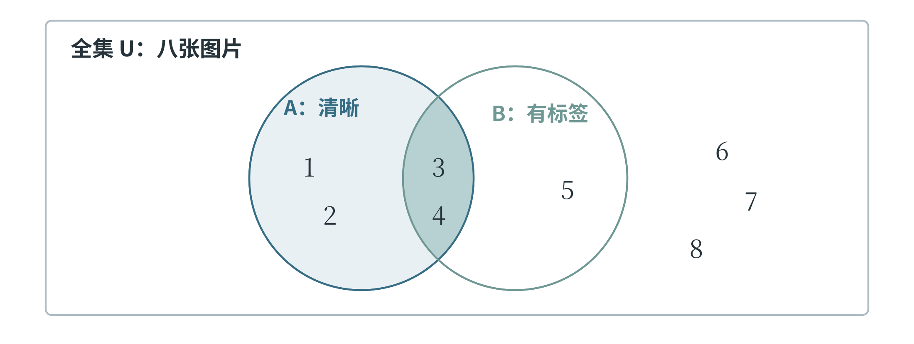
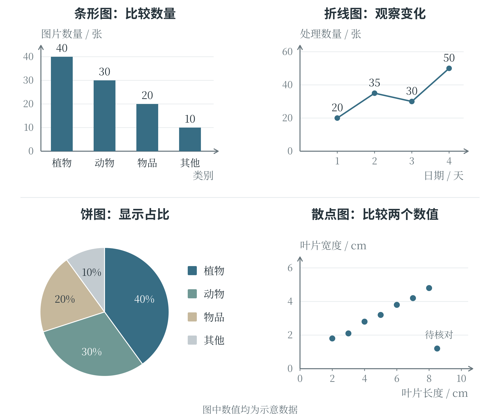
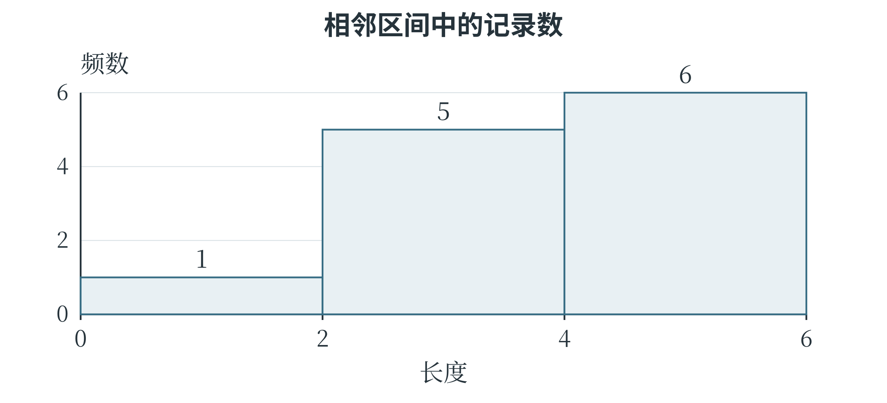
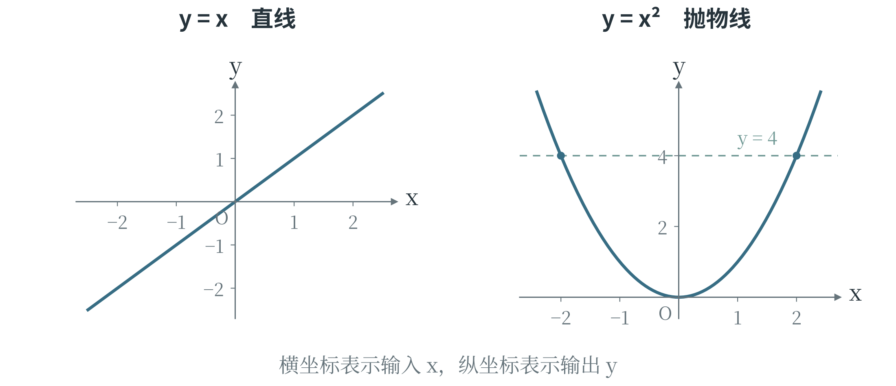
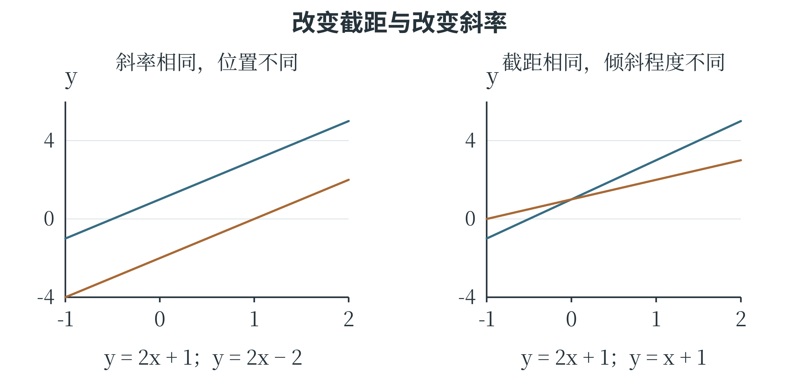
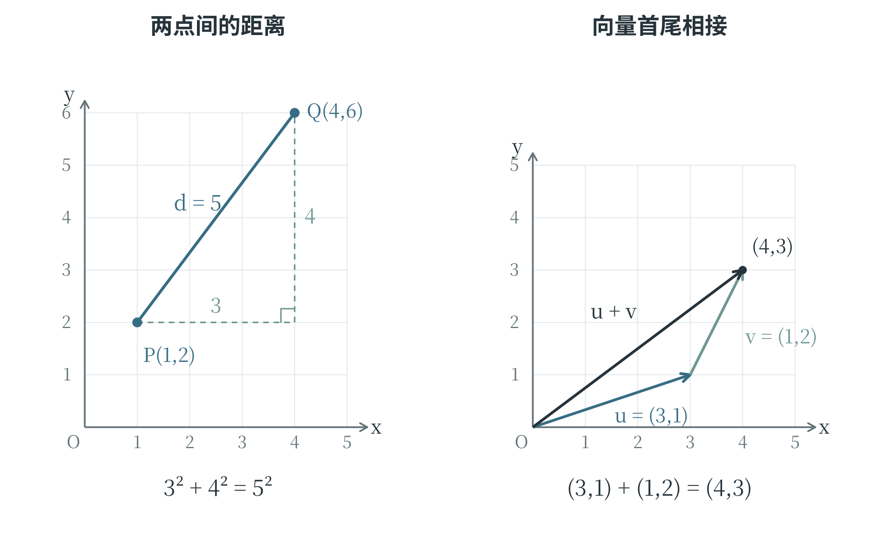
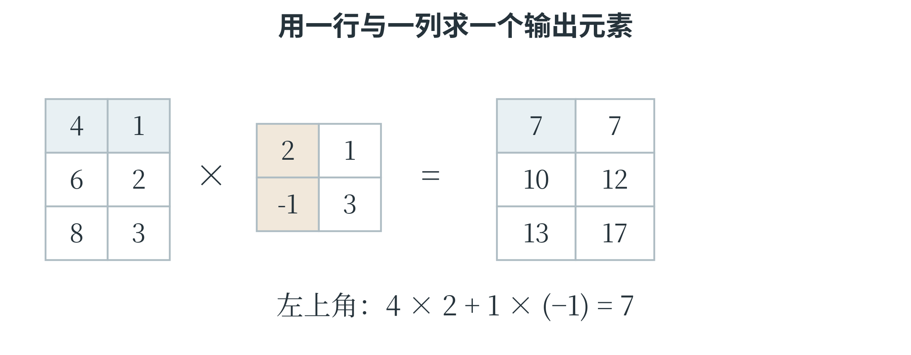
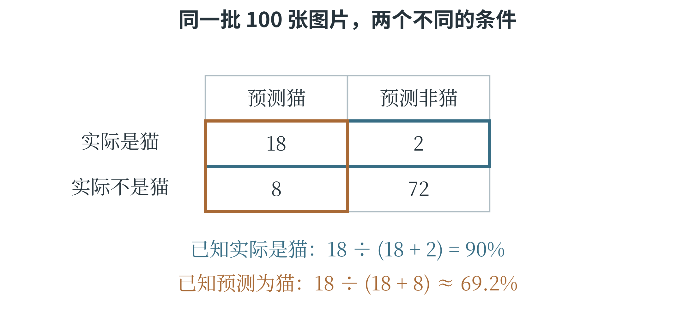
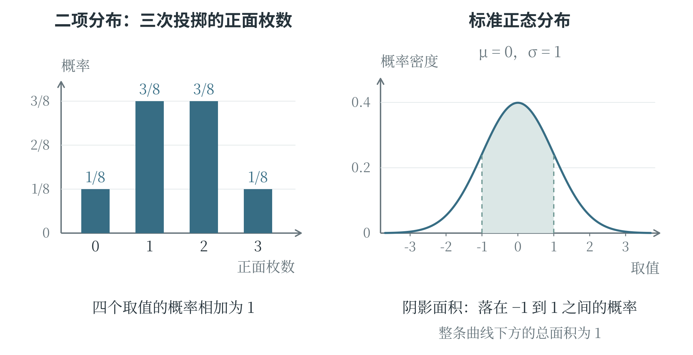

# 第三章 理解 AI 所需的数学基础

计算机可以很快算出一个结果，结果是否回答了原来的问题，却要看计算的依据。比较两张图片，需要先说明“相似”怎样衡量；评价一个预测模型，需要知道误差怎样统计；面对随机变化，还要分清一次出现的结果与长期发生的可能性。数学为这些判断提供了清楚的表达方法。本章从逻辑和集合讲起，逐步介绍统计、方程、函数、向量与概率。这些知识贯穿 CAICP 中的数据阅读、计算与建模，也将用于后面分析人工智能模型怎样工作。

## 3.1 逻辑、集合与条件判断

### 条件怎样组成一个判断

“这张图片的宽度大于 100 像素”是一句可以判断真假的话。给定图片宽度以后，它或者成立，或者不成立。这样的陈述称为**命题**。“把图片放大一些”是一项要求，没有真假之分，因而不是这里讨论的命题。一个陈述是否为真，可以依赖具体条件：宽度为 120 像素时，前面的命题为真；宽度为 80 像素时，它为假。

较复杂的要求可以由几个简单条件组成。设 $P$ 表示“图片宽度不少于 100 像素”，$Q$ 表示“图片高度不少于 100 像素”。这里的字母只是两个命题的简称，不表示具体数值。“$P$ 并且 $Q$”要求两项都成立，称为**合取**；“$P$ 或者 $Q$”要求至少一项成立，称为**析取**。数学中常分别写成 $P\land Q$ 和 $P\lor Q$，对应 Python 的 `and` 和 `or`。表 3-1 列出了所有可能的真假组合，这样的表称为**真值表**。

表 3-1 两个命题的真假组合

| P | Q | P 并且 Q | P 或者 Q |
| --- | --- | --- | --- |
| 真 | 真 | 真 | 真 |
| 真 | 假 | 假 | 真 |
| 假 | 真 | 假 | 真 |
| 假 | 假 | 假 | 假 |

这里的“或者”允许两项同时成立。若要求“恰好满足一项”，就要额外排除两项都成立的情况。图片宽、高均为 120 像素时，$P\lor Q$ 为真，却不符合“恰好有一边不少于 100 像素”的要求。自然语言中的“或”有时带有不同含义，写成程序之前，必须把这一点说清楚。

把一个命题的真假反过来，称为**否定**，记作 $\neg P$，对应 Python 的 `not`。否定“宽度不少于 100”，得到的是“宽度小于 100”，不是“宽度不大于 100”；恰好等于 100 的情况原来属于真，否定后就应属于假。检查边界上的取值，是理解条件的一种直接办法。对于组合条件，否定要作用于整个要求。“并非宽和高都合格”，只需至少一边不合格；“宽和高都不合格”则要求两边同时不合格。于是，否定“$P$ 并且 $Q$”，相当于“非 $P$ 或者非 $Q$”；否定“$P$ 或者 $Q$”，相当于“非 $P$ 并且非 $Q$”。这两条关系称为**德摩根律**。在程序中，`not (P and Q)` 与 `(not P) or (not Q)` 的真假结果相同，括号指出了否定的范围。

### 从条件推出结论

“如果一个整数是 4 的倍数，那么它是偶数”，说明前一个条件成立时，后一个结论也成立。这样的关系称为**蕴含**，常写成 $P\Rightarrow Q$。它把前提与结论联系起来。要否定这条关系，需要找到一个反例：既是 4 的倍数，又不是偶数的整数。只找到一个偶数 6，不能否定原来的话，因为原来的话并没有说“所有偶数都是 4 的倍数”。这也说明，前提和结论不能随意倒过来。已知一个整数是偶数，仍不能断定它一定是 4 的倍数。反过来，已知它不是偶数，就能断定它不是 4 的倍数：如果它是 4 的倍数，就会与“不是偶数”发生冲突。由 $P\Rightarrow Q$ 推出 $\neg Q\Rightarrow\neg P$，称为使用**逆否命题**。这种判断在排除不可能情况时很有用。

把一般规则用于一个具体对象，是常见的推理方式。例如，“所有正方形都有四条边；图形 A 是正方形；所以图形 A 有四条边”，由两个前提得到一个结论，具有**三段论**的形式。推理形式正确，还需要前提本身可靠。如果规则库既存着“所有鸟都会飞”，又存着“企鹅是鸟，企鹅不会飞”，规则与事实之间就有矛盾。计算机照着有矛盾的规则推理，并不能使这些前提自动变得正确。

“所有”与“有的”也决定了结论的范围。“所有图片都清晰”的否定，是“至少有一张图片不清晰”，不需要证明每张都模糊。“有的图片带有标签”的否定，则是“一张带标签的图片也没有”。在审查人工智能系统的判断规则时，找出一个反例就能否定“所有情况都如此”；观察到几次成功，却不能直接证明对所有情况都成立。

### 用集合表示一类对象

按照明确规则归在一起的一批对象，称为**集合**，其中的对象称为**元素**。例如，把编号为 1、2、3、4 的四张图片组成集合，可以写成 $A=\{1,2,3,4\}$。$2\in A$ 表示 2 是 $A$ 的元素，$7\notin A$ 表示 7 不是它的元素。集合只关心有哪些元素，不关心排列顺序；同一个元素写两次，也不会多出一个成员。如果集合 $B$ 中的每个元素都属于集合 $A$，就说 $B$ 是 $A$ 的**子集**，记作 $B\subseteq A$。例如，$\{1,3\}$ 是 $\{1,2,3,4\}$ 的子集。没有任何元素的集合称为**空集**，记作 $\emptyset$。空集与只含数字 0 的集合不同：$\{0\}$ 仍有一个元素。

讨论集合之前，还要明确全部候选对象的范围，称为**全集**，通常记作 $U$。设当前有八张图片，$U=\{1,2,3,4,5,6,7,8\}$；集合 $A=\{1,2,3,4\}$ 收集清晰的图片，集合 $B=\{3,4,5\}$ 收集带标签的图片。图 3-1 用长方形表示全集，用两个圆表示两个集合。这种用区域表现集合关系的图称为**韦恩图**。编号放在哪块区域，表示它具有什么条件，与图上面积的大小无关。

图 3-1 同时属于两个集合的元素位于重叠区域

$A$ 与 $B$ 的**交集**记作 $A\cap B$，包含同时属于二者的元素，因此结果为 $\{3,4\}$。**并集**记作 $A\cup B$，包含至少属于其中一个集合的元素，结果为 $\{1,2,3,4,5\}$。$A$ 相对于全集的**补集**记作 $U\setminus A$，表示全集里不属于 $A$ 的元素，这里是 $\{5,6,7,8\}$。符号 $\setminus$ 还可以表示两个集合的差：$A\setminus B=\{1,2\}$，留下属于 $A$、但不属于 $B$ 的部分。集合运算与逻辑条件有直接联系。筛选“清晰并且有标签”的图片，就是取交集；筛选“清晰或者有标签”的图片，就是取并集；筛选“不清晰”的图片，就是在当前全集中取清晰图片的补集。全集换成另一批图片，补集也可能改变，所以“剩下的全部”必须有明确范围。

计算并集中有多少个元素时，不能把两边的数量直接相加。上例中 $A$ 有 4 个元素，$B$ 有 3 个元素，编号 3、4 被两边都算了一次，应各减去一次，因此并集的元素数为 $4+3-2=5$。用 $|A|$ 表示有限集合 $A$ 的元素个数，可以把这一关系写成：

$$
|A\cup B|=|A|+|B|-|A\cap B|
$$

### 把一句筛选要求翻译成集合

仍以八张图片组成的全集为例，清晰图片为 $A=\{1,2,3,4\}$，带标签图片为 $B=\{3,4,5\}$。若要求“清晰，但还没有标签”，应先在清晰图片中查找，再排除带标签的部分，得到 $A\setminus B=\{1,2\}$。若要求“并非既清晰又带标签”，则应排除同时满足两项的图片，得到 $U\setminus(A\cap B)=\{1,2,5,6,7,8\}$。两句话只差几个字，选出的范围却大不相同。可以逐项检查编号 5 来验证区别。它带标签但不清晰，因此不满足第一句话，却满足第二句话。编号 6 既不清晰也没标签，同样只满足第二句话。选择一个正好能区分两种解释的对象，比只检查编号 3 这样的共同排除项更有帮助。这种对象可以用来检验条件表达是否准确，写程序时的小规模测试也经常采用这种思路。

集合图可以表现范围，逻辑式可以写进程序。例如，“清晰但未标注”对应 `clear and not labeled`；“并非既清晰又已标注”对应 `not (clear and labeled)`。括号使否定作用于整个合取。翻译时先确定每个简单条件，再按“并且”“或者”“并非”的层次组合，最后用具体对象检验，便能把自然语言、集合和代码联系起来。

## 3.2 数据统计与图表阅读

### 总量、占比与平均数

一批原始记录往往很长，统计可以用少量数值说明其中某个方面的特征。由数据计算得到、用于描述数据的量，称为**统计量**。假设从五株植物上各取一片叶子，测得长度依次为 2、3、3、4、8 厘米。这组数据包含 5 条记录，长度总和为 20 厘米；最大值为 8，最小值为 2。“有多少片叶子”与“叶片长度合计多少”分别在数记录、加长度，虽然都涉及“总数”，回答的却是不同的问题。

**占比**表示某一部分在整体中所占的比例，计算时用部分的数量除以整体的数量。五株植物中，有两株的叶片长度不少于 4 厘米，占比是 $2/5=0.4=40\%$。百分号表示“每一百份中的份数”，所以 40% 与小数 0.4 表示同一个比例。若一次图片识别中有 20 张图片，其中 17 张判断正确，这批图片上的正确率就是 $17/20=85\%$；换了一批图片，分母和统计范围也要随之改变。

把总和平均分给每条记录，得到**算术平均数**，通常简称平均数，也称均值。上面的长度总和为 20 厘米，分给 5 条记录，平均数就是 4 厘米。它不要求某一条记录恰好等于这个值。例如 2 厘米和 3 厘米的平均数为 2.5 厘米，虽然原记录里没有 2.5。

$$
\text{平均数＝各项数值的总和÷项数}
$$

平均数会随着每一个测量值变化。如果最后的 8 改成 18，总和增加了 10，五个数的平均数便从 4 增加到 6。其余四个数都没动，平均数却明显变大。这种变化不是计算出了错，而是平均数把每条记录都纳入了总和。要说明一组数据的通常水平，有时还需要观察排序后处在中间的位置。

### 中位数和众数各说明什么

把数据从小到大排列，处于正中间位置的数称为**中位数**。2、3、3、4、8 已经排好序，中间的第三个数是 3，所以中位数为 3。若记录条数是偶数，没有唯一的中间位置，就取中间两个数的平均数。例如 2、3、4、8 的中位数为 $(3+4)/2=3.5$。先排序再找中间位置很关键，原来录入顺序中的“第三条”不一定是中位数。**众数**是出现次数最多的数。五株植物的长度中，3 出现两次，其他数各出现一次，因此众数为 3。一组数据可能有多个众数，例如 2、2、5、5、8 中，2 和 5 都出现两次。对于每个数都只出现一次的数据，通常说没有众数。众数也能用于类别数据：统计图片中出现最多的类别，不需要把类别名称变成可以相加的数字。

平均数、中位数与众数回答的问题不同。平均数利用每个数值，适合反映总体的平均水平；中位数反映排序后的中间位置，受个别极大值或极小值的影响通常较小；众数指出最常见的取值或类别。把前面的 8 改成 18 后，中位数和众数仍为 3，而平均数变成 6。因此，一句“这批数据的典型值是 3”，还需要说明采用了哪一种统计方法。

只有中心位置还不够。两组长度分别为 4、4、4 和 1、4、7，平均数都是 4，后一组却分散得多。最大值减去最小值称为**极差**，两组的极差分别为 0 和 6。极差容易计算，但只用了两端的数；其余记录怎样分布，还需要进一步观察。

### 合并数据时怎样计算平均值

两组数据合在一起，通常不能直接把两个平均数再平均。设一组有 3 条记录，平均值为 4；另一组有 7 条记录，平均值为 8。两组总和分别是 $3\times4=12$ 和 $7\times8=56$，合并后的总和为 68，共 10 条记录，平均值为 6.8。直接计算 $(4+8)/2=6$，等于让两组拥有一样大的影响，忽略了第二组记录更多。

让各部分按相应的份量参与计算，得到的平均数称为**加权平均数**，这些份量称为**权重**。在这个例子中，3 和 7 是按记录条数确定的权重。也可以先把它们化成占比 0.3 和 0.7，再计算 $0.3\times4+0.7\times8=6.8$。合并不同组别的识别正确率时，每组的样本数同样决定了它在总结果中占多大份量。

$$
\text{合并后的平均数}=\frac{3\times4+7\times8}{3+7}=6.8
$$

### 从图表读出什么

表格保留了具体数值，统计图则把部分关系显示出来。**条形图**用条的长度表示数量，便于比较类别；竖着画时也常称为柱状图。**折线图**把有顺序的数据点连接起来，常用于观察随时间发生的变化。图 3-2 的左上图比较各类图片的数量，右上图记录连续四天完成的处理数量；后者第三天略有下降，第四天又上升，不能仅凭最后一点较高就说每天都在增加。**饼图**把一个圆分成若干扇形，用各块的大小表示它们在整体中的占比。同一个饼图的各部分应使用同一个整体，完整分类的占比相加为 100%。图中“植物”占 40%，表示这批图片中每 100 张约有 40 张属于这一类，不表示所有图片来源都保持同样比例。若各类别互相重叠，就不能直接把它们当成互不重叠的扇形拼满一个圆。

**散点图**用一个点表示一条记录，横、纵位置分别对应两个数值。右下图中每一点表示一株植物的叶片长度和宽度，越往右的点长度越大，越往上的点宽度越大。许多点整体向右上方延伸，说明这组记录中较长的叶片通常也较宽；右下方的那个点偏离了主要分布，值得核对原始记录。后面的坐标系一节将说明怎样准确表示点的位置。

图 3-2 四种统计图分别显示数量、变化、占比和两个数值的关系

读图时，先读清横纵轴、单位和刻度，再观察图形。纵轴若只显示 90 到 100，两个数值相差 2，也可能画出很明显的高度差；条形图通常从零开始，才便于用条长直接比较数量。折线图有时会缩小纵轴范围以突出细小变化，此时仍应按刻度读取实际差值。图例说明颜色或形状分别代表什么，不能仅凭颜色深浅猜测数值大小。散点一起上升或下降，表示数值之间有某种**相关关系**，但仅凭相关不能确定因果。例如，一段时间里冰饮销量和游泳人数都增加，可能是气温升高同时影响了二者，不能据此说购买冰饮会使人去游泳。偏离主要分布的记录称为**异常值**，它可能来自抄写错误，也可能是真实但少见的情况；删除之前，需要查清原因。

### 从频数表观察数据分布

如果记录的是长度，数值可能很多，逐个画柱子不一定方便。可以先把数值分成若干区间，统计每个区间里有多少条记录。某一数值或某一区间出现的次数称为**频数**。例如，一组长度记录为 1、2、2、3、3、3、4、4、4、4、5、5，共 12 个数；分为 $[0,2)$、$[2,4)$、$[4,6)$ 三个区间后，频数分别为 1、5、6。这里左边的方括号表示包括左端点，右边的圆括号表示不包括右端点，因此 2 归入第二组，4 归入第三组。

表 3-2 按区间统计长度

| 长度区间 | 包含的记录 | 频数 | 频率 |
| --- | --- | --- | --- |
| 0 到不足 2 | 1 | 1 | 1/12 |
| 2 到不足 4 | 2、2、3、3、3 | 5 | 5/12 |
| 4 到不足 6 | 4、4、4、4、5、5 | 6 | 6/12 |

把区间作为柱子的底边，画出相邻的长方形，就能观察数值主要集中在哪里。这类图称为**直方图**。图 3-3 使用等宽区间，以柱高表示频数。它与前面按“猫、狗、植物”等类别比较数量的条形图不同：直方图的横轴是一条有数量意义的数轴，区间的顺序与跨度不能随意调整。

图 3-3 分组统计把一串数值转化为分布形状

分组以后，个别记录的精确位置不再全部显示。例如，最后一柱只说明有六条记录落在 4 到不足 6 的范围，不能仅凭柱高恢复这六个原始数值。分组过粗，会把重要差异藏起来；分组过细，又可能使图形零散，难以观察整体。选择区间宽度需要结合数据数量和观察目的。若各组宽度不相等，还需要特别说明纵轴含义，不能继续把柱高和面积都当作频数。本书涉及的入门例子采用等宽分组。

### 用误差比较预测结果

预测值与真实值之间的差称为**误差**。本书在数值预测中采用“预测值减去真实值”的顺序：真实值为 10，预测为 8，误差就是 $-2$；预测为 12，误差就是 2。正负号表明偏高还是偏低。如果直接把误差求平均，正负可能抵消，两个预测都不准确，却得到平均误差为零。

只看差距大小，可以取误差的**绝对值**。正数的绝对值仍是它本身，负数的绝对值去掉负号，零的绝对值为零；例如 $|-2|=2$、$|2|=2$。把所有绝对误差相加，再除以样本数，得到**平均绝对误差**，英文简称 MAE。另一种办法是先把每个误差平方，再求平均，得到**均方误差**，英文简称 MSE。平方表示一个数乘它自己，所以 $(-2)^2=4$，$2^2=4$，也不会发生正负抵消。

表 3-3 两组示意预测及其误差

| 记录编号 | 真实值 | 模型甲的预测值 | 模型乙的预测值 |
| --- | --- | --- | --- |
| 1 | 10 | 8 | 10 |
| 2 | 10 | 8 | 10 |
| 3 | 10 | 12 | 10 |
| 4 | 10 | 12 | 18 |

模型甲的四个绝对误差都是 2，MAE 为 $(2+2+2+2)/4=2$，MSE 为 $(4+4+4+4)/4=4$。模型乙的绝对误差为 0、0、0、8，MAE 同样为 2，MSE 却为 $(0+0+0+64)/4=16$。两者的平均绝对误差相同，误差分布却不同；平方会使较大误差对结果的影响更突出。

比较这些指标，需要使用相同的任务、样本范围和单位。若真实值用厘米记录，MAE 的单位也是厘米，MSE 的单位则是平方厘米。MSE 的数值大于 MAE，并不表示它给同一模型判了“更差的分数”，二者本来就在用不同方法计量误差。若任务要求每条记录的绝对误差都不超过 4，仅看平均值也不够：表中的模型甲满足这一要求，模型乙的第四条记录不满足。模型的具体评价方法将在后面继续讨论。

## 3.3 代数、方程与函数

### 用字母表达数量关系

一次计算可以用具体数字写清，许多次计算中共同的规律则适合用字母表达。例如，每个文件占用 2 MB，另有一个固定占用 5 MB 的说明文件。若有 3 个普通文件，总大小为 $2\times3+5=11$ MB；若有 8 个，总大小为 $2\times8+5=21$ MB。用 $x$ 表示普通文件的个数，两个算式便可以统一写成 $2x+5$。这里的 $x$ 是**变量**，表示可以取不同值的量；固定的 2 和 5 是**常量**。式子中乘在变量前面的数称为**系数**，$2x$ 的系数就是 2。数学中常省略数字与字母之间的乘号，$2x$ 表示 $2\times x$；写成 Python 代码时，这个乘号要用 `*` 明确写出。把变量换成一个具体数并计算，称为**代入求值**。计算 $2x+5$ 在 $x=3$ 时的值，就是把式子中的 $x$ 换成 3。使用数量关系时还要留意变量能取什么值：文件个数可以是 0、1、2 等整数，不能是 $-3$ 或 2.5；若 $x$ 表示测得的长度，就可能取 2.5 这样的数。式子的计算规则相同，实际问题允许的取值却未必相同。

人工智能模型也常用字母表达计算规则。一个最简单的数值预测模型可以写成 $y=kx+b$：$x$ 是输入，$y$ 是输出，$k$ 和 $b$ 控制模型怎样计算。对于一个已经确定的模型，$k$、$b$ 是固定的数；比较或训练不同模型时，它们又可以调整。这类用于确定模型具体形式的量称为**参数**。因此，“变量”“常量”“参数”要结合所讨论的过程理解，不能只凭字母长什么样来区分。

### 读懂带下标和求和号的公式

数据一多，用 $x_1,x_2,\ldots,x_n$ 表示比为每个数另取一个字母方便。右下角的数字或字母叫作**下标**，用来区分第几项；$x_2$ 表示第 2 个数，不是 $x$ 的平方。这里 $n$ 表示数据个数，$x_i$ 表示第 $i$ 个数。它们的和可以简写为：

$$
\sum_{i=1}^{n}x_i=x_1+x_2+\cdots+x_n
$$

符号 $\sum$ 是**求和号**，下方的 $i=1$ 指从第 1 项开始，上方的 $n$ 指到第 $n$ 项结束。例如，$x_1=2$、$x_2=3$、$x_3=7$ 时，从第 1 项加到第 3 项，结果就是 12。式子看起来多了几个符号，实际动作仍是依次相加。平均数常记为 $\bar{x}$，读作“$x$ 上横线”，于是平均数的计算可以写为：

$$
\bar{x}=\frac{1}{n}\sum_{i=1}^{n}x_i
$$

这与“总和除以个数”完全相同。求和号把一长串加法收在一个式子里，下标则交代每次要取哪个数。还原成具体数据后，紧凑的公式便能读成一步步计算。

### 读公式时先展开几项

求和号前后的运算位置会改变含义。设 $x_1=1$、$x_2=3$，先平方再相加，得到 $x_1^2+x_2^2=1+9=10$；先相加再平方，则得到 $(x_1+x_2)^2=4^2=16$。写成求和号时，前者是 $\sum_{i=1}^{2}x_i^2$，后者是 $(\sum_{i=1}^{2}x_i)^2$。求和号只是一种简写，括号仍然决定哪些对象一起参与下一步计算。

带下标的公式也可以还原成表格。假设三条记录的真实值分别为 2、4、6，预测值分别为 3、4、4，用 $y_i$ 表示第 $i$ 条真实值，用 $\hat y_i$ 表示对应预测值；上方的小帽子提示这是估计或预测结果。要计算 MSE，就需要对每条记录先求差、再平方，最后求平均。

表 3-4 将误差公式展开为逐条计算

| 记录 i | 真实值 | 预测值 | 误差的平方 |
| --- | --- | --- | --- |
| 1 | 2 | 3 | (3−2)²＝1 |
| 2 | 4 | 4 | (4−4)²＝0 |
| 3 | 6 | 4 | (4−6)²＝4 |

$$
\frac{1}{3}\sum_{i=1}^{3}(\hat y_i-y_i)^2
=\frac{(3-2)^2+(4-4)^2+(4-6)^2}{3}
=\frac{5}{3}
$$

这里分母为 3，因为共有三条参与评价的记录；第二条的误差虽然为零，仍然是一条记录。若把三条误差先相加再平方，就会得到另一种量，不能再称为这批记录的均方误差。读到一个紧凑公式时，先代入两三条数据，便能检查下标、括号和计算顺序是否都理解正确。

### 方程怎样求解

如果总大小已经知道，反过来求文件个数，就需要**方程**。方程是含有未知数的等式，等式中的未知数是等待求出的量。沿用前面每个普通文件占 2 MB、说明文件占 5 MB 的条件，已知总大小为 21 MB，就有 $2x+5=21$。求解的目标是找到使等式成立的 $x$。等式两边同时减去 5，再同时除以 2，得到：

$$
2x+5=21\quad\Rightarrow\quad2x=16\quad\Rightarrow\quad x=8
$$

这些变形依靠等式的基本性质：两边加上或减去同一个数，等式仍然成立；两边乘以同一个非零数，或者除以同一个非零数，也保持相等，并且可以还原回原来的等式。除数不能是零，因为除以零没有定义。将 $x=8$ 代回原式，左边为 $2\times8+5=21$，与右边相同，便完成了检验。数学中的等号表示两边相等，含义与 Python 中用于赋值的单个 `=` 不同。

只有一个未知数、整理后能写成 $ax+b=0$ 且 $a\ne0$ 的方程，称为**一元一次方程**。上面的 $2x+5=21$ 可以写成 $2x-16=0$，就属于这一类。“元”指未知数的个数；这里的“一次”表示未知数以 $x$ 的形式出现，没有被平方或立方。

若一个问题有两个未知数，通常需要两个相互配合的等式。例如，$x+y=10$、$2x+4y=28$ 组成一个**方程组**，要求同一对 $x$、$y$ 同时满足两个等式。把第一个等式两边都乘 2，得到 $2x+2y=20$；再用第二个等式减去它，便有 $2y=8$，所以 $y=4$，代回得到 $x=6$。这个过程把两个未知数暂时减少为一个，称为**消元**。

用不等号连接的式子称为**不等式**。例如，$2x+5\leq15$ 表示 $2x+5$ 不超过 15，其解为 $x\leq5$。与方程相比，不等式往往允许一整段范围内的数。

两边加减同一个数，不等号方向保持不变；两边乘除同一个正数，方向也不变；乘除同一个负数时，方向必须反转。例如 $2<5$，同时乘 $-1$ 后是 $-2>-5$。因此，解 $-2x<6$ 时，两边除以 $-2$，结果是 $x>-3$。若题目中的 $x$ 是文件个数，还应把代数计算的结果与非负整数这一实际要求合在一起考虑。

### 平方、平方根与二次方程

一个数连续乘自身若干次，可以用**乘方**简写，乘方的结果称为**幂**。$x^2=x\times x$ 读作“$x$ 的平方”，$x^3=x\times x\times x$ 读作“$x$ 的立方”。在 $x^3$ 中，$x$ 是底数，3 是指数。括号决定哪些部分一起乘方：$(-2)^2=4$，而 $-2^2=-(2\times2)=-4$。

像 $3x^2-5x+6$ 这样的式子，可以看成 $3x^2$、$-5x$、6 三部分相加，每一部分称为一**项**。用常数、变量的正整数次幂以及它们的乘积组成这样的项，再将若干项相加，得到的式子称为**多项式**。只含一个变量时，一项中变量的指数就是这一项的次数：$3x^2$ 是二次项，$-5x$ 是一次项，6 是不含变量的常数项。字母及其指数相同的项称为**同类项**，可以合并计算，例如 $2x^2-x^2=x^2$。先合并同类项，再看系数不为零的各项，其中最高的次数就是多项式的**次数**。因此，$3x^2-5x+6$ 是二次多项式；前面的 $2x+5$ 则是一次多项式。

乘方也可以反过来问：哪个数的平方等于 9？3 和 $-3$ 都满足要求，都是 9 的**平方根**。其中非负的一个称为**算术平方根**，用根号表示，写作 $\sqrt{9}=3$。所以，$x^2=9$ 有两个解 $x=3$ 和 $x=-3$，但 $\sqrt{9}$ 本身只表示 3。0 的平方根只有 0。

像 2 这样的数也有平方根，只是不能写成两个整数的比；$\sqrt{2}$ 约为 1.414。这些数和整数、分数一起属于**实数**，都可以在数轴上表示。**数轴**是规定了原点、正方向和单位长度的直线，每个实数都对应其中的一个点。任何实数的平方都不小于零，因此 $x^2=-1$ 没有实数解；本章求解方程时只讨论实数范围。

整理后形如 $ax^2+bx+c=0$、且 $a\ne0$ 的方程，称为**一元二次方程**。它的未知数最高次数为 2。某些二次方程可以把左边改写成两个式子的乘积，这种改写称为**因式分解**。例如：

$$
x^2-5x+6=(x-2)(x-3)
$$

把右边的括号展开，得到 $x^2-3x-2x+6$，合并后正好是左边的式子。因此，$x^2-5x+6=0$ 等价于 $(x-2)(x-3)=0$。两个实数相乘为零，至少有一个为零，于是 $x-2=0$ 或 $x-3=0$，得到两个解 2 和 3。方程的解也称为方程的**根**。

有些二次方程不容易直接分解因式，可以使用通用的**求根公式**：

$$
x=\frac{-b\pm\sqrt{b^2-4ac}}{2a}
$$

符号 $\pm$ 读作“正负”，表示分别取加号、减号计算。对于 $x^2-5x+6=0$，$a=1$、$b=-5$、$c=6$，代入后得到 $x=(5\pm1)/2$，仍然是 3 和 2。

根号内的 $b^2-4ac$ 称为**判别式**，常记作 $\Delta$：大于零时有两个不同的实数根；等于零时两个根相等；小于零时没有实数根。这里的 $a\ne0$，既保证方程是二次的，也保证公式的分母不为零。若题目另有取值限制，还应据此筛选求出的根。例如要求 $x>2$ 时，上面两个根中只有 3 符合。

### 函数描述输入与输出的关系

当输入在允许的范围内取每一个值时，都有唯一确定的输出与它对应，这样的关系称为**函数**。例如 $y=2x+1$，给定 $x=0$，输出只能是 1；给定 $x=3$，输出只能是 7。也可以写成 $f(x)=2x+1$，其中 $f$ 是函数的名称，$f(3)$ 表示输入为 3 时的函数值，不表示 $f$ 乘以 3。所有允许输入的值构成函数的**定义域**。函数要求的是“一个输入对应一个输出”，并不要求“不同输入一定对应不同输出”。在 $f(x)=x^2$ 中，输入 2 和 $-2$ 都得到 4，这仍然是函数。相比之下，如果对同一个输入，规则没有说明应从几个不同输出中选哪一个，就还不能确定一个函数。

数学函数用于描述这种对应关系；Python 的函数则是一段可以调用的程序，除了计算数值，还可能读写文件、显示文字。两者有联系，含义并不完全相同。

$y=kx+b$ 是常见的函数形式。当 $k\ne0$ 时，它称为**一次函数**；$k=0$ 时，输出始终为 $b$，称为常数函数。在允许的输入范围内，$x$ 每增加 1，$y$ 就增加 $k$，所以 $k$ 控制变化快慢和方向：$k>0$ 时随输入增加而增加，$k<0$ 时随输入增加而减小。$b$ 是输入为零时的输出。这正好解释了本节开头那个简单模型的两个参数各起什么作用。二次函数 $y=x^2$ 的变化则不一样：$x$ 从 1 增到 2，输出增加 3；从 2 增到 3，输出增加 5，输入每次增加相同的量，输出的增量并不固定。

还有一类函数把变量放在指数的位置，如 $y=2^x$。当 $x$ 依次为 1、2、3、4 时，输出为 2、4、8、16，每增加 1，输出就乘以 2，称为**指数增长**。为了使乘方的运算规律继续成立，规定非零数的零次方等于 1，负整数次方等于相应正整数次方的倒数，如 $2^0=1$、$2^{-2}=1/4$。指数函数也可以接受非整数输入，其更完整的运算方法会在后续数学学习中展开。

人工智能的一些公式使用 $e^x$。其中 $e$ 是一个固定的数学常数，约为 2.71828，$e^x$ 是以它为底的指数函数。若反过来求“$e$ 的多少次方等于一个正数”，就用**自然对数**表示：$\mathrm{ln}(y)=x$ 表示 $e^x=y$。例如 $\mathrm{ln}(1)=0$、$\mathrm{ln}(e)=1$；这里要求 $y>0$。自然对数与指数把相反的两个计算方向联系起来，这种关系会在后面的模型公式中用到。

### 用坐标画出函数

函数的变化可以画出来。为此，需要先约定怎样在纸上表示一对数。取两条互相垂直的数轴，分别作为 $x$ 轴和 $y$ 轴，交点称为**原点**，记作 $O$；通常向右是 $x$ 轴的正方向，向上是 $y$ 轴的正方向。这样建立的图形称为**平面直角坐标系**，也称平面笛卡尔坐标系。两条轴把平面分成四个区域，称为四个象限，从右上方开始逆时针依次编号；坐标轴上的点不属于任何一个象限。

点的位置用有顺序的数对 $(x,y)$ 表示，第一个数称为**横坐标**，第二个称为**纵坐标**。例如，点 $(1,2)$ 在原点右侧 1 个单位、上方 2 个单位的位置；点 $(-1,2)$ 则在原点左侧 1 个单位、上方 2 个单位的位置。两个数的顺序不同，表示的位置也可能不同，所以 $(1,2)$ 与 $(2,1)$ 不能混用。横纵轴可以采用不同单位，也可以采用不同的显示比例，读图时应按各自的刻度判断数值。

对于一个函数，把每个允许的输入 $x$ 与对应的输出 $f(x)$ 配成点 $(x,f(x))$，所有这样的点就组成它的**函数图像**。例如，$y=x^2$ 在输入为 $-2$、$-1$、0、1、2 时，输出分别为 4、1、0、1、4，对应五个点 $(-2,4)$、$(-1,1)$、$(0,0)$、$(1,1)$、$(2,4)$。这些点帮助确定曲线的位置；输入还可以取 0.5、1.2 等更多数值，整条图像包含的点远不止五个。

一次函数 $y=kx+b$ 的图像是一条直线，反映输入每增加相同的量，输出也改变相同的量。二次函数 $y=ax^2+bx+c$（$a\ne0$）的图像则称为**抛物线**：$a>0$ 时开口向上，$a<0$ 时开口向下。图 3-4 比较了 $y=x$ 和 $y=x^2$。右图中，从原点向左右两侧走，曲线都逐渐升高，而且越来越陡。直线与抛物线的区别，使一次、二次这两类数量关系有了直观的形状。

图 3-4 左图是直线，右图是抛物线；虚线与抛物线的交点可用于求根

方程的求解也能从图像上理解。右图中的水平虚线表示 $y=4$，它与 $y=x^2$ 相交于 $(-2,4)$ 和 $(2,4)$。两个交点的横坐标 $-2$、2，正好是方程 $x^2=4$ 的两个根。若把式子改写成 $x^2-4=0$，也可以画出 $y=x^2-4$：它是原来的抛物线整体向下移动 4 个单位，与 $x$ 轴相交处的横坐标仍是这两个根。求根因此可以转化为寻找图像的交点；代数计算则能把图上观察到的位置求得更准确。前面用于计算误差的平方，也是这样的二次关系。用 $r$ 表示误差，$r^2$ 随 $r$ 变化的图像是一条开口向上的抛物线，最低点对应误差为零。公式给出计算规则，图像则帮助看清这种变化的整体趋势。

### 从图像观察参数的作用

在 $y=kx+b$ 中，参数并不是只供代入的字母。固定 $k=2$，把 $b$ 从 1 改成 $-2$，每一个输入对应的输出都减少 3。因此，直线 $y=2x-2$ 可以由 $y=2x+1$ 整体向下移动 3 个单位得到，两条线彼此平行。再固定 $b=1$，比较 $y=x+1$ 与 $y=2x+1$，两条线都经过 $(0,1)$，但输入每增加 1，输出分别增加 1 和 2。

图 3-5 固定一个参数，观察另一个参数改变时的结果

直线的倾斜程度可用**斜率**描述。对不与纵轴平行的直线，任取两个横坐标不同的点，纵坐标的变化量除以横坐标的变化量，得到同一个比值；在 $y=kx+b$ 中，这个比值就是 $k$。例如，$(1,3)$ 与 $(3,7)$ 都在 $y=2x+1$ 上，斜率为 $(7-3)/(3-1)=2$。这里比较的是坐标的数值变化，若绘图时把一条轴压缩，直线在纸上看起来会变陡或变平，但由坐标算出的斜率没有改变。

参数与输入在图中的角色也有区别。固定一组 $k$、$b$，沿直线移动，表示输入在变化；改变 $k$ 或 $b$，则会得到另一条直线，表示模型的计算规则发生变化。第六章训练线性回归模型时，会根据一批观测点调整参数，让预测线更贴近数据。这里先看清参数怎样改变图像，后面便能理解训练程序究竟在调整什么。

## 3.4 坐标、向量与矩阵

### 用坐标表示数据

坐标可以描绘函数，也可以表示一批观测记录。把叶片长度放在横轴、宽度放在纵轴，每片叶子就对应一个点，这便是前面散点图的画法。例如，一片叶子长 3 厘米、宽 1 厘米，可以记为 $(3,1)$。这里的坐标描述测量值，不表示叶子在地面上的实际位置。两个轴各表示什么、采用什么单位，都要随所研究的数据明确下来。

用两个数确定一个点的位置，称为**二维**。在空间中，再增加一条与前两条轴都垂直的 $z$ 轴，便能用 $(x,y,z)$ 三个数表示位置，这就是**三维**。数据也可以增加第三项，例如在叶片长度、宽度之外再记录面积。一条记录含有多少个数值，就可以把它看成多少维的数据；每一维都有自己的含义。把记录表示成点以后，点之间相隔多远，也就成为比较记录的一种办法。下面先从平面中的两个点看起。

### 两点之间的距离怎样计算

图 3-6 左图中，$P(1,2)$ 与 $Q(4,6)$ 的横坐标相差 3，纵坐标相差 4。把水平、竖直两个方向的差作为直角三角形的两条直角边，连接 $P$、$Q$ 的线段就是斜边。**勾股定理**说明，直角三角形两条直角边长度的平方和，等于斜边长度的平方。因而这段距离的平方为 $3^2+4^2=25$，距离为 5。

若两点分别为 $(x_1,y_1)$ 和 $(x_2,y_2)$，用 $d$ 表示它们的距离，就得到：

$$
d=\sqrt{(x_2-x_1)^2+(y_2-y_1)^2}
$$

这样的距离称为**欧氏距离**，在平面中就是熟悉的直线距离。计算时，先在相同位置上相减，再平方、相加，最后开平方。相减顺序颠倒会改变差的正负，却不会改变平方后的结果，因此从 $P$ 到 $Q$ 和从 $Q$ 到 $P$ 的距离相同。

图 3-6 左图用直角三角形求距离，右图将两个向量首尾相接

三维距离的计算再增加一个方向上的差。例如，$(1,2,3)$ 与 $(3,3,5)$ 对应分量的差为 2、1、2，距离为 $\sqrt{2^2+1^2+2^2}=3$。人工智能中，一条记录往往包含更多数值：叶片长度、宽度、面积等，每一个数值都可以占一个位置。即使这些位置无法在纸上画成空间，仍能按相同规则求距离：各位置的差平方后相加，再开平方。

这个方法也提醒了一个容易忽略的问题：距离取决于怎样表示数据。同一片叶子的长度，用厘米记录是 5，用毫米记录是 50。如果某一列改了单位而其他列没有改，这一列对距离的影响就可能明显改变。把数值放进公式之前，要弄清它们的意义和单位；不同尺度怎样处理，将在机器学习部分讨论。用一组数字表示词语或图片以后，距离可以帮助比较它们，但距离是否反映所关心的相似程度，还取决于这些数字是怎样得到的。

### 向量及其基本运算

按顺序排列的一组数可以看作一个**向量**，每个位置上的数叫作一个**分量**，分量的个数称为向量的**维数**。例如 $u=(3,1)$ 是二维向量，$v=(1,2,3)$ 是三维向量。二维、三维向量还可以画成箭头：二维向量 $(3,1)$ 表示水平方向移动 3、竖直方向移动 1。箭头可以从原点出发，也可以从其他点出发，只要长度和方向相同，就表示同一个向量。点用于说明“在哪里”，位移向量用于说明“怎样移动”；两者都能写成有顺序的数，但含义需要区分。

相同维数的向量可以按对应分量相加、相减。取 $u=(3,1)$、$v=(1,2)$，就有：

$$
u+v=(3+1,1+2)=(4,3)
$$

$$
u-v=(3-1,1-2)=(2,-1)
$$

向量相加也可以用首尾相接的箭头表示：先按 $u$ 移动，再按 $v$ 移动，从最初起点指向最终终点的箭头表示 $u+v$，如图 3-6 右图。用一个数乘向量，就把每个分量都乘这个数，例如 $2u=(6,2)$。正数倍使箭头沿原方向伸长或缩短，负数倍还会把方向反转；乘以零得到各分量都为零的**零向量**。

两个同维向量的对应分量相乘，再把乘积相加，称为**内积**，也常叫作**点积**。例如 $a=(2,1)$、$w=(3,4)$，则 $a\cdot w=2\times3+1\times4=10$。点积的结果是一个数。如果 $a$ 的分量表示两个输入数值，$w$ 的分量表示各自的权重，这个计算正好给出加权求和。许多模型就是先做这样的运算，再进行下一步处理。向量从起点到终点的距离称为它的**长度**，也称为这里所用的欧氏范数。$(3,4)$ 的长度是 5，而它与自身的点积是 $3^2+4^2=25$，等于长度的平方。

点积和距离虽然都会用到乘法与加法，却不是同一种运算。例如，$(3,4)$ 与自身的距离为零，与自身的点积却是 25：一个在比较差异，另一个在累加对应分量的乘积。

### 同一组数可以参与不同运算

向量的加法、点积和距离都使用分量，但回答的问题各不相同。取 $a=(2,1)$、$b=(5,3)$，相加得到 $(7,4)$，结果仍是二维向量；相减得到 $(3,2)$，表示从 $a$ 所在的点移到 $b$ 所在的点需要怎样改变两个坐标；欧氏距离是 $\sqrt{3^2+2^2}=\sqrt{13}$；点积则是 $2\times5+1\times3=13$。这个例子中距离的平方恰好等于点积，只是数值上的巧合，换成别的向量通常就不相等。

点积适合把多个输入合成一个结果。设叶片的两个测量值为 $x=(4,2)$，权重为 $w=(3,-1)$，则 $x\cdot w=4\times3+2\times(-1)=10$。第一项权重为正，长度增加会使结果增加；第二项权重为负，宽度增加会使结果减少。若保持长度为 4、把宽度从 2 改成 3，结果变为 9。这样的变化可以直接由各分量的贡献解释，无须先把整个模型当成一个难以看清的整体。

记录中的分量顺序必须一致。如果一条记录按“长度、宽度”排列，另一条却按“宽度、长度”排列，它们在同一位置的数就没有相同含义。距离与点积仍可能算出一个数，但这个数已经不能表达原本想比较的关系。数学公式要求形状相容，实际建模还要求位置的意义相容，两项条件需要同时满足。

### 矩阵把一批数据排在一起

把数按横行、竖列排成一个长方形，就得到**矩阵**。例如，下面的矩阵 $A$ 有 2 行、3 列，称为一个 $2\times3$ 矩阵；这里的 $2\times3$ 说明形状，不是把矩阵变成数字 6。

$$
A=\begin{bmatrix}2&1&3\\0&4&1\end{bmatrix}
$$

矩阵中的每个数叫作一个**元素**，通常用 $a_{ij}$ 表示第 $i$ 行、第 $j$ 列的元素。因此，$a_{12}=1$，$a_{23}=1$。数学中这套下标通常从 1 开始，读取 Python 列表或数组的位置则通常从 0 开始，需要按所使用的规则判断。若每一行对应一片叶子，每一列对应一种测量值，一个矩阵便能装下整批测量记录；图像的像素数值也常按行、列组织。

矩阵的基本运算先从形状入手。只有行数、列数分别相同，两个矩阵才能按对应位置相加、相减；用一个数乘矩阵，则把每个元素都乘这个数。把原来的行变成列、列变成行，称为**转置**，用右上角的 $T$ 表示。上面的 $A$ 转置后为：

$$
A^T=\begin{bmatrix}2&0\\1&4\\3&1\end{bmatrix}
$$

**矩阵乘法**有一套专门的规则。先看矩阵乘向量：把 $w=(1,2,1)$ 竖着写成一列，用 $A$ 的每一行分别与它做点积，就得到一个两分量的结果：

$$
\begin{bmatrix}2&1&3\\0&4&1\end{bmatrix}
\begin{bmatrix}1\\2\\1\end{bmatrix}
=\begin{bmatrix}2\times1+1\times2+3\times1\\0\times1+4\times2+1\times1\end{bmatrix}
=\begin{bmatrix}7\\9\end{bmatrix}
$$

左边矩阵有 3 列，右边向量就必须有 3 个分量，点积才能一一对应。结果有 2 个分量，是因为左边矩阵有 2 行。如果每行是一条输入记录，右边是所有记录共同使用的权重，这一次运算就同时完成了两条记录的加权求和。

矩阵乘矩阵时，也是取“左边的一行”与“右边的一列”做点积。例如：

$$
\begin{bmatrix}1&2\\3&4\end{bmatrix}
\begin{bmatrix}2&0\\1&5\end{bmatrix}
=\begin{bmatrix}4&10\\10&20\end{bmatrix}
$$

结果的第 1 行第 1 列是 $1\times2+2\times1=4$，第 1 行第 2 列是 $1\times0+2\times5=10$，其余位置同理。一般来说，一个 $m\times n$ 矩阵可以乘一个 $n\times p$ 矩阵，结果的形状是 $m\times p$；中间的两个 $n$ 必须相同。

这里的乘法与“两个同形状矩阵按对应元素相乘”不同，后者应明确称为**逐元素乘法**。矩阵乘法一般不能随意交换顺序，交换后即使形状允许计算，也可能得到不同结果。

### 沿着行和列完成一次矩阵乘法

矩阵乘法的形状规则，可以通过一批叶片的两个测量值来理解。把三片叶子的长度、宽度排成输入矩阵 $X$，再用权重矩阵 $W$ 同时计算两种得分：第一列权重用于得分甲，第二列权重用于得分乙。

$$
X=\begin{bmatrix}4&1\\6&2\\8&3\end{bmatrix},\qquad
W=\begin{bmatrix}2&1\\-1&3\end{bmatrix}
$$

第一片叶子的得分甲，用第一行 $(4,1)$ 与第一列 $(2,-1)$ 做点积，得到 $4\times2+1\times(-1)=7$；得分乙用同一行与第二列 $(1,3)$ 做点积，得到 $4\times1+1\times3=7$。第二片叶子换用第二行，两个结果分别为 10 和 12。所有位置都这样计算，便有：

$$
XW=\begin{bmatrix}7&7\\10&12\\13&17\end{bmatrix}
$$

图 3-7 一个输出元素来自一行与一列的点积

输入的三行对应三片叶子，输出仍有三行；权重有两列，表示要计算两种得分，输出于是有两列。中间共同的数 2 表示每次点积有两项相乘：长度对长度的权重，宽度对宽度的权重。写成形状关系就是 $(3\times2)(2\times2)\rightarrow3\times2$。图中把第一项计算单独标出，其余五个位置遵守同样的规则。

**逐元素乘法**采用另一种配对方式。例如，两个 $2\times2$ 矩阵逐元素相乘，每个位置只与另一矩阵的相同位置相乘，不会再把一行与一列的乘积加起来。后面使用 NumPy 时，`*` 通常表示逐元素乘法，`@` 才表示这里的矩阵乘法。同样出现一个乘号或“乘”字，必须先确认采用的规则。

## 3.5 概率与常见分布

### 怎样给随机结果分配概率

掷一枚骰子之前，可以列出可能出现的点数，却不能事先确定这一次是哪一个。这类在相同条件下重复进行、结果仍可能不同的过程，称为**随机试验**。一次试验所有可能结果组成的集合叫作**样本空间**，常记作 $\Omega$。对普通六面骰子来说，$\Omega=\{1,2,3,4,5,6\}$。我们关心的一组结果称为**事件**，例如“出现偶数”对应集合 $\{2,4,6\}$。事件可以只含一个结果，也可以包含多个结果。

**概率**表示事件发生的可能性大小，取值在 0 与 1 之间，也可以写成百分数。概率越接近 1，发生的可能性越大；越接近 0，发生的可能性越小。一定会发生的事件叫作**必然事件**，概率为 1；不可能发生的事件叫作**不可能事件**，概率为 0。

假设骰子是均匀的，六个点数出现的可能性相同，那么出现偶数的概率为 $3/6=1/2$。这种“满足要求的结果数除以全部结果数”的办法叫作**古典概率**的计算方法，使用它的前提是结果有限，且各个基本结果等可能。满足这些条件的概率模型称为**古典概型**。

$$
\text{P(A)＝事件 A 的基本结果数÷全部基本结果数}
$$

这里 $P(A)$ 表示事件 $A$ 的概率。计算前，先检查各个基本结果是否等可能。一个袋子中有 9 个红球、1 个蓝球，球除颜色外相同，每个球被抽中的机会相等。虽然颜色只有两种，红色和蓝色却不是各占一半，抽中红球的概率是 $9/10$。按十个球计数可以使用上述方法，按两个颜色名称直接计数就会出错。

在重复试验中，某事件发生的次数除以试验总次数，称为它的**频率**。投掷均匀硬币 20 次，出现 12 次正面，正面频率是 $12/20=0.6$；这不意味着硬币正面的概率已经变成 0.6。概率描述试验条件下的可能性，频率是某批实际记录的结果。在条件保持一致的情况下，大量重复试验的频率通常会在概率附近逐渐稳定，但不保证每增加一次试验就更接近概率，也不保证短期内正反面次数相等。

### 事件之间的关系

事件本身是集合，因此可以使用 3.1 节中的交集、并集与补集。“$A$ 且 $B$”对应 $A\cap B$，“$A$ 或 $B$”对应 $A\cup B$。在同一次试验中不可能同时发生的两个事件，称为**互斥事件**。例如，一次掷骰子“得到 1 点”和“得到 2 点”互斥；“得到偶数”和“得到大于 3 的点数”不互斥，因为 4 和 6 同时满足两项条件。计算“至少满足一项”的概率时，也要扣除重复计入的部分：

$$
P(A\cup B)=P(A)+P(B)-P(A\cap B)
$$

事件的补集表示它不发生，常记作 $A^c$，因此 $P(A^c)=1-P(A)$。例如，掷一次均匀骰子，没有出现 6 点的概率为 $1-1/6=5/6$。这条关系在“至少发生一次”这类问题中尤其方便，往往先计算“一次也没有发生”，再用 1 减去它。

如果知道一个事件发生与否，不改变另一个事件发生的概率，就称这两个事件**相互独立**。分别投掷两枚均匀硬币，第一枚出现正面，不改变第二枚出现正面的概率；两枚都出现正面的概率是 $(1/2)\times(1/2)=1/4$。对于相互独立的事件，可以把各自的概率相乘来计算共同发生的概率。互斥与独立不可混淆：同一枚骰子得到 1 点后，就不可能再在这次投掷中得到 2 点，两事件互斥，却不独立。

再来看抽球。抽取后是否放回，也可能改变独立性。袋中有 2 个红球、1 个蓝球，第一次抽到红球后不放回，袋中只剩 1 红 1 蓝，第二次抽到红球的概率变为 $1/2$，与第一次的 $2/3$ 不同。若每次抽取后都放回、充分混合，并保证每个球仍等可能被抽中，各次抽取就可以按独立试验处理。

两次试验是否独立，要看试验条件，不能只看次数。

设某种尝试每次成功的概率都是 0.2，三次尝试相互独立。三次都失败的概率是 $0.8^3=0.512$，因此至少成功一次的概率为 $1-0.512=0.488$。“恰好成功一次”是另一回事：成功可能出现在第 1、2 或 3 次，这三种情况互斥，每种概率都是 $0.2\times0.8\times0.8$，合计为 $3\times0.2\times0.8^2=0.384$。0.488 还包含成功两次、三次的情况，所以比 0.384 大。

### 加上条件以后，概率怎样改变

已知某个事件 $B$ 已经发生，再求事件 $A$ 的概率，称为**条件概率**，记作 $P(A\mid B)$，竖线右边写已知条件。它相当于缩小观察范围：不再面对整个样本空间，而只在满足条件 $B$ 的结果中考察 $A$。只要 $P(B)>0$，便有：

$$
P(A\mid B)=\frac{P(A\cap B)}{P(B)}
$$

例如，一批 100 张图片中有 20 张猫的图片、80 张非猫图片。某识别程序把其中 18 张猫图片判为“猫”，又把 8 张非猫图片误判为“猫”。从这 100 张图中等可能地抽取一张，已知它实际是猫，程序判为“猫”的概率为 $18/20=90\%$；但已知程序判为“猫”，图片实际是猫的概率为 $18/(18+8)\approx69.2\%$。两次计算都用到了 18 张正确识别的猫图片，分母却分别是实际猫图片的 20 张和被判为“猫”的 26 张。

条件的位置一变，问题也就变了。$P(A\mid B)$ 通常不等于 $P(B\mid A)$，不能把“猫图片较容易被识别出来”直接理解成“被判为猫的图片几乎都是真的猫”。这正是人工智能评价中需要把不同指标分清的原因之一。

### 用分组人数看清条件概率

前面的猫图片例子可以画成四块：实际为猫且判断为猫的 18 张，实际为猫但判断为非猫的 2 张，实际非猫却判断为猫的 8 张，以及实际非猫且判断为非猫的 72 张。四块合起来是 100 张图片。图 3-8 把同一批记录按实际类别和预测类别分别分组。

图 3-8 已知条件决定从哪一组图片中计算比例

若已知图片实际为猫，观察范围就是 18 与 2 所在的一行，分母为 20。若已知图片被判为猫，观察范围就是 18 与 8 所在的一列，分母为 26。分子都是共同区域的 18，回答的却是两种问题。可以先用笔圈出已知条件允许的范围，再在其中标出所求事件，条件概率的分子和分母便会清楚许多。

还可以改变总体组成来观察影响。保持识别表现为“猫中识别出 90%，非猫中误报 10%”，若另一批 100 张图片中实际有 50 张猫，那么预计正确识别 45 张，非猫中误报 5 张，被判为猫的图片中约有 $45/(45+5)=90\%$ 确实是猫。这个比例与原来的约 69.2% 不同，因为实际类别的占比变了。这里用“预计”和“约”表示根据比例推算的结果，具体一次抽样仍可能波动。

解释识别指标时，分母中的那一组图片究竟是谁，和算出的百分数同样值得关注。

### 从单个事件到概率分布

如果把随机试验的结果用一个数表示，就得到**随机变量**。例如，投掷三枚硬币，用 $X$ 表示出现正面的枚数，$X$ 可能取 0、1、2、3。这里的大写 $X$ 表示尚未确定的随机结果，某次试验结束后才得到具体数值。说明一个随机变量可能取哪些值，以及各个值或范围有多大概率，便是在描述它的**概率分布**。数据表记录已经观察到什么，概率分布描述在给定条件下各种结果有多大可能，二者应有所区分。只有有限个取值，或者可以逐个列出取值的随机变量，称为**离散型随机变量**。均匀骰子的点数就是一例，它在 1 到 6 的每个整数上都有 $1/6$ 的概率，这种各个取值等可能的分布称为**离散均匀分布**。概率总和为 1，表示列出的取值已经覆盖全部可能结果。

还有些量可以在一段范围内连续变化，例如在理想化模型中记录一段等待时间。用连续范围描述取值的随机变量称为**连续型随机变量**。若在 0 到 10 秒内等可能地落入各段相同长度的时间区间，就得到这个区间上的**连续均匀分布**。落在 2 到 5 秒之间的概率为区间长度之比，即 $(5-2)/(10-0)=0.3$。这里的“均匀”比较的是等长区间，不是给无穷多个单独时刻各分配同一个正概率。

### 计数问题中的二项分布

前面“三次尝试中成功几次”的问题，有四个关键条件：试验次数固定；每次只区分成功、失败两种结果；各次相互独立；每次成功的概率相同。在这些条件下，成功次数服从**二项分布**，也称二项式分布。设试验共 $n$ 次，每次成功概率为 $p$，用 $X$ 表示成功次数，那么 $X$ 可以取 $0,1,\ldots,n$。

恰好成功 $k$ 次，既要计算一种具体排列的概率，还要数清成功可以出现在哪些位置。三次恰好成功一次有“成功—失败—失败”“失败—成功—失败”“失败—失败—成功”三种排列。一般地，从 $n$ 个位置中选出 $k$ 个位置的方法数，称为**组合数**，常记作 $C_n^k$。另一种记法及计算公式如下：

$$
\binom{n}{k}=C_n^k=\frac{n!}{k!(n-k)!}
$$

感叹号在这里表示**阶乘**：$n!=n\times(n-1)\times\cdots\times1$，例如 $4!=24$，并规定 $0!=1$。组合数只关心选中了哪些位置，不区分选取位置的先后顺序。例如从 3 个位置中选 1 个有 3 种方法，选 2 个也有 3 种方法。因此，恰好成功 $k$ 次的概率为：

$$
P(X=k)=\binom{n}{k}p^k(1-p)^{n-k}
$$

先看 $0<p<1$ 的情况：$p^k$ 表示指定的 $k$ 次都成功，$(1-p)^{n-k}$ 表示其余各次都失败，组合数则计入所有不同的位置选择。当 $p=0$ 时，成功次数一定是零；当 $p=1$ 时，成功次数一定是 $n$，可以直接按含义判断。三次独立尝试、每次成功概率 0.2，恰好成功一次的概率就是 $3\times0.2\times0.8^2=0.384$，与前面的逐种计算一致。

图 3-9 左图给出三次独立、公平的硬币投掷中正面枚数的分布。0 枚与 3 枚的概率各为 $1/8$，1 枚与 2 枚的概率各为 $3/8$，相加为 1。总共有八种等可能的正反面排列，却只有四种正面枚数，而且这四种枚数并不等可能。

若从袋中连续取球但不放回，导致每次概率改变，就不能直接套用二项分布公式。

### 数据的分散程度与正态分布

只知道中心在哪里，还不够描述一组数据。两组测量值的平均数都可能是 4，一组紧靠 4，另一组却散得很开。为了衡量这种分散程度，可以先求每个数与平均数的差，再把差平方后取平均，得到这组数据的**方差**。用前面学过的求和号表示为：

$$
\text{方差}=\frac{1}{n}\sum_{i=1}^{n}(x_i-\bar{x})^2
$$

例如，2、4、6 的平均数为 4，三个差依次为 $-2$、0、2，平方后是 4、0、4，方差为 $8/3$。对方差取算术平方根，得到**标准差**，约为 1.63。若原始数值用厘米记录，方差的单位是平方厘米，标准差的单位重新回到厘米，更便于与原始数值比较。

标准差为零，表示各个数完全相同；比较同一种量、使用相同单位的数据时，标准差越大，表示数值离平均数越分散。这里计算的是整组给定数据的方差，分母为数据个数 $n$。

一种常见的连续分布，图形中间高、两侧低，左右对称，形似一口钟，称为**正态分布**。它用两个参数描述：$\mu$ 表示均值，确定中心位置；$\sigma$ 表示标准差，且 $\sigma>0$，控制分布的宽窄。标准差较小时，数值更集中在中心附近，曲线较窄、较高；标准差较大时，曲线较宽、较平。$\mu=0$、$\sigma=1$ 的正态分布称为**标准正态分布**。

图 3-9 左图的柱高表示单个取值的概率，右图的阴影面积表示区间概率

正态曲线的纵轴表示**概率密度**。它说明概率在数轴上的分布有多集中，曲线某点的高度本身不是随机变量恰好等于那个数的概率。要问数值落在某个区间内的概率，应看这个区间上方、曲线下方的面积；整条曲线下的总面积为 1。图 3-9 右图的阴影，对应标准正态随机变量落在 $-1$ 与 1 之间的概率。现实中的数据不一定呈钟形。一些测量误差在适当条件下可以用正态分布近似描述，但图片中对象的个数、不同类别的占比等，往往需要别的分布。选择哪种分布，应结合数据怎样产生、能取哪些值来判断。

## 本章小结

逻辑与集合说明条件怎样组合，统计量与图表帮助观察数据，方程和函数表达数量关系，向量与矩阵组织数值，概率描述不确定性。处理 CAICP 中的数学问题，应先辨认各个量的含义，再依据适用条件计算，并判断结果是否符合题意。同一批数据可以用表格记录、用图形观察，也可以写进公式；理解这些表示之间的联系，就能逐步看清人工智能模型怎样作出预测、怎样通过训练减小误差。

## 想一想

1．小车只有在“电量充足，并且前方没有障碍物”时才前进。现在电量很足，前方却有一把椅子，它该不该走？如果把“并且”改成“或者”，会带来什么麻烦？

2．五名同学一个月分别借了 1、2、2、3、17 本书，其中一位是小书迷。平均数和中位数各是多少？若想用一个数描述多数人的借书情况，哪个更合适？

3．买贴纸时，每张 2 元，另付一次包装费 1 元。用 `x` 表示张数、`y` 表示总价，怎样写出它们的关系？多买一张，总价怎样变？这些对应点会排在什么样的线上？

4．地图上，小机器人从 `(0, 0)` 走到 `(3, 4)`。如果能够沿直线走，距离是多少？如果每次只能沿横向或纵向走，路程还能一样短吗？

5．记录三株植物的高度和叶片数，每行放一株植物，每列放一种属性，这张矩阵有几行几列？第三行第二列记录什么？交换两列后，读数时要跟着改变什么？

6．袋里有 3 颗红球和 1 颗蓝球，球大小相同，每次随机摸出一颗，再放回并摇匀。摸到红球的概率是多少？连摸几次都摸到红球，能说明袋里没有蓝球吗？
