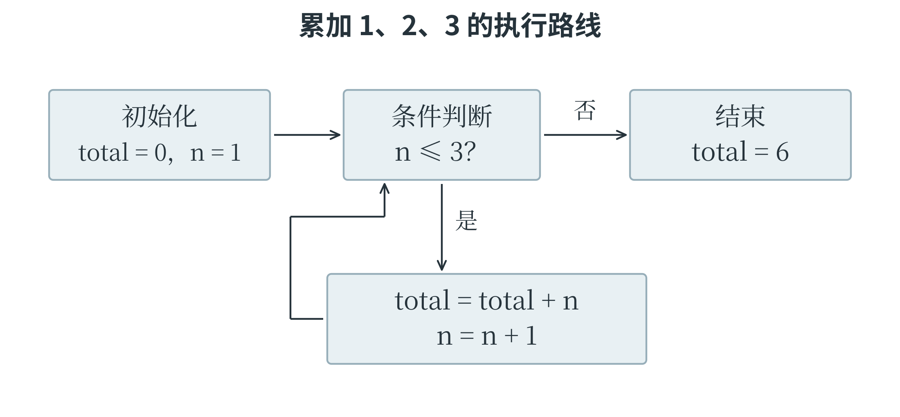
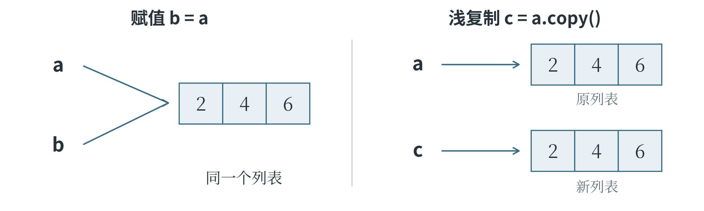
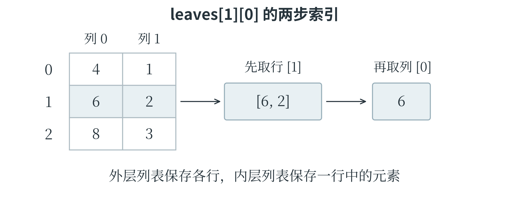
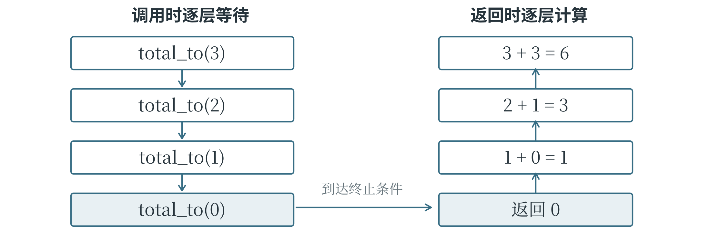

# 第二章 用 Python 编写程序

图片要交给计算机识别，测量记录要整理成模型能用的数据，都需要程序把步骤落实下来。Python 是人工智能领域常用的编程语言，也是 CAICP 编程部分使用的语言。本章从一行程序开始，学习怎样记录数据、安排处理顺序和组织代码，为后面的数据分析与机器学习作准备。

## 2.1 基础语法与程序执行

### 从代码到运行结果

**程序**是按照一定规则写成的一组指令，告诉计算机做什么、按什么顺序做。编写这些指令所用的语言称为**编程语言**，Python 就是其中一种。用编程语言写出的文字称为**代码**；代码中能够完成某个操作的指令称为**语句**。计算机不能只看见这些文字就自动完成工作，还需要由相应的软件读取和执行代码。负责运行 Python 代码的软件称为 **Python 解释器**。

输入和修改代码，要使用**代码编辑器**。本书采用 Python 3：在能运行 Python 3 的编辑器中新建代码文件，输入程序后执行“运行”，输出区域就会显示结果。代码文件通常以 `.py` 结尾，如 `first.py`。灰底代码块中的换行和行首空格都应保留，运行结果则会在正文或注释中另作说明。

Python 已经准备好了一些常用工具，`print()` 就是一个负责显示内容的**函数**。函数把一项工作组织成可以反复使用的操作，使用函数称为**调用**。调用时写出函数名和一对圆括号，需要交给它处理的信息放在括号内，称为**参数**。下面两行分别让 `print()` 显示一段文字和一个计算结果。

```python
print("开始处理数据")
print(2 + 3)
```

程序从上向下执行，先输出 `开始处理数据`，再另起一行输出 `5`。第一行的引号说明里面是一段文字，这样的文字数据称为**字符串**；引号本身不属于要显示的内容。第二行没有给 `2 + 3` 加引号，因此会先做加法，再显示结果。能够计算出一个值的代码片段称为**表达式**，`2 + 3` 就是一个表达式。

输入代码时，括号、引号和逗号等符号应使用英文半角形式。中文全角括号不能直接代替圆括号。

### 变量让数据有了名字

处理一张图片时，程序需要记住它的宽度和高度；统计一批资料时，需要记住已经收集了多少条。**变量**是程序中用来关联数据的名字。有了名字，后面的语句就能通过它使用相应的数据，也能让这个名字改为关联新的数据。例如，可以用 `width` 表示图片宽度，用 `height` 表示高度。

```python
width = 28
height = 28
pixel_count = width * height
print(pixel_count)  # 784
```

第一行把整数 `28` 交给变量 `width`，这样的操作称为**赋值**。赋值写成 `变量名 = 表达式`：先求出等号右边的值，再让左边的名字与这个值关联。第二行同样记录高度；第三行读取两个变量的值，用 `*` 做乘法，把结果交给 `pixel_count`。最后一行输出 `784`。这里的图片宽和高都按像素计，算出的就是像素总数。代码中 `#` 后面的 `784` 是**注释**，用来说明结果，不参与执行；字符串里的 `#` 则只是普通文字。

变量可以重新赋值。例如，已经收集 80 条数据，后来又增加 5 条，就需要更新数量。下面的程序特意保留了更新前的数量，便于比较。

```python
sample_count = 80
old_count = sample_count
sample_count = sample_count + 5
print(sample_count, old_count)  # 85 80
```

第三行先读取当前的 `sample_count`，算出 `80 + 5`，再把 `85` 赋给这个名字。`old_count` 已在上一行取得当时的数值，不会随这次赋值一起改变。倘若一个名字还没有值就被读取，Python 会报告找不到它。

因此，程序里的 `=` 是一次赋值操作，并非数学中两边始终相等的关系。

变量名最好能说明用途，`sample_count` 比随手写的 `a` 更容易理解。常用名称由英文字母、数字和下划线组成，不能以数字开头；大小写有区别，`score` 与 `Score` 是两个名字。`sample-count` 会被读成减法，不能用来代替带下划线的名称。`if`、`for` 等已有特殊含义的词称为**关键字**，不能再拿来当变量名。Python 也允许不少中文字符用于命名，本书采用常见的英文名称，并在需要时解释含义。

### 数据的类型决定怎样处理

同样写着 25，可以表示一个数量，也可以只是编号中的两位文字。计算机需要分清这些情况。**数据类型**规定了一类数据的表示方式以及适合进行的操作。Python 的常用基本类型包括整数 `int`、浮点数 `float`、字符串 `str` 和布尔值 `bool`。整数用来表示没有小数部分的数量；浮点数可以表示带小数的数值，不过很多小数只能被近似保存；字符串保存文字；布尔值只有 `True` 和 `False`，分别表示真和假，常用来记录判断结果。

```python
print(25 + 5)        # 30
print("25" + "5")    # 255
print(25 > 20)       # True
```

第一行的 `+` 做加法，第二行的 `+` 则把两个字符串连接起来。第三行判断 25 是否大于 20，得到真值 `True`。`"25"` 是字符串，`25` 是整数，两者比较是否相等也会得到 `False`。直接写 `"25" + 5` 会报错，因为这里的加号不能把字符串和整数按同一种规则相加。要让文字参与数值计算，可以先做**类型转换**。这就是把合适的内容变成另一种类型。`int("25")` 把文字转成整数，`float("25.5")` 把文字转成浮点数，`str(25)` 则把整数转成字符串。这些写法都在调用相应的转换工具。转换也有条件：`int("25.5")` 不能直接处理带小数点的文字；若输入已经是浮点数，`int(25.9)` 得到 `25`，`int(-25.9)` 得到 `-25`，相当于舍去小数部分，并没有四舍五入。

Python 把程序使用的具体数据统称为**对象**，整数和字符串都是对象，各有类型和值。变量名“指向”对象，本身却不固定属于某种类型：`value = 25` 让它指向整数，`value = "25"` 又让它指向字符串。程序越长，越应让一个名字保持清楚、一致的用途，免得把文字误拿去做数值计算。

### 输入怎样进入程序

**输入**是把外部信息交给程序，**输出**是把程序的结果交出来。`input()` 可以读取一行输入；执行到这里时，程序会等待输入内容。输入结束后，`input()` 把读到的文字交回当前调用的位置，这称为**返回**，交回的内容称为**返回值**。下面先把输入保存到变量 `text`，再转换成整数。

```python
text = input()
count = int(text)
print("样本数", count, sep="：")
```

输入 `12` 后，第一行得到的是字符串 `"12"`，第二行才得到整数 `12`，最后输出 `样本数：12`。按下运行后若暂时没有结果，可能只是程序正在等待输入；有些在线编辑器需要先在专门的输入区域填好内容。`input()` 也能在括号内接收一段提示文字，但题目若规定了输入输出格式，就应按约定编写，不能随意增加提示语。结果的显示方式可以交给 `print()` 的参数控制。它接收多个内容时用逗号分开，默认在中间显示空格、末尾换行；本例的 `sep="："` 将分隔符改为中文冒号。`end` 控制结尾，`print(1, 2, end="!")` 会输出 `1 2!`，随后不自动换行。至于 `print("count")` 与 `print(count)`，前者显示引号中的单词，后者读取变量，两者做的工作不同。

### 运算与判断

加、减、乘、除分别写作 `+`、`-`、`*`、`/`，乘方写作 `**`，例如 `2 ** 3` 表示 2 的三次方，得到 `8`。`//` 表示整除，`%` 表示取余。以 17 除以 5 为例，`17 // 5` 得到 `3`，`17 % 5` 得到 `2`，对应 `17 = 3 × 5 + 2`。普通除法 `10 / 2` 得到浮点数 `5.0`。`total += value` 是常见简写；对于这里的数值，相当于 `total = total + value`。遇到负数，整除仍要按商向较小整数方向取整：`-17 // 5` 为 `-4`，余数 `-17 % 5` 为 `3`，满足 `-17 = (-4) × 5 + 3`。

整除向下取整与 `int()` 舍去小数部分，是两套不同的规则。

比较运算 `>`、`<`、`==`、`!=`、`>=`、`<=` 分别表示大于、小于、等于、不等于、大于等于、小于等于。它们产生真假结果，其中判断相等需要两个等号。一个判断有时包含不止一个要求，例如年龄应在 10 至 15 岁之间，就需要既不小于 10，又不大于 15。`and` 表示“并且”，要求两边都成立；`or` 表示“或者”，至少一边成立即可；`not` 则把真假取反。

```python
age = 12
allowed = age >= 10 and age <= 15
print(allowed)      # True
print(not allowed)  # False
```

把年龄改为 8，第一个条件就不成立，整个 `and` 判断为假。误写成 `or` 却会让它通过，因为 8 满足“不大于 15”。这个范围也可以写成连续比较 `10 <= age <= 15`。

常见运算先处理括号，再进行乘方、乘除与整除取余、加减，之后进行比较，最后依次处理 `not`、`and`、`or`。负号与乘方相遇时，`-2 ** 2` 按 `-(2 ** 2)` 计算，结果为 `-4`；`(-2) ** 2` 才是 `4`。连续乘方 `2 ** 3 ** 2` 按 `2 ** (3 ** 2)` 计算，得到 `512`。较长的表达式可以用括号明确分组，使计算意图更清楚。

### 分支让程序选择路线

前面的程序基本按从上到下的顺序执行，这称为**顺序结构**。如果电量不足时准备充电，电量充足时继续工作，程序就需要根据条件选择不同的语句，这称为**分支结构**。Python 用 `if` 开始判断，用 `elif` 检查另一个条件，用 `else` 处理前面条件都不成立的情况。

```python
battery = 15
if battery == 0:
    status = "停止"
elif battery < 20:
    status = "准备充电"
else:
    status = "继续运行"
print(status)  # 准备充电
```

每个条件后面的冒号表示下面跟着相应的一组语句，称为**代码块**。行首向右空出的距离称为**缩进**，它在 Python 中用来表示语句之间的层次，通常每一级使用四个空格。这里三行给 `status` 赋值的语句分别属于三个分支，最后的 `print()` 没有缩进，表示整组判断结束后再执行它。沿着这个层次看电量为 15 的情况：第一个条件不成立，第二个成立，于是 `status` 变为 `"准备充电"`，随后跳过 `else`。整组 `if-elif-else` 最多执行一个分支；两个独立的 `if` 却会各自判断。分支里还可以嵌入另一组判断，只有进入外层分支，内层才有执行机会。

缩进决定语句属于哪里，不能随意增减，也不要混用空格和制表符。这个例子执行的是人写好的电量规则；从数据中学习判断方法，要到后面的机器学习部分再讨论。

### 循环让相同的步骤重复执行

面对三条记录，可以把处理语句写三遍；面对三千条记录，这样做就很不方便。**循环**能够让一组语句重复执行。为了先把多项数据放在一起，可以使用**列表**：用方括号包围数据，项目之间用逗号分开，例如 `[18, 20, 25]`。列表里的每一项称为一个**元素**，有关列表的更多操作将在下一节展开。

```python
values = [18, 20, 25]
total = 0
for value in values:
    total = total + value
print(total)  # 63
```

`for value in values:` 的意思是依次取出列表中的元素，每次交给变量 `value`，再执行缩进的循环体。第一次取出 18，把总数从 0 改成 18；第二次取出 20，总数变成 38；第三次取出 25，总数变成 63。元素取完以后离开循环，执行最后的输出。这种逐项访问数据的过程称为**遍历**。字符串同样可以遍历，`for letter in "cat":` 会依次得到 `"c"`、`"a"`、`"t"`。能够提供这些逐项访问结果的数据对象，统称为**可迭代对象**。

如果只需要重复若干次，可以用 `range()` 提供一段整数。`range(4)` 从 0 开始，给出 `0、1、2、3`；指定起点时，`range(1, 4)` 给出 `1、2、3`。第三个参数是每次前进的步长，例如 `range(2, 7, 2)` 给出 `2、4、6`，`range(5, 0, -1)` 给出 `5、4、3、2、1`。

`range()` 不包含终点，步长也不能为零。方向不合适时可能一个数也取不到，例如 `range(5, 0)`。给循环变量另外赋值，也不会改变 `for` 下一次从原有数据中取出的元素。

`while` 是另一种循环：每次进入循环体之前先检查条件，条件为真才继续。下面计算 1、2、3 的总和，每次把当前的 `n` 加入总数，再把 `n` 增加 1。

```python
total = 0
n = 1
while n <= 3:
    total += n
    n += 1
print(total, n)  # 6 4
```

表 2-1 记录了每轮的变化。第三轮结束时，`n` 已变成 4；再次检查 `n <= 3`，条件不成立，循环结束，所以最后输出的 `n` 是 4。若漏掉 `n += 1`，`n` 一直是 1，条件就始终成立，形成无法正常结束的循环。跟踪程序时，必须看清每条语句执行的先后，不能把“先累加、再更新”读成相反顺序。

表 2-1 循环中变量的变化

| 次数 | 进入循环时的 n | 累加后的 total | 更新后的 n |
| --- | --- | --- | --- |
| 第一次 | 1 | 1 | 2 |
| 第二次 | 2 | 3 | 3 |
| 第三次 | 3 | 6 | 4 |

### 把循环画成执行过程

读循环时，可以把“将要检查的条件”和“刚刚完成的语句”分开。前面的 `while` 程序进入循环前，`n` 为 1、`total` 为 0；检查条件后，才执行累加；累加完成，再更新 `n`。图 2-1 把这几步连成一个回路，返回条件判断的箭头说明：每一轮都要重新读取变量的当前值。循环结束后的 `print()` 位于回路外，因此只在离开循环后执行一次。



图 2-1 循环会反复回到条件判断

如果把 `print(total)` 缩进到循环体末尾，输出就变成 1、3、6 三个中间结果。若再把 `total = 0` 也移入循环体，每轮都会重新清零，便失去了累积的作用。相同语句放在不同层次，程序完成的任务也会改变。跟踪变量的表格与执行路线图可以相互配合：表格记录数值，路线图解释为什么接下来会执行这一步。

### 提前结束与跳过一轮

有时数据还没有处理完，但需要的结果已经找到，这时可以用 `break` 结束当前这一层循环。另一些时候，只是当前这一项不符合要求，后面的数据还应继续处理，就可以用 `continue` 跳过本轮剩下的语句。下面约定负数表示无效记录，只把非负数加入总数。

```python
values = [3, -1, 5]
total = 0
for value in values:
    if value < 0:
        continue
    total += value
print(total)  # 8
```

取到 `-1` 时进入内层分支，`continue` 使程序跳过本轮的累加，随后继续取出 `5`。这里的 `total += value` 与内层 `if` 对齐，属于循环体，但不属于 `if` 的代码块。`pass` 则表示什么也不做，常在语法要求必须有一句语句、暂时又没有具体操作时占位；它既不会退出循环，也不会跳过后面的语句。使用 `while` 和 `continue` 时，应让计数或状态得到必要的更新，否则可能反复停在同一种情况。

循环也可以嵌套。例如，外层处理两行数据，内层处理每行的三项，最内层的操作一共执行六次，下一节的二维列表会给出完整例子。内层的 `break` 只结束内层，外层仍可继续。循环后还可以跟 `else`，它表示循环正常结束时要做的事；通过 `break` 提前离开时，则跳过它。下面用 `len(values)` 取得列表长度，从左向右寻找数字 7。

```python
values = [4, 7, 10]
index = 0
while index < len(values):
    if values[index] == 7:
        print(index)  # 1
        break
    index += 1
else:
    print("未找到")
```

列表位置从 0 开始，`values[index]` 取出指定位置的元素。第一次检查位置 0 的数字 4，未找到；第二次检查位置 1 的数字 7，输出位置并结束循环。若把要找的数改成 8，循环会走完，执行 `else`。这里的 `else` 与 `while` 对齐，属于循环；如果与内层 `if` 对齐，含义就变了。`for` 的元素取完或 `while` 的条件变为假，都会执行循环的 `else`，即使一开始就没有循环次数也如此；如果程序因函数返回或未处理的错误而中断，则不会补做它。

条件中不一定有比较式。零、空字符串、空列表和 `None` 都会被当作假值，常见的非零数与非空容器会被当作真值。`None` 表示没有具体值，`if values:` 则可以检查列表是否非空。

`and` 和 `or` 还采用**短路求值**：前面的值已能决定结果，就不再计算后面。例如 `count != 0 and total / count > 10` 先检查数量，数量为零时便不会执行除法。这两个运算返回参与判断的某个值，不一定是布尔值；`"" or "未命名"` 返回的就是字符串 `"未命名"`。读到这样的表达式，除了判断真假，还要看它究竟交回了什么值。

## 2.2 字符串与容器

### 按位置访问数据

一个变量可以记录一个数量，实际任务却常常要处理一组资料。**容器**用来把多项数据组织在一起，前面出现的列表就是一种容器，元组、字典和集合也是常用容器。字符串则把字符按先后顺序排列。这样有位置顺序、能够按位置取项的数据结构称为**序列**，字符串和列表都属于序列。**索引**就是元素的位置编号，从 0 开始；负索引从末尾算起，`-1` 表示最后一项，`-2` 表示倒数第二项。以 `"Python"` 为例，`P` 的索引为 0，`y` 为 1，依次到 `n` 为 5。在变量名后加方括号、写入索引，就能取出相应字符。下面再把取两端字符与取一段字符放在一起比较。

```python
word = "Python"
print(word[0], word[-1])  # P n
print(word[1:4])          # yth
print(word[:3])           # Pyt
print(word[::2])          # Pto
print(word[::-1])         # nohtyP
```

方括号中使用冒号的写法称为**切片**，一般形式是 `序列[start:stop:step]`，三个名称分别表示起点、终点和步长。`word[1:4]` 从索引 1 开始，取到索引 4 之前，因此得到 `"yth"`，不包含索引 4 的 `o`。`word[:3]` 省略起点，从开头取到索引 3 之前；省略终点则一直取到相应方向的末端。没有写步长时按 1 前进，`word[::2]` 每隔一项取一项，`word[::-1]` 则从末尾向前逐项取得整个字符串。

单项访问和切片的边界规则不同：`word[6]` 超过了这个字符串的范围，会报告 `IndexError`；`word[:100]` 则只取存在的部分，仍得到整个字符串。列表也一样，`data[1]` 取一项，`data[1:2]` 得到含这一项的新列表。

“取一项”与“取一段”，连结果的类型都可能不同。

字符串可以用成对的单引号或双引号包围。某些不能方便地直接写出的字符，要用**转义**写法表示，例如 `\n` 表示换行符，`\\` 表示一个反斜杠。`print("第一行\n第二行")` 会分两行显示文字。`len()` 可以取得字符串长度，普通汉字、英文字母、空格和标点通常各计为一项。更准确地说，Python 按 Unicode 码点计数：Unicode 为文字和符号安排编号，这些编号称为**码点**；少数显示为一个图形的符号由多个码点组合而成，长度便可能大于 1。字符串长度也不同于保存文件时所占的字节数，字节是计算机存储容量的基本单位之一。

### 把一段文字整理成需要的内容

文字记录中可能混有多余的空格，几项内容也可能挤在同一行。字符串提供了一些专门处理这些情况的**方法**。方法是与对象相关的操作，可以像函数一样调用，不过要先写处理对象，再写点号和方法名。例如，`text.strip()` 处理的是 `text` 指向的字符串，去掉两端的空白；`text.split(",")` 以逗号为界拆分；`text.replace("旧", "新")` 把指定文字替换为另一段文字。逗号在这里承担分隔内容的作用，称为**分隔符**。

字符串创建后不能直接修改其中的字符，这种性质称为**不可变**。上述方法会把处理结果返回，原字符串仍然保留原样；若希望变量以后使用新的文字，就需要把结果赋回去。下面整理一条包含编号、温度和状态的记录，每一步都先保留结果，再交给下一步使用。

```python
line = "  A17,23.5,正常  "
cleaned = line.strip()
parts = cleaned.split(",")
name = parts[0]
temperature = float(parts[1])
print(name, temperature, parts[2])  # A17 23.5 正常
print(" / ".join(parts))           # A17 / 23.5 / 正常
```

`cleaned` 保存去掉两端空格后的文字，`parts` 得到三个字符串组成的列表 `['A17', '23.5', '正常']`。索引 0 取出编号，索引 1 取出温度文字，再由 `float()` 转成数值。最后的 `join()` 从另一个方向工作：用 `" / "` 作连接符，把列表中的字符串连接起来，参加连接的各项都应当是字符串。熟悉各步以后，前两次处理也可以连续写成 `line.strip().split(",")`；点号连用时，后一个方法处理的是前一个方法返回的结果。拆分时还要看分隔规则。`split()` 不带参数，会按连续空白拆分并忽略两端空白；指定逗号后，`"a,,b".split(",")` 却会得到 `['a', '', 'b']`，中间空项被保留下来。它可能代表某项内容缺失，不能只为让结果整齐就删掉。读入原始记录之后，先分清这些数值、编号和标签的含义，后面的计算才有依据。

查找文字时，`"on" in word` 判断是否包含子串，`word.find("on")` 返回第一次出现的位置，没有找到则返回 `-1`。`index()` 也能找位置，但找不到时会报错。`startswith()` 和 `endswith()` 分别检查开头、结尾，`lower()` 与 `upper()` 用于大小写转换。需要按某个分隔符只拆一次时，还可以使用 `partition()`：`"A17:正常".partition(":")` 得到包含前段、分隔符和后段的三个部分；`rpartition()` 从右边寻找分隔符。阅读陌生文本处理代码，重点是弄清每一步的输入和输出形状。

**格式化**把数值等内容按需要放入一段文字中。常用的 f 字符串在引号前加 `f`，用花括号标出需要计算并填入的位置；普通文字照原样保留。下面把编号和温度分别填入相应的说明。

```python
name = "A17"
temperature = 23.5
print(f"编号：{name}")
print(f"温度：{temperature:.1f}℃")
```

两行输出分别是 `编号：A17` 和 `温度：23.5℃`。第二行花括号中的冒号后面写着 `.1f`，表示按一位小数显示。也可以使用字符串的 `format()` 方法，例如 `"温度：{:.1f}℃".format(temperature)`。格式化改变的是文字呈现方式，原来的数值不会因此改变。

### 列表与二维列表

前面已经用方括号建立过列表，也用循环读过它的元素。列表与字符串有一个明显区别：列表是**可变**的，可以直接替换元素，也可以增删元素。`data[0] = 8` 把列表第一项改成 8，`data.append(4)` 在末尾加入一个元素 4，`data.extend([1, 5])` 则把另一组数据中的 1 和 5 逐个加入。`append([1, 5])` 加入的是一个列表元素，`extend([1, 5])` 加入的是两个整数，二者不能互换。

其他常用操作也有各自的处理对象。`insert(i, x)` 在位置 `i` 前插入元素 `x`；`pop(i)` 删除并返回该位置的元素，省略位置时处理最后一项；`remove(x)` 删除第一个等于 `x` 的元素，找不到时会报错。`del data[i]` 按位置删除，`clear()` 清空列表。列表允许保存不同类型的数据，但一组需要统一计算的观测值，应当保持适合计算的类型。下面先向列表添加数值，再把它们从小到大排列，这样的操作称为**排序**。

```python
data = [3, 1]
data.append(4)
data.extend([1, 5])
print(data)              # [3, 1, 4, 1, 5]
ordered = sorted(data)
print(ordered)           # [1, 1, 3, 4, 5]
print(data)              # [3, 1, 4, 1, 5]
data.sort(reverse=True)
print(data)              # [5, 4, 3, 1, 1]
```

`sorted()` 返回排好序的新列表，原列表不变；列表的 `sort()` 则在原处调整顺序，返回 `None`。`reverse=True` 表示反向排序，这里按从大到小排列。若写成 `data = data.sort()`，`data` 最后会指向 `None`。`append()`、`extend()` 等修改列表的方法也通常不返回修改后的列表，使用时应分清“操作原对象”和“接收返回结果”。

需要倒转现有顺序时，`reverse()` 在原处反转，而切片 `data[::-1]` 得到新列表；反转并不等于按数值从大到小排序。

**二维列表**是在一个列表里放入多个列表，常用来表示行和列。`grid[r][c]` 先取第 `r` 行，再取这一行的第 `c` 项，两个索引都从 0 开始。Python 并不要求各行一样长；如果要把它当作整齐的表格使用，就需要自行保证行列关系。

```python
grid = [[2, 4, 6], [1, 3, 5]]
print(grid[1][2])  # 5
grid[0][1] = 8
for row in grid:
    row_total = 0
    for value in row:
        row_total += value
    print(row_total)  # 依次输出 16 和 9
```

外层循环每次取出一行，内层循环再逐项累加；进入新的一行时，`row_total` 重新从 0 开始，所以两行分别得到自己的总数。若需要修改指定位置，可以使用行列索引。对于这个两行三列的列表，第一列是 `grid[0][0]` 和 `grid[1][0]`。`grid[0:2]` 取得的是前两行，并不会自动取出“前两列”。行、列和单个元素的层次弄清楚以后，图像像素表和后面的数值数组就更容易理解。

### 赋值与复制

列表能够修改，这使赋值出现了一个值得留意的结果。变量名好比写着名称的标签，标签指向数据本身；写下 `b = a`，相当于给同一份列表又添了一个标签，并没有再做一份列表。此后沿着任何一个名字修改它，另一个名字都能看到变化。若需要一份独立的新列表，可以调用 `a.copy()`，也可以使用取完整范围的切片 `a[:]`。图 2-2 展示了下面代码在修改之前的关系。

```python
a = [2, 4, 6]
b = a
c = a.copy()
b[0] = 9
print(a)  # [9, 4, 6]
print(c)  # [2, 4, 6]
```



图 2-2 两个名字可以指向同一个列表

这种关系称为**共享引用**。`==` 比较内容是否相等，`is` 判断是否为同一个对象；两个独立列表可以内容相等，却不是同一个对象。这里的复制属于**浅复制**：只新建最外面一层。若列表中还放着内层列表，新旧外层仍可能指向相同的内层对象。建立二维列表时，`bad = [[0, 0]] * 3` 就会把同一行重复引用三次，执行 `bad[0][0] = 1` 后，三行都会显示 `[1, 0]`。可以改用循环，每次创建一个新行：

```python
rows = []
for _ in range(3):
    rows.append([0, 0])
rows[0][0] = 1
print(rows)  # [[1, 0], [0, 0], [0, 0]]
```

这里的 `_` 是普通变量名，用它表示这次不需要使用循环序号。复制已有的规则二维列表时，若每行只含整数等不可变元素，可以逐行调用 `copy()`，得到相互独立的新行；嵌套层次更多时，还要继续看里面保存了什么。

是否会相互影响，要追到名字最终指向的对象。

### 从表格中提取一列

二维列表里的行列关系，值得用一个完整的小任务再看一遍。下面每一行表示一片叶子，第一项是长度，第二项是宽度，单位都为厘米。要求取出全部长度，并计算平均长度。

```python
leaves = [[4.0, 1.0], [6.0, 2.0], [8.0, 3.0]]
lengths = []
for row in leaves:
    lengths.append(row[0])
average = sum(lengths) / len(lengths)
print(lengths)  # [4.0, 6.0, 8.0]
print(average)  # 6.0
```

第一次循环，`row` 指向 `[4.0, 1.0]`，`row[0]` 是 4.0；接下来分别得到 6.0 和 8.0。外层列表中的一项是一整行，行中的一项才是一个数。因此，`leaves[0]` 取出第一片叶子的整行资料，`leaves[0][1]` 则取出它的宽度。若打算取所有宽度，应在循环中使用 `row[1]`。图 2-3 把几个索引的含义放在同一张表里。



图 2-3 先找到行，再找到行中的元素

`lengths` 保存了完整的一列。若只求平均数，也可以逐行累加，不另存这份列表；结果相同，留下的中间资料却不同。处理图像或一批样本时，也要先分清需要的是一条记录、一个属性，还是整片数据区域。

### 元组、字典和集合

**元组**也是有顺序的序列，不过创建后不能替换其中的元素，也不能增删位置。坐标可以写成 `point = (3, 5)`，通过索引读取，也可以用 `x, y = point` 把两项分别交给两个变量，这称为**解包**。只有一个元素时要写成 `(3,)`，逗号不能省略；`(3)` 只是括号中的整数。元组可以遍历，也可以保存列表，但“不能换掉元组中的元素”不代表“这个元素指向的列表也不能修改”。是否可变，需要看清具体对象。

列表用位置找内容，**字典**则用名称或其他键来找内容。字典的一项由**键**和**值**组成，键负责定位，值保存相应数据；写法是把各组 `键: 值` 放进花括号，组与组之间用逗号分开。例如，`{"编号": "A17", "温度": 23.5}` 用 `"编号"` 和 `"温度"` 作键，分别对应一段文字和一个数值。

```python
record = {"编号": "A17", "温度": 23.5}
print(record["编号"])  # A17
record["温度"] = 24.0
record["状态"] = "正常"
print(record["温度"])  # 24.0
```

访问字典也使用方括号，不过里面写的是键。第三行修改已有键的值，第四行使用一个新键，于是增加了一项内容。字典的键不能重复，不同的键却可以对应相同的值。键常用字符串和整数，普通列表和字典本身不能直接作为键。为了按照标签统计数据，还可以把标签名当作键，把出现次数当作值：

```python
labels = ["猫", "狗", "猫"]
counts = {}
for label in labels:
    counts[label] = counts.get(label, 0) + 1
for label, count in counts.items():
    print(label, count)  # 依次输出 猫 2 和 狗 1
```

起初 `counts` 是空字典。第一次读到 `"猫"`，`get(label, 0)` 因为找不到这个键而返回 0，加 1 后记成 `"猫": 1`；读到 `"狗"` 时同样记成 1；再次读到 `"猫"`，就取出已有的 1，增加为 2。`get()` 后面的第二个参数是找不到键时返回的默认值，单独调用它不会增加键，真正的更新发生在赋值时。直接用方括号访问不存在的键则会报 `KeyError`。统计完成后，第二个循环用 `items()` 逐组取得键和值，`label, count` 对它们解包。直接遍历字典或写 `label in counts`，处理的则是键；`keys()` 提供键，`values()` 提供值。删除某项可以用 `del counts[label]`，也可以用 `pop()` 删除并取得对应的值。

字典保留插入顺序，但不会自动排序。用它统计各标签的数量，可以先看清这批分类数据大致是怎样分布的。

**集合**保存不重复的元素，适合判断某一项是否出现，也适合**去重**，即从重复内容中只保留一份。例如 `set(["猫", "狗", "猫"])` 把列表转成集合，只保留两个不同标签。集合没有用于取第几项的索引，也不保证遍历顺序，不能靠打印时恰好出现的顺序完成“保留首次出现顺序”的任务。空集合写成 `set()`，`{}` 表示空字典；集合可以保存整数、字符串等，但不能直接把普通列表放作元素。集合的 `add()` 加入元素，`discard()` 删除指定元素，即使不存在也不报错；`remove()` 则在元素不存在时报错。

两个集合可以用 `|` 取得任一集合中出现的元素，称为并集；用 `&` 取得共同出现的元素，称为交集；用 `-` 取得只在前一个集合中出现的元素，称为差集。例如，`{1, 2} & {2, 3}` 得到 `{2}`。下一章会从数学角度进一步讨论这些关系。

表 2-2 概括了这几种容器的主要区别。选择容器时，要看任务需要保持位置、按键查找，还是只关心某项是否出现，而不是把所有材料都塞进同一种结构。

表 2-2 常用容器的比较

| 类型 | 怎样组织数据 | 可以怎样修改 | 常见用途 |
| --- | --- | --- | --- |
| 列表 list | 按位置排列，允许重复 | 替换、添加和删除元素 | 一组观测值、待处理记录 |
| 元组 tuple | 按位置排列，允许重复 | 不能替换或增删位置 | 坐标、固定的一组信息 |
| 字典 dict | 每个键对应一个值 | 添加键值对或修改值 | 按编号查记录、分类计数 |
| 集合 set | 保留互不重复的元素 | 添加或删除元素 | 去重、判断成员关系 |

## 2.3 函数、递归与代码复用

### 用函数划分工作

同一组测量值换成另一组，求平均数的步骤仍是“总和除以数量”。这样反复出现的工作，可以定义成自己的函数，像调用 `print()`、`len()` 那样复用。定义以 `def` 开始，后面写函数名和参数；冒号之后缩进的部分是**函数体**。下面将函数命名为 `mean`，意思是平均数。参数 `values` 接收数据，`sum(values)` 求总和，`len(values)` 取项数，`return` 再把计算结果交回调用处。

```python
def mean(values):
    return sum(values) / len(values)

result = mean([18, 20, 25])
print(result)  # 21.0
```

执行函数定义时，Python 先记下这个函数，并不立即计算平均数。运行到 `mean([18, 20, 25])`，才把列表交给参数 `values`，进入函数体：总和为 63，数量为 3，除法结果为 `21.0`。`return` 随即结束这次函数执行，把结果交给外面的 `result`，最后由 `print()` 显示出来。如果换成另一组非空数值，函数仍使用相同的步骤；空列表会使除数为零，不符合这个函数的使用条件。把相关步骤组织起来，用明确的参数与返回结果提供功能，称为**封装**。调用者可以先看函数完成什么工作，需要时再查内部细节。以后要对多批资料求平均数或转换格式，就能反复调用同一处代码，也便于集中修改。

函数也可以不接收参数。下面的 `announce()` 只显示固定文字，但定义和调用时的空括号都不能省略。

```python
def announce():
    print("处理完成")

announce()
```

“显示内容”和“返回结果”是两个操作。显示是把文字送到输出区域，返回是把数据交回调用的位置。没有执行带结果的 `return` 时，函数会返回 `None`。下面故意只打印总数，观察外面接到什么。

```python
def show_total(values):
    print(sum(values))

result = show_total([2, 3])
print(result)
```

第一行输出 `5`，来自函数体内的 `print()`；第二行输出 `None`，因为 `show_total()` 没有把总数返回。若后面还要拿总数继续计算，就应在函数体中使用 `return sum(values)`，不能把已经出现在屏幕上的文字当成调用者收到的数据。

### 参数怎样传入函数

一个函数可以有多个参数，也可以给部分参数规定**默认值**，在调用者省略这项信息时使用。下面的函数把数值增加一段偏移量；`offset` 表示偏移量，没有另外指定时使用 1。

```python
def shift(value, offset=1):
    return value + offset

print(shift(5))            # 6
print(shift(5, 3))         # 8
print(shift(5, offset=3))   # 8
```

`shift(5, 3)` 按位置传递，5 交给 `value`，3 交给 `offset`；`shift(5, offset=3)` 则为第二个参数写出了名称。顺序和名称都必须符合函数定义，不能随意把两项交换。默认值是在定义函数时计算的，默认列表不会在每次调用时自动重新创建；若需要每次从一份空列表开始，应把新建列表的语句放在函数体内。

变量名能在哪一部分代码中使用，有自己的范围，称为**作用域**。参数以及函数体内赋值建立的名字，通常是当前函数调用的**局部变量**。例如，`mean` 内部的参数叫 `values`，外面调用它时使用的列表变量可以叫 `temperatures`，两个名字不必相同。不同函数里即使都写了名叫 `total` 的局部变量，也不会仅因同名就联动。函数内直接赋值通常建立局部名字；优先通过参数接收数据、通过返回值交出结果，能够让这种内外关系更清楚。

### 列表作为参数时发生什么

函数接收列表参数时，并不会自动获得一份新列表。下面的参数 `values` 与外面的 `data` 指向同一个对象，所以在函数内执行 `append()`，会改变调用者原有的数据。

```python
def add_zero(values):
    values.append(0)

data = [3, 5]
add_zero(data)
print(data)  # [3, 5, 0]
```

把函数体改成 `values = [0]`，结果却不同：局部名字改为指向新列表，外面的 `data` 仍指向原列表。

`append()` 修改对象，赋值更换名字所指的对象，这一区别到了函数内部仍然成立。如果希望保留原数据，可以先复制，再修改副本并返回；复制嵌套列表时，也仍要考虑内层是否共享。

### 常用内置函数与数制转换

Python 已经提供了许多可以直接使用的**内置函数**。`sum()` 求和，`len()` 取长度或元素数量，`min()` 和 `max()` 求最小值、最大值，`abs()` 求绝对值，`pow(x, y)` 计算乘方，`sorted()` 返回排序后的列表。它们让程序能够直接表达“求总数”“取最大值”这些意图。`round(x, n)` 用于按指定的小数位数取近似值，省略 `n` 时取整；当数值恰好处于两个候选值正中间时，采用靠近偶数的规则，例如 `round(2.5)` 为 2，`round(3.5)` 为 4。浮点数本身也可能有表示误差，因此它不等同于所有日常场景中的“四舍五入”。

**数制**决定如何用数码表示一个数。十进制每向左一位，所代表的单位扩大 10 倍；二进制扩大 2 倍，只用 0 和 1；十六进制扩大 16 倍，用 0 至 9 和 A 至 F 表示十六种数码，其中 A 表示十，F 表示十五。例如，二进制的 `1101` 表示 `1×8 + 1×4 + 0×2 + 1`，也就是十进制的 13。变的是写法，数值并没有变。

```python
print(bin(26))       # 0b11010
print(hex(26))       # 0x1a
print(int("11010", 2))  # 26
print(int("1A", 16))    # 26
print(format(26, "b"))  # 11010
```

`bin()` 和 `hex()` 返回字符串，前面的 `0b`、`0x` 分别说明二进制和十六进制。`int(文字, 进制)` 按指定规则把文字读成整数，十六进制的字母可以大写或小写。`format(26, "b")` 得到不带 `0b` 的二进制文字。输入若含多个字段，应先按约定拆开，再分别转换；进制不匹配的数码，例如把 `"102"` 当作二进制读取，会引发错误。

### 递归如何一层层返回

**递归**是函数在执行过程中调用自身。它适合把某个问题缩小成同类问题，再逐层求解。以从 1 加到正整数 `n` 为例，前 `n` 项的和等于“前 `n-1` 项的和再加 `n`”。约定 `n` 为非负整数，`n = 0` 时没有数要加，总和就是 0。这样就有了一个直接结束的情况，也有了向它不断靠近的方法。

```python
def total_to(n):
    if n == 0:
        return 0
    return n + total_to(n - 1)

print(total_to(3))  # 6
```

计算 `total_to(3)` 时，函数需要先知道 `total_to(2)` 的结果；后者又要等待 `total_to(1)`，再等到 `total_to(0)`。每次调用都有各自的参数和执行位置，外层不会因为出现了新调用而消失。直到最内层返回 0，等待的计算才依次完成：`1 + 0` 得到 1，`2 + 1` 得到 3，`3 + 3` 得到 6。图 2-4 用箭头表示这个先深入、再返回的过程。



图 2-4 递归需要保存每一层尚未完成的计算

递归需要**终止条件**，还需要每次调用真正接近终止条件。如果把 `n - 1` 写成 `n`，问题大小就没有改变；如果把负整数交给上面的函数，它也不会走到 0。Python 对递归深度有限制，递归过深会出现 `RecursionError`。

这个求和问题也能直接用循环或 `sum(range(1, n + 1))` 完成。递归提供了一种组织思路，是否采用，还要看问题结构和执行开销，不能认为写成递归就一定更快。

## 2.4 模块、文档阅读与程序调试

### 导入已有工具

函数能把一项工作组织起来，如果相关函数很多，就可以进一步把它们放在一起，形成**模块**。模块中还可以保存常量和其他定义，供别的程序使用。Python 配备了一组常用工具，称为**标准库**；其中的 `math` 模块提供数学运算，`random` 提供随机工具，`os` 提供与操作系统有关的功能。这些模块可以直接使用，不需要另外编写它们的内部代码。要让当前程序访问这些工具，先用 `import` **导入**模块。下面在 `math` 后加点号，调用其中的平方根函数 `sqrt()`。因为 5 的平方为 25，`math.sqrt(25)` 得到 `5.0`。

```python
import math

print(math.sqrt(25))   # 5.0
print(math.floor(2.8)) # 2
print(math.ceil(2.2))  # 3
```

`floor()` 取不大于给定数的最大整数，`ceil()` 取不小于给定数的最小整数，所以对负数也应按数轴方向理解：`math.floor(-2.2)` 为 `-3`，`math.ceil(-2.2)` 为 `-2`。数学模块还提供圆周率 `math.pi` 等**常量**，即使用时作为固定数值看待的量。`math.sqrt()` 处理普通实数时不能直接给负数开平方，调用前仍要考虑输入条件。

另一种导入写法是 `from math import sqrt`，只把所需名称引入当前程序，随后直接写 `sqrt(25)`。`import math as m` 则给模块取别名，随后使用 `m.sqrt(25)`。本书初次使用模块时通常保留完整的模块名，便于看清函数来自哪里。变量、方法和模块都会用到点号，但点号前后的名称说明了正在访问谁的内容。

`random` 模块用于产生**伪随机数**，也就是通过确定的算法产生看起来具有随机变化特点的数值。它常用来模拟抽签、打乱数据或进行随机抽样。下面创建一个随机数生成器，再调用它的不同方法；注释说明结果应当满足的条件，不把某一次抽到的值当作永远不变的答案。

```python
import random

rng = random.Random(7)
print(rng.randint(1, 6))        # 1 到 6 之间的整数，含两端
print(rng.choice(["甲", "乙", "丙"]))  # 从三项中选一项
print(rng.sample([1, 2, 3, 4], 2))   # 抽取两个不同位置
```

`Random(7)` 中的 7 是**随机种子**，用来确定生成器的初始状态。在相同实现、相同种子和相同调用顺序等条件下，通常可以重复得到相同序列，便于比较程序修改前后的结果。`random()` 产生大于等于 0、小于 1 的浮点数；`randint(a, b)` 的整数范围包含两个端点，不能与 `range()` 的终点规则混淆。`sample()` 不重复抽取同一个位置，但原序列若有重复值，抽出的值仍可能相同。`shuffle()` 在原列表中打乱顺序，返回 `None`。随机工具提供了数据变化，是否符合具体任务的抽样要求仍需要判断。

`os` 模块提供与操作系统打交道的功能，例如查看文件夹、组合路径和判断文件是否存在。**路径**用来说明文件或文件夹的位置；绝对路径从文件系统的起点定位，相对路径则以当前工作目录为出发点。当前工作目录不一定就是代码文件所在的目录。

```python
import os

print(os.getcwd())
path = os.path.join("data", "records.txt")
print(os.path.isfile(path))
```

第一行输出随运行位置变化，最后一行输出 `True` 或 `False`，表示相应路径是否指向一个已存在的文件。`os.path.join()` 按系统规则把文件夹名和文件名组合成路径，`os.listdir("data")` 则列出文件夹内的条目名称。列出的名称不保证已经排序，需要固定顺序时可以使用 `sorted()`。处理一批图片或文本之前，通常就要先找到文件所在的位置。

读取文件内容可以用内置函数 `open()`。下面假定当前工作目录下已有 `data` 文件夹，其中有一个以 UTF-8 编码保存的 `records.txt` 文本文件。**文字编码**规定文字如何表示成字节，UTF-8 是一种常用编码方式；读取时应与保存方式相符。

```python
import os

path = os.path.join("data", "records.txt")
with open(path, encoding="utf-8") as file:
    text = file.read()
print(text)
```

`open()` 返回一个表示已打开文件的对象，`as file` 把它交给变量 `file`，`file.read()` 读取其中的文字。`with` 使程序在离开这个代码块时关闭文件，不必再另写关闭语句。最后输出的是文件实际保存的内容，因此结果随文件而变。遇到“文件找不到”，应先核对路径和工作目录；程序并不知道一份资料在人脑中被归到了哪个文件夹。

### 从文档理解一个陌生函数

**文档**是工具的使用说明，写着用途、参数、返回结果和使用条件。程序员也经常查文档，不会把全部函数记在脑中。Python 可以用 `help(str.split)` 或导入后的 `help(math.sqrt)` 查看相应帮助。函数名和参数列表称为**函数签名**，从中能看出需要交给工具哪些信息。以 `split(sep=None, maxsplit=-1)` 为例，`sep` 指定分隔方式，`maxsplit` 限制分割次数，负数表示不限次数。对 `"A:B:C"` 使用 `split(":", 1)`，只分割一次，便得到 `['A', 'B:C']`。签名中的 `/` 表示前面的参数只能按位置传递，单独的 `*` 表示后面的参数必须写出名称；这些符号说明调用规则，通常不照抄进调用语句。再看返回值的类型、是否修改原对象、没有找到所需内容时怎样处理，就能逐步掌握一个陌生工具。CAICP 中给出文档提示的任务，也需要这样读懂说明再分析代码。

读一段陌生代码，可以先确认输入是什么，再逐步记录中间结果的类型、内容和形状。字符串经过 `split()` 变成列表，列表中的某一项经过 `float()` 变成数值，数值比较又产生布尔值。只要这些变化能连起来，即使中间使用了不熟悉的方法，也可以借助文档继续分析。遇到简短示例，应自己换一组小输入检查，尤其可以试一试没有匹配项、只有一项或刚好位于边界的情况。

### 让错误变得可以定位

程序没报错，并不等于结果正确。

漏写冒号或括号不配对，会造成**语法错误**，缩进出错也可能让程序无法开始执行。除以零、访问不存在的位置等**运行错误**，则发生在执行某条语句时。还有一种更隐蔽的**逻辑错误**：程序顺利结束，却没有完成原来的要求。例如，打算累加到 `n`，写的却是 `range(1, n)`，就会漏掉最后一项。先分清错误属于哪一类，才知道从哪里查起。

查找并修正程序错误的过程称为**调试**。运行错误通常会给出**回溯信息**，列出出错的调用位置，并在末尾显示异常名称和原因。**异常**是程序执行中报告错误或特殊情况的一种机制。常见的 `NameError` 表示名字无法找到，`TypeError` 表示对象类型不适合当前操作，`ValueError` 表示值不符合要求，`IndexError` 表示序列索引超出范围，`KeyError` 表示字典中没有相应键。检查时先读末尾的异常说明，再找到自己代码中的相关行，并核对那一行使用的变量。

对于可以预料并有明确处理办法的异常，可以用 `try-except`。`try` 中写需要尝试的操作，`except` 后写要处理的异常类型，以及出现这种异常时执行的语句。程序先执行 `try` 的代码块，成功就跳过对应的 `except`；遇到指定异常，才转入处理部分。下面的转换会失败，因此输出一段说明，程序随后可以继续。

```python
text = "3.5"
try:
    count = int(text)
except ValueError:
    print("这段文字不能直接转换为整数")
```

没有异常信息可看时，可以先用最小的一组数据，把预期结果与实际结果比较，再临时打印关键变量，找到第一个不符合预期的中间值。前面的求和程序，用 `n = 1`、`n = 3` 就容易查出是否漏了一项；换成大数，反而不便手算。空列表、只有一项、数值恰好等于阈值，都是**边界情况**，选择它们是为了检查分支与范围的含义。

代码也应让人容易看懂意图。名称说明用途，重复步骤可以提成函数，注释解释为什么这样处理。补全程序尤其要留意前后的约定：要求返回新列表，就不能只打印；要求保留顺序，也不能顺手用排序代替去重。

### 把几项基本操作连成一个程序

现在把几个基本操作连起来。假设一行文字按 `"编号,长度,宽度"` 保存一条记录，字段都齐全，彼此以英文逗号分隔。任务是把文字转成数值，保留长、宽都大于零的记录，再计算平均长度。可以先把读取一条记录的步骤写成 `read_record` 函数：用 `split()` 分字段，用 `float()` 转两个测量值，最后以元组返回三个结果。它接收的是已经放在字符串里的文字，这一步还不涉及打开硬盘上的文件。

```python
def read_record(line):
    fields = line.split(",")
    code = fields[0].strip()
    length = float(fields[1])
    width = float(fields[2])
    return code, length, width
```

下面用循环逐条处理。`total` 记录有效长度的总和，`count` 记录有效条数。两者都放在循环外初始化，只有一条记录通过条件判断后才一起更新。程序最后才用总和除以条数。

```python
lines = ["A,4.0,1.0", "B,-2.0,1.5", "C,8.0,3.0"]
total = 0.0
count = 0
for line in lines:
    code, length, width = read_record(line)
    if length > 0 and width > 0:
        total += length
        count += 1
if count > 0:
    print(total / count)  # 6.0
else:
    print("没有有效记录")
```

A 记录通过检查，使总和变为 4.0、条数变为 1。B 的长度为负，本例将它视为无效记录，因此总和和条数都不变。C 通过检查，最终总和为 12.0、条数为 2，平均长度是 6.0。如果误用 `len(lines)` 作为分母，得到的会是 4.0；程序依然能运行，含义却变成了把无效记录也计入数量。这就是一种逻辑错误。找出错误后，需要说明分母应统计什么，才能知道为什么应当修改。

如果一行文字写成 `"D,很长,2.0"`，数值转换会失败；少一个字段，则可能在按索引访问时出错。怎样处理这些情况，应根据数据约定决定：是要求修正记录，还是跳过并保留原因。程序不能因为某一项读不懂，就擅自把它当成零。这里采用格式完整、测量值可转换的数据，是为了先看清几个基本步骤怎样配合；第五章会进一步讨论缺失、异常和数据清洗的不同含义。

若分隔符后来改成分号，只需集中修改读取函数。统计部分仍接收编号、长度、宽度；交接含义不变，两部分就可以分别调整。这也是把处理步骤写成函数的一个好处。

## 2.5 进阶表达与面向对象

### 用推导式生成新容器

处理数据时，经常需要把每项数值按某种规则变换，或只留下符合条件的记录。普通循环可以完成这些工作。下面从五个数中选出正数，再把每个正数加倍，放进一个新列表。

```python
values = [-2, 0, 3, 5, -1]
doubled = []
for x in values:
    if x > 0:
        doubled.append(x * 2)
print(doubled)  # [6, 10]
```

**列表推导式**可以把这里的遍历、筛选和生成新值合写在一个表达式中。它的一般形式是 `[新值 for 元素 in 数据 if 条件]`，条件部分可以省略。阅读时先找到 `for`：依次取出元素，检查条件，满足条件才计算最前面的新值，把它放进结果列表。上面的程序用推导式写，就得到下面的形式。

```python
values = [-2, 0, 3, 5, -1]
doubled = [x * 2 for x in values if x > 0]
print(doubled)  # [6, 10]
```

两段代码做的是同一件事。原列表中的负数和零没有进入结果，`3` 与 `5` 分别变成 `6` 与 `10`，顺序保持不变。若使用 `[x if x > 0 else 0 for x in values]`，含义就不同了：每个元素都产生一项，正数保留，其余变成零，结果为 `[0, 0, 3, 5, 0]`。这里的 `甲 if 条件 else 乙` 是**条件表达式**，条件成立时取甲，否则取乙。因此，一种写法在筛选，另一种在逐项替换。

筛选会减少记录，逐项替换却可能保留原来的项数。处理模型数据时，要先决定需要哪一种结果。

字典推导式使用花括号，在前面写 `键: 值`。例如，`{word: len(word) for word in ["cat", "bird"]}` 得到 `{'cat': 3, 'bird': 4}`。如果多次生成同一个键，后面的值会覆盖前面的值。推导式也可以嵌套，例如 `[[0, 0] for _ in range(3)]` 每次重新创建一行，能得到三行相互独立的列表。表达式过长时，改写为普通循环通常更便于跟踪；简短应当建立在意思清楚的基础上。

### 函数也能作为参数

函数本身也是对象，可以赋给变量，也可以作为参数交给另一个函数。例如，已经有一个负责把数值加倍的函数 `double`，`map()` 可以安排它依次处理一组数据。

```python
def double(x):
    return x * 2

result = list(map(double, [3, 5]))
print(result)  # [6, 10]
```

`map()` 的第一个参数是要使用的函数，第二个参数是要处理的数据。这里传入 `double`，表示把函数本身交过去，随后由 `map()` 对每个元素调用它；若写 `double(3)`，则会立即调用函数，得到数值 6，含义不同。

`map()` 返回**迭代器**，即能够逐项提供数据、记住当前取到何处的对象；外面的 `list()` 把它提供的结果收集成列表。一个迭代器取完后，再遍历同一个迭代器不会自动从头重来。

如果一个函数只有很短的计算，还可以用 `lambda` 写成表达式，形式为 `lambda 参数: 表达式`，返回的就是冒号后表达式的结果。`lambda x: x * 2` 与上面 `double` 的计算相同，却不必另写一段带名称的函数定义。它适合简短的转换或判断，不能在里面堆放普通的多行语句。`filter()` 则根据给定函数的真假结果保留元素，也返回迭代器。下面先保留正数，再把它们加倍。

```python
values = [-2, 0, 3, 5]
positive = filter(lambda x: x > 0, values)
result = list(map(lambda x: x * 2, positive))
print(result)  # [6, 10]
```

这里先筛选，再转换，得到的结果与前面的列表推导式相同。`map()` 不会替换原列表的元素，`filter()` 也不会直接从原列表删项。需要按某个特征排序时，还可以把函数交给 `sorted()` 的 `key` 参数。例如，`sorted(["bird", "ox", "cat"], key=len)` 按长度排列；若元素是一条条记录，`key=lambda row: row[1]` 表示使用每条记录的第二项比较。`key` 决定比较依据，排序结果里仍保留完整的原元素。

`functools` 模块中的 `reduce()` 则把数据逐步合并成一个结果。它接收一个有两个参数的函数：第一个参数是已经累积的结果，第二个参数是新取到的元素。提供初始值以后，就从这个初始值开始。例如，`reduce(lambda total, x: total + x, [2, 3, 4], 0)` 依次计算 `0+2`、`2+3`、`5+4`，最后得到 9。对于求和，直接使用 `sum()` 更清楚；`reduce()` 的意义在于表达更一般的逐步合并。

下面删除空字符串，并按首次出现的顺序去重。普通集合无法单独保证这个顺序，因此每遇到一项，就检查它是否已经在累积结果中。

```python
from functools import reduce

names = ["A", "", "B", "A", "C"]
result = reduce(
    lambda kept, x: (
        kept + [x] if x and x not in kept else kept
    ),
    names,
    []
)
print(result)  # ['A', 'B', 'C']
```

起始结果是空列表，遇到 `"A"` 时加入，遇到空字符串时保留原结果，遇到 `"B"` 时加入，再遇到 `"A"` 时不重复加入，最后加入 `"C"`。这里的条件表达式选择“新列表”或“已有列表”，并把选择的结果交给下一步。

自己的程序也完全可以用循环完成这项工作。看清每一步，比把它挤成一个表达式更有用。

### 类把数据与操作放在一起

一台设备有名称、电量，也有运行时消耗电量等操作。管理多台设备，如果把这些资料散放在各处，很容易弄混谁属于谁。**类**给同类对象规定共同的组织方式：具有哪些数据，可以做哪些操作；依据类建立的具体对象，称为**实例**。例如，同一个设备类建立的 A、B 两台设备，都遵守相同的运行规则，却分别保存自己的电量。对象中能通过名称访问的数据或功能称为**属性**，其中可调用的操作通常称为**方法**，前面的 `append()`、`split()` 就是方法。在设备类中，名称和电量是数据属性，运行可以写成方法。围绕对象组织数据与操作的方式，称为**面向对象编程**。

下面用 `class` 定义 `Device` 类，把这几项联系放在同一个例子里观察。

```python
class Device:
    def __init__(self, name, battery):
        self.name = name
        self.battery = battery

    def run(self, cost):
        if cost < 0 or cost > self.battery:
            return False
        self.battery -= cost
        return True
```

类中使用 `def` 定义方法，写法与普通函数相近，不过这里的第一个参数 `self` 用来接收当前实例。`self` 是约定俗成的名称，`self.battery` 表示当前实例的电量属性。`__init__` 是一个有特定用途的方法名，两侧各有两个下划线；建立实例时，它负责**初始化**，也就是设置对象开始使用时所需的数据。`self.name = name` 把传入的名称记到实例中，`self.battery = battery` 把传入的电量记到实例中。接着，调用 `Device("A", 10)`，就能建立名称为 A、初始电量为 10 的实例，将它赋给 `first`，以后便可通过这个名字访问它。再调用一次，会新建另一台设备，各自保留数据。

```python
first = Device("A", 10)
second = Device("B", 10)
print(first.run(6))      # True
print(first.run(5))      # False
print(first.battery)     # 4
print(second.battery)    # 10
```

`first.run(6)` 会把 `first` 自动交给方法的 `self`，只需要另外提供消耗量。第一次电量足够，扣去 6 后剩 4；第二次需要 5，方法返回 `False`，而且没有执行扣电语句。`second` 没有参加这些调用，电量仍为 10。方法一方面可以改变状态，另一方面可以返回结果，这两件事要分别观察。读这类程序时，列出每个对象的属性，再逐次跟踪方法调用，就能看清最后的状态。

### 实例属性与类属性

**实例属性**属于某个具体实例，通常通过 `self.属性名` 赋值。**类属性**直接定义在类中，可供实例共同访问。若每台设备都需要自己的一份记录，就应在初始化方法里写 `self.records = []`。若把 `records = []` 直接写在类中，再通过实例调用 `append()`，可能修改的就是所有实例共同访问的那一个列表。

```python
class Box:
    items = []

a = Box()
b = Box()
a.items.append("红")
print(b.items)  # ['红']
a.items = ["蓝"]
print(a.items)  # ['蓝']
print(b.items)  # ['红']
```

最初，两个实例都没有自己的 `items` 属性，于是访问的是类中的列表。`append("红")` 修改了这个列表，`b` 因而也能看到。随后，`a.items = ["蓝"]` 为 `a` 建立了同名的实例属性，此后从 `a` 访问该名称时，优先取得它自己的列表；类属性并没有被这次赋值替换，`b` 仍然取得原来的 `['红']`。这与列表共享引用中的道理一致：修改一个对象，与给某个名字或属性换上另一个对象，是不同的操作。

类也可以描述数据集、绘图窗口和机器学习模型。后面的工具往往先创建模型对象，再调用方法训练、预测，参数和其他状态便保存在这个对象里。

## 本章小结

Python 用变量关联数据，用判断选择步骤，用循环逐项计算；数据多了，需要容器组织，步骤反复出现，可以写成函数，再借助模块或类安排更大的程序。无论写法怎样，都要能追清数据从哪里来、执行了哪一步、结果交到了哪里。CAICP 的程序阅读、补全与编写考查这些能力，人工智能程序读取图片、训练模型、统计结果也离不开它们。

程序已经能够把步骤执行出来。接下来的数学与算法，还要帮助解释为什么这样计算。

## 想一想

1．集星星的程序先执行 `stars = 2`，再执行 `stars = stars + 3`。星星变成了几颗？第二行两边都有 `stars`，为什么程序仍然能算下去？

2．小林用 `input()` 输入两个数，把输入结果直接相加，输入 5 和 2 却得到了 `52`。电脑把它们当成了什么？若要算出 7，应在哪一步改变数据的类型？

3．程序要从 `[55, 80, 95]` 中找出不低于 80 的分数。假想循环依次走过这三个数，哪些会被留下？如果把判断条件误写成“大于 80”，结果会少谁？

4．先执行 `a = ['语文', '数学']`，再执行 `b = a`，随后往 `b` 里添加“英语”。查看 `a` 时会看到什么？如果希望两份清单能分别修改，应该怎样处理？

5．三个小组都要计算各自测得的平均叶长。与其把同一段计算抄三遍，不如写成一个函数。这个函数需要接收什么、返回什么，才能让三个小组都用得上？

6．为三盆植物各建一个 `FlowerPot` 对象，记录名字和含水量。给第一盆浇水时，另外两盆的含水量也应该跟着改变吗？这些数据为什么适合保存在各自的实例里？
