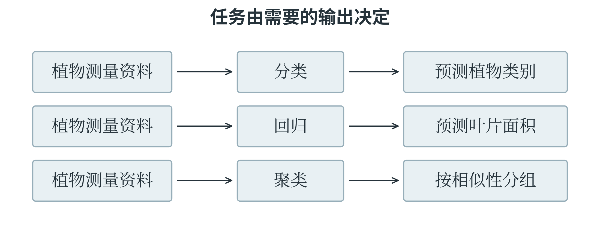
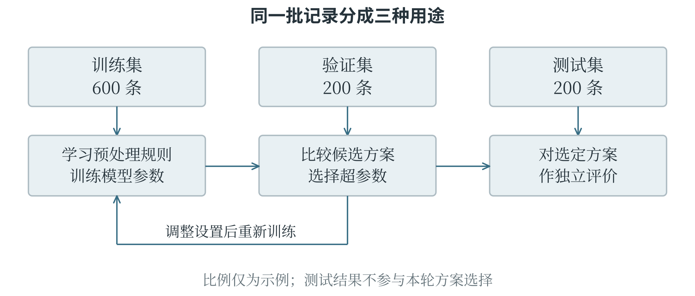
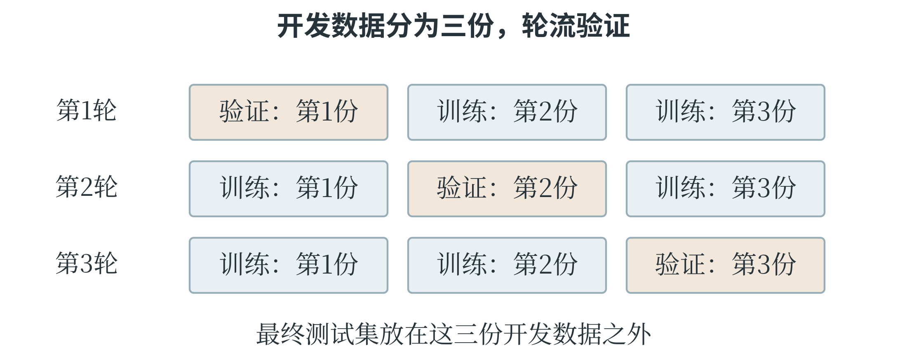
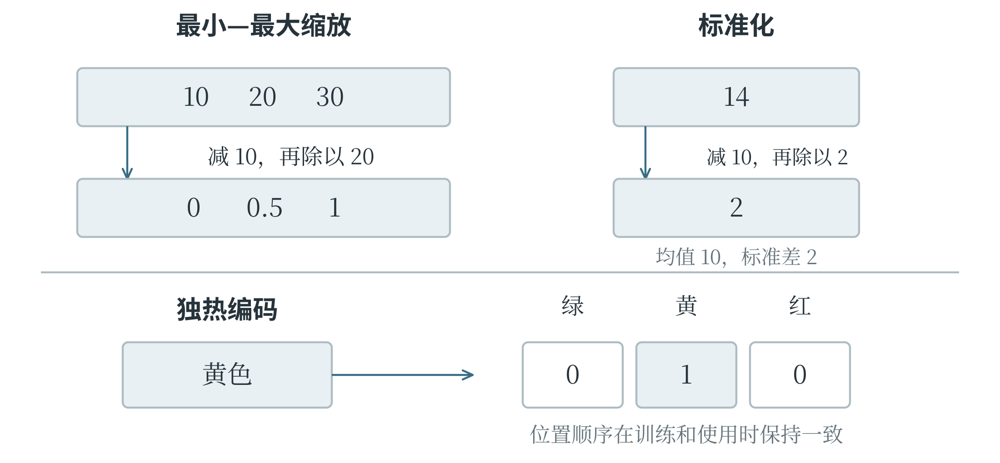
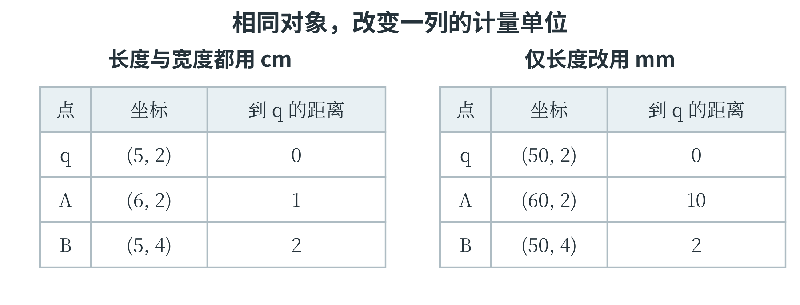
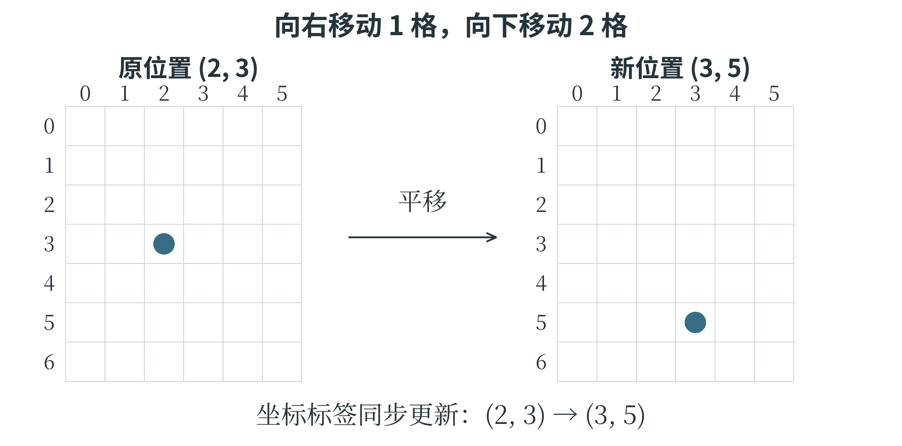
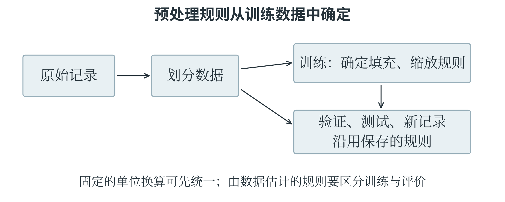
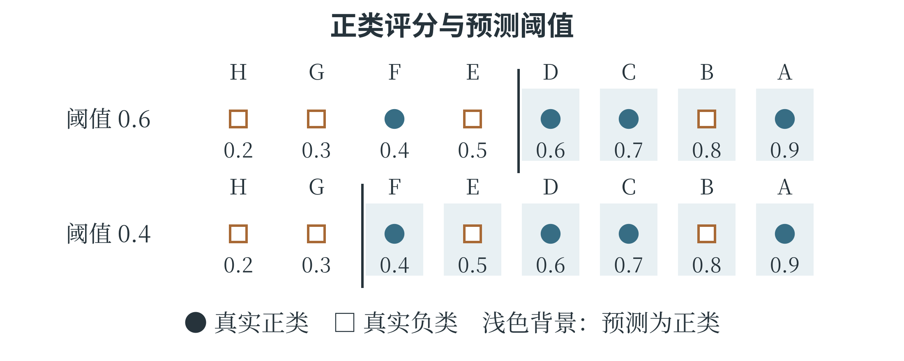

# 第五章 让机器从数据中学习

机器学习把数据变成可以使用的判断规则，但收集到数据与得到可靠模型之间，还有许多工作。任务要先定义清楚，材料要适合学习，评价也要反映真正关心的问题。一个能区分训练图片的模型，未必能识别新拍的图片；一项很高的准确率，也可能掩盖某类重要错误。本章介绍机器学习的主要方式和完整过程，说明特征怎样处理、结果怎样检查。这些概念贯穿 CAICP 的模型应用题，也决定了后面学习各种算法时应当观察什么。

## 5.1 任务与学习方式

### 先看希望得到什么结果

在机器学习中，一条用于处理或分析的记录称为一个**样本**。它可以是一行测量值，也可以是一张图片、一段录音。用来描述样本、供模型计算的信息称为**特征**；在有标准答案的学习任务中，希望模型预测的目标称为**标签**或目标值。同一份植物记录中，叶片长度和宽度可以作为特征，植物类别可以作为标签。若任务改为根据类别和宽度预测长度，输入与目标的角色也随之改变。

**分类**要判断样本属于哪个类别。例如，根据叶片特征判断属于甲类还是乙类，根据邮件内容判断是否为垃圾邮件。只有两个类别时称为二分类，有多个互斥类别时称为多分类。类别可以编码成数字，但数字的用途是标记类别：用 0 表示甲类、1 表示乙类，并不意味着乙类在数量上比甲类“大一”。**回归**要预测具有数量意义的数值，例如叶片长度、明天的用水量或一段行程的耗时。预测值与真实值相差多少，通常具有明确意义。

区分分类与回归，要看数字代表什么，而不只看它是不是整数。预测班级编号属于分类；估计明天有多少人来借书，虽然人数是整数，仍可以作为数值预测问题处理。实际输出还可能需要取整或满足非负约束。

**聚类**则是在没有给定目标类别的情况下，根据样本之间的相似性分组。例如，只提供许多叶片的长度和宽度，希望算法寻找大小相近的组别。算法得到的“第 0 组”“第 1 组”只是簇的编号，不会自动成为准确的植物学类别。一个物种可能因生长阶段不同分成几组，不同物种也可能因形态相近聚到一起。

分类的类别已经给定，聚类的分组则有待发现。

### 同一批资料可以定义三种任务

假设一份植物资料同时记录了叶片长度、宽度、面积和已经确认的植物类别。若输入长度和宽度，要求输出植物类别，这是分类；若输入长度和宽度，要求输出面积，这是回归；若暂时不使用类别和面积，只根据长度和宽度把样本分成若干组，则是聚类。三个任务都使用植物资料，所问的问题却不同。图 5-1 将输入与输出并排比较。

图 5-1 任务类型由希望得到的结果决定

在分类任务中，两个不同物种即使长度相近，也仍应分别使用对应的类别标签；在聚类任务中，算法可能把它们归到同一簇，因为当前只要求按所选特征的相似性分组。聚类结果是否有用，需要结合后续用途解释。例如，按叶片大小选择扫描区域时，这种分组可能有用；用它直接替代植物学分类，则缺少依据。

回归模型也未必能够仅凭两个特征作出精确预测。长和宽相同，叶片形状仍可能不同，面积因而不同。模型只能利用输入中存在的信息作估计，无法凭空获得被省略的细节。遇到误差时，应先判断：是已有特征足够而方法没有学好，还是输入本来就无法唯一确定答案。这个区别会影响是否需要增加新的测量或改用更合适的表示。

### 监督、非监督与半监督学习

**监督学习**使用带有目标答案的训练样本。模型先作出预测，再根据预测与标签之间的差异改进计算规则。分类与回归都是典型的监督学习任务。“监督”表示训练中存在可用的目标信息，不表示每做一次计算都需要一个人站在旁边检查。标签既可能来自人工标注，也可能来自测量结果和已有业务记录。**非监督学习**不使用这类目标标签，主要从数据本身寻找结构。聚类是其中一种方法。它也可以用于发现数据的某些表示或变化方向，因此非监督学习不等于聚类一个算法。

没有标签不表示没有目标：仍要确定希望怎样组织数据、采用什么相似性标准，以及得到的结构是否有解释价值。

**半监督学习**同时使用少量有标签样本和较多无标签样本。假设只有少量植物图片经过专家确认，另有许多未标注图片，半监督方法希望两部分材料共同帮助模型学习。一种思路是先用有标签样本训练，再对未标注样本给出较有把握的临时标签，继续学习；这些临时标签称为伪标签。伪标签也可能出错，如果把错误预测当作确定事实反复训练，错误就会被放大。因此，半监督学习的效果取决于数据结构、筛选方法和标签质量，不是简单地把两堆数据混在一起。

还有一种常见方式叫**自监督学习**，它从数据内部构造学习目标。例如，遮住句子中的一部分，让模型根据其余部分预测被遮住的内容；目标答案来自原句，无需另请人逐句标注。它与半监督学习不同，区别不在人工标签“多一点还是少一点”，而在训练目标怎样产生。

### 在行动中学习的强化学习

**强化学习**研究如何通过与环境交互学习行动策略。作出动作的系统称为**智能体**，动作发生的外部条件称为**环境**。智能体观察当前情况，选择动作，环境随之变化，并提供奖励信号；智能体再根据这些经历改进行动规则。第四章的状态、动作和状态转换，正好可以用于描述这一过程。例如，机器人在模拟房间里学习到达出口。向前走、转弯或等待是动作，位置和朝向是状态的一部分；到达出口可以得到正奖励，碰到障碍物可以得到负奖励，绕远路也可以增加时间代价。**策略**说明在某种状态下选择什么动作，或各个动作分别有多大概率被选中。学习的目标通常是提高长期累积奖励，而不只是让下一步的奖励最大。

奖励可能为正、为负或为零，也可能隔许多步才出现。机器人先绕开障碍，看起来离出口更远，却可能最终更快到达。若每一步只追求眼前收益，就可能反复撞墙。智能体还要在**探索**与**利用**之间取舍：探索是尝试尚不确定的行动，以获得信息；利用是按已有经验选择目前看来较好的行动。监督学习通常提供某个输入对应的目标答案，强化学习提供的往往是行动结果的评价，未必直接告诉每一步的最佳动作。

同一应用可以采用不同学习方式。推荐系统可以把历史点击作为标签，训练一个监督学习模型；也可以把连续推荐与后续反馈作为交互过程，使用强化学习。仅凭“推荐”“机器人”等应用名称，无法判断具体范式，应观察训练数据、目标和反馈怎样组织。

### 怎样比较一串行动的收益

强化学习中的长期目标，可以先用一个确定的小环境说明。小车从起点出发，有两条可到达终点的路线。路线甲经过两次移动，奖励依次为 2、1；路线乙经过三次移动，奖励依次为 0、0、5。若暂时直接把奖励相加，甲的累计奖励为 3，乙为 5。只看第一步会选甲，比较完整路线则会选乙。第一步的奖励不足以代表整条路线的结果。训练过程中，小车需要把获得的最终结果与此前经过的状态、采取的动作联系起来。路线乙的第一步本身没有得到正奖励，但它为后来的 5 分创造了条件。如果只让第一步的动作学习它当场拿到的零分，这种联系就被丢掉了。

有时还会让更远的奖励在当前比较中占较小份量。把折扣因子记为 $\gamma$，通常取 0 到 1 之间。三步奖励 $r_1,r_2,r_3$ 的折扣累计值可写成

$$
G=r_1+\gamma r_2+\gamma^2r_3.
$$

第二步乘一次折扣，第三步乘两次。取 $\gamma=0.9$，路线甲的 G 为 $2+0.9\times1=2.9$，路线乙为 $0+0.9\times0+0.9^2\times5=4.05$，仍然选乙。若取 $\gamma=0.5$，甲为 2.5，乙为 1.25，比较结果便反过来。任务更看重多远的收益，会影响怎样定义学习目标。

表 5-1 两条路线在不同目标下的累计值

| 路线 | 各步奖励 | 不折扣 | 折扣因子 0.9 | 折扣因子 0.5 |
| --- | --- | --- | --- | --- |
| 甲 | 2、1 | 3 | 2.9 | 2.5 |
| 乙 | 0、0、5 | 5 | 4.05 | 1.25 |

真实环境中的结果还可能带有随机性。同一动作有时成功、有时失败，不能只凭一次获得高分就认定它长期最好。智能体通过多次经历估计不同选择的后续收益，再逐步改进策略。探索让它获得尚不了解的路线信息，利用则让它根据已有经验行动。

有了累计奖励，还要检查它是否表达了真正的目标。若希望小车尽快到达终点，却只奖励每次移动，它可能不停绕圈；如果只奖励“靠近终点”，又可能忽略必须先绕开的障碍。奖励是供学习使用的数值信号，设计者仍要检查：获得高累计奖励的行为，是否真的完成了原来的任务。

## 5.2 从问题定义到模型应用

### 任务定义与数据准备

一个可操作的任务定义，应说明输入是什么、输出是什么、何时使用结果，以及怎样判断结果可用。以预测温室下一小时的温度为例，输入可以是当前温度、室外温度和通风状态，输出是下一小时的温度。预测时尚未发生的“下一小时实测温度”只能作为训练标签，不能同时放进输入。若不先规定预测时刻，就可能把未来信息误当成当时已知的条件。数据收集要覆盖实际使用中重要的情况。只在晴天收集的记录，很难充分反映阴雨天；只收集设备工作正常时的数据，也不足以检查异常情况下的表现。记录还应包含测量单位、时间、来源等必要说明，这些信息帮助判断能否合并、是否重复、标签有没有对错。数据数量重要，但大量相同条件下的记录不能替代缺失的重要场景。

**数据标注**是按明确规则为样本补充目标信息。判断叶片图片是否清晰，就应说明模糊、遮挡和尺寸过小分别怎样处理；否则不同标注者可能依据不同标准判断。遇到无法确认的样本，可以暂列为待核对，而不是强行给一个答案。抽查、复核分歧和记录修改原因，能使标签更可靠。若任务本身没有清楚的类别界限，先调整任务和标注规则，通常比立即训练更有价值。

### 标签是怎样形成的

为了训练“图片是否适合识别”的分类模型，不能只请标注者凭感觉写“好”或“不好”。可以先规定：叶片主体完整、主要纹理能够辨认、没有严重遮挡的图片标为可用；主体大部分缺失或模糊到无法辨认的图片标为不可用；难以确定的图片先留待复核。这些规定把任务目标转化为可执行的标注依据，也使分歧有机会被具体讨论。如果两位标注者对同一张照片给出不同标签，可以检查分歧究竟来自哪里：一人重视图像是否美观，另一人重视叶缘是否完整，说明任务理解不一致；两人理解相同，却看不清某块区域，则可能需要更清晰的原图或更有经验的复核。

标签也可以直接来自测量。预测叶片面积时，标签是按约定方法测得的面积；预测下一小时温度时，标签是那一小时实际到来后的观测值。无论来自人工判断还是仪器，都应与输入样本准确对应。把甲叶片的特征配上乙叶片的面积，程序通常不会报错，但训练会学习错误的对应关系。样本编号和采集时间因此虽未必作为模型特征，仍然是整理数据的重要依据。

### 为什么要把数据分开

**训练集**用于学习模型参数；**验证集**用于比较方案、选择超参数和调整方法；**测试集**用于方案确定后的独立评价。可以把它们理解为三种不同用途的材料：一部分参与练习，一部分帮助决定怎样练习，最后一部分检查定下来的方法面对新材料时表现如何。图 5-2 展示了它们在流程中的位置。

图 5-2 模型和处理规则在训练集上学习，方案经验证集选择后再接受测试

例如，1000 条相互独立、来自同一类使用条件的记录，可以分成 600 条训练、200 条验证、200 条测试。这个比例只是示例，不是固定要求。数据较少时，可以使用**交叉验证**：将用于开发模型的数据分成几份，轮流留出一份作验证，其余部分训练，最后汇总多轮结果。每轮都应重新训练模型，也应重新学习这一轮的数据处理参数，不能先用全部数据完成标准化再分折。

验证集上的结果会影响方案选择，因此它也会逐渐被“用熟”。反复尝试大量方案后，某个方案可能只是恰好适合这份验证集。测试集应尽量保留到选择结束后使用；若看过测试结果又据此不断改模型，这份材料便已经参与开发，不再具有原先那样的独立评价作用。

测试时，模型可以读取测试样本的特征来预测；测试信息不能再反过来帮助选择和学习模型。

划分方式还要与实际问题一致。同一片叶子的多张近似照片如果分别进入训练集和测试集，模型可能借助几乎重复的材料获得好成绩；若要评价对新植物的识别能力，就应按植物对象分组划分。预测未来温度时，应按时间用较早记录训练、较晚记录评价，不能把未来和过去任意混合。随机划分适用于相应的独立样本情境，并不是所有任务通用的步骤。

### 看清一次交叉验证

假设已有六组相互独立的样本，将它们分成三份，每份两组。第一轮用第 2、3 份训练，第 1 份验证；第二轮用第 1、3 份训练，第 2 份验证；第三轮用第 1、2 份训练，第 3 份验证。每轮重新开始训练，不能让上一轮学过验证对象的模型直接接着算。图 5-3 用不同位置表示每轮的用途。

图 5-3 每轮重新训练，验证位置随轮次轮换

如果三个验证部分大小相同，准确率分别为 80%、90%、85%，它们的平均值是 85%。这个汇总反映同一种设置在不同划分上的表现。比较另一组设置时，应沿用相同划分，才便于把差异归因于设置，而不是恰好换了一批更容易的样本。各折样本量不同时，怎样汇总还应明确是按折平均，还是合并所有预测后计算；二者未必得到同一个数。这三轮都属于模型开发过程。若另外留出独立测试集，它不会参加这些轮换。通过交叉验证选好设置后，可以在全部开发数据上重新训练最终模型，再在测试集上评价。对于同一对象的多次测量，还应将同一对象的记录放在同一份里，避免近似重复的资料跨越训练与验证。

时间序列需要另作安排。预测未来气温时，可以用前四个月训练、第五个月验证，再用前五个月训练、第六个月验证，使每次学习都发生在被预测的时间之前。不能为了凑成形式整齐的几折，让模型先见到未来资料。这种按真实使用条件组织验证的想法，比记住一个固定的划分比例更重要。

### 训练、选择与部署

训练是利用训练数据确定模型的计算规则。可以先建立一个简单的**基线模型**，作为比较起点。例如，回归任务先总是预测训练集目标的平均值，分类任务先总是预测训练集中最多的类别。基线也许不够好，却能帮助发现复杂方法是否真的带来了改进：若一个精心训练的模型还不如简单基线，就需要检查数据、代码和任务设定。

模型的**参数**是从训练中学到的数值，例如直线的斜率和截距；**超参数**是用来规定模型结构或训练方式的设置，例如邻居数量、树的最大深度、学习率。超参数可能由人选择，也可以由搜索程序根据验证结果选择。

区分参数和超参数，依据是它们在学习中的作用，并不是看数值由人填写还是由程序选择。

选好方案后，**部署**是把模型连同必要的数据处理步骤放到实际使用环境。训练时输入长度以厘米记录，使用时也必须按一致规则转换；训练时特征顺序为“长度、宽度”，使用时不能颠倒。部署的不只是一个预测公式，还包括输入检查、处理规则和结果解释。若预测超出模型经过评价的范围，系统应有明确的处理方式，例如转交人工复核，而不是把任何数值都当成同样可靠。使用环境还会变化。摄像头更换、光照改变、用户群体变化，都可能使新数据与训练时不同，这种变化常称为**分布变化**；随时间发生的变化也常叫数据漂移。持续观察错误类型与数据构成，有助于决定是否补充样本、重新训练。

### 先知道简单方法能做到什么

基线能够给模型成绩提供一个参照。假设训练目标为 2、4、6，它们的均值为 4。一个不看输入的回归基线，遇到任何新样本都预测 4。在三条验证记录上，真实目标分别为 3、4、8，那么这条基线的误差是 1、0、−4，MAE 为 $5/3$，MSE 为 $17/3$。均值来自训练集，验证目标只用于计算这些误差。现在有两个候选模型，甲在同一验证集上预测 3、5、7，乙预测 4、4、6。甲的误差为 0、1、−1，MAE 和 MSE 都为 $2/3$；乙的误差为 1、0、−2，MAE 为 1，MSE 为 $5/3$。在这份验证材料上，两个模型都优于基线，甲的两项指标也都优于乙。表 5-2 把比较放在同一处，数值经过了显示舍入。

表 5-2 同一验证材料上的基线与候选模型

| 方法 | 三条预测 | MAE | MSE |
| --- | --- | --- | --- |
| 固定均值基线 | 4、4、4 | 1.667 | 5.667 |
| 模型甲 | 3、5、7 | 0.667 | 0.667 |
| 模型乙 | 4、4、6 | 1.000 | 1.667 |

这张表回答的是“候选方法是否在这份验证材料上带来改进”。接下来仍要查看差异是否来自某一条特殊记录，以及评价材料是否足够代表用途。基线的意义也不限于陪衬：如果某个复杂模型在表中明显更差，就值得检查它是否列顺序错误、目标与特征错配，或训练尚未完成。一个简单、可手算的参照，有时比直接在长程序里寻找问题更有效。

分类基线也遵循相同原则。如果训练集里甲类占 70%，可以把“全部预测甲类”作为一个起点。在类别比例相近的验证集上，它可能取得约 70% 的准确率，但一个乙类样本也识别不出来。比它高一个百分点和比它高二十个百分点，所说明的进展不同；即使总准确率超过它，也还要检查需要识别的类别是否真的改善。

## 5.3 特征与数据预处理

### 清洗并不只是删除

把原始数据整理成适合分析和模型使用的形式，称为**数据预处理**。其中，纠正错误、处理缺失和重复等工作通常称为**数据清洗**。例如，“3.2 cm”和“32 mm”可以先统一为厘米；同一条记录误导入两次，应核对后去重；温度写成 280 摄氏度，则需要检查单位或录入过程。异常并不自动等于错误，一次真实的设备故障也可能产生少见数值，删除后反而会失去重要信息。

**缺失值**表示某项内容没有记录，不等于零。叶片宽度为零与没有测到宽度，是两个不同含义。处理方法可以是补测、删除少量不完整记录，或按合理方法填充。使用均值填充时，例如训练集中某列已知值为 2、4、6，平均值是 4，就用 4 填入缺失位置。模型随后面对验证集和测试集中的缺失项，也应沿用训练阶段确定的填充值，不能再用这些集合的平均值反过来帮助训练。

填入均值，补齐了表格，却没有补回那次测量。它还会把一些记录拉向中心，掩盖原先的不确定性。如果缺失本身有意义，还可以增加“是否缺失”这一特征。某些记录没有测量，可能因为仪器故障，也可能因为样本太小，原因不同，处理方式也可能不同。不存在适合所有数据的唯一填充规则。

对于有顺序的数据，可以根据相邻记录估计中间值，称为**插值**。若 9 时和 11 时的温度分别为 18、22 摄氏度，假设两小时内按直线变化，10 时便估为 20，这叫线性插值。它利用的是时间位置与变化假设，不能只看表中上下两行。若两次测量间隔很长，或期间发生突变，直线假设就可能不合适；若系统要在 10 时立即作预测，11 时的记录尚不可用，也不能把它当成当时能取得的信息。

### 同一处缺失可以怎样处理

一列训练数据为 2、4、缺失、6，已知三项的均值为 4。用均值填充后，得到 2、4、4、6，新的均值仍为 4。不过，原来已知三项的方差为 $8/3$，填充后四项的方差变为 2。增加一条恰好位于中心的记录，使数据看起来更集中。均值没有变化，并不意味着整组数据的统计性质都保持不变。如果缺失值来自仪器不容易测量的小叶片，直接填入平均宽度还可能系统性地高估这些样本。为每条记录另存一个“原先是否缺失”的标记，可以保留一部分有关缺失的信息；是否这样做、怎样使用该标记，仍需要通过合理的验证检查。

插值则依赖位置。上午 9 时气温为 18 摄氏度，11 时为 22 摄氏度，若假设中间匀速变化，9 时 30 分位于总时间的四分之一处，估计温度为：

$$
18+\frac{0.5}{2}(22-18)=19
$$

直接取两个端点的平均数会得到 20，那是 10 时对应的插值，不能用于 9 时 30 分。数据表里两行之间看起来只隔着一个空格或一行，并不表示实际时间等距。处理观测记录时，位置、单位和顺序都会参与计算。

### 把几张表合在一起

**数据集成**是把不同来源的数据组合起来。两张表记录相同字段、不同对象时，可以上下追加记录。例如，上周的叶片记录与本周的叶片记录具有相同列，就可以接成一张更长的表。追加之前仍需检查单位、字段含义和重复记录；列名相同并不保证含义相同。

若两张表记录同一批对象的不同信息，则需要按共同的键进行**连接**，英文常称 join。例如，测量表含“样本编号、长度”，标注表含“样本编号、类别”，可以按样本编号将长度与类别配到一起。不能只按当前行号横着拼接，因为两张表的排序可能不同。共同的键应当指向同一个对象，否则表面整齐的数据也可能把甲样本的长度配给乙样本的类别。连接方式决定没有配对的记录怎么办。**内连接**只保留两边都匹配的键；**左连接**保留左表的全部记录，右表没有匹配时留下缺失值。如果右表同一编号出现两次，一条左表记录可能配出两行结果。这不一定是软件出错，而是连接规则产生的结果。

### 让不同数值能够合理比较

第四章的算法可以比较原始数值，但机器学习中的距离和优化过程还会受数值尺度影响。例如，一个特征范围约为 0—1，另一个约为 0—1000，直接计算欧氏距离时，后者的差异往往占据较大影响。**特征缩放**通过变换数值尺度，使比较和计算更合适；它不决定哪个特征在现实中更重要。

一种常用的**归一化**方法，是将训练数据某列的最小值与最大值对应到 0 和 1，称为最小—最大缩放。设这两个值分别为 $x_{\min}$、$x_{\max}$，一个原始值为 $x$，转换后为：

$$
x'=\frac{x-x_{\min}}{x_{\max}-x_{\min}}
$$

训练列为 10、20、30 时，转换结果为 0、0.5、1。新样本取 40，仍沿用训练范围，得到 1.5，并不自动截成 1；这表明新值超出了训练范围。若整列数都一样，分母为零，就不能直接使用这个公式，应按工具约定处理该常量列。“归一化”在不同资料中还可能指将整个向量缩放到单位长度，因此读到名称时要同时看具体公式。

另一种常用方法是**标准化**：减去训练列的均值，再除以标准差。用 $\mu$ 表示均值、$\sigma$ 表示非零标准差，有：

$$
z=\frac{x-\mu}{\sigma}
$$

若一列数据的均值为 10、标准差为 2，原值 14 就变成 2，表示它比均值高两个标准差。标准化后的训练列均值为零、标准差为一，但不意味着数据变成正态分布；它只改变位置和尺度，没有把原本的分布形状重新塑造成钟形。图 5-4 对比这两类常见变换。

图 5-4 数值缩放改变尺度，独热编码将类别表示为多个指示位置

### 单位变化为什么会改变邻近关系

设一片待判断叶子的长度、宽度为 $(5,2)$，两条参考记录分别为 A$(6,2)$、B$(5,4)$，单位都为厘米。按原始数值计算距离，待判断叶子到 A 的距离为 1，到 B 的距离为 2，A 更近。如果只把长度改用毫米记录，三条记录变成 $(50,2)$、$(60,2)$、$(50,4)$，距离便变为 10 和 2，B 反而更近了。

图 5-5 物理对象相同，数值尺度可以改变计算中的相对影响

叶片没有改变，改变的是某一列数值的比例。在距离的平方中，长度差从 1 变成 10，其贡献从 1 变成 100。采用基于距离的模型时，如果没有考虑各列尺度，就可能把“记录单位更细”误当成“应该更重要”。标准化或其他缩放方法可以使尺度有明确依据，但并不能代替对特征含义的判断。两个特征是否同等重要，仍然取决于任务和数据。

缩放规则应在训练集上确定。若训练列为 10、20、30，其最小—最大缩放规则为 $(x-10)/20$。验证样本 25 变为 0.75，测试样本 40 变为 1.5，三部分始终使用同一把“尺子”。

若各份数据各用一把尺子，同一个原始数值就可能变成不同的数，训练与预测的计算条件也就不一致了。

### 类别和文字怎样变成特征

有些特征是类别，例如叶片颜色“绿、黄、红”。若直接编码为 0、1、2，依赖距离的模型可能把黄色看成恰好处于绿色和红色的中间，而颜色类别本身未必支持这种数量关系。**独热编码**，也称 One-hot 编码，为每个类别设一个位置，属于该类别的位置为 1，其余为 0。例如按“绿、黄、红”的顺序，黄色表示为 $(0,1,0)$。独热向量像一排有固定名称的位置，1 所在的位置指出当前类别。因此，“绿、黄、红”这一顺序要保存下来，训练和使用时都沿用。类别种类越多，位置也越多；遇到原来没有的类别，则需要按照预先约定的方式处理，例如另设“其他”位置。这种表示保留了类别身份，并没有为颜色规定远近关系。

文字也可以从明确的规则开始表示，例如统计一条评论中某些词出现的次数。这样的**词频特征**容易理解，却可能丢失顺序：“猫追狗”和“狗追猫”中各个词出现的次数相同，追赶关系却正好相反。另一种方法是**词嵌入**，把词映射成较短的数值向量，这些向量通常通过学习得到，希望有用的语义或用法关系能在数值表示中体现出来。向量的每一维一般没有“颜色”“长度”这样直接的名称，距离也不自动等于人类对意义的全部判断。同一个词还可能随语境改变含义。“苹果落在地上”与“苹果发布新品”中的“苹果”，所指并不相同。一些模型会根据上下文形成不同的表示，而不总是取出一份固定向量。

### 一段文字怎样变成一行数

先使用一个小词表，观察词频表示的具体过程。约定词表顺序为“猫、追、狗”，并假定已经完成分词。句子“猫追狗”的三个词各出现一次，向量是 $(1,1,1)$；“狗追猫”同样是 $(1,1,1)$；“猫追猫”则是 $(2,1,0)$。把每句话写成一行，就得到表 5-3。

表 5-3 固定词表下的词频特征

| 句子 | 猫 | 追 | 狗 |
| --- | --- | --- | --- |
| 猫追狗 | 1 | 1 | 1 |
| 狗追猫 | 1 | 1 | 1 |
| 猫追猫 | 2 | 1 | 0 |

前两行完全相同，说明这种表示已经把顺序区别丢掉。后续即使换一个更复杂的模型，只看到这三列，也无法从完全相同的输入中恢复究竟是谁追谁。如果任务只关心评论里是否提到某些物品，词频可能已经有用；如果任务要判断动作的承担者，就需要保留词序或更丰富的上下文。还可以把相邻两个词组成的片段作为特征，例如“猫—追”和“狗—追”，这就保留了一部分局部顺序。词表会因此变大，新句子中也可能出现从未记录过的片段。

词表本身也属于处理规则。用训练文字建立词表以后，新句子必须沿用相同列顺序；词表外的词按约定忽略或交给专门的未知词位置。若每句话都根据自己出现的词重新安排第一列，那么不同句子的第一列就不再具有相同含义。第七章中的数组列、表格字段和流水线，正是在程序层面保持这些对应关系。

### 数据增强为什么要保持任务含义

**数据增强**对已有样本作适当变换，构造额外的训练材料，帮助模型适应可能出现的变化。图像可以轻微旋转、裁切或调整亮度；语音可以加入适量背景噪声、调整音高；文本可以按任务需要遮盖部分词语或替换近义词。增强通常用于训练数据，独立评价材料应能反映实际使用条件。变换是否合适，要看标签是否仍然成立。把猫的照片轻微旋转，类别通常不变；将数字 6 大幅旋转，则可能接近 9。裁切若去掉了要识别的物体，原标签也可能不再有效。将“并不满意”中的“不”删去，文本含义更会发生反转。

增强应当保留任务所需的含义。变换之后，原答案是否还成立，需要重新检查。

处理步骤的先后也有意义。先按原始对象划分训练与评价材料，再只对训练部分做增强，可以避免同一张原图的不同变体落入两边。使用验证或测试信息帮助训练，或者让本应未知的信息提前进入模型，称为**数据泄漏**。数据泄漏可能让分数看起来很高，却不能说明模型对新样本同样有效。

### 变换数据时，标签也要跟着检查

图像增强还要区分不同类型的标签。整张图片分类时，标签可能只是“叶片”，轻微平移叶片的位置，类别通常保持不变；如果标签记录的是叶片中心坐标，图片平移以后，坐标就必须相应改变。同一种图像变换，在两种任务中需要不同的标签处理。设一张小图的坐标从 0 开始，某个目标中心原先位于 $(2,3)$。向右平移一格、向下平移两格后，新的中心是 $(3,5)$。如果变换后的图片仍配上旧坐标 $(2,3)$，模型会被要求把新位置看成旧位置，监督信息便出现错误。图 5-6 用同一个点说明输入与标签需要怎样配合。

图 5-6 分类标签可能保持不变，位置标签通常需要同步变换

裁切也如此。裁掉左边一列后，原来横坐标为 3 的点，在新图中横坐标变成 2；若目标整个被裁掉，就不能继续把这张图当作“目标完整存在”的正例。平移、裁切和旋转的计算规则可以由程序执行，但规则是否适合任务，要在设计增强时先判断清楚。

一张照片变换出许多版本，也不等于采集了许多不同对象。一张叶片照片变换出一百张图，仍然没有提供一百片不同叶片的形态。原图中没有的品种、病斑或拍摄设备，不会因为多做几次旋转就自动出现。因此，增强适合帮助模型应对任务允许的变化，采集有代表性的新样本仍有自己的作用。

### 为一个任务安排处理顺序

现在把几个步骤串起来。假设任务是根据叶片长度、宽度和颜色预测植物类别，测量表与标注表通过样本编号连接。首先检查编号是否指向同一个对象，统一测量单位，并核对明显的录入错误；接着按植物对象划分开发和测试材料，避免同一植物的近似记录出现在两边。训练部分决定缺失值如何填充、数值怎样缩放，以及颜色类别按什么顺序编码；这些规则保存下来，再用于验证和测试。

图 5-7 由训练数据确定的处理规则，需要随模型一起保存

“先划分再预处理”中的重点，是不能利用评价数据学习处理规则。统一厘米和毫米这种依据已知单位执行的换算，并不需要从数据中估计参数；均值填充和标准化则会从数据中估计均值、标准差，必须放到正确的训练范围内。

实际使用时，新记录先经过同一套处理，再交给模型预测。颜色的独热位置若从“绿、黄、红”换成“红、黄、绿”，即使数组形状没变，第一列的意义也改变了。因此，处理规则、特征顺序和模型参数共同构成了完整的预测方法。

## 5.4 模型评估与结果解释

### 读懂混淆矩阵

分类评价先要数清哪些判断正确、哪些判断错误。**混淆矩阵**将真实类别与预测类别交叉排列，记录各类组合的数量。表 5-4 以“需要检查”为正类，“正常”为负类；正类只是当前重点关注的类别，并不表示道德上的好坏。本表规定行是真实类别、列是预测类别，阅读其他矩阵时也应先看清行列说明。

表 5-4 一组检查模型的混淆矩阵

| 真实类别 | 预测需要检查 | 预测正常 |
| --- | --- | --- |
| 需要检查 | 18 | 2 |
| 正常 | 8 | 72 |

18 个需要检查的样本被正确找出，称为**真正例**，记为 TP；2 个被漏掉，称为**假负例**，记为 FN。8 个正常样本被误报，称为**假正例**，记为 FP；72 个正常样本被正确排除，称为**真负例**，记为 TN。四格相加为 100，覆盖全部样本。“真、假”看预测是否正确，“正、负”看预测给出的类别，明确这两个角度就不容易把格子记反。

**准确率**表示全部样本中判断正确的比例。表中为 $(18+72)/100=90\%$。**精确率**又称查准率，关注被判为正类的样本里有多少是真的正类；本例为 $18/(18+8)\approx69.2\%$。**召回率**又称查全率，关注实际正类中有多少被找出来；本例为 $18/(18+2)=90\%$。

精确率与召回率都用了 18，分母却不同：一个数预测正类，一个数实际正类。

$$
\text{准确率}=\frac{TP+TN}{TP+TN+FP+FN}
$$

$$
\text{精确率}=\frac{TP}{TP+FP}\qquad\text{召回率}=\frac{TP}{TP+FN}
$$

当分母为零时，不能直接按分数计算，应说明这种情况，并查看所用工具如何处理。多分类任务中，混淆矩阵会有更多行列，对角线上仍是判断正确的数量；其他位置则说明某一类被误认成了哪一类。模型总分相同，错误可能分布在完全不同的位置。

### 指标与使用目的要对应

准确率很高，可能只是因为多数样本属于同一类。1000 个样本中若有 990 个正常，一个永远预测正常的模型准确率就是 99%，却找不出任何一个需要检查的样本。因此，类别不均衡时，不能只看总体准确率。精确率回答“报出来的有多可信”，召回率回答“该找的找到了多少”，可以帮助揭示这种差异。

一些模型先输出分数，再按**阈值**决定类别，例如分数不小于 0.6 就预测需要检查。阈值降低，通常会使更多样本被列为正类，漏报可能减少，误报也可能增加；阈值升高则通常相反。这是改变作出决定的规则，不一定改变模型内部参数。

分数即使位于 0 与 1 之间，也不必然是准确校准的概率。只有经过相应评价，才能把“0.8”解释成与实际发生频率相符的可能性估计。

**F1 分数**是精确率与召回率的一种综合指标。设两者分别为 $P$ 和 $R$，在分母非零时，$F1=2PR/(P+R)$。它不是简单的算术平均，会受到较低一项的明显影响。例如，精确率为 1、召回率为 0.5 时，F1 约为 0.667，低于算术平均数 0.75。指标选择要服从任务：某些场景规定漏报最多几次，就应直接检查漏报数，而不能用很高的 F1 抵消超过限制的事实。

回归评价则关注数值误差。第三章介绍的 MAE 表示绝对误差的平均大小，MSE 对较大误差的影响更敏感。还可以对 MSE 取平方根，得到**均方根误差**，简称 RMSE，它与目标值具有相同单位。比较不同模型时，应使用相同的评价样本、目标定义和计量单位；预测温度的误差与预测人数的误差，不能仅凭数字大小判断哪个模型“更优秀”。

### 同样的准确率可能对应不同错误

表 5-5 给出八个样本的评分。正类仍表示需要检查，评分越高，模型越倾向于报告为正类。先把“不小于 0.6”作为判断条件，A、B、C、D 被报告；将阈值降到 0.4，E、F 也会被报告。

表 5-5 同一批评分在不同阈值下作决定

| 样本 | 真实类别 | 评分 | 评分不小于 0.6 |
| --- | --- | --- | --- |
| A | 正类 | 0.9 | 是 |
| B | 负类 | 0.8 | 是 |
| C | 正类 | 0.7 | 是 |
| D | 正类 | 0.6 | 是 |
| E | 负类 | 0.5 | 否 |
| F | 正类 | 0.4 | 否 |
| G | 负类 | 0.3 | 否 |
| H | 负类 | 0.2 | 否 |

阈值为 0.6 时，正确找出 A、C、D，误报 B，漏报 F，正确排除 E、G、H。因此 TP 为 3、FP 为 1、FN 为 1、TN 为 3，准确率、精确率和召回率都是 75%。阈值为 0.4 时，四个真实正类全部找到，但增加了对 E 的误报；TP 为 4、FP 为 2、FN 为 0、TN 为 2，准确率仍是 75%，精确率变为 $4/6$，召回率升为 100%。

图 5-8 阈值改变了哪些样本被列为正类

两种方案的准确率相同，适用情况却可能不同。如果遗漏一条重要记录的代价很高，而且人工可以再检查报告，较低阈值可能更符合任务；如果人工检查资源很有限，误报过多也会挤占处理能力。选择时需要明确这些实际条件，再在验证数据上确定规则。不能先看测试标签，再逐个挑选刚好能得到好成绩的阈值。

### 从多分类矩阵找出主要混淆

多分类任务可以沿用相同的交叉计数。假设三类植物各有 10 个测试样本，矩阵规定行是真实类别、列是预测类别：

表 5-6 三类植物的预测结果

| 真实类别 | 预测甲 | 预测乙 | 预测丙 |
| --- | --- | --- | --- |
| 甲 | 8 | 2 | 0 |
| 乙 | 1 | 7 | 2 |
| 丙 | 0 | 3 | 7 |

对角线上的 8、7、7 都是正确判断，总准确率为 $22/30$，约 73.3%。真实丙类有 3 个被判为乙类，而真实甲类没有被判为丙类。改进时，可以先检查乙、丙两类的混淆：是否形态接近、是否缺少能够区分的特征、是否有标注分歧。一个总准确率只能显示整体结果，矩阵则指出错误主要发生在哪些类别之间。若把乙类单独当作正类，其余两类合成负类，那么 TP 为 7，FN 为 $1+2=3$，FP 为 $2+3=5$，TN 为其余四个格子的总和 $8+0+0+7=15$。于是乙类召回率为 $7/10=70\%$，精确率为 $7/12\approx58.3\%$。二分类指标由此可以扩展到“逐类观察”，但每次都要先说清哪个类别被视为正类。

### 总体结果之外还要看什么

总体指标是对所有样本的汇总，可能掩盖少数场景的困难。假设一个识别模型在白天的 900 张图片上判断正确 882 张，在夜间的 100 张图片上正确 60 张，总体准确率为 94.2%，但夜间准确率只有 60%。如果模型要在夜间工作，这项不足就不能由白天表现补偿。按光照、设备、类别等有实际意义的条件分别报告结果，称为分组评价。

分组以后，还要看每组有多少样本。某组只有 5 张图片，错一张就会使准确率下降 20 个百分点；另一组有 500 张，错一张只改变 0.2 个百分点。少量样本上的高低差异可能不稳定，需要更多有代表性的记录支持判断。

错误分析可以从具体样本开始：是否模糊、标签有误、与训练材料差别很大，或者不同类别原本就难以区分。找到原因，才便于决定补数据还是换方法。

模型是否可用，有时还要同时满足多项要求。假设规定漏报不超过 3 次，而且夜间准确率至少 85%。模型甲漏报 2 次、夜间准确率 80%，模型乙漏报 4 次、夜间准确率 90%，两者都没有同时达标。不能选择一项较好的数字去抵消另一项不达标，也不能把两个模型简单组合后，直接沿用单个模型的指标；组合后的输出需要重新评价。

**结果解释**是说明模型为什么给出某个结果、它依赖哪些信息，以及结果能支持什么结论。小型决策树可以沿判断路径解释，线性模型可以检查特征变化怎样影响输出；复杂模型的解释方法则可能只是近似分析。即使发现某个特征对预测影响较大，也不能仅凭模型就认定它在现实中造成了结果。第三章中相关与因果的区别，在这里仍然成立。

## 本章小结

机器学习的任务由目标决定，学习方式由可用的数据和反馈决定。训练、验证与测试分工明确，预处理沿用一致规则，评价对应实际用途，模型结果才有清楚的含义。CAICP 中有关学习过程和效果判断的问题，往往正是要求辨认这些关系。后面介绍线性回归、分类器和神经网络时，将进一步打开模型内部，观察输入怎样变成预测，以及训练怎样改变这一计算过程。

## 想一想

1．图书馆想让模型回答两个问题：“这本书会不会逾期归还？”和“它还要几天归还？”前一个要选类别，后一个要报数值。这会怎样影响任务的设置和检查结果的方式？

2．把一盒纽扣交给程序，让它按相似程度分成几堆，却不事先告诉它每颗纽扣属于哪一类。这样的学习需要现成的类别答案吗？分出的堆就一定是人们想要的分类吗？

3．把同一张照片复制十份，再随机放进训练集和测试集，模型的成绩可能很好看。为什么这还不能证明它能识别没见过的照片？划分数据时应该怎样处理这些重复材料？

4．一份表同时记录身高和年龄。把身高从厘米改成毫米，人并没有长高，可按两列数值计算的距离却可能明显改变。为什么换个单位也会影响结果？预处理可以怎样帮助比较？

5．为了增加训练图片，小林把一张“6”旋转，结果看起来成了“9”，却仍保留原来的标签“6”。这次数据增强哪里出了问题？变换图片时，除了清晰度，还要检查什么？

6．100 个苹果中有 98 个好苹果、2 个坏苹果。模型把它们全部判断为好苹果，准确率就有 98%。把它放到专门挑出坏苹果的岗位上，表现真的好吗？它漏掉了什么？
