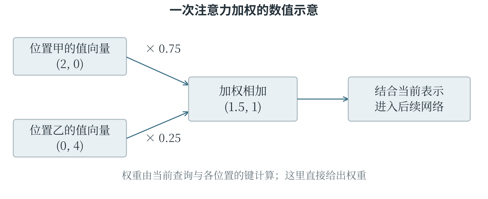
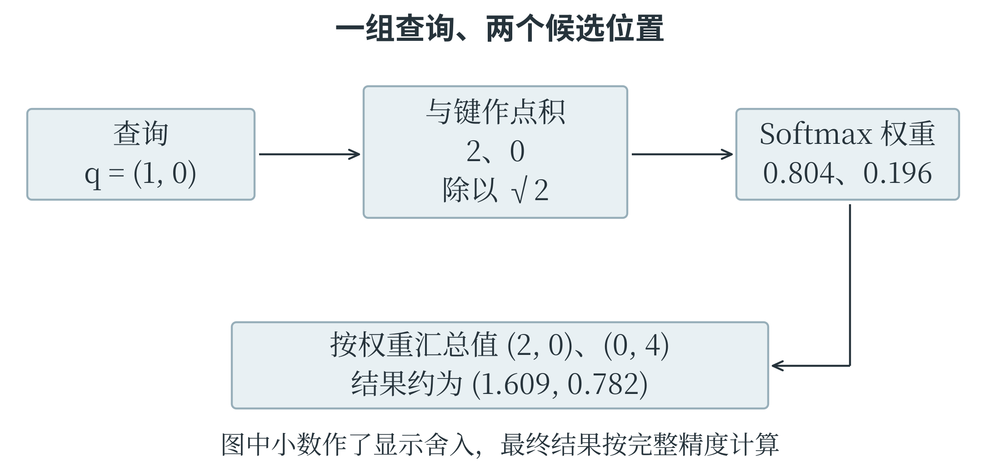
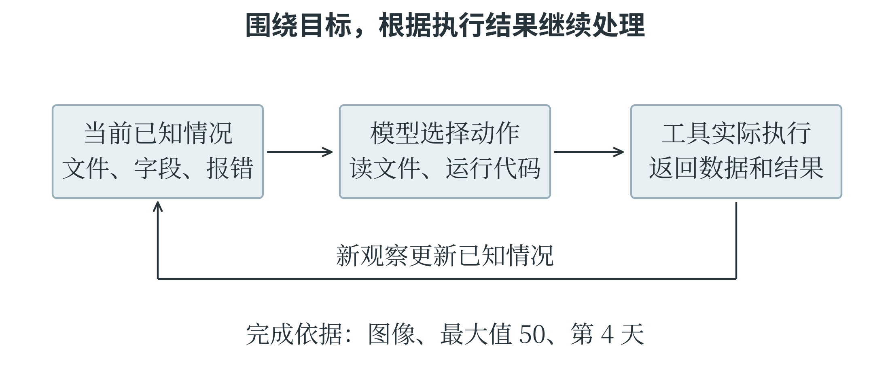
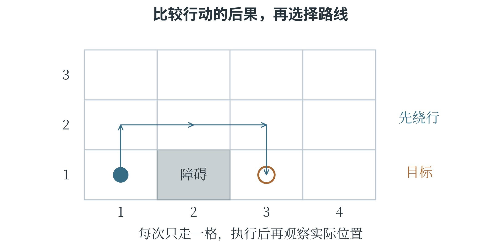
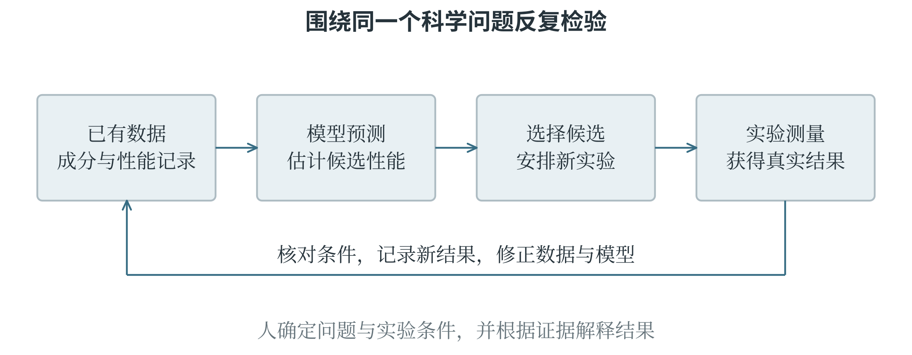

# 第八章 了解人工智能的前沿与应用

人工智能的新名称不断出现，但理解它们仍然可以从熟悉的问题开始：系统收到什么输入，使用怎样的模型，能够作出什么输出，结果又经过怎样的检验。Transformer、世界模型和智能体分别强调不同的结构与能力，不能因为都与“大模型”有关就混为一谈。本章把这些方向与前面的数据、学习和反馈知识连接起来，再讨论人工智能怎样参与科学研究，以及广泛应用后需要怎样安排人的判断与责任。这也是 CAICP 对技术理解、应用分析和伦理思考的综合要求。

## 8.1 当代人工智能的主要方向

### 文字怎样进入神经网络

处理文字时，模型首先要把文本变成能够计算的序列。**词元**，英文 token，是模型处理文本时使用的基本片段，可以是一个字、一个词、词的一部分，也可能是标点或其他符号。词元不固定等于一个汉字或一个英文单词，怎样切分取决于分词规则。每个词元先对应编号，再通过嵌入变成数值向量，网络才能对它进行后续运算。一段文字的意思不仅取决于出现了哪些词，还取决于顺序和上下文。“小明把书借给小林”与“小林把书借给小明”用了同样的人名，借出者却不同。第五章介绍的词频统计可能丢掉这种区别，模型需要保留位置，并让某个位置的表示参考其他相关位置。输入序列能在一次处理中容纳的范围，常称为**上下文窗口**；它有容量限制，也不等于模型已经永久记住这些内容。

### Transformer 与注意力

**注意力机制**根据当前处理内容，计算其他位置的信息应当占多大份量，再进行加权汇总。这里的“注意力”是一种可学习的数值计算，借用了人的注意力这一名称。例如，在“盒子装不进书包，因为它太大了”中，理解“它”需要结合前文的对象和关系。注意力机制使表示某个位置时，可以按相关性组合其他位置的信息；具体关联仍由模型学习，不是程序预先把“它”固定指向某个词。

把一次计算简化为两个候选位置，如果权重分别为 0.75、0.25，两个向量为 $(2,0)$、$(0,4)$，加权结果就是 $0.75(2,0)+0.25(0,4)=(1.5,1)$。

真实模型会从输入计算三组向量，分别称为**查询、键和值**。查询表示当前要匹配的信息，键用于与查询比较，值则提供实际参与汇总的内容。可以把这三者理解为“按什么找、拿什么来匹配、取出什么信息”三个环节。查询与键的点积等计算产生匹配分数，再由 Softmax 转成非负、总和为 1 的权重。

**自注意力**表示查询和所参考的信息来自同一序列，序列中的位置相互提供上下文。**多头注意力**并行使用多组不同的投影与加权计算，再组合结果，使模型能从不同表示中提取关系。每一组有自己的参数，因而可以形成不同的匹配方式；它们的具体作用是在训练中逐步形成的，并没有事先分配好“专管语法”或“专管人物”之类的固定职责。

2017 年提出的 **Transformer** 是以注意力为核心的神经网络架构。它还包含前馈网络、位置表示、残差连接和归一化等组成部分。前馈网络进一步变换每个位置的表示；残差连接把输入与变换结果相加，帮助信息和训练信号跨层传递；位置表示提供顺序线索。这里网络内部的归一化与第五章按训练样本列做标准化都涉及调整数值尺度，但处理对象和具体规则不同。



图 8-1 注意力根据当前内容组合相关位置的信息，再交给后续网络处理

Transformer 在训练时可以并行处理序列中的许多位置，但常见的自回归文本生成仍按已经生成的内容逐步预测下一个词元。用于这种任务时，注意力还要遮住当前位置之后的目标内容，避免训练时提前看到本来需要预测的答案。不同 Transformer 变体的连接方式和可见范围不同，因此不能把“并行训练”解释成任何系统都一次生成整段答案。

### 从匹配分数算出注意力结果

注意力里的“相关”可以怎样算？用一个只有两个候选位置的例子，就能看清点积、Softmax 与加权和怎样接起来。假设当前查询为 $q=(1,0)$，两个键为 $k_1=(2,0)$、$k_2=(0,2)$，两个值为 $v_1=(2,0)$、$v_2=(0,4)$。这里的数是为演示计算而指定的，并不代表某个真实词语天然具有这些坐标。查询分别与两个键作点积，得到 2 和 0。常见的缩放点积注意力还把分数除以键向量维数的平方根；本例维数为 2，缩放后的分数约为 1.414 和 0。将它们送入 Softmax，第一个位置的权重为

$$
a_1=\frac{e^{1.414}}{e^{1.414}+e^0}\approx0.804,
$$

第二个权重约为 0.196。于是汇总结果约为

$$
0.804(2,0)+0.196(0,4)=(1.608,0.784).
$$

第一个候选与查询更匹配，所提供的值在结果中占较大份量；第二个候选仍然贡献一部分信息。若改成查询 $(0,1)$，两个匹配分数就交换了位置，结果也会随之改变。注意力不是给每个词贴一个永久不变的重要程度，而是根据当前查询重新计算关系。



图 8-2 查询影响匹配分数，分数影响权重，权重用于组合值向量

下面的程序直接使用 NumPy 完成上述步骤。`keys @ query` 同时计算两个键与查询的点积；最后一行的矩阵乘法，则把两个值向量按对应权重相加。

```python
import numpy as np

query = np.array([1.0, 0.0])
keys = np.array([[2.0, 0.0], [0.0, 2.0]])
values = np.array([[2.0, 0.0], [0.0, 4.0]])
scores = keys @ query / np.sqrt(keys.shape[1])
exp_scores = np.exp(scores - scores.max())
weights = exp_scores / exp_scores.sum()
output = weights @ values
print(np.round(weights, 3))
print(np.round(output, 3))
```

输出分别约为 `[0.804, 0.196]` 和 `[1.609, 0.782]`。程序保留中间计算的精度，手算先把权重取了三位小数，因此最后两项略有差别。计算指数前减去最大分数，不改变各指数之间的比例，却能让指数的输入不超过零，减少数值过大造成的问题。这与第六章的 Softmax 公式等价，计算时更稳定。

小例子中的查询、键和值是给定的。真实网络中的这些向量从哪里来？它们由当前表示与可学习的矩阵运算产生，训练会同时调整这些矩阵和网络的其他参数。以上小例子展示一个位置、一个注意力头的一次计算；扩展到更多位置、更多头和更多层，基本计算关系仍然成立。

### 预训练、规模定律与能力表现

**预训练**让模型先从较广泛的数据中学习通用表示和预测能力。文本模型可以根据前面的词元预测后面的词元，目标直接来自原始文本，是自监督学习的一种方式。之后再用特定任务数据或指令样本继续调整，称为微调；根据偏好反馈等进一步调整行为，也属于后续训练过程。使用时把资料放进提示或检索结果，通常只改变这一次可参考的上下文，不会自动改变模型参数。

模型之所以能生成通顺文字，与训练中学到的模式和关系有关，但“预测下一个词元”是训练任务的描述，并不意味着它只会机械拼接几个高频词。许多层表示组合之后，可以支持翻译、代码生成和推理等行为。

语言流畅并不保证事实正确，某个判断没有证据时，模型也可能生成看似合理的内容。评价能力需要使用具体任务与独立材料，不能只凭一段令人印象深刻的回答。

**规模定律**描述在一定实验范围和条件下，模型规模、训练数据量、计算投入与损失等指标之间观察到的规律。增加参数、数据或计算，往往可以按某种趋势改善指标，但三者需要配合：大模型没有足够合适数据，或者数据很多却训练不足，都可能浪费资源。这是经验规律，不是“扩大任意一项就必定获得任意能力”的定理。

大模型有时在规模或训练条件变化后，表现出原先不明显的任务能力，这类现象常被称为**涌现**。观察到的突变程度也可能受评价方式影响：一个必须整题全对才得分的指标，可能把逐步改善显示成突然跃升。研究涌现，需要同时考察任务、指标和证据。它本身也不能证明模型具有人类的意识或责任能力。

模型规模还会影响部署。参数更多，通常需要更大的存储空间和更多计算；推理速度又受输入长度、生成长度、硬件和软件实现共同影响。GPU、NPU 及其软件平台的作用，仍可回到第一章的数据传送、并行运算和存储容量理解。模型排行榜的一个总分，无法同时回答成本、响应时间、可靠性和适用场景等所有问题。

### 智能体与辅助编程

**智能体系统**不仅产生一段回答，还会围绕目标选择步骤、调用工具、观察结果，再决定下一步。例如，整理观测记录时，系统可以读取文件、运行统计代码、检查报错、修正程序并生成图表。模型提供部分规划或判断，工具实际执行读取和计算，系统再把工具结果交回模型。这种循环与第四章的状态和反馈有关。

模型提出行动，工具执行行动，两者的能力需要区分。语言模型可以提出“读取某文件”的调用，能否读到文件取决于系统是否提供工具及相应访问权限。工具返回真实数据后，模型仍可能解释错误；工具没有执行成功，也不能把它计划得到的结果当作已经完成。

完成了哪些工作，要看实际动作与输出记录。

**OpenClaw**，中文讨论中常称“小龙虾”，是一个开源的个人 AI 助手系统，能够将消息渠道、智能体运行和工具能力连接起来。它可以接入模型服务，围绕消息和任务组织处理，并不等于一个新的基础语言模型。能完成哪些操作取决于连接的模型、工具、配置和授权。理解这类产品时，应把模型、应用系统和外部工具分开，不必把产品的每项配置都当成新的人工智能原理。

**Vibe Coding** 常译作氛围编程，指通过自然语言表达意图，让 AI 生成和修改代码，并根据运行结果继续调整的一类开发方式。日常用法有宽有窄，其中较窄的用法强调主要凭运行效果推进、很少深入阅读生成代码。它降低了制作原型的门槛，但程序是否符合要求，仍然由输入、执行过程和输出决定，不能只靠“看起来能用”。例如，要求程序计算平均叶长，如果没有说明无效记录怎样处理、空数据怎么办，生成代码就可能自行选择规则。即使几个普通样例正确，也可能在空列表或缺失值上失败。AI 能帮助编写程序，读懂和验证程序的能力则帮助人判断这份帮助是否可靠。

### 一个智能体任务怎样结束

设定一个具体任务：“读取四天的设备记录，画出每日处理数量，并找出数量最多的一天。”单纯的文本回答可以描述做法，智能体则要让相关工具实际完成操作。它先读取文件，看见字段 `day` 和 `count`，再运行统计与绘图程序。如果程序返回“找不到列 `counts`”，这个报错就是新的观察，下一步应核对字段，把误写的复数改成实际列名，然后重新运行。目标没有改变，已知情况却在每一步增加。开始时只知道文件名；读取后知道了字段；出错后知道代码与字段不一致；运行成功后又取得数值结果和图像。图 8-3 中的循环，正是第四章“状态—行动—反馈”在软件系统中的一种应用。



图 8-3 工具的执行结果更新已知情况，任务完成需要有可检查的输出

怎样判断任务已经结束？如果输入记录是 20、35、30、50，最终应能找到对应四天的图、最大值 50，以及第 4 天这一结论。只输出“已完成”而没有这些结果，不能证明任务要求得到了满足。同样，生成了一张好看的图，也要核对它是否使用了这四个数。

智能体也可能陷入重复尝试：同一个报错出现多次，却始终修改无关的地方。有效的反馈需要改变下一步判断，而不只是把原动作再做一遍。对于学校里的小型编程任务，保留输入文件、运行记录和最终结果，就能清楚看出工具究竟完成了哪些步骤，哪一步仍需要人来处理。

### 具身智能与世界模型

**具身智能**研究智能系统怎样通过身体或类似身体的行动能力，与环境持续交互。机器人用摄像头感知前方，规划路线，驱动轮子移动，再观察是否偏离目标，就是感知、决策、执行、再感知组成的闭环。只生成一段“机器人应该怎样走”的文字，还没有在物理环境中完成这条闭环；而按固定程序运动的机械装置，则可能主要依靠事先写好的控制规则。行动之前，系统还可以先预测后果。**世界模型**试图表示环境怎样变化，以及行动可能带来什么后果。系统可以在实际行动前，比较“向左绕行”“向右绕行”“等待”等候选动作的预测结果，再作选择。

这里的“世界”可以只是一个房间、一段道路或一个游戏场景，并不表示模型掌握现实世界的全部知识。第六章中的回归预测一个数值，世界模型则常要预测后续状态、观察或奖励等更丰富的信息。

世界模型可以用于规划和模拟训练，具身智能强调通过行动与环境交互，两者有联系但不相同。一个机器人可以采用没有显式世界模型的控制方法，一个世界模型也可以只在虚拟环境中工作。能生成逼真视频的系统若没有展示动作与后果之间可靠的对应，也不能仅凭画面就认定它已经能够指导任意现实行动。

预测多步未来时，前一步的小误差可能传到后一步，逐渐扩大。系统实际移动后重新感知，比较预测与结果，可以发现偏差并修正下一步判断。若一次绕行成功，只能支持这次条件下的表现；遇到地面打滑、遮挡或未见过的物体，仍需新的评价。

### 在预测中比较行动

世界模型与一般分类器的区别，可以通过小车绕行来观察。分类器根据摄像头画面判断“前方有障碍物”，回答的是当前观察属于哪一类。世界模型则尝试回答：“从当前位置向左转并前进，下一步可能在哪里？会不会碰到障碍物？”它把当前状态与候选行动一起考虑，用于预测后续状态。假设一个网格场地中，小车位于 $(1,1)$，目标在 $(3,1)$，中间的 $(2,1)$ 被障碍物占据。四个方向每次只能走一格。一个知道网格规则的简化预测器可以判断，直接向右会受阻，而先到 $(1,2)$，再经过 $(2,2)$、$(3,2)$，最后到达目标，是一条可行路线。这种预测器的规则是人写出的；学习型世界模型则尝试从交互记录中学出环境变化规律。两者都可以为行动比较提供预测，获得预测的方式不同。



图 8-4 预测候选行动的后果，可以为路径选择提供依据

网格中的一步是确定的，现实小车的一步却可能受速度、转弯半径和地面摩擦影响。即使路线规划正确，也不保证轮子每次都把车带到预期位置。执行一小段之后重新观察，再调整下一段，比完全依赖最初的长程预测更能应对偏差。这里同时用到了预测模型和反馈控制：前者帮助比较尚未发生的可能性，后者利用已经发生的结果修正行动。

## 8.2 人工智能与科学研究、社会发展

### 用模型帮助认识自然

**AI for Science** 指使用人工智能帮助解决自然科学等领域的问题，例如预测分子结构、筛选材料、分析天文观测和加速物理过程计算。科学问题常有自己的约束：测量单位要一致，结果要符合已知物理条件，实验过程要可检查。这些领域知识与数据一起决定模型的输入、训练目标，以及怎样检验预测。

蛋白质结构预测是一个重要例子。蛋白质由氨基酸按顺序连接而成，链条会形成空间结构，而结构与许多生物功能有关。AlphaFold 系列模型利用已有结构数据等信息学习关系，帮助预测蛋白质及相关分子体系的三维结构。AlphaFold 2 在蛋白质结构预测上取得重要进展，AlphaFold 3 进一步面向多种生物分子及其相互作用结构。

这类结果能够帮助研究者提出问题、设计实验，但结构预测并不自动回答分子在所有条件下怎样运动、是否具有某种功能，更不等于完成了后续应用验证。

在材料研究中，可能有大量候选配方，每个都制作和测试，代价很高。模型可以先根据成分、结构和已有测量预测性能，筛出值得进一步实验的候选。一个闭环是：收集已有实验数据，训练预测模型，选择新候选，进行真实实验，再用新结果更新认识。图 8-5 将模型计算与现实检验接在一起：排名靠前的是值得研究的候选，实验则提供判断预测是否成立的新证据。



图 8-5 模型帮助提出和筛选候选，实验结果再用于检验与改进

表 8-1 是用于说明判断方法的示意数据，性能单位假定为同一种计量单位，数值越大越好。三个候选使用相同实验流程各测量三次。

表 8-1 候选材料的预测值与重复实验示意

| 候选 | 模型预测 | 三次实验结果 |
| --- | --- | --- |
| A | 82 | 80、81、80 |
| B | 90 | 88、62、87 |
| C | 78 | 77、78、79 |

B 的预测最高，其中两次实验也较高，但一次明显偏低。不能为了让结果与模型一致就删去 62，应先核对样品、测量和实验条件。A 的结果较稳定，可以支持继续研究，却也不能用这三次测量证明它在所有环境中都稳定。预测误差、重复性和适用条件共同决定下一步怎样安排。科学计算中，异常结果有时正是发现新问题的线索。

### 从辅助计算到参与研究流程

**AI for Research** 更强调人工智能参与研究过程本身，例如检索和整理已有知识，提出候选假设，编写分析程序，比较实验方案，协助解释结果。它与 AI for Science 的范围有重叠：一个系统既可以预测材料性能，也可以帮助研究者决定下一批实验。两者的区别主要在讨论重点，不是一道严格互斥的边界。

谈论研究方式时，有一种常见概括：实验观察、理论推导、计算模拟和数据密集研究分别代表几类重要方法，人机协同、由 AI 深入参与研究流程的方式则被称为**科研第五范式**。这是一种对研究方式变化的概括，学术讨论中的名称和边界并非完全统一，也不表示后一种方式淘汰前面的方式。

生成许多假设，还不等于增加了同样多的知识。

一个假设需要与已有证据相容，能够提出可检查的预测，并通过合适的实验或观察接受检验。多个模型互相评价也不能替代现实证据；如果它们依据相近材料、共享相同偏差，意见一致仍可能是一起出错。保存原始记录、代码、模型设置和失败结果，有助于别人复核结论，也有助于研究者自己找到误差来源。

### 技术收益怎样分配

人工智能可以减少重复劳动，帮助识别海量信息，改善无障碍交流，并为教育、农业、交通和科研提供新的工具。语音转写能让听觉障碍者更方便地获得内容，图像分析可以帮助统计作物生长情况，预测系统可以支持资源安排。具体收益取决于系统是否适合当地数据、能否负担运行成本，以及使用者是否获得必要培训。同一种能力也会改变工作分工。自动整理记录能节省时间，但如果只减少人员、不保留复核和处理异常的能力，系统出错时可能无人应对。部分岗位中的任务会被自动化，另一些任务则需要更多数据整理、判断、沟通和监督。

就业受到怎样的影响，还要看组织怎样安排转型和培训，以及由谁承担成本、由谁获得收益。

模型表现不均衡，也会影响机会分配。一个识别系统如果只在某些口音、光照或设备上表现较好，广泛使用后可能让其他使用者更难获得服务。整体平均分可能掩盖这些差异，因此第五章的分组评价不仅是技术细节，也与公平相关。公平本身还可能有不同衡量方式，需要结合具体目的讨论，不能指望一个数字同时解决所有价值冲突。

训练和运行模型需要电力、设备与数据，计算资源的成本也会影响谁能够研究和使用技术。模型越大并不自动越适合每个任务。若一个较小模型已经满足准确度、时延和适用范围要求，部署更庞大的模型未必带来相应收益。技术选择需要同时考虑效果、资源和实际使用条件。

### 平均表现背后的不同处境

一个语音识别系统在 100 段录音中识别正确 90 段，整体准确率为 90%。如果其中 80 段来自甲组，识别正确 76 段；20 段来自乙组，识别正确 14 段，那么两组准确率分别为 95% 和 70%。表 8-2 中的总数没有算错，但它把两组相差很大的使用体验压成了一个平均值。

表 8-2 语音识别的分组评价示意

| 录音来源 | 录音数 | 正确数 | 准确率 |
| --- | --- | --- | --- |
| 甲组 | 80 | 76 | 95% |
| 乙组 | 20 | 14 | 70% |
| 合计 | 100 | 90 | 90% |

为什么会有这种差别，还不能只看表格就下结论。可能是训练数据里某类口音较少，也可能是两组录音设备不同，或者乙组录音环境更嘈杂。下一步应分别检查这些因素，并在相近条件下比较。发现差距是调查的起点，解释原因则需要更多证据。

如果这个系统只是帮助整理个人笔记，用户可能愿意自己修改错误；如果它是获取学校服务的唯一入口，识别较差的一组就可能反复被挡在外面。相同错误率在不同用途下带来的后果不同。因此，改进模型之外，还可以保留文字输入、人工协助等方式，让识别失败的人能够继续完成原来的事情。

### 典型治理文件关注什么

**人工智能治理**是围绕开发、部署和使用制定规则、分配责任，并持续处理影响的过程。不同国家和地区既希望发展技术，也以不同方式规定风险与权利保护。理解典型文件时，要分清法律规则、政策方向和自愿性框架，不能把某一份文件等同于一个国家对人工智能的全部态度。

中国 2023 年发布的《生成式人工智能服务管理暂行办法》强调促进技术发展与管理风险相结合，并对适用范围内的服务提出数据、内容和使用者权益等要求。例如，提供者需要保护使用者输入和使用记录中的个人信息，避免收集无必要的信息；数据标注应有明确规则并检查质量。阅读这份文件时，应同时看它规定的适用范围。

欧盟 2024 年通过的《人工智能法案》采用基于风险的规则，对某些用途规定禁止或较严格要求，也涉及透明度、人类监督和通用人工智能模型等事项。理解它的重点是使用场景与影响：同一种技术用来整理相册，与用来影响教育、就业等重要机会，可能涉及不同要求。具体适用时间和细则会分阶段实施或调整，判断案例应依据当时有效的具体条文。

美国国家标准与技术研究院 NIST 的《人工智能风险管理框架》1.0 于 2023 年发布，是供自愿使用的风险管理框架，强调治理、识别情境、测量和管理等工作。它的法律性质与欧盟法案不同，但自愿采用某一框架，不等于使用者可以忽略现有法律或已经发现的实际问题。

这些文件的共同关注包括可靠性、透明度、数据和权利保护、责任安排等，但具体义务与适用对象不同。分析学校应用案例时，可以先辨认系统处理哪些数据、作出什么决定、影响哪些人，再查相关规则如何作用于这些环节。不能因为服务商做过评价，就省略学校自己使用场景中的判断。

### 人的判断与责任

人工智能可以参与决策，但大语言模型本身不能像自然人一样承担社会责任。系统产生错误时，需要检查开发、部署、管理和使用各方在具体情境中的职责，不能以“模型自己决定的”结束讨论。人机协同也不等于给每个自动结果象征性地加一个确认按钮，负责复核的人必须理解所需信息，并有能力改变或停止不合适的行动。

有些问题包含**两难冲突**：不同价值都值得维护，却不能在当前条件下同时达到最好。例如，为了更及时发现校园危险，增加摄像与识别可能有帮助，但持续收集所有人的细节又可能侵入隐私。处理这类问题，需要讨论目的是否必要、能否减少收集、哪些区域适合使用、谁能查看、多久删除，以及发生争议时如何处理。

模型可以帮助比较方案，社会愿意接受怎样的取舍，仍需要人来讨论和决定。

教育中也存在类似的判断。AI 可以解释概念、提示错误、生成练习，但若学习者只复制答案而不理解过程，表面完成的作业无法反映真实能力。这是第一章所说认知外包的一种风险。较有价值的使用方式，是把工具的帮助接回自己的推理：核对条件，解释每一步，换一组数据再试，发现不一致时寻找原因。读懂程序、公式和证据，才能判断工具是否帮忙解决了原来的问题。

## 本章小结

人工智能前沿可以通过已有基础逐步理解：Transformer 组合上下文表示，智能体连接模型与工具，世界模型预测后果，具身系统通过行动获得反馈。进入科学与社会场景后，模型输出还需要接受现实检验，并与人的目的、权利和责任相联系。学习 CAICP 的意义也在这里：不仅认识技术名称，更能沿着数据、计算、证据和应用条件说明一件事为什么成立，在哪些地方仍需继续判断。

## 想一想

1．“机器人拿起杯子，把它放到桌上。”读到“它”，只看这个字就能知道指什么吗？句子中的哪些内容提供了线索？这能怎样帮助理解语言模型为什么要利用上下文？

2．AI 把一本书介绍得头头是道，连作者和出版年份都写出来了。怎样确认这本书确实存在？为什么一段回答写得流畅、细节丰富，仍然需要核对？

3．一个智能体说：“我会先读文件，再计算，最后画图。”但它没有读取文件，也没有生成图表。这算完成任务了吗？应查看哪些实际结果，才能知道它确实做过这些事？

4．机器人已经在模拟中找到一条能绕开椅子的路线，真走起来却可能遇到轮子打滑。为什么执行一段后还要重新观察？预测接下来会怎样，与检查刚才实际怎样，有什么不同？

5．模型预测某种肥料能让小苗长得更高，几次实际测量却没有出现预想的效果。应该删掉这些“不配合”的记录吗？怎样利用它们决定下一步要查什么、试什么？

6．语音点歌系统让大多数同学用得很顺利，说某种方言的同学却总是点错歌。只看全班的总体成功率，会忽略什么？还应该怎样分开查看使用记录，才能发现这些困难？
