# 第六章 理解常见模型的工作原理

不同模型有不同的计算方式。有的用一条直线作预测，有的参考附近样本，有的依次判断条件，还有的让数值在多层网络中传递。理解模型，需要把两件事分开来看：参数已经确定时，怎样从输入得到输出；参数尚未确定时，怎样根据数据调整它们。本章围绕这两条线索介绍 CAICP 涉及的主要模型，逐步说明拟合、概率推断、神经网络和梯度下降。公式中的每个量都对应一个具体对象，计算过程也可以从少量数据开始检查。

## 6.1 线性回归与多项式回归

### 一条直线怎样作预测

第三章用 $y=kx+b$ 描述一次函数。把它用于数值预测时，常写为 $\hat{y}=wx+b$，称为一个单特征的**线性回归模型**。$x$ 是输入特征，$\hat{y}$ 是预测值，读作“$y$ 帽”；真实目标值仍记为 $y$。$w$ 是权重，决定输入变化对预测的影响，$b$ 是截距，也常称为偏置。例如，一个按厘米记录的叶片面积估计模型规定：输入叶片长度 $x$，预测面积 $\hat{y}=2x+1$ 平方厘米。长度为 4 厘米时，预测为 9 平方厘米；长度增加到 5 厘米，预测增加 2 平方厘米。这个公式是用于说明计算的示例，不是所有叶片都满足的生物学规律。权重的数值与单位有关，若长度改用毫米输入，就不能继续原样使用权重 2。

有多个特征时，可以分别加权后相加。例如，$\hat{y}=w_1x_1+w_2x_2+b$ 同时使用长度和宽度。若权重为 2、3，偏置为 1，输入为 $(4,2)$，预测就是 $2\times4+3\times2+1=15$。第三章的点积恰好表示这种加权和。输入增加到更多特征时，计算规则不变，只是对应相乘的项更多。线性模型并不要求所有权重为正。权重为负，表示在其他特征固定时，这个特征增加会使预测减小。

解释某个权重时，必须带上“其他特征固定”和“在当前模型中”这两个条件。输入特征常常彼此相关，模型权重也会受所选数据影响，不能仅凭一个负号就断言现实中的因果关系。

### 最小二乘法如何选择直线

模型的形式规定了能作出怎样的预测，训练则决定具体权重与偏置。对训练样本逐个计算误差 $\hat{y}_i-y_i$，把误差平方后相加，寻找使这个总和尽量小的参数，这种拟合原则称为**最小二乘法**。“二乘”指平方；它衡量的是在每个输入位置上，预测输出与真实输出之间的差，通常不是散点到直线的垂直最短距离。

设训练集有 $n$ 个样本，用 $L$ 表示均方误差，则：

$$
L(w,b)=\frac{1}{n}\sum_{i=1}^{n}(wx_i+b-y_i)^2
$$

$L$ 称为**损失函数**，用一个数评价当前参数下预测与训练目标的差距。括号里先算模型输出，再减去真实值；下标 $i$ 表示第几个样本。固定这批样本以后，$x_i$ 和 $y_i$ 不再改变，改变的是 $w$ 和 $b$。因此，这个式子也可以看作以模型参数为输入、以误差大小为输出的函数。对于固定的 $n$，除不除以 $n$ 不影响最小值对应的参数。一个式子中出现许多下标，仍然可以按样本逐条展开。例如，只有两条记录时，求和号表示先算 $(wx_1+b-y_1)^2$，再算 $(wx_2+b-y_2)^2$，两项相加后除以 2。参数在所有样本上共用，每条样本有自己的输入和目标，这正是模型从整批数据中学习共同规则的含义。

先看只有偏置的模型：它无论收到什么输入，总是预测同一个数 $b$。训练目标为 2、4、6 时，取 $b=3$，平方误差和为 $1+1+9=11$；取 $b=4$，则为 $4+0+4=8$。事实上，对这三个数，误差和可以整理为 $3(b-4)^2+8$，所以 $b=4$ 时最小。这里的 4 正是目标值的平均数。这个简单例子说明，最小二乘并不是要让模型恰好经过每个点，而是在一批数据之间寻求按平方误差衡量的整体拟合。

对于同时含权重与偏置的单特征线性回归，也有直接计算的方法。设输入平均数为 $\bar{x}$，目标平均数为 $\bar{y}$，且输入并非全部相同，则最小二乘解为：

$$
w=\frac{\sum_{i=1}^{n}(x_i-\bar{x})(y_i-\bar{y})}{\sum_{i=1}^{n}(x_i-\bar{x})^2},\qquad b=\bar{y}-w\bar{x}
$$

分子把输入与目标相对各自平均数的变化相乘后累加，分母衡量输入自身的分散程度。对输入 1、2、3 和目标 2、4、6，两组平均数为 2 和 4，分子为 $(-1)(-2)+0+1\times2=4$，分母为 $1+0+1=2$，得到 $w=2$、$b=0$。所有点正好落在 $y=2x$ 上，训练误差为零。真实测量通常没有这样整齐，得到的直线会在各点之间作出折中。

上述公式用于一元、带截距、普通最小二乘的情形。如果所有输入相同，分母为零，数据不足以唯一确定斜率；不能直接代入。多特征模型常借助线性代数工具求解，也可以使用后面介绍的梯度下降。

最小二乘确定了训练目标，求解算法则负责找到符合这一目标的参数。

### 对不完全共线的记录拟合一次

训练点恰好排成直线时，容易把拟合理解成“连起几个点”。现在使用三条不完全共线的记录：输入为 1、2、3，目标为 2、3、7。输入均值为 2，目标均值为 4，各项计算列在表 6-1 中。

表 6-1 最小二乘计算中的中心化数值

| 输入与目标 | 输入减均值 | 目标减均值 | 两个差的乘积 |
| --- | --- | --- | --- |
| (1,2) | −1 | −2 | 2 |
| (2,3) | 0 | −1 | 0 |
| (3,7) | 1 | 3 | 3 |

分子的总和为 5，分母为 $(-1)^2+0^2+1^2=2$，所以 $w=2.5$、$b=4-2.5\times2=-1$。拟合直线为 $\hat y=2.5x-1$，三条预测分别为 1.5、4、6.5，误差分别为 $-0.5$、1、$-0.5$，均方误差为：

$$
L=\frac{(-0.5)^2+1^2+(-0.5)^2}{3}=0.5
$$

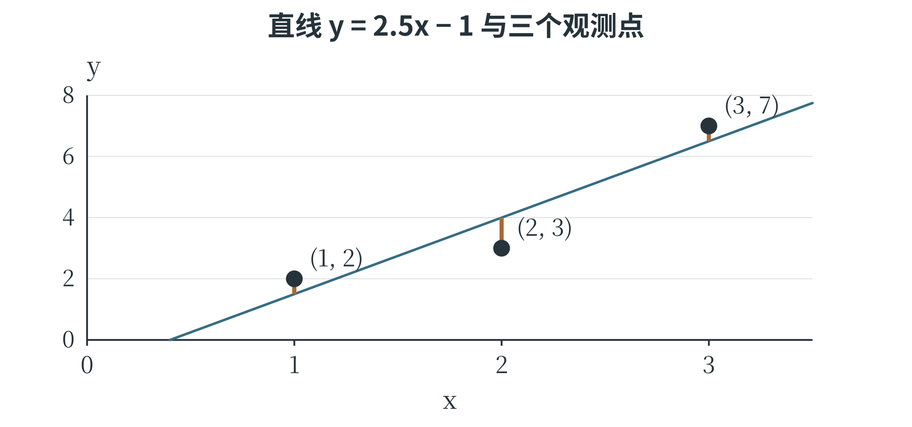

图 6-1 最小二乘比较的是同一输入位置上的输出差

图中的短线沿纵向连接预测与观测，表示每条误差。中间的点位于直线下方，两端的点位于直线上方，直线在三条记录之间取得折中。如果改用 $\hat y=2x$，误差为 0、1、$-1$，MSE 为 $2/3$，比 0.5 大。虽然这条备选直线恰好经过第一条记录，却没有在整批数据上得到更小的平方误差。

可以用一个小函数计算任意给定参数的损失。这里让模型参数成为函数的输入，训练数据固定在列表中，便于观察“换一条直线”对结果的影响。

```python
samples = [(1.0, 2.0), (2.0, 3.0), (3.0, 7.0)]
def line_loss(w, b):
    total = 0.0
    for x, y in samples:
        prediction = w * x + b
        total += (prediction - y) ** 2
    return total / len(samples)

print(line_loss(2.5, -1.0))  # 0.5
print(round(line_loss(2.0, 0.0), 4))  # 0.6667
```

计算出最优直线以后，仍要用未参与拟合的记录评价预测。三条训练记录说明了如何确定参数，却不能单独证明这条关系适用于更大范围。一个模型的拟合过程与它在新数据上的可信程度，需要分别检查。

### 多项式让图像能够弯曲

一条直线每向右走相同距离，预测变化量都相同。如果散点明显呈弯曲趋势，可以增加 $x^2$、$x^3$ 等特征，得到**多项式回归**。二次形式为 $\hat{y}=a_2x^2+a_1x+b$。例如，模型 $\hat{y}=x^2+1$ 在输入 1、2、3 时分别输出 2、5、10，第三章中的抛物线因此直接成为一种预测曲线。虽然输出相对于原输入 $x$ 是弯曲的，模型对参数 $a_2$、$a_1$、$b$ 仍是加权相加，没有把参数平方或相乘。因此，可以先把原输入变成 $(x,x^2)$ 两个特征，再用线性回归学习这些特征的权重。“线性”在模型讨论中有时是相对于参数而言，不能只凭图像是否弯曲判断。

多个输入也可以构造交互项，例如 $x_1x_2$。它表示一个特征的影响随另一个特征而变化。多变量多项式中，一项的次数是各变量指数之和：$x_1x_2$ 是二次项，$x_1^2x_2$ 是三次项。增加这些项会让模型更加灵活，也会增加待学习参数；不能因为原始特征只有两个，就认为模型一定简单。

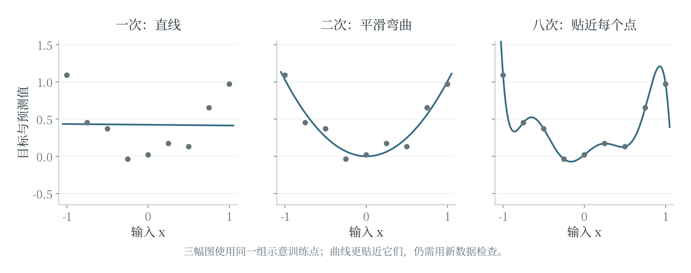

图 6-2 更灵活的曲线可以贴近训练点，也可能把测量波动当作规律

提高次数通常能降低同一训练集上的最小平方误差，却未必改善新数据预测。图 6-2 中，过分曲折的曲线迎合了训练点的细小波动，在点与点之间或观察范围之外可能变化很大。在训练数据覆盖范围之外作预测称为**外推**，此时模型依靠的是从已有范围延伸出的假设，应结合实际规律和新数据评价。第 6.7 节将进一步讨论模型复杂度怎样影响泛化。

## 6.2 常见分类算法

### 先形成分数，再决定类别

分类模型最终要输出类别，但内部可以先计算一个或多个分数。把输入变成分类分数的函数，常称为**决策函数**。例如，$g(x_1,x_2)=2x_1-x_2-1$，规定 $g\geq0$ 时判为甲类，否则判为乙类。输入 $(2,1)$ 时，分数为 2，输出甲类；输入 $(0,1)$ 时，分数为 $-2$，输出乙类。两类之间满足 $g=0$ 的位置构成**决策边界**。在这个二维例子中，它是一条直线。边界两侧用不同类别表示，分数大小与类别判定因此相关，但分数本身不是概率。

损失函数和决策函数的用途不同：前者评价预测与目标的差距，帮助训练；后者利用输入给出分类依据。不同模型可以用不同方式构成边界。

### K 近邻参考周围的样本

**K 近邻算法**，简称 KNN，对一个新样本先计算它到训练样本的距离，找出最近的 $K$ 个，再由这些邻居决定结果。用于分类时，最简单的办法是让邻居按标签投票；用于回归时，则可以对邻居目标值取平均。字母 $K$ 指采用多少个邻居，是需要选择的超参数。例如，二维特征空间中有三个训练样本：甲类 $(1,1)$、甲类 $(2,1)$、乙类 $(4,4)$。新样本为 $(2,2)$，它到三点的距离分别为 $\sqrt{2}$、1、$\sqrt{8}$。取 $K=1$，最近邻为 $(2,1)$，判为甲类；取 $K=3$，三票中甲类有两票，仍判为甲类。若再增加不同位置的训练点，或改变 $K$，结果就可能变化。

KNN 把训练样本保留下来供预测时参考，通常不需要先拟合一条显式直线。它的边界由样本位置、距离规则和邻居数共同决定。

$K$ 太小，判断容易受个别异常点影响；$K$ 太大，则可能让较远的大类别盖过近处的局部规律。距离还受特征尺度影响，长度和编号随意混在一起就可能误导邻居选择。

出现票数相同时，需要使用事先确定的规则，不能假定每次一定有唯一多数。

### 邻居数改变时，判断怎样变化

取待判断点 $q=(3,3)$。附近有一个乙类点 $(3.2,3)$，距离仅为 0.2；另有两个甲类点 $(2,3)$、$(3,2)$，距离都是 1。更远处还有甲类 $(1,1)$ 和乙类 $(5,5)$。取一个最近邻，q 被判为乙类；取三个最近邻，两票甲、一票乙，q 被判为甲类。图 6-3 标出样本位置，并列出两次判断的票数。

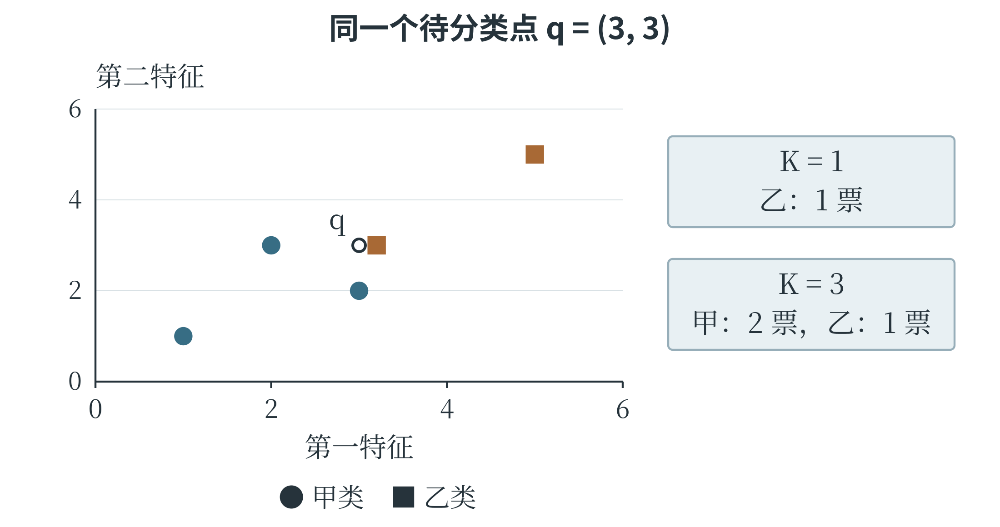

图 6-3 K 决定哪些邻居参与判断

最近的乙类点可能是真实的局部结构，也可能是一条少见记录。仅凭这张图，不能断言哪一个 K 一定更好；需要在代表实际使用条件的验证资料上比较。下面用普通 Python 列表实现这个例子的分类。距离只用于排序，因此可以直接比较距离的平方，省去开平方；对非负数，平方根保持大小顺序。程序把每条距离与标签配成元组，排序后取前 K 项，再统计票数。

```python
training = [(3.2, 3.0, "乙"), (2.0, 3.0, "甲"),
            (3.0, 2.0, "甲"), (1.0, 1.0, "甲"),
            (5.0, 5.0, "乙")]
def neighbor_vote(point, k):
    distances = []
    for x1, x2, label in training:
        d2 = (point[0] - x1) ** 2
        d2 += (point[1] - x2) ** 2
        distances.append((d2, label))
    distances.sort(key=lambda item: item[0])
    counts = {}
    for d2, label in distances[:k]:
        counts[label] = counts.get(label, 0) + 1
    return max(counts, key=counts.get)

print(neighbor_vote((3.0, 3.0), 1))  # 乙
print(neighbor_vote((3.0, 3.0), 3))  # 甲
```

本例约定 K 为 1 到训练样本数之间的整数。票数相同的类别在这里按最早进入计数字典的先后决定，也就是优先采用已选邻居中更早出现的类别；这个例子的两次调用都没有出现平票。程序给出了明确的执行规则，但实际工具可以采用不同规则。理解算法时，需要把距离、邻居选择、投票和并列处理分别看清楚。

### 决策树把判断组织成分支

**决策树**用一连串条件把样本逐步分开。根结点给出第一次判断，分支指向不同结果，内部结点继续判断，叶结点给出预测类别或类别分布。例如，先问叶长是否小于 5 厘米，再在其中一侧按叶宽划分，每条从根到叶的路径就是一组同时满足的条件。预测时只需沿条件走到相应叶结点。树的结构可以从训练数据中学习。设按长度排序的六个样本，前三个标签为甲、后三个为乙，在第三与第四个长度之间设阈值，就能把两类完全分开。若一次划分后各组仍混有许多类别，则区分能力较弱。训练算法会比较候选特征和阈值，选择能让子组更集中于某些类别的划分。

衡量混杂程度的一种方法是**基尼不纯度**。若一个结点中各类占比分别为 $p_1,p_2,\ldots$，其值为 $1-\sum_jp_j^2$。两类各一半时为 $1-0.5^2-0.5^2=0.5$；全为同一类时为零。比较划分时，要按子结点样本数加权，不能让只有一个样本的小组与几十个样本的大组拥有同等影响。另一种常用指标叫信息熵，同样用于反映类别混杂程度。

树可以继续分支，直到叶结点足够纯，或者达到最大深度、最少样本数等限制。分得太细，甚至为个别错误标签专设分支，训练准确率可能很高，面对新样本却未必可靠。限制最大深度或增加叶结点最少样本数，就是控制复杂度的常见办法。

### 一次树划分怎样比较好坏

设六个样本的长度依次为 1、2、3、4、5、6，标签依次为甲、甲、乙、乙、乙、甲。划分前两类各占一半，基尼不纯度为 0.5。先试着在 2 与 3 之间划分：左边两条都是甲，不纯度为 0；右边四条中三乙一甲，不纯度为 $1-(3/4)^2-(1/4)^2=3/8$。按样本数加权后为：

$$
\frac{2}{6}\times0+\frac{4}{6}\times\frac{3}{8}=\frac{1}{4}
$$

再试着在 3 与 4 之间划分：左边两甲一乙，右边一甲两乙，每边的不纯度都是 $1-(2/3)^2-(1/3)^2=4/9$，加权后仍为 $4/9$。两种候选都让混杂程度有所下降，但第一种下降更多，因此在这两种方案中优先选择第一种。这里比较的是划分后的整体混杂程度，小组与大组按样本数分配权重。

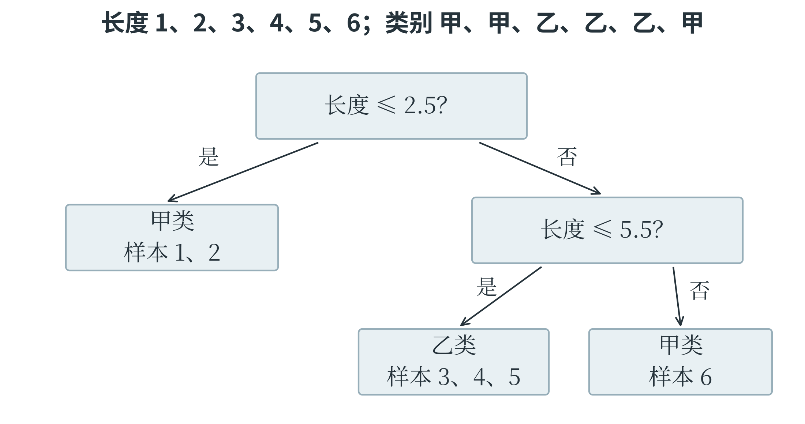

图 6-4 一条从根到叶的路径对应一组判断条件

第一种划分右侧仍有甲乙混合，可以继续在 5 与 6 之间设阈值。这样得到三个叶结点：长度不大于 2.5 时判甲；长度大于 2.5、且不大于 5.5 时判乙；长度大于 5.5 时判甲。新样本长度为 4.2，会先走右分支，再走左分支，落到乙类叶结点。训练时要比较许多候选划分，预测时则只沿一条路径走，这两种工作量也不同。若某个叶结点里仍有多类样本，可以按多数类别输出，也可以保留各类别比例。例如，两甲一乙的叶结点，可以输出甲类，并把 $2/3$ 作为该叶结点内的甲类比例。这个比例依赖到达此处的训练样本；样本很少时，比例也可能不稳定。增加叶结点所需的最少样本数，就是避免树仅凭极少数记录作过细区分的一种方式。

### 支持向量机寻找有间隔的边界

**支持向量机**，简称 SVM，在一种基本的二分类情形中，寻找能够分开两类、并使两侧最近样本到边界的间隔尽量大的边界。二维中的线性边界是一条直线，三维中是平面，更高维中常称为超平面。靠近边界、对边界位置起关键作用的样本称为支持向量。两条直线都能把训练样本分开时，其中一条若紧贴某几个样本，轻微测量变化就可能把它们推到另一侧；另一条留出较大间隔，通常更有余地。这是最大间隔思想的直观出发点。真实数据常有重叠和噪声，SVM 可以允许部分样本进入间隔甚至被误分，同时惩罚这些违反要求的情况，称为软间隔。

常见超参数 $C$ 调节违反间隔要求的惩罚强度。其他条件相同时，较大的 $C$ 更强调减少这些违反情况，较小的 $C$ 更容许一定误差来换取较宽松的边界。它并不是越大越好，仍应根据验证结果选择。非线性 SVM 可以使用**核函数**，以计算相似性的方式表达更复杂的特征关系，使原始空间中的边界能够弯曲；核函数不是标签规则，也不是卷积核。

KNN 参考邻居，决策树逐条判断，SVM 比较边界与间隔。它们都能完成分类，却具有不同的假设和计算特点。模型选择需要结合数据规模、特征表示、是否需要解释以及验证表现，不能仅凭名称新旧决定。

### 把间隔画出来

设甲类训练点位于 $(1,1)$、$(1,3)$，乙类训练点位于 $(3,1)$、$(3,3)$。直线 $x_1=1.5$ 能把两类分开，但离左侧甲类只有 0.5；直线 $x_1=2$ 到两侧最近点的距离都为 1。最大间隔的想法，就是在能够正确区分的边界中，尽量扩大最近样本留出的空间。

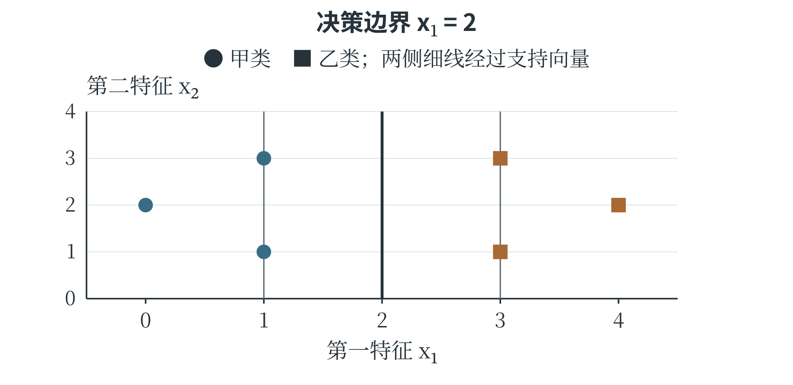

图 6-5 边界位置由靠近它的样本限制

图 6-5 的中间线是决策边界，左右两条平行线经过最近样本，表示间隔边缘。在这个对称例子中，四个点都限制了可留出的空间；若再加入位于 $(0,2)$ 的甲类点和 $(4,2)$ 的乙类点，它们离边界更远，不会要求把边界挪开。支持向量中的“支持”，便可以理解为这些关键样本对边界位置的约束作用。

若在右侧出现一个甲类点，所有点可能无法再被一条直线完全分开。软间隔允许适当违反间隔要求，同时把这些违反计入训练目标。是否为了一个异常点大幅弯曲或移动边界，需要与整体拟合和复杂度一并考虑。

## 6.3 聚类与 K-means

### 用中心代表一组数据

**K-means**，中文常称 K 均值聚类，希望把数据分成 $K$ 个簇，使同一簇中的点尽量靠近该簇的中心。这里的 $K$ 是簇的数量，与 KNN 的邻居数量不是同一个意思。每个中心用向量表示，对应分量通常取该簇样本的平均值，因此称为均值。以一维数据 1、2、8、9 为例，希望分成两簇。若先把中心放在 1 和 8，每个样本寻找较近的中心，把 1、2 分入第一簇，把 8、9 分入第二簇。随后重算中心，分别得到 1.5 和 8.5。按新中心重新分配样本，分组不再改变，这次迭代便达到稳定结果。在二维中，只需将每个点到中心的距离换成二维欧氏距离，中心的横、纵坐标分别求平均。

常见算法反复交替做两件事：固定中心，将样本分给最近的中心；固定分组，将中心移到该组的均值。每次完整的“分配—更新”称为一轮**迭代**。停止条件可以是分组不再变化、中心移动小于规定值，或已经达到最大迭代次数。距离相同的样本和没有分到样本的空簇，需要实现中的相应处理规则。

K-means 的目标常写成各点到所属中心的距离平方之和。若 $c_i$ 表示第 $i$ 个样本所属簇的编号，$\mu_{c_i}$ 表示该簇中心，则：

$$
J=\sum_{i=1}^{n}\|x_i-\mu_{c_i}\|^2
$$

两条竖线在这里表示向量的欧氏长度，所以 $\|x_i-\mu_{c_i}\|^2$ 就是各分量之差的平方和。这个目标鼓励簇内紧凑。分配步骤选择最近中心，不会让当前样本的这项距离变大；更新步骤取均值，则使给定簇内的平方距离和最小。两步交替改进同一个目标，但不保证找到所有可能分组中的全局最优方案。

### 观察一个真正改变分组的迭代过程

为了看清反复分配的作用，使用一维数据 1、2、3、8、9，设 K 为 2，初始中心为 1 和 4。第一次按最近中心分组，1、2 进入第一簇，3、8、9 进入第二簇。更新均值后，中心变为 1.5 和 $20/3$，约为 6.67。此时重新检查样本 3：到第一个中心的距离为 1.5，到第二个中心约为 3.67，于是它改入第一簇。第二次更新，第一簇 1、2、3 的中心为 2，第二簇 8、9 的中心为 8.5。再次分配时，所有样本保持原簇，算法达到稳定结果。图 6-6 使用同一条数轴，圆点表示样本，较大的十字表示中心；中心可以落在没有样本的位置，因为它由均值决定，不要求一定选取某条原始记录。

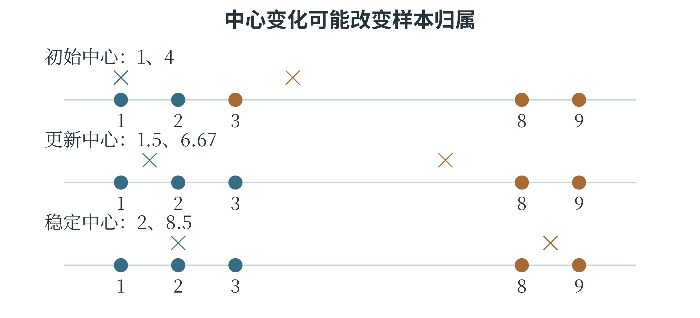

图 6-6 中心移动后，样本可能需要重新选择所属簇

最后的目标值为 $(1-2)^2+(2-2)^2+(3-2)^2+(8-8.5)^2+(9-8.5)^2=2.5$。如果只执行第一次分配而不更新中心，就没有完成 K-means 的迭代。若只更新一次就停止，也会保留一个已经不符合“各点选最近中心”的旧分组。

下面的程序按相同步骤计算。`groups` 保存当前分组，`centers` 保存当前中心；两个列表属于不同层次，更新时先完成整批分配，再同时计算新的中心。

```python
points = [1.0, 2.0, 3.0, 8.0, 9.0]
centers = [1.0, 4.0]
for iteration in range(10):
    groups = [[], []]
    for value in points:
        label = min(range(2),
                    key=lambda j: (value - centers[j]) ** 2)
        groups[label].append(value)
    updated = []
    for j in range(2):
        if groups[j]:
            updated.append(sum(groups[j]) / len(groups[j]))
        else:
            updated.append(centers[j])
    if updated == centers:
        break
    centers = updated
print(groups)   # [[1.0, 2.0, 3.0], [8.0, 9.0]]
print(centers)  # [2.0, 8.5]
```

这个数值例子在稳定后得到完全相同的中心，所以直接比较列表即可。实际工具常用容许误差来判断中心移动是否足够小。程序还约定空簇暂时保留旧中心，距离并列时优先选编号较小的中心；本例中未出现空簇。不同实现可以采用其他处理办法，理解一个具体过程时应按给定规则推演。

### 初始中心与簇数的影响

初始中心不同，算法可能得到不同结果。一种常见改进是 K-means++，它让初始中心更有机会分散在数据的不同区域；还可以用多组初始中心分别运行，比较最终目标值。计算机通常用伪随机数来选择这些初始位置，生成过程的起始设置称为**随机种子**。固定种子可以重现相同的选择，便于比较算法；尝试多个起点，则有机会找到更好的分组。

簇数增多，簇内平方距离通常能减小；极端情况下，每个样本单独成簇，距离可以为零。这并不意味着分组最有用。选择 $K$ 需要结合任务、数据规模和分组可解释性，也可以观察增加簇数后误差下降是否明显放缓。不能只按训练目标越来越小，就一路增加簇数。K-means 偏好能由中心和欧氏距离较好描述的紧凑簇。若数据是互相套着的环，或不同簇的疏密差别很大，按最近中心分组可能不合适。异常点还可能把均值中心拉偏，特征尺度也会改变距离。

## 6.4 概率建模与统计推断

### 从数据推测未知规律

第三章在已知概率条件下计算事件发生的可能性。实际建模常要反过来：观察了一批结果，希望推测产生这些结果的概率或参数。根据样本对未知总体或规律作出推断，称为**统计推断**。推断依靠数据，也依靠假设；假设与数据产生过程不符时，计算再准确也可能回答了错误的问题。例如，一枚硬币的正面概率未知，用 $p$ 表示。假设各次投掷相互独立，且正面概率保持不变，观察到四次结果依次为“正、正、正、反”。如果暂取 $p=0.5$，这串结果出现的概率是 $0.5^3\times0.5=0.0625$；若取 $p=0.75$，概率是 $0.75^3\times0.25\approx0.1055$。后一个参数使已观察到的结果更容易出现。

### 最大似然估计

把数据固定，比较不同参数使这份数据出现的可能性，这个关于参数的函数称为**似然函数**。对上面的具体结果序列，似然为 $L(p)=p^3(1-p)$。选择使似然最大的参数，称为**最大似然估计**。在这个例子中，最大值出现在 $p=3/4$，恰好等于正面次数除以总次数。

同一个式子，计算角度发生了变化：概率问题是“给定参数，结果有多可能”；似然问题是“已经看到结果，哪个参数更能解释它”。似然不是参数本身的概率分布，不能把 $L(0.75)\approx0.1055$ 解释为“正面概率等于 0.75 的概率是 10.55%”。

若只记录四次中出现三次正面，不区分先后，似然还要乘组合数 4，但这个因子与 $p$ 无关，不影响使它最大的参数。

最大似然给出的是基于这份数据的估计。只投四次，估计可能很不稳定；即使四次都是正面，估计为 1，也不能据此证明反面永远不会出现。增加符合条件的观测，通常能够提供更多信息。

计算似然时，取对数可以把相乘变成相加，由于对数在正数范围内保持大小顺序，最大化正似然与最大化对数似然得到相同的最优参数。这使很多概率模型更便于计算。最小二乘与最大似然并非毫无联系。在假设数值误差相互独立、服从均值为零且方差相同的正态分布时，寻找预测模型参数的最大似然解，可以转化为最小化误差平方和。这里的联系依赖具体的误差模型，并不表示所有最大似然问题都是最小二乘问题。

### 用曲线区分似然与概率

把 $p$ 从 0 到 1 依次代入 $L(p)=p^3(1-p)$，可以画出图 6-7。横轴表示正在尝试的参数值，纵轴表示这份固定观测序列在该参数下的似然。$p$ 为 0 或 1 时，似然都为零：前者不允许出现正面，后者不允许出现反面，而这份资料恰好两者都有。

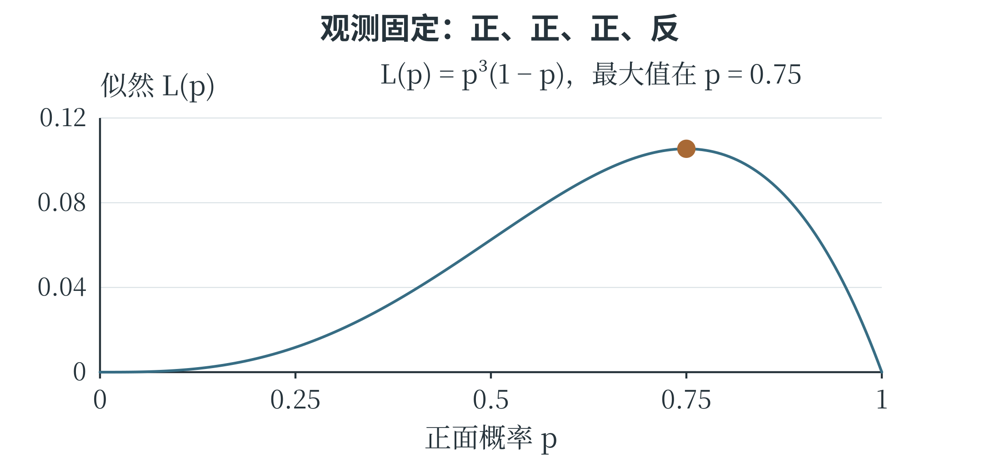

图 6-7 数据固定以后，可以比较不同参数的解释能力

取 $p=0.25$，似然约为 0.0117；取 0.5，似然为 0.0625；取 0.75，约为 0.1055；再提高到 0.9，似然下降到 0.0729。参数并非越大越好，因为记录中还有一次反面。曲线的最高点表示对当前记录最有利的参数，并不是“最可能出现的下一次投掷结果”。下一次的结果只有正、反两个，而参数是一种描述产生结果的规则。

可以先用一组候选值进行数值比较：

```python
candidates = [i / 20 for i in range(21)]
def likelihood(p):
    return p ** 3 * (1 - p)
best = max(candidates, key=likelihood)
print(best)  # 0.75
```

程序只比较列出的 21 个候选，说明其中 0.75 最好；连续区间上的最大值还需要进一步的数学依据，第 6.6 节会用导数验证。离散候选搜索与连续求解在这里相互配合，不能把“试过的里面最好”直接当成任何问题中的全局最优证明。

### 贝叶斯定理怎样更新判断

最大似然着重比较数据在不同参数下的可能性。**贝叶斯方法**还把观察前已有的判断与新证据结合起来。第三章的条件概率说明，$P(A\mid B)$ 与 $P(B\mid A)$ 的条件位置不同；贝叶斯定理给出两者之间的关系，在 $P(B)>0$ 时：

$$
P(A\mid B)=\frac{P(B\mid A)P(A)}{P(B)}
$$

$P(A)$ 是看到证据 B 之前 A 的概率，称为**先验概率**；$P(A\mid B)$ 是看到 B 之后的条件概率，称为**后验概率**；$P(B\mid A)$ 说明如果 A 成立，证据 B 有多大可能出现。分母 $P(B)$ 对结果进行归一化，使后验概率具有正确的总量。继续看图片识别。假设一批图片中猫占 20%，非猫占 80%；模型将猫判成“猫”的比例为 90%，将非猫误判成“猫”的比例为 10%。从这批图片中等可能抽取一张，设 A 表示实际是猫，B 表示模型判为猫。B 可以通过两条互斥途径发生：猫被正确识别，或者非猫被误识别。因此：

$$
P(B)=0.9\times0.2+0.1\times0.8=0.26
$$

$$
P(A\mid B)=\frac{0.9\times0.2}{0.26}\approx69.2\%
$$

这与从 100 张图片中数出 18 张正确识别、8 张误识别，再算 $18/26$ 是同一个道理。即使模型识别猫的能力保持不变，若换到猫极少的一批图片，被判为猫的结果中，误报占比也可能更高。先验比例与识别能力一起影响后验判断。贝叶斯定理是概率关系，本身不会保证输入的概率可靠。先验可能来自历史统计或领域知识，识别率也应来自适当评价；使用条件改变后，需要重新检查它们是否仍然适用。

### 新证据怎样接着修正旧判断

贝叶斯更新还可以连续进行。假设袋中有两种可能的硬币，实际拿到哪一种尚不知道。甲硬币的正面概率为 0.5，乙硬币为 0.75；取到两种硬币的先验概率各为 0.5。我们选定一枚后连续投掷，假设在硬币种类确定的条件下，各次结果相互独立。第一次出现正面。对于“拿到甲且投出正面”，概率为 $0.5\times0.5=0.25$；对于“拿到乙且投出正面”，概率为 $0.5\times0.75=0.375$。二者加起来为 0.625，所以看到这个正面以后，拿到乙的后验概率为 $0.375/0.625=0.6$，拿到甲的后验概率为 0.4。正面更符合乙的特点，判断便向乙移动了一些。

第二次又是正面。此时把刚得到的 0.4、0.6 当作更新前的判断，分别乘两种硬币出现正面的概率，得到 0.2、0.45，再除以总和 0.65。拿到乙的后验概率变为 $0.45/0.65=9/13$，约为 69.2%。如果把两次正面一起计算，也会得到同样的结果：

$$
P(\text{乙}\mid\text{两次正面})
=\frac{0.5\times0.75^2}{0.5\times0.5^2+0.5\times0.75^2}
=\frac{9}{13}.
$$

现在第三次出现反面。甲硬币出反面的概率为 0.5，乙为 0.25，这个证据更有利于甲。把前一步的后验再次更新，乙的概率成为

$$
\frac{(9/13)\times0.25}{(4/13)\times0.5+(9/13)\times0.25}
=\frac{9}{17}\approx52.9\%.
$$

表 6-2 同一枚硬币的连续观测与判断

| 已观察结果 | 拿到甲的概率 | 拿到乙的概率 |
| --- | --- | --- |
| 尚未投掷 | 1/2 | 1/2 |
| 正 | 2/5 | 3/5 |
| 正、正 | 4/13 | 9/13 |
| 正、正、反 | 8/17 | 9/17 |

新证据也可能让原先较强的判断回落。

每一步更新都保留已经看过的材料，再结合新材料作调整。“乙的概率为 9/17”仍然是在这两种候选硬币与给定先验下的判断；如果袋中还可能有第三种硬币，模型就应把它也纳入比较。

## 6.5 神经元与多层感知机

### 一个神经元的两步计算

人工神经网络由许多简单计算单元连接而成，这些单元称为**人工神经元**。它借用了生物神经系统中连接与传递的思想，但计算方式是数学模型，并不等于复制了真实神经细胞。一个常见神经元先对输入加权求和并加上偏置，再通过一个函数产生输出：

$$
z=w_1x_1+w_2x_2+\cdots+w_dx_d+b,\qquad h=f(z)
$$

$d$ 是输入特征数，$z$ 是加权结果，$f$ 称为**激活函数**，$h$ 是该神经元的输出。激活函数规定加权结果怎样转换为下一层可用的数值。例如，阈值函数可以规定 $z\geq0$ 时输出 1，否则输出 0。这种神经元能够表示一个简单的分类边界。下标从 1 到 $d$，表示对所有输入特征分别乘权重，再把结果相加；末尾的偏置只加一次。取 $w_1=2$、$w_2=-1$、$b=-1$，输入 $(2,1)$ 时，$z=2\times2-1-1=2$，阈值输出为 1。输入 $(0,1)$ 时，$z=-2$，输出为 0。权重不是输入本身，偏置也不对应额外测量值；它们决定计算规则，可以在训练中改变。

常见的 **Sigmoid 函数**写为 $\sigma(z)=1/(1+e^{-z})$，把实数平滑地映射到 0 与 1 之间。输入为零时输出 0.5，输入 2 时约为 0.881，输入 $-2$ 时约为 0.119。它常用于二分类网络的输出，形成概率估计。函数形状和后续训练使这种估计成为可能，但仍需用数据检查它是否与实际发生频率相符。

**ReLU 函数**更简单，写为 $f(z)=\max(0,z)$：负数输出零，非负数原样输出。例如，输入 $-2$、0、3，输出分别为 0、0、3。ReLU 常用于隐藏层，它不会把正输出压到 1 以下。

神经元的输出并不总是 0 或 1。它输出什么，取决于所用的激活函数。

### 在同一条数轴上比较激活函数

Sigmoid 与 ReLU 接收的都是加权结果，但输出形状很不一样。图 6-8 中，Sigmoid 从靠近 0 的一侧平滑上升，在输入 0 处经过 0.5，随后逐渐接近 1；ReLU 在负数一侧贴着横轴，正数一侧沿斜率为 1 的直线继续增长。

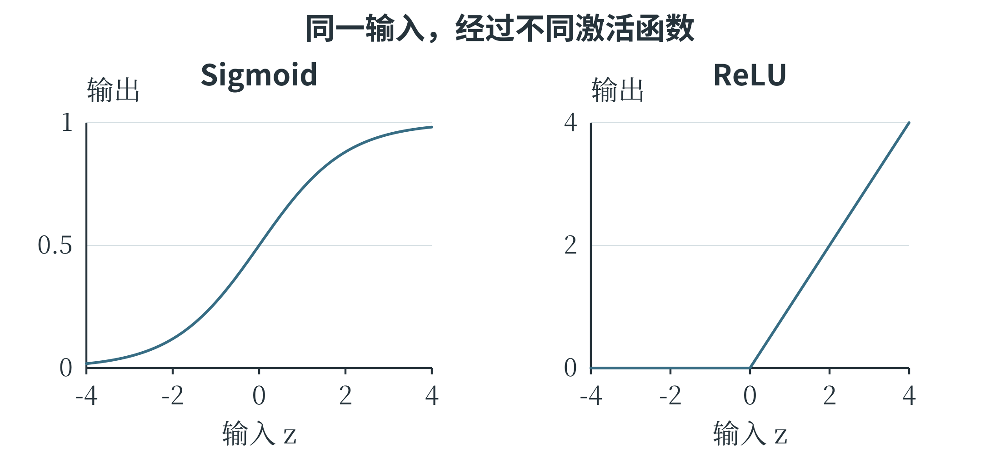

图 6-8 激活函数决定加权结果怎样交给下一步

例如，输入从 2 增加到 3，ReLU 输出增加 1，Sigmoid 输出只从约 0.881 增至约 0.953。Sigmoid 在两端比较平缓，输入改变较多，输出也可能只变一点；ReLU 在正数区间保持直接的数值变化。

```python
import math
for z in [-2.0, 0.0, 2.0]:
    sigmoid = 1 / (1 + math.exp(-z))
    relu = max(0.0, z)
    print(z, round(sigmoid, 3), relu)
# -2.0 0.119 0.0
#  0.0 0.500 0.0
#  2.0 0.881 2.0
```

这里的数字按三位小数说明近似值，`print()` 实际显示 0.5 时可能不保留末尾的零。若使用概率输出，仍需结合训练目标和数据检查结果；一个值落在 0 与 1 之间，本身不足以说明它已经具有可靠的概率意义。

### 让上一层的输出成为下一层的输入

神经网络中，**输入层**接收特征，**隐藏层**形成中间表示，**输出层**产生最终预测。具有一个或多个隐藏层、相邻层之间常采用全连接方式的前馈网络，称为**多层感知机**，简称 MLP。“前馈”表示本次计算按输入到输出的方向推进；“全连接”表示后一层的每个神经元接收前一层所有单元的输出。图 6-9 给出一个可以手算的两输入网络。隐藏层有两个采用 ReLU 的神经元，分别计算 $h_1=\max(0,x_1+x_2-1)$、$h_2=\max(0,x_1-x_2)$；输出层先算 $s=h_1-2h_2$，再规定 $s\geq0.5$ 时输出 1，否则输出 0。这些权重与阈值是为说明逐层计算而给定的，尚未涉及训练。

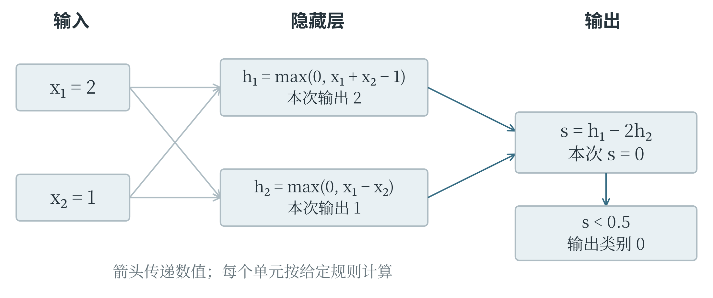

图 6-9 每一层先完成自己的运算，再把结果传给下一层

输入 $(2,1)$ 时，$h_1=2$、$h_2=1$，所以 $s=0$，最终输出 0。输入 $(1,2)$ 时，$h_1=2$、$h_2=0$，所以 $s=2$，最终输出 1。两个样本的特征总和都是 3，第一个隐藏单元输出相同；第二个隐藏单元保留了二者的另一种差别，输出层于是能作出不同判断。中间表示如何组织信息，在这个例子中可以逐项看清。

```python
def network(x1, x2):
    h1 = max(0, x1 + x2 - 1)
    h2 = max(0, x1 - x2)
    score = h1 - 2 * h2
    return int(score >= 0.5)

print(network(2, 1))
print(network(1, 2))
```

激活函数为什么重要，可以从连续两层都只做加权相加来看。第一层若算 $h=2x+1$，第二层算 $y=3h-4$，合起来仍是 $y=6x-1$。层数增加了，函数形式仍然是直线。一般地，只有线性变换和偏置的多层网络，可以合成一个同类变换；非线性激活让网络能够表示更复杂的关系。层数、每层的单元数量和激活函数，因此共同影响模型能够表达什么。每层的单元数量也常称为该层的**宽度**。利用较多层神经网络学习数据表示的方法，通常归入**深度学习**。它属于机器学习，机器学习又是人工智能的重要研究方向。神经网络的范围并不只包含深层网络，一个很浅的网络也可以用于学习；是否称为“深度”，没有对所有场合通用的简单层数分界。

### 隐藏层怎样表示一个弯折的判断

一个经典的小例子是“恰好有一项成立”。输入 $x_1$、$x_2$ 各取 0 或 1，只有 $(1,0)$ 和 $(0,1)$ 输出 1，$(0,0)$ 与 $(1,1)$ 输出 0。这称为**异或**关系，含义与第三章讨论的“恰好满足一个条件”一致。在平面中，两类点交错位于正方形对角，无法用一条直线完全分开。

可以用两个隐藏单元分别计算两个方向的差：

$$
h_1=\max(0,x_1-x_2),\qquad
h_2=\max(0,x_2-x_1)
$$

输出层把 $h_1+h_2$ 相加，规定不小于 0.5 时输出 1。四种输入的计算如下。

表 6-3 两个隐藏单元表示异或关系

| 输入 | h₁ | h₂ | 最终类别 |
| --- | --- | --- | --- |
| (0,0) | 0 | 0 | 0 |
| (1,0) | 1 | 0 | 1 |
| (0,1) | 0 | 1 | 1 |
| (1,1) | 0 | 0 | 0 |

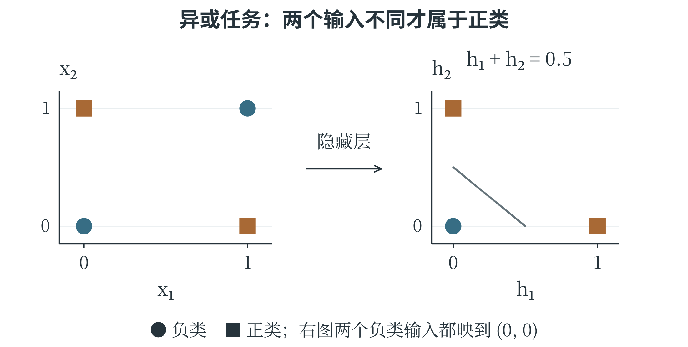

图 6-10 隐藏层把原来的输入转换成便于后续判断的表示

两个输入相同时，两项差都不能留下正值；只有第一项较大时，第一隐藏单元响应；只有第二项较大时，第二隐藏单元响应。输出层再把两种情况合在一起。

这组参数说明，网络能够表示异或关系。怎样从样本中学到合适的参数，则是训练要解决的问题。

```python
def xor_network(x1, x2):
    h1 = max(0, x1 - x2)
    h2 = max(0, x2 - x1)
    return int(h1 + h2 >= 0.5)

for point in [(0, 0), (1, 0), (0, 1), (1, 1)]:
    print(point, xor_network(*point))
```

调用里的 `*point` 把元组的两项按位置交给两个参数，这里也可以写成 `xor_network(point[0], point[1])`。把模型写成函数后，输入、隐藏层结果与最终类别都可以单独检查。复杂网络虽然有更多单元，前向计算仍由这些有明确输入输出的步骤组成。

### 从前向计算到训练

按当前参数逐层得到预测，称为**前向传播**。训练时还要计算损失，再确定每个参数怎样调整，才能减小损失。**反向传播**依据求导规则，从输出端逐层计算损失对各参数的变化率；**优化器**再利用这些变化率更新参数。

反向传播计算梯度，优化器使用梯度来改参数。这是训练中前后衔接的两步。

网络输出形式要与任务匹配。回归可以输出一个不受 0—1 限制的数；二分类可以用一个 Sigmoid 输出；多个互斥类别可以输出多个分数，再用 Softmax 转成相加为 1 的概率分布。Softmax 的第 $j$ 个输出为 $e^{z_j}/\sum_ke^{z_k}$，其中 $z_j$ 是这一类的原始分数。若两个分数都是零，输出各为 0.5；分数较大的一类得到较大的份额。它与每个位置单独使用 Sigmoid 的方式不同。

一个网络的权重和偏置通常在训练开始时初始化，再随数据更新。隐藏层宽度、层数、学习率等属于超参数。训练需要成批数据、明确的目标和足够计算资源；把网络图画得更深，并不会自动提高泛化能力。

## 6.6 极限、导数与梯度下降

### 从一段变化到一点附近的变化

一次函数 $y=2x+1$ 的输入增加 1，输出就增加 2，变化率始终相同。二次函数 $f(x)=x^2$ 则不同：从 1 到 2，平均变化率为 $(4-1)/(2-1)=3$；从 2 到 3，平均变化率为 5。所谓**平均变化率**，就是一段范围内输出改变量除以输入改变量，在图像上对应两点连线的斜率。

若希望知道 $x=2$ 附近变化得有多快，可以把另一个点逐渐靠近它。设输入从 2 变为 $2+h$，其中 $h\ne0$，平均变化率为：

$$
\frac{(2+h)^2-2^2}{h}=\frac{4h+h^2}{h}=4+h
$$

$h$ 取 1、0.1、0.01 时，结果分别为 5、4.1、4.01；取 $-0.1$、$-0.01$ 时，结果为 3.9、3.99。无论从哪一侧靠近，$h$ 越接近零，$4+h$ 就越接近 4。描述这种“无限靠近时趋向哪里”的概念，称为**极限**。这里先保持 $h$ 非零完成计算，再研究它趋近零时的结果，并不是直接把分母设为零。如果一个函数在某点的这种平均变化率趋向一个确定的数，就称这个数为函数在该点的**导数**，表示该点的瞬时变化率。$f(x)$ 的导数常记为 $f'(x)$，也可记为 $\mathrm{d}f/\mathrm{d}x$。上面的计算得到 $f'(2)=4$。图 6-11 中，两个点越来越近时，割线的方向逐渐接近切线方向，导数就是这条切线的斜率。

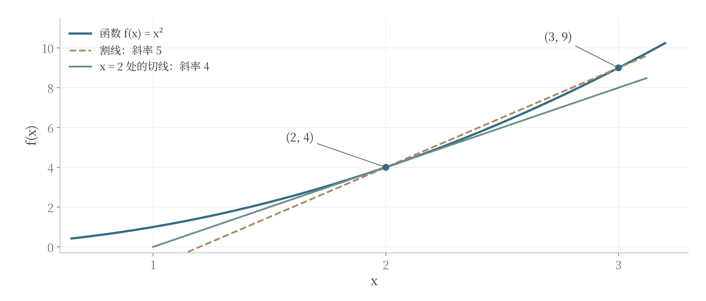

图 6-11 对平方函数，在 x 等于 2 的位置，切线斜率为 4

导数为正，表示函数在该点附近沿输入增大的方向具有上升趋势；导数为负，则具有下降趋势。导数的绝对值越大，局部变化越陡。

导数为零表示该点切线水平，但不能单凭这一点断定它是最小值。例如，$x^2$ 在零处取得最小值，$-x^2$ 在零处取得最大值，两者在零处的导数都是零。有些函数在某点没有导数：ReLU 在零点两侧的斜率分别为 0 和 1，不能得到同一个值。

### 几条常用求导规则

将上面的推导中的 2 换成一般的 $x$，可以得到 $(x^2)'=2x$。多项式各项也有简便规则：常数的导数为零，$x$ 的导数为 1，$x^n$ 的导数为 $nx^{n-1}$，这里 $n$ 为正整数。常数倍可以保留，各项相加减则分别求导后再相加减。因此：

$$
(3x^2-5x+6)'=6x-5
$$

$$
(2x^3+x^2-4x+7)'=6x^2+2x-4
$$

导数本身也是一个函数。想知道第一个多项式在 $x=2$ 处怎样变化，代入导函数得到 $6\times2-5=7$ 即可。$e^x$ 有一个特别的性质：它的导数仍是 $e^x$。若指数内部还有一个随 $x$ 变化的表达式，还要乘上内部表达式的导数，这体现了**链式法则**。例如，$(e^{3x})'=3e^{3x}$，$(e^{-x})'=-e^{-x}$，而不是都原样照抄。再看一个“函数套函数”的例子。对 $(2x+1)^2$，可以先把 $2x+1$ 看成整体，外层平方的变化率是 $2(2x+1)$；内层随 $x$ 变化的速率是 2，两者相乘，得到 $4(2x+1)$。展开为 $4x^2+4x+1$ 后再求导，也得到 $8x+4$。神经网络把多层函数接在一起，反向传播正是沿这些连接应用链式法则，把输出损失对前面各量的影响逐步传回去。

求导也能回过头检验第 6.4 节的最大似然例子。将 $L(p)=p^3(1-p)$ 展开为 $p^3-p^4$，导数为 $3p^2-4p^3=p^2(3-4p)$。在 $0<p<3/4$ 时为正，在 $3/4<p<1$ 时为负，说明似然先上升再下降，因此在 $p=3/4$ 处最大。前面通过数据比例得到的估计，便有了变化率方面的解释。

### 沿着减小损失的方向移动

**梯度下降**利用当前的变化率，向函数值减小的方向调整参数。先看只有一个参数的损失函数 $L(w)=(w-2)^2$。它在 $w=2$ 处最小，导数为 $L'(w)=2(w-2)$。当 $w=0$ 时，导数为 $-4$，说明向增大 $w$ 的方向移动，附近的损失会下降；当 $w=3$ 时，导数为 2，减小 $w$ 则有助于下降。

把每次移动的比例记为 $\eta$，读作 eta，称为**学习率**。一次更新可写为：

$$
w_{\text{新}}=w_{\text{旧}}-\eta L'(w_{\text{旧}})
$$

这里的减号保证沿导数所指上升方向的反方向移动。若初值为零，学习率为 0.1，第一次更新为 $0-0.1\times(-4)=0.4$，损失从 4 降到 2.56；第二次导数为 $2(0.4-2)=-3.2$，更新到 0.72，损失降到 1.6384。每次都要在新的位置重新计算导数，不能始终沿用第一次的 $-4$。

```python
w = 0.0
learning_rate = 0.1
for step in range(3):
    gradient = 2 * (w - 2)
    w = w - learning_rate * gradient
    loss = (w - 2) ** 2
    print(round(w, 4), round(loss, 4))
```

三行结果依次为 `0.4 2.56`、`0.72 1.6384`、`0.976 1.0486`。损失持续下降，但前三步没有立即到达最小点。学习率太小，靠近得慢；太大则可能跨过谷底来回摆动，甚至越走越远。对这个特定的二次函数，若学习率取 1.1，从零出发先到 4.4，再到 $-0.88$，距离最优点反而扩大。这与第四章中调节过猛的反馈现象有相通之处。

### 小步变化怎样检验导数

导数计算可以用很小的有限变化作数值核对。设 $f(x)=(2x+1)^2$，在 $x=1$ 处的导数为 $4(2\times1+1)=12$。这表示输入在 1 附近增加一小段 h 时，输出改变量近似为 $12h$。取 $h=0.01$，预测的改变量为 0.12；直接代入公式，实际改变量为 $3.02^2-3^2=0.1204$，两者已经很接近。差出的 0.0004 从哪里来？把式子展开，实际改变量为 $12h+4h^2$。导数提供其中与 h 成正比的部分，$4h^2$ 则是有限步长下仍存在的差异。当 h 更小时，这一部分相对于 h 也变得更小。

导数描述的是局部变化。把这一步跨得很大，近似就可能不再准确。

程序中可以用相邻两点的差商检查导数公式：

```python
def function_value(x):
    return (2 * x + 1) ** 2

x = 1.0
for h in [0.1, 0.01, 0.001]:
    rate = (function_value(x + h) - function_value(x)) / h
    print(round(rate, 3))
# 12.4
# 12.04
# 12.004
```

这三个数逐步接近 12，与公式求得的导数一致。用有限步长近似导数，称为数值求导的一种方法。它适合帮助理解或核对，但通常不能代替解析求导或反向传播：步长较大时近似较粗，过小时又可能受到浮点舍入的影响；参数很多时，逐个试探还需要大量计算。梯度检查的想法也从这里来。把某一个参数稍稍增加、稍稍减少，观察损失如何变化，再与反向传播给出的偏导比较，可以帮助发现符号或链式法则用错的位置。检查时要固定其他参数，并保证两次计算采用同一批数据，才能把差异归因于正在考察的参数。

### 多个参数形成损失曲面

模型通常不止一个参数。对 $\hat{y}=wx+b$，设训练样本只有两条：输入为 $-1$ 时目标为 $-2$，输入为 1 时目标为 2。它们的均方误差为：

$$
L(w,b)=\frac{(-w+b+2)^2+(w+b-2)^2}{2}=(w-2)^2+b^2
$$

这次横向的两个坐标分别表示权重 $w$ 和偏置 $b$，竖向表示损失 $L$。每一对参数确定一个模型，也确定曲面上的一个点。图 6-12 的曲面呈碗形，最低处为 $(w,b)=(2,0)$。它与“输入 x 对应预测 y”的函数图像不同：这里固定了训练数据，观察的是更换模型参数会怎样改变整体误差。

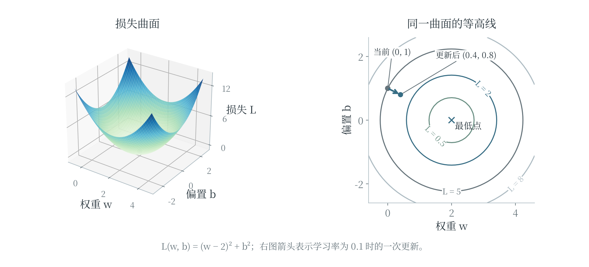

图 6-12 同一损失可以画成曲面或等高线，负梯度指向当前位置下降最快的方向

只改变 $w$、暂时固定 $b$，计算损失的变化率，称为损失对 $w$ 的**偏导数**；同理可以对 $b$ 求偏导。本例得到 $\partial L/\partial w=2(w-2)$、$\partial L/\partial b=2b$。把各参数的偏导按顺序组成向量，就得到**梯度**，记为 $\nabla L$。在 $(0,1)$ 处，梯度为 $(-4,2)$，负梯度为 $(4,-2)$；学习率取 0.1，一次更新便到 $(0.4,0.8)$。**等高线**连接损失相同的参数位置。在曲面光滑、梯度不为零的位置，梯度垂直于该点经过的等高线，指向局部上升最快的方向；负梯度方向局部下降最快。读图时要先看各圈标出的损失高低，再判断箭头方向，不能把“向中心走”当成所有图都适用的规则。

局部下降最快，不保证一直沿此方向就能到达最低处；步长过大，也可能让损失反而上升。

复杂神经网络的损失曲面可能有许多谷地和平坦区域。某些位置各偏导都为零，却不是最低点。用一个简单的曲面函数 $F(u,v)=u^2-v^2$ 说明：在原点，梯度为零，沿 $u$ 轴离开原点时函数值上升，沿 $v$ 轴离开时却下降，这样的位置称为**鞍点**。这说明“梯度接近零”需要结合曲面和训练表现解释。梯度下降是一种有用的优化方法，实际效果仍取决于损失形状、初始化、步长以及数据。

### 把样本、梯度和更新连成一次训练

前面的损失曲面具有很整齐的形式。实际程序常常逐条读取样本，再累加梯度。对线性模型 $\hat y=wx+b$，一条样本的误差为 $e=wx+b-y$，平方损失是 $e^2$。改变 w 会先改变预测，再改变误差和平方，因此由链式法则得到：

$$
\frac{\partial(e^2)}{\partial w}=2ex,\qquad
\frac{\partial(e^2)}{\partial b}=2e
$$

其中 x 来自“预测对权重的变化率”，偏置前的对应变化率则为 1。对于一批 n 条样本，逐条计算这些量后取平均，就得到均方误差的两个偏导：

$$
\frac{\partial L}{\partial w}=\frac{2}{n}\sum_{i=1}^{n}e_i x_i
$$

$$
\frac{\partial L}{\partial b}=\frac{2}{n}\sum_{i=1}^{n}e_i
$$

取训练样本 $(1,2)$、$(2,4)$，初始 $w=0$、$b=0$。两条预测都是零，误差分别为 $-2$、$-4$，MSE 为 10。权重梯度为 $(-2)\times1+(-4)\times2=-10$，偏置梯度为 $-2-4=-6$；这里 $2/n=1$，所以不再另乘系数。学习率取 0.1，两个参数一起更新为：

$$
w=0-0.1\times(-10)=1,\qquad
b=0-0.1\times(-6)=0.6
$$

重新预测，得到 1.6 和 2.6，MSE 降为 $(0.4^2+1.4^2)/2=1.06$。第二次必须从新的参数重新计算，得到权重梯度 $-3.2$、偏置梯度 $-1.8$，再更新到 $w=1.32$、$b=0.78$，MSE 为 0.1732。每一步都把同一批输入、目标与当前参数联系起来，不能只看一个“让权重变大”的固定口诀。

```python
samples = [(1.0, 2.0), (2.0, 4.0)]
w, b = 0.0, 0.0
rate = 0.1
for step in range(3):
    grad_w, grad_b = 0.0, 0.0
    for x, y in samples:
        error = w * x + b - y
        grad_w += 2 * error * x / len(samples)
        grad_b += 2 * error / len(samples)
    w -= rate * grad_w
    b -= rate * grad_b
    loss = sum((w * x + b - y) ** 2
               for x, y in samples) / len(samples)
    print(round(w, 4), round(b, 4), round(loss, 6))
# 1.0 0.6 1.06
# 1.32 0.78 0.1732
# 1.426 0.828 0.083458
```

程序先完整累加两个梯度，再更新参数。这保证两个梯度都在同一组旧参数处计算。如果算出第一条样本的贡献后立即修改 w，后面的样本就使用了不同参数，已不再是这里说明的整批梯度。它可能对应另一种更新方式，但必须重新解释过程，不能把两种算法混在一起比较。

### 沿着连接反向计算变化率

反向传播可以从一条很短的网络看起。设输入 x 为 2，第一层计算 $u=wx$、$h=\max(0,u)$，第二层计算 $\hat y=vh$；本例为简化计算省略偏置。取 $w=1$、$v=3$，目标 y 为 4。前向计算依次得到 u 为 2、h 为 2、预测为 6，平方损失为 4。反向计算从损失对预测的变化率开始：$(\hat y-y)^2$ 对 $\hat y$ 的导数是 $2(\hat y-y)$，当前为 4。输出层的权重 v 每改变一点，预测按 h 的倍数变化，所以损失对 v 的梯度为 $4\times h=8$。再向前传，预测对 h 的变化率为 v，损失对 h 的变化率便为 $4\times3=12$。

由于当前 u 大于零，ReLU 在此处的导数为 1；u 对 w 的变化率为 x，也就是 2。因此，损失对第一层权重 w 的梯度为：

$$
\frac{\partial L}{\partial w}
=4\times3\times1\times2=24
$$

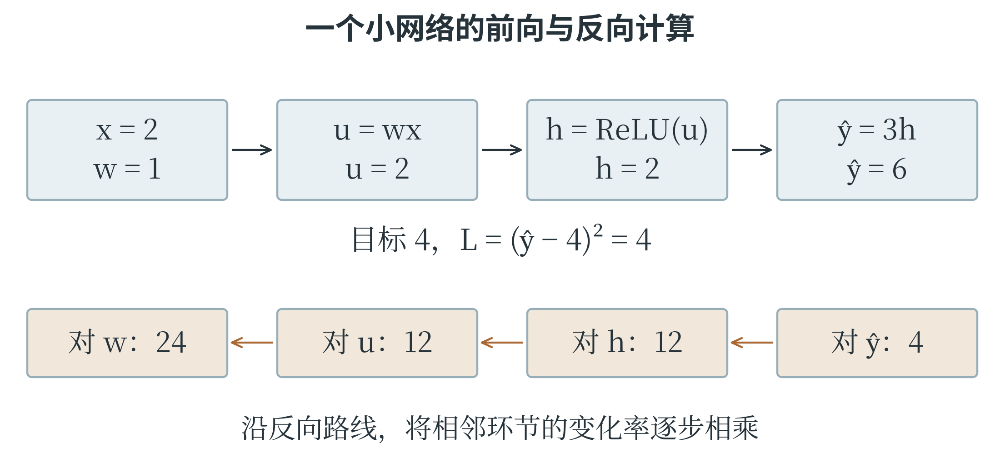

图 6-13 反向传播沿着前向计算的连接应用链式法则

学习率取 0.01，同时更新 w、v，得到 $w=0.76$、$v=2.92$。再次前向计算，预测为 $2.92\times(0.76\times2)=4.4384$，损失约为 0.1922，较原来的 4 明显减小。两条梯度大小不同，是因为各条路径上的变化率不同，不是因为训练程序随意给前一层“更大的责任”。

若当前 u 小于零，ReLU 在这一侧输出恒为零，局部导数为零，这条路径向前传递的梯度也会相应变为零。u 恰好为零时，数学导数不存在，软件会采用约定值处理。更宽的网络中，一个中间量可能通向多个输出分支，此时需要把各条路径带来的梯度贡献相加。反向传播计算这些贡献，优化器再使用它们调整参数。

## 6.7 模型训练与改进

### 一次更新与一轮训练

训练时可以每次用全部训练样本计算损失和梯度，称为批量梯度下降；也可以每次只取一个样本，或一小批样本近似估计梯度。后一种常用方式称为**小批量训练**。一批含多少样本，称为批大小；完整处理一遍训练集，称为一个**训练轮次**，常用英文 epoch 表示。处理一批并更新一次参数，是一个更新步骤，两者不是同一个单位。例如，训练集有 1000 个样本，批大小为 100，不丢弃数据时，一轮共有 10 个批次，通常完成 10 次参数更新。小批量梯度会随所抽样本波动，损失不一定每一步都下降，但计算资源利用和更新频率常更适合大数据训练。打乱独立训练样本的顺序，有助于避免批次长期偏向某一类；时间序列等有专门结构的任务，则需要相应采样方式。

训练一般反复经历取样、前向计算、计算损失、反向传播和更新参数。分类网络常使用**交叉熵损失**。在二分类中，标签 $y$ 为 0 或 1，模型对正类的概率估计为 $p$，损失为 $-[y\ln p+(1-y)\ln(1-p)]$。若真实标签为 1，这个式子只留下 $-\ln p$：给真实类别较低概率，损失就更大。公式要求对数输入为正，实际软件还会用数值稳定的实现处理非常接近端点的情形。

训练为什么常用交叉熵，而不直接用准确率？准确率只记录类别是否判对，很多参数的小变化并不改变它；交叉熵还能区分“刚刚判对”与“对真实类别给出较高概率”的预测，有利于提供连续的训练信号。训练损失与最终应用指标可以不同，但应当相互匹配，并通过验证结果检查这种选择是否合适。

### 训练轮次、更新次数和输出置信程度

训练集若只有 10 个样本，批大小为 4，且不丢弃最后不足一批的数据，那么一轮分为 4、4、2 三批，共有三次更新。训练五轮则通常有 15 次更新。每一轮可以让所有样本都参与一次，每一批得到的梯度却只反映当前这一部分材料。最后一批样本少，计算平均损失时也应按这一批实际的数量处理。

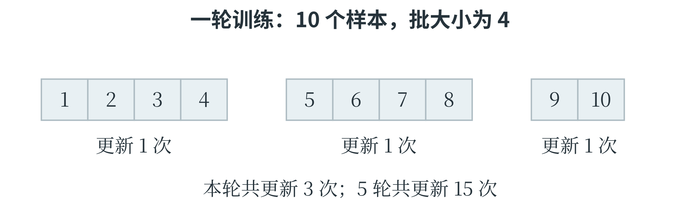

图 6-14 处理完整训练集一次，与更新参数一次是不同的计数单位

分类训练还需要比“判对了没有”更细的信号。假设真实标签为 1，两次预测给正类的概率分别为 0.6 和 0.9，按 0.5 阈值都判对，准确率没有区别；交叉熵却分别为 $-\ln0.6\approx0.5108$ 和 $-\ln0.9\approx0.1054$，后一种损失更小。若模型给真实类别的概率仅为 0.01，损失约为 4.6052，说明这个错误判断会受到更大的惩罚。对于真实标签 0，应看模型给负类的概率 $1-p$。如果 p 为 0.9，负类概率仅为 0.1，损失便是 $-\ln0.1\approx2.3026$。同一个 p，在不同真实标签下对应的损失不同，因为损失比较的是预测与目标。

### 从连续记录看训练是否继续有用

只看最后一轮的损失，难以知道训练过程中发生了什么。可以在每轮结束时，用同一评价规则分别计算训练和验证损失，保存成两条序列。表 6-4 是用于分析的示意记录，图 6-15 将同一组数画成曲线。

表 6-4 五轮训练中的损失变化示例

| 轮次 | 训练损失 | 验证损失 |
| --- | --- | --- |
| 1 | 0.80 | 0.85 |
| 2 | 0.50 | 0.58 |
| 3 | 0.30 | 0.45 |
| 4 | 0.15 | 0.52 |
| 5 | 0.08 | 0.70 |

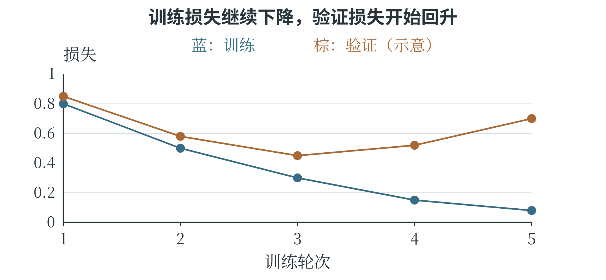

图 6-15 验证损失最低的轮次未必是训练结束的轮次

前三轮，两条损失都在下降，说明训练资料和验证资料上的表现一起改善；后两轮训练损失继续下降，验证损失却上升。在数据划分合理、评价方式一致的前提下，这提示模型可能开始过分贴合训练细节。若预先规定容许连续两轮没有改善，训练到第五轮可以停止，并使用第三轮保存的参数。

停止的时刻和最终采用哪轮参数，需要分别记录。曲线提供了进一步检查的线索。可以先检查验证集是否代表实际使用条件，再尝试降低不必要的模型复杂度、增加合适的训练材料或使用正则化。每次改动后重新观察曲线和实际错误，才能知道改动是否解决了原来的问题。

### 欠拟合与过拟合

**欠拟合**表示模型没有充分学到任务中可用的规律，在训练数据上也表现不佳。例如，用一条直线去描述明显弯曲的关系，即使训练充分，也可能持续留下较大误差。模型表达能力不足、特征遗漏、训练轮次不够或优化设置不合适，都可能造成类似现象，需要结合具体证据区分。**过拟合**表示模型过度适应训练材料中的细节或噪声，训练表现很好，新数据表现却较差。树不断分支直到记住每一条训练记录，高次多项式追随每一个测量波动，都是直观例子。训练损失持续降低而验证损失开始升高，是值得注意的信号。

训练与验证之间有差距，也可能有其他原因。数据分布不同、标注质量不同也可能造成差距。

若训练和验证误差都很高，可以先检查代码、特征与训练过程，再考虑提高模型能力或增加有效训练；若训练误差很低而验证误差较高，可以检查数据泄漏与划分、补充有代表性的样本，或者降低不必要的复杂度。常见做法包括减小树深、减少多项式次数、调整网络规模、使用适当增强等。应当根据发现的问题改动，而不是在每种情况下都笼统地“加数据、加层数”。

### 正则化、早停与超参数选择

**正则化**是在拟合训练数据之外，对模型施加额外约束或偏好，以改善泛化。例如，在平方误差后增加权重平方和的惩罚：

$$
L_{\text{总}}=L_{\text{数据}}+\lambda\sum_jw_j^2
$$

$\lambda$ 是非负的正则化强度。惩罚项使非常大的权重需要付出额外代价，训练便在贴近数据与控制权重之间取舍。强度过大也可能让模型过于受限，出现欠拟合。是否惩罚偏置、怎样按样本数缩放惩罚项，属于具体实现约定；读代码时应查清所用工具的定义。

**早停**在验证表现长期不再改善时结束训练，并保留表现较好的参数。它并不是看到某一批训练损失上升就立刻终止，因为小批量波动很常见。可以预先规定容许多少轮没有改善、用哪个指标比较。验证材料的使用方式也要明确，不能一边用测试集决定停止时间，一边再把同一测试集当作独立考试。

超参数搜索可以比较一组候选设置。例如，对决策树最大深度依次尝试 2、4、6，每次仅用训练集学习，再用验证集比较。更完整的方法可以同时比较几个超参数，或采用交叉验证。比较时尽量保持评价材料和其他重要条件一致，记录每个设置的结果，便于判断改进来自哪里。

### 正则化怎样改变最优参数

对两条训练样本 $(1,2)$、$(2,4)$，先考虑没有偏置的模型 $\hat y=wx$。它的均方误差为

$$
L_{\text{数据}}=\frac{(w-2)^2+(2w-4)^2}{2}
=2.5(w-2)^2.
$$

只看数据误差，$w=2$ 可以让两条预测都正确，损失为零。现在加入强度为 2.5 的权重平方惩罚，总目标改为

$$
L_{\text{总}}=2.5(w-2)^2+2.5w^2.
$$

对总目标求导，得到 $5(w-2)+5w=10w-10$，在 $w=1$ 处为零。这个二次函数开口向上，所以它在 1 处取得最小值。表 6-5 比较几个候选，能够看出正则化改变了什么。

表 6-5 数据误差与权重惩罚共同决定总目标

| w | 数据误差 | 惩罚项 | 总目标 |
| --- | --- | --- | --- |
| 0 | 10 | 0 | 10 |
| 1 | 2.5 | 2.5 | 5 |
| 2 | 0 | 10 | 10 |

新的参数使预测变为 1、2，数据误差由零增加到 2.5，但权重惩罚由 10 降到 2.5，总目标反而更小。训练正是在按照改变后的目标作取舍。图 6-16 分别画出两项与它们的和，三条曲线最低的位置并不相同。

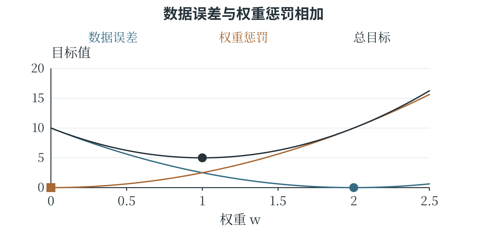

图 6-16 数据误差希望 w 靠近 2，惩罚希望 w 靠近 0，总目标在两者之间取舍

这组没有噪声的小数据，本来就能被 $w=2$ 完全描述，较强正则化反而损害了这个真实关系的拟合。可见，加入惩罚并不保证预测更准。实际任务中，额外约束可能减少模型追随噪声，也可能限制了本来需要的变化，仍要在验证数据上选择强度。

如果把强度改记为一般的 $\lambda$，求导后可得最优权重为 $10/(5+2\lambda)$。$\lambda=0$ 时回到 2；随着非负的 $\lambda$ 增大，权重逐渐靠近零。参数的变化于是有了明确的方向和数量关系，而不只是“模型变简单”这样抽象的描述。

### 分别观察表达能力与训练结果

模型能表示什么，与训练最后找到了什么，是两个相关但不同的问题。一条直线能够通过某两点，不代表某次只更新一两步的训练已经找到了那条直线；一个神经网络能够表示异或关系，也不代表任意初始参数和任意学习率都会把它训练好。判断问题时，可以先检查表达形式，再检查训练过程。例如，真实关系明显弯曲，线性模型的训练与验证误差都较大，增加训练轮次可能只是让直线更接近它所能达到的最佳位置，仍无法变成曲线。相反，如果数据本来接近直线，但学习率过小、只训练了几步，那么换一个更复杂模型未必必要，先观察损失是否仍在稳定下降更有帮助。

数据量也会影响这种判断。很小的训练集上，复杂模型容易把几条记录全部拟合好，却很难凭这些记录确定哪些变化是稳定规律。增加覆盖实际条件的样本，可以让训练更充分地约束模型。若新增样本只是原来记录的重复副本，它们可能改变重复计算的次数，却没有带来相同程度的新信息。

可以把每次实验记录为“数据版本、模型设置、训练过程、验证结果”四部分。改变某一项后，观察相应曲线和错误类型，才知道改动产生了什么影响。这样的记录既用于选择当前模型，也帮助解释失败：究竟是模型形式不合适、训练未完成，还是现有数据无法支持所需判断。

## 6.8 卷积神经网络

### 图像中的相邻位置有意义

一张灰度图可以写成像素矩阵，彩色图通常还有多个颜色通道。如果把全部像素直接拉成一长列送入全连接层，模型虽然能计算，却没有直接利用附近像素共同形成边缘、纹理的结构。**卷积神经网络**，简称 CNN，使用小窗口在图像上移动，对不同位置重复进行局部运算，逐步提取图像特征。窗口中的一组权重称为**卷积核**或滤波器。对一个位置，把窗口覆盖的像素与卷积核对应相乘后相加，再加上偏置，就得到输出中的一个数。窗口移动到其他位置，继续使用同一组权重，得到一张**特征图**。某个卷积核如果对一类边缘产生较强响应，该边缘出现在图像其他位置时，也有机会被同一组权重检测到，这叫权重共享。

### 逐格计算一个卷积窗口

设输入灰度图与卷积核分别为下面两个矩阵，偏置为零，窗口每次移动一格，不在边缘补数：

$$
X=\begin{bmatrix}1&2&0\\0&1&3\\2&1&0\end{bmatrix},\qquad K=\begin{bmatrix}1&0\\0&-1\end{bmatrix}
$$

左上窗口覆盖 $\begin{bmatrix}1&2\\0&1\end{bmatrix}$，计算结果为 $1\times1+2\times0+0\times0+1\times(-1)=0$。向右移动一格，窗口变为 $\begin{bmatrix}2&0\\1&3\end{bmatrix}$，结果为 $2-3=-1$。下方两个窗口同样计算，分别得到 $-1$ 和 1，因此输出为：

$$
Y=\begin{bmatrix}0&-1\\-1&1\end{bmatrix}
$$

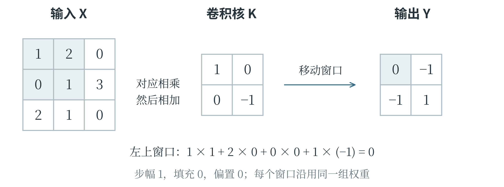

图 6-17 同一卷积核在不同位置重复使用，四个窗口产生四个输出

这里使用的是深度学习库中通常称为“卷积”的运算约定：卷积核不翻转，严格数学名称是互相关。数学教材中的卷积常会先翻转卷积核，因此遇到题目时应按给定规则计算。这个区别不影响理解局部连接和权重共享，却可能改变具体数字结果。

**步幅**表示窗口每次移动多少格，步幅为 2 就每次跨两格。**填充**表示在输入边缘补上数值，常见的是补零，它可以控制输出尺寸，也让边缘像素参与更多窗口计算。对一个方向，输入长度为 $n$，卷积核长度为 $k$，两侧各填充 $p$，步幅为 $s$，当卷积核连续覆盖相邻格子，且有效输入至少能放下一个窗口时，输出长度为：

$$
\left\lfloor\frac{n+2p-k}{s}\right\rfloor+1
$$

向下取整符号表示舍去不足一个完整步幅的部分。本例 $n=3$、$k=2$、$p=0$、$s=1$，每个方向输出长度为 2。若输入为 $5\times5$、核为 $3\times3$、步幅 1、四边各补一格，输出仍为 $5\times5$。先确定有效窗口能放在什么位置，再计算个数，也能检查公式是否用对。

### 通道、池化与完整网络

彩色图的每个位置可能包含红、绿、蓝三个数。一个卷积核通常也要覆盖所有输入通道：分别对应相乘，跨通道相加，再加偏置，得到一个输出通道。使用多个不同的卷积核，便产生多张特征图。例如，3 个输入通道、每个核的空间大小为 $3\times3$，一个核含 27 个权重；若另含一个偏置，就是 28 个参数。4 个这样的核共含 112 个参数，产生 4 个输出通道。卷积核的权重通常从训练数据中学习。教材中给一个固定核，是为了理解计算，不表示实际网络的每个边缘检测器都由人手工规定。经过卷积后常接 ReLU 等激活函数，保留非线性。较浅层可能形成边缘和纹理特征，后面的层把局部信息组合成更复杂的模式，但不能把每一张特征图都机械地解释成某个固定物体部件。

**池化层**在小范围内汇总数值，常用于降低特征图的空间尺寸。最大池化取窗口中的最大值，平均池化取平均值。例如，窗口 $\begin{bmatrix}1&3\\2&0\end{bmatrix}$ 的最大池化结果为 3，平均池化结果为 1.5。普通最大池化、平均池化本身没有像卷积核那样需要训练的权重。汇总降低了后续计算量，也会丢失部分位置细节，因此并非任何任务都适合大量池化。

一个简单图像分类网络可以依次执行卷积、激活、池化，再将特征交给全连接层输出类别分数。把多维特征排列成一条向量，称为**展平**。展平改变的是组织形状，不会重新学习一组特征。若池化后有 4 张 $2\times2$ 特征图，展平后就是 16 个数，随后一个含 3 个输出单元的全连接层接收这 16 个输入。

预测时，图像依次经过这些层；训练时，损失通过反向传播影响前面各层的权重。CNN 利用局部结构提高图像处理的效率，但仍受训练材料、目标与架构限制。某种位置变化、遮挡或光照变化是否能够处理，需要通过数据和评价说明，不能仅凭“使用了卷积”就推断模型已经具备所有视觉能力。

### 把池化窗口完整移动一次

只计算一个窗口，还看不清池化怎样改变整张特征图。设输入为下面的 $4\times4$ 矩阵，使用 $2\times2$ 窗口，横、纵步幅都为 2，不填充边缘。窗口恰好覆盖左上、右上、左下、右下四块，不发生重叠。

$$
X=\begin{bmatrix}1&3&2&0\\2&0&1&4\\0&1&5&2\\3&2&1&0\end{bmatrix}
$$

四块的最大值依次为 3、4、3、5，因此最大池化得到 $\begin{bmatrix}3&4\\3&5\end{bmatrix}$。若改用平均池化，四块总和分别为 6、7、6、8，每块除以 4，得到 $\begin{bmatrix}1.5&1.75\\1.5&2\end{bmatrix}$。图 6-18 用颜色框出对应区域，输入里的四个数共同决定输出里的一个数。

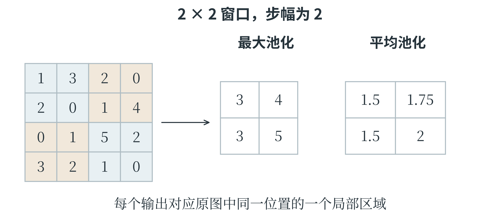

图 6-18 池化汇总局部数值，输出保留区域的排列关系

```python
feature = [[1, 3, 2, 0], [2, 0, 1, 4],
           [0, 1, 5, 2], [3, 2, 1, 0]]
pooled = []
for row in range(0, 4, 2):
    output_row = []
    for col in range(0, 4, 2):
        window = [feature[row][col],
                  feature[row][col + 1],
                  feature[row + 1][col],
                  feature[row + 1][col + 1]]
        output_row.append(max(window))
    pooled.append(output_row)
print(pooled)  # [[3, 4], [3, 5]]
```

第二章中的二维列表和嵌套循环，在这里直接表达了图像操作。外层循环确定窗口所在行，内层循环确定窗口所在列，汇总后的位置则对应输出的行列。卷积同样要确定窗口位置，但还包含各位置乘权重、再求和的步骤，不能把它与取最大值混用。

### 沿着整个网络检查尺寸和参数

考虑一个小型分类网络，输入是 $8\times8$ 的彩色图像，共三个颜色通道。第一层采用 4 个 $3\times3$ 卷积核，步幅为 1，不填充；每个方向可以放下 $8-3+1=6$ 个窗口，因此得到 4 张 $6\times6$ 特征图。随后经过 ReLU，形状不变；再用 $2\times2$、步幅为 2 的最大池化，每张特征图变为 $3\times3$。

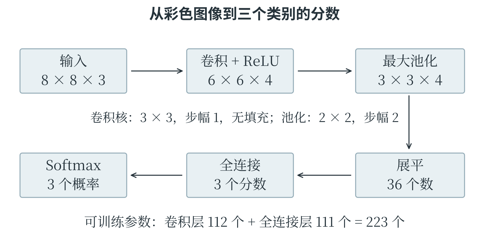

图 6-19 沿每一层追踪形状，可以检查网络能否正确连接

池化后共有 $3\times3\times4=36$ 个数，展平为 36 维向量。一个有 3 个输出单元的全连接层，为每个输出准备 36 个权重和 1 个偏置，因此有 $(36+1)\times3=111$ 个参数。前面的卷积层参数为 $(3\times3\times3+1)\times4=112$ 个；ReLU、普通池化和展平没有需要训练的参数，这个网络两层权重与偏置合计 223 个。

表 6-6 小型卷积网络的形状与参数

| 处理步骤 | 输出形状或数量 | 可训练参数数 |
| --- | --- | --- |
| 输入图像 | 8×8×3 | 0 |
| 卷积 | 6×6×4 | 112 |
| ReLU | 6×6×4 | 0 |
| 最大池化 | 3×3×4 | 0 |
| 展平 | 36 个数 | 0 |
| 全连接 | 3 个分数 | 111 |
| Softmax | 3 个概率估计 | 0 |

卷积层输出共有 $6\times6\times4=144$ 个数，参数却只有 112 个，因为同一卷积核在不同位置共享权重。若让这 144 个输出都独立连接全部 $8\times8\times3=192$ 个输入，并各自带一个偏置，就需要 $(192+1)\times144=27792$ 个参数。局部连接与权重共享利用了图像位置结构，使参数组织方式明显不同；这并不意味着参数较少的模型在任何任务上都更好，而是说明 CNN 的结构为何适合许多图像处理问题。

网络输出三个分数以后，还需根据任务决定怎样使用。若三个类别互斥，Softmax 可以把分数变成总和为 1 的概率估计，再选择最大的一项作为类别；训练时，真实标签与这三个输出共同决定损失。

## 本章小结

模型把特征变成预测，训练则依据目标和数据改变模型。线性回归用加权和，KNN 参考邻居，决策树选择分支，SVM 寻找分类边界，K-means 围绕中心分组，神经网络通过多层运算形成表示。最小二乘、最大似然与贝叶斯方法分别从误差、数据可能性和证据更新的角度指导建模；导数和梯度使参数调整有了可计算的方向。理解 CAICP 中的模型题，不仅要会代入公式，还要看清公式在整个过程中负责什么，以及所得结果能够说明什么。

## 想一想

1．用直线预测小苗的高度时，有几个观测点没落在线上，这就说明模型用错了吗？比较两条候选直线时，可以怎样利用预测高度与实测高度的差？

2．一个新样本的三个最近邻居，按距离由近到远分别属于红类、蓝类、蓝类。只听最近的一位，和让三位邻居按多数表决，结果会一样吗？这说明邻居数为什么值得选择？

3．桌上的纽扣按位置分组，用每组坐标的平均值作中心。这个中心一定落在某颗纽扣上吗？如果中心移动了，下一轮中有些纽扣为什么可能换组？

4．甲盒有 8 颗红球、2 颗蓝球，乙盒恰好相反。等可能地选一盒，随机摸到一颗红球，却不知道选的是哪盒。这个新线索使哪一盒更值得相信？能因此断定一定选了它吗？

5．有人给神经网络增加了许多层，却去掉所有非线性激活，每层只做加权求和、加上偏置。他说：“层数这么多，弯曲的关系也能学出来。”只增加层数就够了吗？

6．把减小损失想成沿着碗壁走向碗底：方向没有选反，每一步却跨得太大，总是跳到对面。怎样改步长可能更稳？在梯度下降中，哪个设置控制这种步长的大小？

7．模型把练习用的图片越认越准，验证集上的成绩却开始变差。这时继续增加训练轮数，就一定能让它在新图片上表现更好吗？这个反差提醒了什么？

8．图中两个位置出现完全相同的 3×3 像素块，用同一个 3×3 卷积核分别计算，结果会怎样？是否需要为每个位置单独学习一套卷积核参数？
