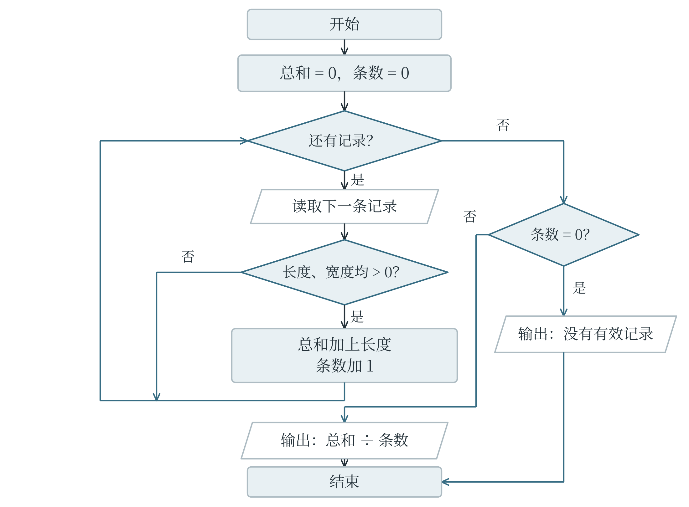
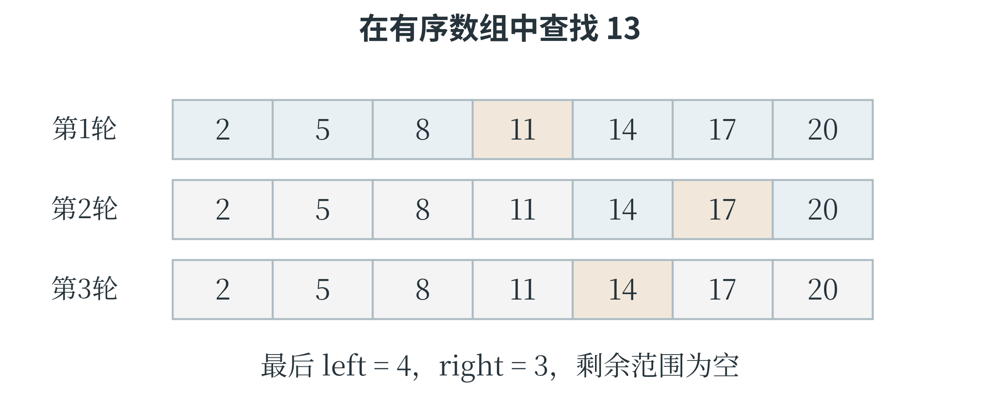
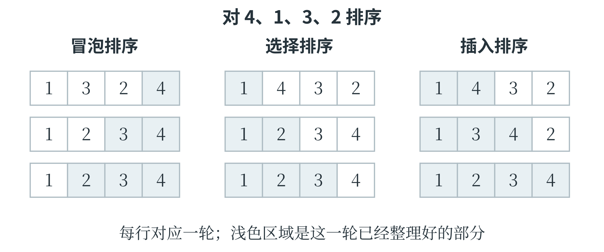
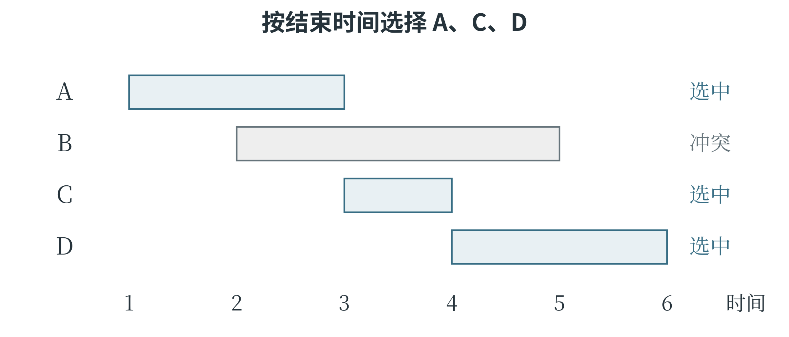
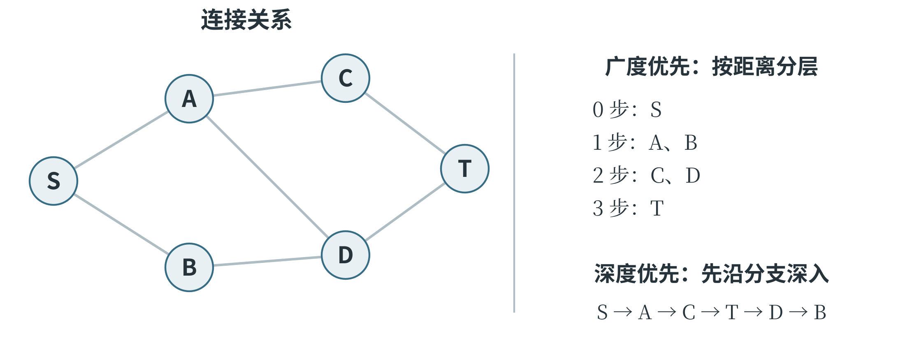
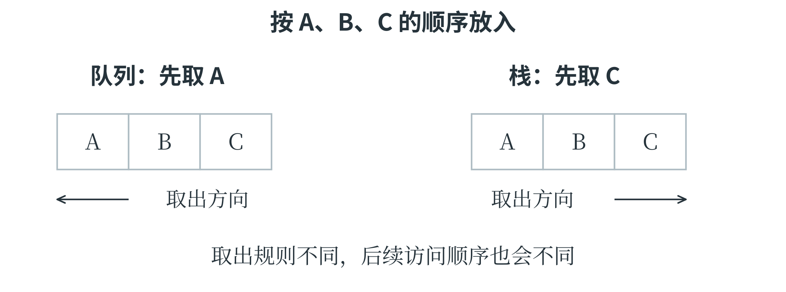
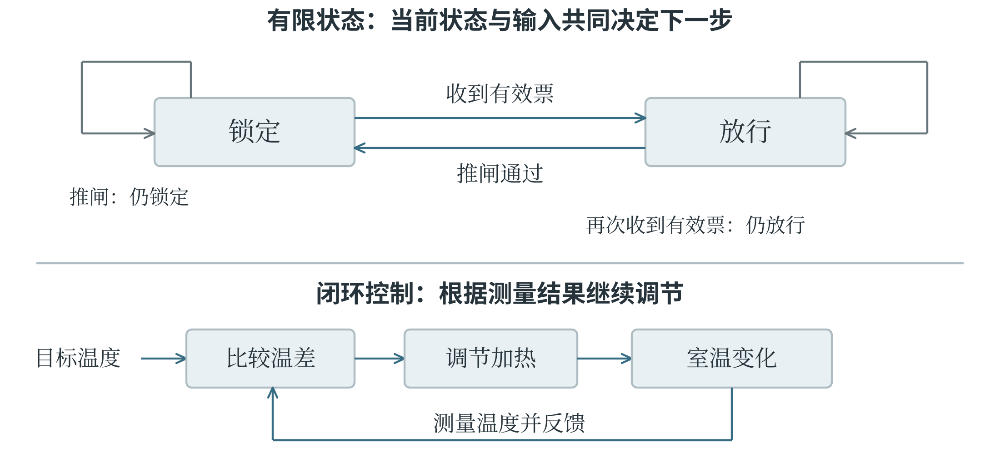
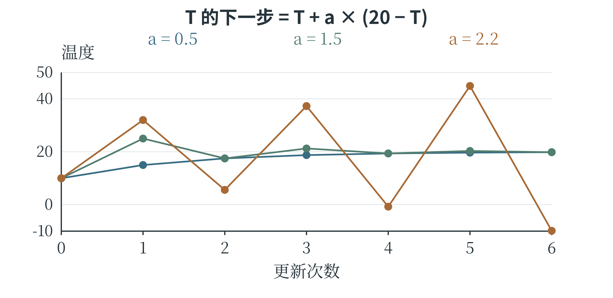

# 第四章 用算法解决问题

把问题写成程序，首先要弄清楚哪些信息需要保留、计算从哪里开始、怎样判断已经完成。寻找一条路线，既可以逐条尝试，也可以先研究道路之间的连接；分析一台设备，既可以记录每个零件，也可以只保留影响下一步动作的状态。这些选择构成了计算建模的过程。本章从信息表示讲起，介绍查找、排序和搜索，再用状态与反馈描述不断变化的系统。它们既是 CAICP 计算思维部分的主要内容，也为理解机器学习怎样组织数据、选择行动和改进结果提供基础。

## 4.1 问题分解、抽象与信息表示

### 从一段要求到可以计算的问题

“整理一批植物观测记录”还不是一条足够明确的程序指令。整理可以指检查缺失项，也可以指计算平均长度，或者按类别分组。若要求改为“读入每片叶子的编号、长度和宽度，去掉长度或宽度不大于零的记录，计算其余记录的平均长度”，输入、处理规则和输出便清楚了。输入是原始记录，输出是一个平均数；其中还隐含着一个必须处理的情况：如果没有留下任何有效记录，就没有可计算的平均数。

将一个大问题拆成若干较小的问题，称为**问题分解**。上面的任务可以拆成读取、检查、统计和输出四部分。每部分的结果要能交给下一部分使用：检查过程应交出有效记录，或者交出它们的长度总和与条数。子问题不一定彼此毫无关系，关键是明确各自负责什么、需要什么输入、产生什么输出。

只保留与当前任务有关的信息，暂时略去其他细节，称为**抽象**。计算平均叶长时，不需要记录叶片的每一个锯齿；研究叶缘形状能否区分植物时，锯齿却可能成为重要特征。抽象并不是随意删减，而是根据要回答的问题决定保留什么。用叶长和叶宽预测植物类别，还作出了一个建模选择：希望仅凭这两个测量值就能获得有用的判断。如果两类植物在这两个数值上几乎重叠，模型效果不佳可能是信息不足，不能只归咎于算法。

**计算模型**是对对象及其关系的一种可计算表示，可以是一组方程、一张表、一幅图，也可以是一套状态变化规则。模型与现实之间需要约定。例如，把走廊交叉口表示为点、走廊表示为连线，是为了研究路线；如果目标是计算通行时间，还应记录各段耗时。把所有走廊都当成一样长虽然方便，却可能选出经过路口少、实际用时反而多的路线。

计算结果能否回答实际问题，先要看模型保留的信息是否合适。

### 算法的三种表达

自然语言适合说明思路，但“处理合适的记录”这样的说法仍有歧义。**伪代码**把关键动作、判断和重复写得更明确，不要求遵守某种编程语言的全部语法。平均叶长的算法可以表述为：先将总和与条数设为零；依次检查每条记录；若长度和宽度均大于零，就累加长度并增加条数；检查结束后，条数为零则报告没有有效记录，否则用总和除以条数。

```text
总和 ← 0，条数 ← 0
对每条记录重复：
    如果长度 > 0 且宽度 > 0：
        总和 ← 总和 + 长度
        条数 ← 条数 + 1
如果条数 = 0：
    输出“没有有效记录”
否则：
    输出总和 ÷ 条数
```

箭头表示赋值，缩进表示哪些动作受同一个条件或循环控制。这段伪代码保留了程序结构，但“对每条记录重复”没有使用 Python 的具体语法，因此用于交流算法思路，不能直接作为 Python 程序运行。**流程图**用图形表达同样的过程。常见约定中，圆角框表示开始和结束，矩形表示处理，菱形表示条件判断，平行四边形表示输入或输出，箭头表示执行方向。图 4-1 用“是否还有记录”和“记录是否有效”两个判断组织循环。菱形的出口需要标明条件，否则读者无法知道下一步走哪条线。

写成 Python 后，变量负责保存过程中的信息，循环负责依次处理记录。这里的列表中，每个元组依次保存长度和宽度；负数表示一条有问题的记录，不能当作正常叶长参与统计。

```python
records = [(4.0, 1.5), (-2.0, 1.0), (6.0, 2.0)]
total = 0.0
count = 0
for length, width in records:
    if length > 0 and width > 0:
        total += length
        count += 1
if count == 0:
    print("没有有效记录")
else:
    print(total / count)
```

第一条和第三条记录被保留，最终输出 `5.0`。`total` 与 `count` 必须同步更新：若总和只累加有效记录，条数却把所有记录都算进去，结果便会偏小。这种检查方法也适用于更复杂的代码：观察几个相互关联的量是否描述同一批对象，比只盯着最后一行更容易找到错误。



图 4-1 先检查每条记录，循环结束后再决定是否计算平均数

### 编码、解码与规律

**编码**是按约定规则把信息转换成另一种表示，**解码**则根据规则还原信息。假设给四种图形编号：圆为 `00`、三角形为 `01`、正方形为 `10`、五角星为 `11`。图形序列“圆、正方形、三角形”便编码为 `001001`。由于每个编码都长两位，解码时从左到右每两位分一组即可。两个二进制位有 $2^2=4$ 种组合，若要表示五种图形，两个位就不够了。

固定长度使这次解码很方便。若换成长度不同的码字，情况就未必如此。例如，规定 A 对应 `0`、B 对应 `01`、C 对应 `1`，字符串 `01` 既可能表示 B，也可能表示 AC。只知道字符与码字的对应表，还不足以唯一解码。可以改用固定长度，增加分隔符，或者设计不会相互混淆的码字。题目给出编码方法时，应先弄清分组、顺序和边界；不能擅自把另一套熟悉规则套进来。

编码也不等于加密。知道公开规则的人，通常都可以据此还原信息。

规律识别可以减少逐项计算。例如，灯光依次重复“红、蓝、蓝”，循环长度为 3。若从第 1 次开始编号，第 $n$ 次在一轮中的位置由 $(n-1)$ 除以 3 的余数决定：余数 0 对应红色，余数 1、2 对应蓝色。第 10 次的余数是 0，所以是红色。先减 1，是因为 Python 列表索引从 0 开始，而题目编号从 1 开始。

```python
pattern = ["红", "蓝", "蓝"]
n = 10
print(pattern[(n - 1) % len(pattern)])
```

从已经看到的几个数猜测规律，与按已知规则推算，并不是同一件事。序列 2、4、6 可以继续为 8，也可能只是另一条复杂规则的开头。题目若明确给出循环规则，就能据此计算；若要求从数据中寻找模式，还需要检验后续记录。机器学习同样要面对这种区别：拟合了已有记录，不等于已经证明未来必然如此。

### 按规则完成一次解码

解码可以组织成一个小算法。沿用每个图形占两个二进制位的约定，字符串 `001001` 应分成 `00、10、01` 三组。分组的起点依次为索引 0、2、4，每次取当前位置及其后的一位。这里已经约定字符串长度为偶数，而且所有字符都是 0 或 1；因此每一组都能在编码表中找到对应图形。

```python
codebook = {"00": "圆", "01": "三角形",
            "10": "正方形", "11": "五角星"}
encoded = "001001"
decoded = []
for start in range(0, len(encoded), 2):
    piece = encoded[start:start + 2]
    decoded.append(codebook[piece])
print(decoded)  # ['圆', '正方形', '三角形']
```

`range()` 的步长决定每次从哪里开始，切片的右端点决定这一组包含哪些字符。两者共同实现固定长度分组。若把步长改为 1，就会读出彼此重叠的片段，已经不是原来的解码方法。若题目把每个图形的编码改成三位，则需要同时改变步长、切片长度与编码表，不能只修改其中一处。输入、规则和结果之间的关系还可以反过来检验：把解码后的图形再按同一套规则编码，应当得到原来的字符串。这个检验称不上证明所有输入都正确，却能帮助发现本次分组或查表中的错误。

## 4.2 枚举与查找

### 把可能性逐一检查

在一个有限范围内依次列出候选答案，并检查哪些符合条件，称为**枚举**。例如，两种材料每份分别重 3 克、5 克，需要配出 16 克，且每种份数是非负整数。设它们分别有 $a$ 份、$b$ 份，条件就是 $3a+5b=16$。因为 $3a$ 不能超过 16，$a$ 只需从 0 检查到 5；同理，$b$ 从 0 检查到 3。

```python
solutions = []
for a in range(16 // 3 + 1):
    for b in range(16 // 5 + 1):
        if 3 * a + 5 * b == 16:
            solutions.append((a, b))
print(solutions)
```

输出 `[(2, 2)]`，表示两种材料各取两份。枚举范围应包含零和上界，所以 `range` 的终点要加 1。这段程序会检查 $6\times4=24$ 对候选数。还可以只枚举 $a$，计算剩余重量 `16 - 3 * a`；如果它非负且能被 5 整除，就能直接得到 $b$。这样既没有漏解，也省去了内层循环。设计枚举算法时，最值得说明的两件事是：为什么这些候选已经足够，以及有没有重复检查同一答案。

### 怎样减少枚举而不漏掉答案

在 $3a+5b=16$ 中，一旦确定 $a$，剩余重量就确定了，$b$ 因而不必再从头试到尾。表 4-1 列出所有可能的 $a$，并检查剩余重量能否由 5 克的材料整份组成。

表 4-1 用剩余重量缩小枚举范围

| a 的取值 | 剩余重量 16−3a | 能否被 5 整除 | 结论 |
| --- | --- | --- | --- |
| 0 | 16 | 否 | 不符合 |
| 1 | 13 | 否 | 不符合 |
| 2 | 10 | 是 | b＝2 |
| 3 | 7 | 否 | 不符合 |
| 4 | 4 | 否 | 不符合 |
| 5 | 1 | 否 | 不符合 |

相应程序只需要一个循环：

```python
solutions = []
for a in range(16 // 3 + 1):
    remaining = 16 - 3 * a
    if remaining % 5 == 0:
        b = remaining // 5
        solutions.append((a, b))
print(solutions)  # [(2, 2)]
```

循环范围保证剩余重量不为负，取余为零则保证能够整份分配。每一个合法答案都有一个 $a$，这个 $a$ 一定会被检查；检查时又由等式唯一确定 $b$，所以这个改写不会遗漏合法答案。原程序检查 24 对候选数，改写后只检查 6 个剩余重量。

这里能少写一层循环，是因为确定了 $a$ 就能算出唯一的 $b$。如果一个 $a$ 可能对应许多个合法的 $b$，就需要另外说明怎样找到它们。改进算法时，先写出能够覆盖全部情况的办法，再寻找已经确定的信息，避免重复尝试。人工智能中的许多计算也会反复利用这类关系，把共同部分提前计算或同时处理。

### 顺序查找与二分查找

要判断某个编号是否在一组记录中，最直接的办法是从头到尾逐个比较，称为**顺序查找**。它不要求数据事先排序。找到目标就返回所在位置，检查完仍没找到则返回约定的标记。下面用 `-1` 表示未找到；使用结果时要先判断，不能直接拿 `-1` 访问列表，因为在 Python 中它恰好表示最后一个元素。

```python
def linear_search(values, target):
    for i in range(len(values)):
        if values[i] == target:
            return i
    return -1

print(linear_search([8, 3, 9, 5], 9))
```

输出为 `2`。若列表含有重复目标，这个函数返回第一次出现的位置。最顺利时第一次就能找到；目标在末尾或根本不存在时，可能需要检查全部 $n$ 个元素。这里的 $n$ 表示数据规模，也就是列表长度。

如果列表已经按从小到大的顺序排列，可以每次检查当前范围的中间元素，称为**二分查找**。中间值小于目标时，它左边的值也不可能更大，所以连同中间位置一起排除；中间值大于目标时，则排除右半部分。每次比较都让候选范围大约减少一半，直到找到目标或范围为空。

```python
def binary_search(values, target):
    left = 0
    right = len(values) - 1
    while left <= right:
        middle = (left + right) // 2
        if values[middle] == target:
            return middle
        if values[middle] < target:
            left = middle + 1
        else:
            right = middle - 1
    return -1

print(binary_search([2, 5, 8, 11, 14, 17, 20], 14))
```

第一次检查索引 3，值为 11，候选范围变成索引 4 到 6；第二次检查索引 5，值为 17，范围缩为索引 4；第三次找到 14，返回 `4`。`left` 和 `right` 表示仍可能包含目标的左右端点，而且都包含在范围内。更新时用 `middle + 1` 或 `middle - 1`，是因为中间位置已经检查过。若仍把它留作端点，范围可能无法继续缩小，循环便可能停不下来。空列表开始时 `right` 为 `-1`，条件不成立，直接返回 `-1`。目标重复出现时，这种写法会找到其中一次，未必是第一次；若要求第一个或最后一个位置，需要改动保留范围的规则。

二分查找能排除半个范围，靠的是数据已经有序。对打乱的列表，便失去了这一依据。

### 没找到目标时，范围怎样消失

找到目标的例子说明二分查找怎样返回答案，没有目标的例子则更能检查端点规则。仍使用 `[2, 5, 8, 11, 14, 17, 20]`，现在寻找 13。第一次比较中间的 11，目标若存在只能在右侧；第二次比较 17，目标若存在只能在它左侧；第三次只剩 14，比较后左端点成为 4、右端点成为 3，范围为空。

表 4-2 二分查找 13 的过程

| 比较次数 | 当前索引范围 | 中间位置与数值 | 更新后的范围 |
| --- | --- | --- | --- |
| 1 | 0 到 6 | 索引 3，数值 11 | 4 到 6 |
| 2 | 4 到 6 | 索引 5，数值 17 | 4 到 4 |
| 3 | 4 到 4 | 索引 4，数值 14 | 4 到 3，空范围 |



图 4-2 每次更新都排除已经检查过的中间位置

算法在整个过程中维持一个约定：如果目标存在，它仍在尚未排除的范围内。比较之后，只有已经证明不可能的部分才能丢掉。这种在循环前后持续成立的关系，称为**循环不变量**。顺序求最大值时，“当前最大值是已经读过的数中最大的”，也是这样的关系。列表有重复值时，任务要求还会决定何时结束。若只需要找到任意一个目标，比较相等后即可返回；若要求第一次出现的位置，则即使找到了目标，左侧仍可能有另一个相同值，需要继续检查。修改程序前，应先改变“尚未解决的是什么”这一解释，再据此修改端点和返回规则。

### 用操作次数理解效率

评价算法快慢，不能只看一次运行花了多少秒：设备、数据和当时的负载都会影响时间。更稳定的比较方法，是看数据规模增大时，主要操作次数怎样变化。顺序查找的最坏情况需要 $n$ 次比较，称为线性增长，常记为 $O(n)$。二分查找把范围反复减半，规模从 16 增到 32，最坏情况大致只多一次比较，常记为 $O(\log n)$；这里的对数来自“需要减半多少次”。符号 $O$ 用来描述增长的数量级，并不表示精确用时。两重循环若各自最多执行 $n$ 次，可能产生约 $n^2$ 次操作，常记为 $O(n^2)$。保存额外数据也要占空间：只记录几个端点，与复制整份列表，所需的额外空间不同。

一次查找是否值得先排序，也要结合任务。为了只找一次就先排好整组数据，排序本身可能比顺序检查更费事；若同一组数据要反复查找，排序后的有序结构则可能节省大量工作。算法选择是在比较完整过程，不能只比较最后那一步。

## 4.3 排序与贪心

### 排序中的位置与比较

**排序**是按某种比较规则重新安排元素顺序。按叶长从小到大排序，比较的是长度；按“类别优先、同类再比长度”排序，就要先比较类别，再处理相同类别中的先后。若两条记录的排序依据相同，排序后仍保留它们原先的相对顺序，这种性质称为**稳定性**。Python 的 `sorted` 和列表的 `sort` 是稳定排序，前者返回新列表，后者修改原列表。

**冒泡排序**反复比较相邻元素，前者较大就交换。对 `[4, 1, 3, 2]` 做第一轮比较，4 先与 1 交换，再与 3、2 交换，结果为 `[1, 3, 2, 4]`。最大的数已经到末尾，下一轮只需处理前三个数。每一轮确定一个末尾位置，剩余范围逐渐缩小。

```python
def bubble_sort(values):
    a = values.copy()
    for end in range(len(a) - 1, 0, -1):
        changed = False
        for i in range(end):
            if a[i] > a[i + 1]:
                a[i], a[i + 1] = a[i + 1], a[i]
                changed = True
        if not changed:
            break
    return a
```

`end` 是当前尚需检查范围的最右位置。内层 `range(end)` 最后取到 `end - 1`，与其右侧的 `end` 比较，恰好不会越界。若整轮没有交换，说明相邻元素已经顺序正确，可以提前结束。这里只在严格大于时交换，相等元素不会互相跨越，所以这种冒泡写法保持稳定性。

**选择排序**换一种思路：在剩余范围内找到最小元素，把它放到该范围最前面。第一次确定索引 0 的元素，第二次确定索引 1，依此类推。它每轮只在最后交换一次，但寻找最小值仍要逐个比较。

```python
def selection_sort(values):
    a = values.copy()
    for start in range(len(a) - 1):
        smallest = start
        for i in range(start + 1, len(a)):
            if a[i] < a[smallest]:
                smallest = i
        a[start], a[smallest] = a[smallest], a[start]
    return a
```

变量 `smallest` 保存的是位置，比较时才通过 `a[smallest]` 取出数值。这个位置和最小数值容易在补全程序时混淆。选择排序中的远距离交换还可能改变相等记录的先后，因此这种常见写法不稳定。

**插入排序**则始终保留一段已经排好序的前缀，再把后面的元素逐个插入其中。前缀为 `[1, 4]`、下一个数为 3 时，先将 4 向右移动，留下空位，再放入 3，得到 `[1, 3, 4]`。这个过程与整理手中一叠有编号的卡片相似：已有卡片顺序正确，只需要给新卡片找到位置。

```python
def insertion_sort(values):
    a = values.copy()
    for i in range(1, len(a)):
        value = a[i]
        j = i - 1
        while j >= 0 and a[j] > value:
            a[j + 1] = a[j]
            j -= 1
        a[j + 1] = value
    return a
```

`value` 暂存待插入的元素，避免右移时将它覆盖。循环结束后，`j` 可能指向一个不大于 `value` 的元素，也可能变成 `-1`；两种情况下，正确插入位置都是 `j + 1`。这里同样只移动严格较大的元素，因此稳定。

### 对照同一组数观察三种排序

排序算法可以用同一组数来比较，但应区分“检查了哪些位置”和“本轮确定了哪个位置”。对 `[4, 1, 3, 2]`，冒泡排序第一轮把最大值 4 推到最右端；选择排序第一轮把最小值 1 放到最左端；插入排序第一轮把前两项整理为 `[1, 4]`，随后再把 3、2 依次放入已排序部分。图 4-3 用色块标出每一步已经确定的部分。



图 4-3 三种排序维护着不同的已整理区域

插入排序中，元素的移动尤其值得分步看。当前列表为 `[1, 4, 3, 2]`，准备插入 3，先把它保存到 `value`。比较 4 与 3，发现 4 较大，就将 4 复制到右侧位置，列表暂时成为 `[1, 4, 4, 2]`。这个中间状态里出现了两个 4，但 3 没有丢失，因为它还保存在 `value` 中。再比较左侧的 1，发现不必继续移动，于是把 3 放入空出的位置，得到 `[1, 3, 4, 2]`。

因此，检查中间结果时，还要看看变量里存着什么，不能只看列表。

选择排序中的稳定性，也可以用带名字的记录观察。设两条长度同为 2 的记录分别记作 2甲、2乙，初始顺序为 `[2甲, 2乙, 1]`。第一轮找到末尾的 1，与开头的 2甲 交换，结果为 `[1, 2乙, 2甲]`。两个长度为 2 的记录改变了相对顺序，所以这种交换写法不稳定。如果只是排一串纯数字，差别可能看不出来；若每个数后面还关联着采集时间或编号，差别就会影响后续处理。

排序程序中的复制也有明确用途。本章几种函数开头的 `values.copy()` 保留了调用者的原列表，算法在副本上移动元素，最后返回结果。若去掉复制而直接操作原列表，排序步骤本身可能仍然正确，但函数对外部数据的影响改变了。阅读代码时，既要看排序结果，也要看它承诺修改哪一份数据。

### 分成小组再排序

**快速排序**先选一个元素作为基准，按大小将元素分组，再对较小组和较大组分别排序。这体现了**分治**思想：把问题分成更小的同类问题，分别求解，再合成结果。第二章的递归函数可以直接表达这个过程。

```python
def quick_sort(values):
    if len(values) <= 1:
        return values.copy()
    pivot = values[len(values) // 2]
    smaller = [x for x in values if x < pivot]
    equal = [x for x in values if x == pivot]
    larger = [x for x in values if x > pivot]
    return quick_sort(smaller) + equal + quick_sort(larger)
```

对 `[4, 1, 3, 2]`，基准是 3，三组分别为 `[1, 2]`、`[3]`、`[4]`；较小组继续排序后再拼接，得到 `[1, 2, 3, 4]`。相等组不再递归，否则大量相等元素可能让问题规模无法缩小。这份代码用新列表突出分组思想，理解起来直接，但会分配额外空间；常见的原地快速排序则在原列表中交换元素，具体写法不同。

冒泡、选择和插入排序最坏情况下的比较或移动次数通常按 $n^2$ 增长。快速排序若各次分组较均衡，通常具有 $O(n\log n)$ 的时间复杂度；分组极不均衡时，仍可能达到 $O(n^2)$。选择列表中间位置的元素，并不保证选中了数值大小居中的元素。

### 贪心选择何时成立

**贪心算法**在每一步按某个规则选择当前看来最有利的方案，通常不回头更改已经作出的选择。例如，一台设备同一时间只能进行一个实验，若希望在一天内完成尽量多的实验，一种方法是每次选择结束最早、又不与已选实验冲突的实验。提前结束，为后面的实验留下更多时间。这里的目标是实验数量，不是实验总时长或收益。设几个实验的起止时间分别为 A：1—3，B：2—5，C：3—4，D：4—6。允许前一个结束的时刻与后一个开始的时刻相同。按结束时间选择，先选 A，再选 C，最后选 D，可以完成三个；如果先选耗时较长的 B，就会挡住 A 和 C。算法需要先按结束时间排序，再依次检查开始时间是否不早于上一个已选实验的结束时间。

这种选择有理由成立：在任意一个完成数量最多的方案中，把第一个实验换成所有候选中结束最早的实验，后面的可用时间不会减少，因此不会使已经能够安排的后续实验失去位置。做完第一次选择，剩下的又是同类问题。这说明了局部选择怎样与整体目标相容，而不只是展示一组碰巧成功的数据。

贪心也会失败。用面值 1、3、4 的硬币凑出 6，每次取不超过剩余金额的最大面值，会得到 4、1、1，共三枚；取 3、3 只需两枚。“当前尽量多取”没有保证“最终枚数最少”。分析贪心策略时，需要同时写清可选动作、选择依据、剩余问题和最终目标；寻找一个反例，就能推翻“它总能得到最优结果”的判断；若要确认它一直有效，则需要说明每一步选择为什么不会妨碍整体目标。

取棋子的游戏也能说明，眼前拿得多，未必最后能获胜。两人轮流从 10 枚棋子中取走 1 枚或 2 枚，取走最后一枚的人获胜。先手先取 1 枚，留下 9 枚；以后对手取 1 枚，就取 2 枚，对手取 2 枚，就取 1 枚。每两次合计取走 3 枚，便能依次留下 6、3、0 枚，最后一枚由先手取走。这里有效的是保持“给对手留下 3 的倍数”这一状态规律，而不是每次取最多。规则若改成不能取最后一枚，原策略也必须重新分析。

### 将实验安排写成程序

“先选结束最早的实验”需要落实为明确的排序规则。把每个实验写成“名称、开始时间、结束时间”的元组，按第三项排序；随后依次检查，开始时间不早于上一个选中实验的结束时间，就可以加入安排。

```python
experiments = [("A", 1, 3), ("B", 2, 5),
               ("C", 3, 4), ("D", 4, 6)]
ordered = sorted(experiments, key=lambda item: item[2])
chosen = []
last_end = 0
for name, start, end in ordered:
    if start >= last_end:
        chosen.append(name)
        last_end = end
print(chosen)  # ['A', 'C', 'D']
```

本例所有实验都在时间 0 以后开始，所以 `last_end` 从 0 起即可。排序结果为 A、C、B、D：选 A 后空闲时间从 3 开始，C 恰好在 3 开始，可以接上；B 在 2 开始，与已经选中的实验冲突，因而跳过；D 在 4 开始，可以接在 C 后面。图 4-4 把区间放在同一条时间轴上，冲突与衔接便一目了然。



图 4-4 按结束时间选择互不冲突的实验

如果要求改为“总收益最大”，这个算法就未必适用。假设 B 的收益为 100，A、C、D 的收益各为 1，选择三个实验只得到收益 3，选择 B 却能得到 100。目标变化之后，原来的正确理由不再支持新任务。算法题中看似只是替换了一个词，实际可能已经改变需要优化的量。

### 用小状态检查博弈策略

取棋子的规则也可以从最小情况倒着分析。轮到某人时只剩 1 枚或 2 枚，他可以一次取完而获胜；剩 3 枚时，无论取 1 枚还是 2 枚，都会把能立即获胜的局面交给对方。于是，3 枚是当前行动者的不利状态。剩 4 枚时可以取 1 枚留下 3，剩 5 枚时可以取 2 枚留下 3，因而两者又成为有利状态。沿着相同方法继续，剩 6 枚时的两种选择都会进入对方的有利状态，6 再次是不利状态。由此可以发现 3、6、9 这样的规律，并解释前面从 10 枚开始的策略。

要确认这条规律一直成立，还需要说明：每个 3 的倍数只能走向非倍数，而每个非倍数都能通过取 1 或 2 变为 3 的倍数。状态及其允许的后继，正是接下来用树和图搜索时要保存的信息。

## 4.4 树、图与搜索

### 用连接关系表示问题

一个对象只列出自身特征，有时还不够。例如，路线问题需要知道哪些路口可以互通，社交网络需要知道哪些人有联系。**图**由一组顶点和连接它们的边组成，顶点也常称为结点。道路只能单向通行时，用带箭头的有向边表示；可以双向通行时，可以使用无向边。边还可以附带距离、费用等数值，称为**权重**。沿着边依次经过顶点，形成一条**路径**。本节讨论无权图时，路径长度按经过的边数计算。沿不同的边经过一串顶点，除起点与终点重合外不重复经过顶点，就形成一个**环**。沿一条路走过去再原路退回，不算这里所说的环。

**树**是一种没有环、且所有顶点连通的无向图；若选定一个根结点，就可以按离根的层次讨论父结点、子结点和叶结点。父子关系描述相邻层次，叶结点则没有子结点。计算机的目录层级和决策树都借用了这种结构，但具体数据是否真是一棵树，还要看有没有额外连接。

图可以用**邻接表**保存：每个顶点对应一个列表，记录从它出发可以直接到达的邻居。下面这张无向图中，S 与 A 相连，就在 S 的列表中写 A，也在 A 的列表中写 S。邻居顺序还规定了后面搜索时的先后次序。

```python
graph = {
    "S": ["A", "B"],
    "A": ["S", "C", "D"],
    "B": ["S", "D"],
    "C": ["A", "T"],
    "D": ["A", "B", "T"],
    "T": ["C", "D"]
}
```



图 4-5 广度优先搜索先访问较近的一层，深度优先搜索先沿一条路深入

**搜索**是在候选位置或状态中，按一定顺序寻找目标；**遍历**则着重于按规则访问所有需要处理的结点。图中可能有环，多个顶点也可能通向同一个顶点，因此通常要保存一个“已经发现”的集合，避免反复进入同一处。从 S 能访问哪些顶点，还取决于它们与 S 是否连通；若要求遍历整张不连通的图，需要再从尚未访问的顶点开始搜索。

### 广度优先搜索

**广度优先搜索**，简称 BFS，先处理起点，再处理离起点一条边的顶点，然后处理两条边、三条边的顶点。它使用**队列**保存等待处理的顶点：先进入队列的先出来，这种顺序称为先进先出。Python 的 `collections.deque` 可以高效地从一端加入、另一端取出。

```python
from collections import deque

def bfs(graph, start):
    queue = deque([start])
    distance = {start: 0}
    order = []
    while queue:
        node = queue.popleft()
        order.append(node)
        for neighbor in graph[node]:
            if neighbor not in distance:
                distance[neighbor] = distance[node] + 1
                queue.append(neighbor)
    return order, distance

order, distance = bfs(graph, "S")
print(order)
print(distance["T"])
```

访问顺序为 `S、A、B、C、D、T`，S 到 T 的最短距离为 `3`。最初队列为 `[S]`；取出 S 后，加入 A、B；取出 A 后，加入 C、D，队列变为 `[B, C, D]`。处理 B 时，D 已经在 `distance` 中，不会再次入队。将“已发现”标记放在入队时完成，可以避免一个结点被不同邻居反复加入。这个字典同时保存距离和已发现标记。首次发现邻居时，它比当前结点多经过一条边，所以距离加 1。由于队列先处理较近的层，第一次发现一个结点时，不会漏掉一条边数更少的路径。这就是 BFS 能在无权图中求最短路径长度的原因。

若每条边的耗时不同，边数少不等于总耗时少，上述程序便不能直接用来求最短耗时。

若还需要输出完整路线，可以在首次发现邻居时记录它来自哪个结点。例如，将 `parent[neighbor]` 设为 `node`；找到 T 后，从 T 沿这些记录回到 S，再把顺序反转。距离字典回答“有多远”，前驱记录回答“怎样走到那里”，两者保存的信息不同。

### 把最短距离还原成一条路线

如果只记录距离 3，仍不知道该经过哪些结点。找到一个新结点时，可以同时记下它是从哪里第一次到达的，把这个来源称为**前驱**。在本例中，A 和 B 的前驱是 S，C 和 D 的前驱是 A，T 的前驱是 C。由 T 沿前驱反向追溯，得到 T、C、A、S；反转后就是从起点出发的路线。下面的函数仍使用前面定义的 `graph` 和已经导入的 `deque`。字典 `parent` 同时承担已发现标记和前驱记录，起点的前驱设为 `None`，表示回溯到此结束。

```python
def shortest_path(graph, start, goal):
    queue = deque([start])
    parent = {start: None}
    while queue:
        node = queue.popleft()
        if node == goal:
            break
        for neighbor in graph[node]:
            if neighbor not in parent:
                parent[neighbor] = node
                queue.append(neighbor)
    if goal not in parent:
        return []
    path = []
    node = goal
    while node is not None:
        path.append(node)
        node = parent[node]
    return path[::-1]

print(shortest_path(graph, "S", "T"))
# ['S', 'A', 'C', 'T']
```

回溯循环不再查看图中所有邻居，只沿已经保存的前驱走。前驱记录把搜索过程中的一个选择保留下来，因此搜索结束后仍能还原路线。如果邻居的访问顺序改变，可能得到另一条同样短的路线；无权图中最短边数仍为 3。要判断程序对不对，应看任务是否允许多个正确答案。

图 4-6 还比较了队列和栈的取出顺序。A、B、C 按这个顺序放入，队列先取出 A，栈先取出 C。搜索顺序不是由字母本身决定的，而是由数据结构的取出规则与放入顺序共同决定的。



图 4-6 队列先进先出，栈后进先出

### 深度优先搜索

**深度优先搜索**，简称 DFS，沿着一条尚未访问的路线尽量深入，到没有可继续访问的邻居时，再退回上一个结点，尝试其他分支。递归调用恰好能够保存“退回哪里继续”的信息。

```python
def dfs(graph, start):
    visited = set()
    order = []

    def visit(node):
        visited.add(node)
        order.append(node)
        for neighbor in graph[node]:
            if neighbor not in visited:
                visit(neighbor)

    visit(start)
    return order

print(dfs(graph, "S"))
```

按给定邻接表，顺序为 `S、A、C、T、D、B`。从 S 进入 A，再进入 C、T、D、B；B 的邻居都已经访问过，于是返回 D，继续检查 D 尚未检查完的邻居。递归结束不表示重新从起点开始，而是回到发起这次调用的位置。这一点与第二章中函数调用的执行顺序相同。

DFS 也可以用**栈**实现。栈是后放入的先取出，称为后进先出；它与队列的顺序不同。如果希望迭代写法产生与上述递归相同的顺序，还需注意邻居的压栈次序。

DFS 找到的第一条路线未必最短，因为它可能先走进一条很长的分支。BFS 与 DFS 都能检查可达性，选择哪一种，要看目标是逐层找近处，还是深入检查分支结构。

## 4.5 状态、过程与反馈系统

### 状态应当保存什么

描述一个正在运行的系统，往往需要知道它“目前处于什么情况”。**状态**就是为判断下一步变化而保留的信息。自动门可以处于关闭、正在打开、打开、正在关闭等状态；程序处理文本时，可以处于“尚未读到数字”或“正在读取一串数字”的状态。状态名称取决于任务需要，不一定对应一个可见的物体。怎样判断保留的信息是否够用？可以试着用它们推演下一步。例如，只记录机器人所在格子，在所有方向移动规则相同时也许可用；若“前进”的方向取决于机器人朝向，就还应记录朝向。位置相同、朝向不同，执行同一动作后可能到达不同格子。状态需要足以判断下一步的变化；与变化无关的细节，则可以略去。

所有可能状态构成**状态空间**。动作或输入使系统从一个状态进入另一个状态，称为**状态转换**。若只用有限个状态及明确的转换规则描述系统，就得到一种**有限状态自动机**。下面用一个简化闸机说明：状态只有“锁定”和“放行”，输入只有“有效票”和“推闸”。初始为锁定；收到有效票后放行；放行时推闸，通过后重新锁定。此模型只研究通行许可，不描述机械开合所花的时间。

表 4-3 简化闸机的状态转换规则

| 当前状态 | 输入 | 下一状态 |
| --- | --- | --- |
| 锁定 | 有效票 | 放行 |
| 锁定 | 推闸 | 锁定 |
| 放行 | 有效票 | 放行 |
| 放行 | 推闸 | 锁定 |

```python
transition = {
    ("锁定", "有效票"): "放行",
    ("锁定", "推闸"): "锁定",
    ("放行", "有效票"): "放行",
    ("放行", "推闸"): "锁定"
}
state = "锁定"
for event in ["推闸", "有效票", "推闸"]:
    state = transition[(state, event)]
    print(state)
```

三个输出依次为“锁定、放行、锁定”。字典的键是一对信息：当前状态和当前输入，只根据其中一个无法决定下一状态。图 4-7 中，箭头说明转换方向，箭头上的文字说明触发条件；回到自身的箭头表示输入发生后状态不变。运行过程可以写成一串状态，也可以在这张状态图中沿箭头走。



图 4-7 状态图描述允许的转换，反馈图描述结果怎样影响后续动作

### 用反馈解释持续变化

若系统的输出结果被测量后又用于决定下一步动作，就形成**反馈**。温度调节器读取室温，与设定温度比较，再决定是否加热；加热改变室温，新的室温又成为下一次判断的输入。这是一个闭环。若只是每天固定时间打开加热器，期间不测量温度，动作虽然自动执行，却没有依据温度结果形成这一反馈回路。

**负反馈**使变化受到抵消，常用于减小偏差。室温低于目标就增强加热，接近目标就减弱或停止加热，作用方向是在缩小温度差。**正反馈**则使原先的变化进一步加强。例如，话筒拾取扬声器的声音，声音被放大后再次送到扬声器，话筒又拾取更强的声音，便可能形成越来越响的啸叫。

“正”和“负”表示作用方向，不等于好和坏。负反馈若调节过猛或反应太迟，也可能使温度上下摆动。

可以先用一个简化计算理解调节强度。设目标温度为 20，当前为 10，每一步将当前温度向目标移动“温差的一定比例”。比例取 0.5 时，温度依次变为 15、17.5、18.75，偏差逐步缩小；比例取 1.5 时，先变为 25，再变为 17.5，虽然越过目标，但摆动幅度逐步减小。比例取 2.2 时，先到 32，再到 5.6，摆动反而扩大。这里假设温度能立即按公式变化，只用于观察调节规则，真实加热系统还包含热损失、延迟等因素。

人工智能系统也有反馈。推荐结果影响人们看见什么，看见什么又影响点击记录，点击记录再用于更新推荐。如果系统只根据已有点击不断增加相似内容，就可能形成偏好被持续放大的回路。模型训练中依据误差调整参数，也是在使用结果改进后续计算。调整能否改善结果，既取决于反馈是否可靠，也取决于调整的方式。

### 用一条更新规则推演反馈

前面的温度调节可以写成递推关系。**递推**表示用当前已经知道的量计算下一步的量。设 $T_t$ 为第 $t$ 步的温度，目标温度为 20，调节比例为 $a$，则下一步为：

$$
T_{t+1}=T_t+a(20-T_t)
$$

下标 $t+1$ 表示下一步，括号内是当前距离目标的差。取 $T_0=10$、$a=0.5$，第一次计算 $10+0.5\times10=15$，第二次计算 $15+0.5\times5=17.5$。每一步都重新用当前温度求差，不能始终把最初的温差 10 加进去。

```python
temperature = 10.0
rate = 0.5
history = [temperature]
for step in range(5):
    temperature += rate * (20 - temperature)
    history.append(temperature)
print(history)
# [10.0, 15.0, 17.5, 18.75, 19.375, 19.6875]
```

图 4-8 将三种调节比例的结果画在一起。同样按温差调整，幅度不同，过程便不同；第六章还会用这种逐步推演的方法观察参数训练。



图 4-8 调整方向相同，调整幅度也会影响结果

## 本章小结

计算建模先确定保留哪些信息，再规定如何处理和更新这些信息。枚举检查候选，查找缩小范围，排序建立顺序，搜索沿连接关系探索，状态与反馈则描述系统怎样随输入和结果变化。面对 CAICP 中的情境题或程序题，先找出输入、目标、约束和过程中的记录，再逐步推演，通常比急着套用某个算法名称更有效。机器学习也需要这些基础。

## 想一想

1．给校园小车画一张找路地图，目的是找出能从校门到图书馆的路线。树叶的颜色、路口的位置、道路之间是否连通，哪些信息需要保留？为什么地图不必像照片一样详细？

2．一本书的编号藏在排好序的编号表里，可以从中间开始查。若把编号打乱，还能照搬“每次排除一半”的办法吗？排序原先提供了什么重要线索？

3．四个包裹的重量依次是 4、1、3、2。程序从左到右比较相邻两件，前一件更重就交换。这样走完一遍，最重的包裹在哪里？所有包裹已经排好序了吗？

4．游戏商店有面值为 1、4、5 的金币，每种都足够多。要恰好付 8，每次都先拿不超过剩余金额的最大金币，会拿几枚？还能用更少的金币付清吗？

5．迷宫里，每条走廊都一样长。小车先看完一步能到的路口，再看两步能到的路口。为什么这种逐层探索有助于找到步数最少的路线？遇到走过的路口，还需要反复探索吗？

6．暖风机低于 18 度时开启，高于 20 度时关闭，中间则保持原来的开关状态。现在显示 19 度，只看这个数，能知道暖风机开着还是关着吗？还需要保留什么记录？
